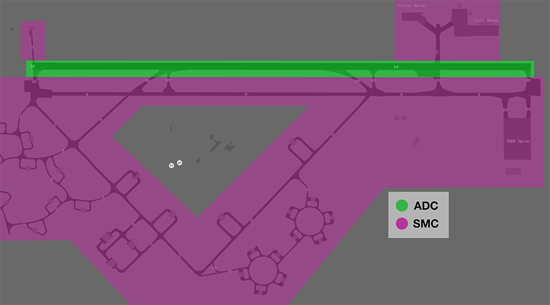
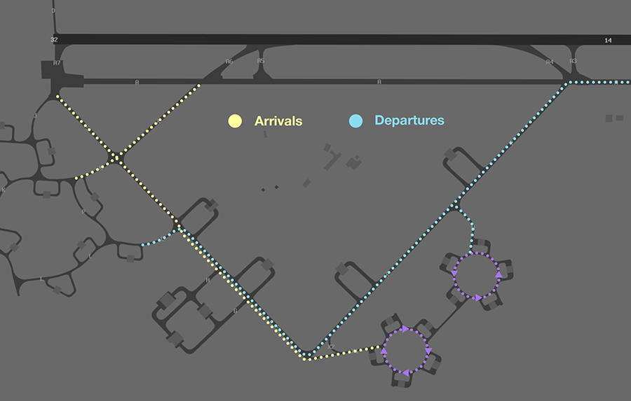
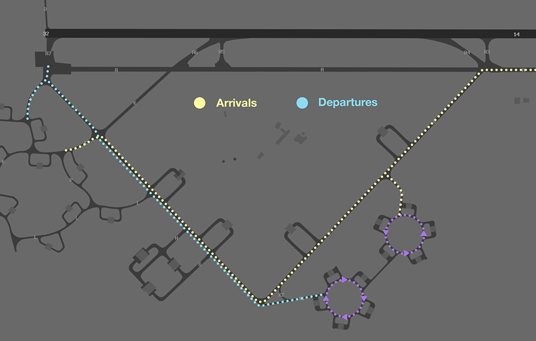

--8<-- "includes/abbreviations.md"

## Positions

| Name               | Callsign              | Frequency   | Login ID      |
| ------------------ | --------------------- | ----------- | ------------- |
| **Tindal ADC**     | **Tindal Tower**      | **119.700** | **TN_TWR**    |
| **Tindal SMC**     | **Tindal Ground**     | **135.850** | **TN_GND**    |
| **Tindal ACD**     | **Tindal Delivery**   | **128.100** | **TN_DEL**    |
| **Tindal ATIS**    |                       | **124.000** | **YPTN_ATIS** |

!!! note
    YPTN is a [joint military/civil aerodrome](../../../controller-skills/military/#military-aerodromes) and procedures can differ significantly to those at a civil aerodrome. Ensure you are familiar with the [military controller skills](../../../controller-skills/military) necessary to provide a quality service.

## Airspace
TN ADC is not responsible for any airspace by default.

### Restricted Area Activations
There are no [restricted areas or MOAs](../../../controller-skills/sua) activated by default when TN ADC is online.

## Manoeuvring Area
### Manoeuvring Area Responsibility
ADC is responsible for all runways. SMC is responsible for all taxiways, but is not responsible for helicopter movements around the [infield helipads](#helipads)

<figure markdown>
{ width="500" }
  <figcaption>YPTN Manoeuvring Area Responsibility</figcaption>
</figure>

### Recommended Taxi Routes
Except when the traffic situation warrants, taxi clearances shall conform to the following diagram:

=== "Runway 14"
	<figure markdown>
	{ width="500" }
	  <figcaption>Standard Taxi Routes for RWY 14</figcaption>
	</figure>
	
=== "Runway 32"
	<figure markdown>
	{ width="500" }
	  <figcaption>Standard Taxi Routes for RWY 32</figcaption>
	</figure>

## Local Procedures
### Initial and Pitch
The [intial points](../../../controller-skills/military/#initial-and-pitch) are aligned with Taxiway A at the following locations.

| RWY  | Initial Point | Altitude |
| ---- | ------------- | -------- |
| 14   | 3NM downwind  | `A020`   |
| 32   | 3NM downwind  | `A020`   |

### Coded Clearances
Aircraft departing to certain defined groups of SUA may be cleared a coded clearance.

| Coded Clearance | Restricted Areas |
| --------------- | ---------------- |
| B F M           | R225D, R238, and R250 |
| A C M           | R225B, R225D, R238, and R250 |
| Falconer        | R225D, R225F, R232, R238, and R250 |
| Western         | R225A-F, and R250 |
| Eastern         | R226A and R226B |

[Coordination](#acd-to-tn-tcu) may be required with TN TCU prior to issuing clearance to an aircraft intending to operate in an SUA.

!!! phraseology
    *CLAS21 plans to operate within R226A and R226B for military training.*  
    **TN ACD**: "CLAS21, cleared Eastern via [MILNE](#military-gates), climb to `F180`, squawk 6003, departure frequency 120.95"

### Military Gates
There are numerous [military gates](../../../controller-skills/military/#military-gates) established throughout the TN TMA to facilitate entry and exit to adjoining SUA.

<figure markdown>
{ width="700" }
  <figcaption>TN SUA Gates</figcaption>
</figure>

Pilots should include the desired departure gate when requesting clearance.

!!! phraseology
    *CLAS35 plans to enter the R225D restricted area via the MOROTAI gate for military training and airwork.*  
    **CLAS35**: "Tindal Delivery, CLAS35 for MOROTAI, `F120` for R225D, request clearance."  
    **TN ACD**: "CLAS35, Tindal Delivery. cleared MOROTAI direct, climb to `F120`, squawk 6001, departure frequency 120.95."   

If the pilot **does not** nominate a gate, or nominates a gate that does not provide access to their intended SUA, TN ACD should clear the aircraft to depart via the **appropriate gate**.

| Intended SUA    | TCU Exit Gate       |
| --------------- | ------------------- |
| R225 (and adjacent SUA) | MOROTAI TARAKAN  |
| R226            | MILNE               |
| R238            | WEDGE 1-3           |

!!! tip
    [Coordination requirements](#acd-to-tn-tcu) exist between ACD and TCU when aircraft are requesting clearance to operate in an SUA that has not been activated. Controllers performing the role of ACD should ensure they coordinate with TCU before providing clearance.

## Helicopter Operations
### Helipads
There are two helipads at YPTN, both located near the control tower in the centre of the airfield.

Both helipads are outside of the manoeuvring area so no takeoff or landing clearances should be issued. Instead, helicopters should be instructed to report airborne or report on the ground.

!!! phraseology 
    **TN ADC**: "CHOP31, Pad 1, report on the ground"  

### Choppers East
Helicopters perform circuits within '**Choppers East**', defined as an area between Taxiway Alpha the Old Stuart Highway, and the runway thresholds.

<figure markdown>
{ width="700" }
<figcaption>Choppers East</figcaption>
</figure>

Helicopters requesting clearance to operate in the Eastern Grass shall be cleared to air transit to, and then operate within, the area by ADC.

!!! phraseology
    **CHOP12**: "Tindal Tower, CHOP12 ZXY, Pad 1, for circuits, ready."   
    **TN ADC**: "CHOP12, Tindal Tower. Cleared to operate Choppers East not above `A010`. Report airborne."

## Runway Modes
### Circuits
The circuit height is `A015`.

#### Circuit Direction
| Runway | Direction |
| ------ | ----------|
| 14     | Right     |
| 32     | Left      |

## SID Selection
### Civil Aircraft
Aircraft planned via **DN VOR**, **LAREB**, **GREGA**, **DOSAM**, **MILIV**, **MIGAX**, **DAPMA** shall be assigned the **Procedural SID** that terminates at the appropriate SID terminus.  Jet Aircraft **not** planned via any of these waypoints shall receive amended routing via the most appropriate SID terminus, unless the pilot indicates they are unable to accept a Procedural SID.

Aircraft unable to accept a procedural SID, and **non-RNAV** aircraft shall be assigned either the RADAR SID or a visual departure. 

### Military Aircraft
Military aircraft that are unable to accept a procedural SID shall be assigned either the RADAR SID or a visual departure.

## Coordination
### Auto Release
[Next](../../../controller-skills/coordination/#next) coordination is required from TN ADC to TN TCU for all aircraft.

The standard assignable level from TN ADC to TN TCU is:

| Aircraft | Level |
| ----- | ---- |
| All | The lower of `F180` and `RFL` |

### Departures Controller
When a TCU controller is online, aircraft shall be issued with a departure frequency during their airways clearance in accordance with the table below. If no TCU controllers are online, the appropriate enroute frequency or advisory frequencyshall be issued.

| Runway | Via  | Departure Frequency |
| ------ | ---- | ------------------- |
| All    | All  | 120.95 (TNA)        |

### ACD to TN TCU
The controller assuming responsibility of **ACD** shall give [heads-up](../../../controller-skills/coordination/#airways-clearance) coordination to TNA (or the enroute controller responsible for the TN TCU) prior to the issue of a clearance to an aircraft intending to operate in an SUA that **has not** been activated. 

!!! phraseology
    **TN ACD** -> **TNA**: "CLAS35 requests clearance to R225D”  
    **TNA** -> **TN ACD**: "CLAS35, clearance approved."  

## Charts
!!! abstract "Reference"
    In addition to the civilian `ERSA` and `AIP` publications, [the RAAF AIP website](https://ais-af.airforce.gov.au/australian-aip){target=new} contains the necessary charts (available in the TERMA) and description of procedures (in each airports' FIHA).
