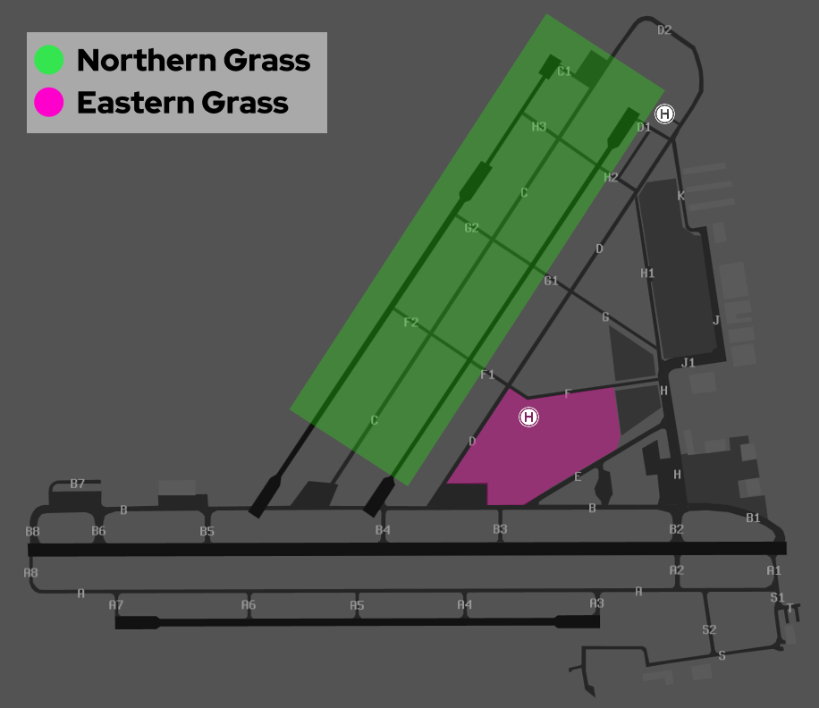

--8<-- "includes/abbreviations.md"

## Positions
| Name                       | Callsign              | Frequency   | Login ID      |
| -------------------------- | --------------------- | ----------- | ------------- |
| **Archerfield ADC South**  | **Archer Tower**      | **118.100** | **AF_TWR**    |
| Archerfield ADC North :material-information-outline:{ title="Non-standard position"} | Archer Tower | 123.600 | AF-N_TWR |
| **Archerfield SMC**        | **Archer Ground**     | **129.300** | **AF_GND**    |
| **Archerfield ATIS**       |                       | **120.900** | **YBAF_ATIS** |

!!! abstract "Non-Standard Positions"
    :material-information-outline: Non-standard positions may only be used in accordance with [VATPAC Air Traffic Services Policy](https://vatpac.org/publications/policies){target=new}.  
    Approval must be sought from the **bolded parent position** prior to opening a Non-Standard Position, unless [NOTAMs](https://vatpac.org/publications/notam){target=new} indicate otherwise (eg, for events).

## Airspace
AF ADC is responsible for the Class D airspace in the AF CTR `SFC` to `A015`.

<figure markdown>
{ width="700" }
  <figcaption>AF ADC Airspace</figcaption>
</figure>

Refer to [Class D Tower Separation Standards](../../../separation-standards/classd) for more information.

### Dual ADC Operations
When Archerfield ADC North is online, responsibility for the **Runway**, **Circuit**, and **Airspace** is divided between the two ADC controllers.

ADC South takes responsibility for the South/East Runway, Circuit and Airspace (Runway **10R, 28L, 04R, 22L**).

ADC North takes responsibility for the North/West Runway, Circuit and Airspace (Runway **10L, 28R, 04L, 22R**).

ADC North is **not permitted** online when *Single Runway* Operations are in use.

Refer to the [ATIS section](#runway-mode-formatting) for information on ATIS formatting when ADC North is online.

## Manoeuvring Area
The apron areas are outside the manoeuvring area. The runup bays and all connecting taxiways are inside the manoeuvring area, requiring taxi instructions. All aircraft require a clearance to cross RWY 04L & 04R on Taxiway B and RWY 10L on A8/B8.

Aircraft may taxi past the undershoot of RWY 28L on the southern apron without clearance, provided the pilot is satisfied that no risk of collision exists.

!!! tip
    The YBAF Manoeuvring Area chart can be found on the [CASA Website](https://www.casa.gov.au/archerfield-manoeuvring-area-map).

!!! warning "Important"
    In some simulator scenery holding point **B6** is incorrect or entirely missing. Pilots with scenery which does not support this holding point, shall inform **AF SMC** when requesting taxi with RWY 10L is in use.

## VFR Operations
### Arrivals
Aircraft shall track via any designated VFR inbound reporting point at `A015`, and be instructed as below:

| VFR Approach Point | RWYs 04  | RWYs 22 | RWYs 10  | RWYs 28 | 
| ----------------   | --------- | ------------- | --------- | ---------- |
| TVT    |  *"Join Base RWY 04L, report CBRG"* | *"Join Base RWY 22R, report CBRG"* | *"Join Final RWY 10L, report CBRG"* | *"Join Downwind RWY 28R, maintain A015, report CBRG"* |
| GON    |  *"Join Final RWY 04L"*                             | *"Join Downwind RWY 22R, maintain A015"*                          | *"Join Final RWY 10R"* | *"Join Downwind RWY 28L, maintain A015"*        |
| PKR   |  *"Join Base RWY 04R, report Logan Motorway"*     | *"Join Base RWY 22L, report Logan Motorway"*     | *"Join Base RWY 10R, report Logan Motorway"*  | *"Join Base 28L, report Logan Motorway"*         |
| TAR       |  *"Join Base RWY 04R"*                              | *"Join Base RWY 22L"*                              | *"Join Downwind RWY 10R, maintain A015"*       | *"Join Final RWY 28L"*        |

!!! note
    If applicable, aircraft shall be instructed to maintain `A015` for separation with aircraft departing the zone `A010`. Once clear of the departure track, clear these aircraft for a visual approach.

### Departures

| Planned Departure Tracks | "Intentions"   | Tracking Requirement | 
| ---------------      | ---------      | ----------           | 
| BTN 310 & 019 DEG    | Northern Departure | Track via WTBG | 
| BTN 020 & 099 DEG    | Eastern Departure  | Track via Gateway Motorway and Pacific Motorway Intersection *(Not available when Rwy 22 active unless departing into Class C)* | 
| BTN 100 & 204 DEG    | Southern Departure | Track 135 until clear of the zone |
| BTN 205 & 309 DEG    | Western Departure  | Track between 220 & 309 until clear of the zone *(Acft must nominate outbound DEP track with TAXI call)* |
| Other                |                    | As approved by ATC

Aircraft shall advise planned departure intentions to **AF SMC** when requesting taxi.

!!! phraseology
    **BJZ:** "Archer Ground, Seminole BJZ, Eastern Apron, received F, for eastern departure, request taxi"  
    **AF ADC:** "BJZ, Archer Ground, taxi holding point B2, runway 28R"  
    **BJZ:** "Taxi holding point B2, runway 28R, BJZ"

Aircraft shall confirm departure intentions to **AF ADC** on initial contact. All VFR departures shall depart the AF CTR at `A010`.

!!! phraseology 
    **ZSO:** "Archer Tower, Sling ZSO, holding point A7, runway 10R, for southern departure, ready"  
    **AF ADC:** "ZSO, Archer Tower, runway 10R, cleared for takeoff"  
    **ZSO:** "Runway 10R, cleared for takeoff, ZSO"

!!! note
    Aircraft departing the zone into Class G airspace will transfer to area frequency/advisory frequency upon leaving the zone. No explicit frequency transfer shall be given to these aircraft.

## Helicopter Operations
Archerfield has three helipads located around the aerodrome:

- **Northern Helipad**, adjacent the north-eastern end of Runway 04R/22L.
- **Central Helipad**, on the southern side of Taxiway Foxtrot.
- The **LifeFlight Maintenance Base** and **Queensland Government Air facility** used by rescue helicopters, north of Taxiway B6 and B5.

!!! note
    Both the **Northern** and **Central** helipads are inside the manoeuvring area and treated like a runway, requiring a takeoff and landing clearance from AF ADC. Helicopters operating on other surfaces outside the manoeuvring areas should be instructed to *"report airborne"*  or *"report on the ground"* so the controllers knows when they are active/no longer active in their airspace. 

### Training Areas
There are 2 designated helicopter training areas which can be used for helicopter training operations in ground effect and circuits. When the helicopter training area is active, this shall be reflected on the [ATIS](#helicopter-area).

<figure markdown> 
  { width="600" }
  <figcaption>Archerfield Helicopter Training Areas</figcaption>
</figure>

#### Circuits

Helicopter circuits are conducted from designated areas based on the duty runway.

| Duty Runway    | Training Area   |
| -------------- | --------------- |
| Runway 28/10   | Northern Grass  |
| Runway 04/22   | Eastern Grass   |

Circuit operations are conducted parallel to the duty runway not above `A007` and inside the fixed-wing circuit. Once established within Northern Grass or Eastern Grass, helicopters may operate in ground effect, maintaining a listening watch with ADC. ATC will not positively control helicopter takeoff and landings from the training areas or provide sequencing instructions. Initial traffic information only will be provided on other helicopters conducting circuits, and a continuous lookout for airborne traffic is the responsibility of the pilot. 

Once established, the only call is an airborne call before each circuit. Pilots must report airborne before each circuit. If departing, they must include their departure intentions.

!!! phraseology 
    **FHK:** "Archer Tower, helicopter FHK, northern pad, for northern grass, ready"  
    **AF ADC:** "FHK, Archer Tower, air transit northern grass, report established, northern pad, cleared for takeoff"  
    **FHK:** "Air transit northern grass, wilco, northern pad, cleared for takeoff, FHK"

    **FHK:** "FHK, established"  
    **AF ADC:**" "FHK"  

    *FHK becomes airborne for circuits*  
    **FHK:** "FHK, airborne"  
    **AF ADC:** "FHK"

After circuit training, pilots will nominate their landing HLS during the airborne call and transition to the arrival procedure.

!!! phraseology 
    **FHK:** "FHK airborne, request northern pad"  
    **AF ADC:** "FHK track direct northern pad, cleared to land"  
    **FHK:** "Track direct northern pad, cleared to land, FHK"

### Departures
Helicopters depart the zone via any of the [designated outbound routes](#departures). Departures shall be parallel to and clear of the duty runways. 

!!! phraseology 
    **TUY:** "Archer Tower, helicopter TUY, northen pad, for eastern departure, ready"  
    **AF ADC:** "TUY, Archer Tower, depart east, parallel to runway 10L, northen pad, cleared for takeoff"  
    **TUY:** "Depart east, parallel to runway 10L, cleared for takeoff, northen pad, TUY"

#### Uni Departure
Departures with intended entry into BN CTR northbound shall depart the zone via the **Uni Departure**. Aircraft on the Uni Departure depart via UQLD at `A010`, then contact BN TCU for airways clearance. No heads-up coordination with BN TCU is required.

### Arrivals
Helicopters enter the zone from any of the [designated inbound reporting points](#arrivals). Pilots shall nominate their desired HLS on first contact with AF ADC. If necessary, helicopters may be instructed to overfly the runway complex not below `A005` for a short circuit to the designated HLS.

!!! phraseology 
    **82Y:** "Archer Tower, helicopter 82Y, TAR `A010`, recieved Foxtrot, inbound northern pad"  
    **AF ADC:** "82Y, Archer Tower, track direct northen pad, report 1 mile"  
    **82Y:** "Track direct northern pad, 82Y"  

    **82Y:** "82Y, 1 mile, northern pad"  
    **AF ADC:** "82Y, cleared to land northern pad"  
    **82Y:** "Cleared to land northen pad, 82Y"

Helicopters inbound for the LifeFlight Maintenance Base or Queensland Government Air facility HLS shall be issued a standard fixed wing circuit instruction for the applicable duty runway, complying with fixed wing operations unless another approach is requested or desired.

Helicopters inbound from the south via PKR for either the northen or central helipad shall be instructed to *"cross 10L and 10R"* alongside any other tracking or traffic information.

!!! phraseology 
    **SMD:** "Archer Tower, helicopter SMD, PKR `A015`, recieved Golf, inbound central pad"  
    **AF ADC:** "SMD, Archer Tower, report Logan Motorway"  
    **SMD:** "Report Logan Motorway, SMD"  

    **SMD:** "SMD, Logan Motorway"  
    **AF ADC:** "SMD, track direct central pad, cross 10L and 10R"  
    **SMD:** "Track direct central pad, crossing 10L and 10R, SMD" 

## Runway Modes
### Preferred Runway Modes
Winds must always be considered for Runway modes (Crosswind <20kts, Tailwind <5kts), however the order of preference is as follows:

| Priority - Mode | Arrivals  | Departures |
| ----------------| --------- | ---------- |
| =1 - 10 PROPS | 10L (NORTH) & 10R (SOUTH) | 10L (NORTH) & 10R (SOUTH) |
| =1 - 28 PROPS | 28L (SOUTH) & 28R (NORTH) | 28L (SOUTH) & 28R (NORTH) |
| =2 - 04 PROPS | 04L (NORTH AND WEST) & 04R (SOUTH AND EAST) | 04L (NORTH AND WEST) & 04R (SOUTH AND EAST) |
| =2 - 22 PROPS | 22L (SOUTH AND EAST) & 22R (NORTH AND WEST) | 22L (SOUTH Only) & 22R (NORTH AND WEST) |
| =3 - 10L Only | 10L | 10L |
| =3 - 28R Only | 28R | 28R |

#### Night Operational Restrictions
Runways 04L/22R, 04R/22L, and 10R/28L are unlit, and **cannot** be used at night.

### Circuits
The circuit direction changes depending on time of day and runway being used.

| Runway | Day  | Night |
| ----------------| --------- | ---------- |
| 04R             | Right | -  |
| 04L             | Left  | -  |
| 22R             | Right | -  |
| 22L             | Left  | -  |
| 10R             | Right | -  |
| 10L             | Left  | Left  |
| 28R             | Right | **Left** |
| 28L             | Left  | -  |

Circuits are to be flown at `A010`.

## ATIS
### Approach Expectation
When **Runway 10L/28R** is in use for arrivals, the following table shall be followed for the Approach Expectation field:

| Cloud Base          | Visibility | ATIS APCH field |
| ------------------- | ---------- | --------------- |
| At or above `A029`  | >5000M     | (blank) |
| Below `A029` **or** | <5000M     | `EXP INST APCH` |

### Runway Mode Formatting
The ATIS must indicate runway configuration in the format below:

| Mode        | Controllers | ATIS Runway information |
| ----------- | ----------- | ----------------------- |
| 10/28 PROPS | Single ADC  | `RWY 10L/28R FOR ARRS AND DEPS NORTH. RWY 10R/28L FOR ARRS AND DEPS SOUTH` |
| 10/28 PROPS | Dual ADC    | `RWY 10L/28R FOR ARRS AND DEPS NORTH, FREQ 123.6. RWY 10R/28L FOR ARRS AND DEPS SOUTH, FREQ 118.1` |
| 04 PROPS    | Single ADC  | `RWY 04L FOR ARRS AND DEPS NORTH AND WEST. RWY 04R FOR ARRS AND DEPS SOUTH AND EAST` |
| 04 PROPS    | Dual ADC    | `RWY 04L FOR ARRS AND DEPS NORTH AND WEST, FREQ 123.6. RWY 04R FOR ARRS AND DEPS SOUTH AND EAST, FREQ 118.1` |
| 22 PROPS    | Single ADC  | `RWY 22. EASTERN DEPS NAVBL. RWY 22R FOR ARRS AND DEPS NORTH AND WEST. RWY 22L FOR ARRS SOUTH AND EAST AND DEPS SOUTH` |
| 22 PROPS    | Dual ADC    | `EASTERN DEPS NAVBL. RWY 22R FOR ARRS AND DEPS NORTH AND WEST, FREQ 123.6. RWY 22L FOR ARRS SOUTH AND EAST AND DEPS SOUTH, FREQ 118.1` |
| Single Runway | Single ADC | `ALL OPERATIONS RWY (Number)` |

### Operational Info
#### Helicopter Area
The ATIS must indicate the current state of the helicopter circuit area, refer to [Training Areas](#training-areas).

!!! example  
    OPR INFO: **HELICOPTER CCT AREA ACTIVE**  

## Coordination
### Departures
[Next](../../controller-skills/coordination.md#next) coordination is required from AF ADC to BN TCU for all aircraft **entering BN TCU CTA**.

The Standard Assignable level from **AF ADC** to **BN TCU** is:

| Aircraft | Level |
| ------- | ----- |
| All | The lower of `A040` and `RFL` |

### Arrivals/Overfliers
BN TCU will heads-up coordinate arrivals/overfliers from Class C to AF ADC.  
IFR aircraft will be cleared for the coordinated approach (Instrument or Visual) prior to handoff to AF ADC, unless AF ADC nominates a restriction.  
VFR aircraft require a level readback.

!!! phraseology
    **BN TCU** -> **AF ADC**: "via TVT for the visual approach, UJE"  
    **AF ADC** -> **BN TCU**: "UJE, visual approach"

!!! tip
    Remember that IFR aircraft are only separated from other IFR or SVFR aircraft in class D. You should *generally* be able to issue a clearance for an approach and use other separation methods (visual separation, holding a departure on the ground) if separation is required with these aircraft.

#### ADC North Online
When ADC North is online, BN TCU may not be familiar with which controller owns what airspace. Best practice is to receive the coordination no matter what, and if it was meant for the other ADC controller, relay the coordination to them internally.

### AF ADC Internal
AF ADC must heads-up coordinate **all aircraft** transiting from one ADC controller to the other.

!!! phraseology
    **AF ADC S** -> **AF ADC N**: "via TAR, TQC for an overhead join"  
    **AF ADC N** -> **AF ADC S**: "TQC, A015"