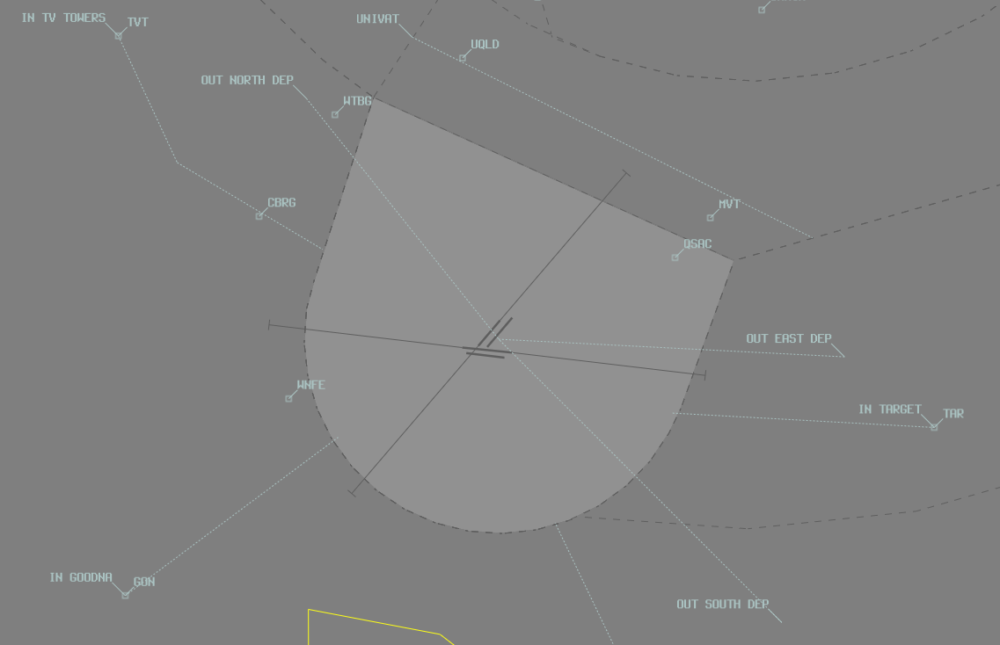

--8<-- "includes/abbreviations.md"

## Positions
| Name               | Callsign       | Frequency        | Login ID                         |
| ------------------ | -------------- | ---------------- | ---------------------------------------- |
| **Archerfield ADC**  | **Archer Tower**  | **118.100**        | **AF_TWR**                        |
| **Archerfield SMC**   | **Archer Ground**  | **129.300**         | **AF_GND**                       |
| Archerfield ATIS        |                | 120.900          | YBAF_ATIS                                |

## Airspace
AF ADC is responsible for the Class D airspace in the AF CTR `SFC` to `A015`.

<figure markdown>
{ width="700" }
  <figcaption>AF ADC Airspace</figcaption>
</figure>

Refer to [Class D Tower Separation Standards](../../../separation-standards/classd) for more information.

## VFR Arrival Procedures
VFR aircraft should track via a VFR inbound point at `A015` and be instructed as below:

| VFR Approach Point | RWYs 04  | RWYs 22 | RWYs 10  | RWYs 28 | 
| ----------------   | --------- | ------------- | --------- | ---------- |
| TVT    |  *"Join Base RWY 04L, report CBRG"* | *"Join Base RWY 22R, report CBRG"* | *"Join Final RWY 10L, report CBRG"* | *"Join Downwind RWY 28R, maintain A015, report CBRG"* |
| GON    |  *"Join Final RWY 04L"*                             | *"Join Downwind RWY 22R, maintain A015"*                          | *"Join Final RWY 10R"* | *"Join Downwind RWY 28L, maintain A015"*        |
| PKR   |  *"Join Base RWY 04R, report Logan Motorway"*     | *"Join Base RWY 22L, report Logan Motorway"*     | *"Join Base RWY 10R, report Logan Motorway"*  | *"Join Base 28L, report Logan Motorway"*         |
| TAR       |  *"Join Base RWY 04R"*                              | *"Join Base RWY 22L"*                              | *"Join Downwind RWY 10R, maintain A015"*       | *"Join Final RWY 28L"*        |

!!! note
    Aircraft joining downwind are instructed to maintain `A015` for separation with aircraft departing the zone at `A010`.  Once inbound aircraft are clear of the departure track, they should be *"cleared visual approach"*.

## VFR Departure Procedures

| Planned Departure Tracks | "Intentions"   | Tracking Requirement | 
| ---------------      | ---------      | ----------           | 
| BTN 310 & 019 DEG    | Northern Departure | Track via WTBG | 
| BTN 020 & 099 DEG    | Eastern Departure  | Track via Gateway Motorway and Pacific Motorway Intersection   *(Not available when Rwy 22 active EXC if departing into Class C)* | 
| BTN 100 & 204 DEG    | Southern Departure | Track 135 DEG from Archerfield |
| BTN 205 & 309 DEG    | Western Departure  | DEP AF CTR on a track between 220 & 309. Acft must nominate outbound DEP track with TAXI call |
| Other                |                    | As approved by ATC

VFR departures will depart the control zone at `A010`.

Aircraft should advise planned Departure Procedure to **AF SMC** with TAXI call and **AF ADC** with READY call.

!!! phraseology
    **VPF:** "Archer Ground, Cherokee VPF, Main Apron, for a Western Departure, received information Alpha, request taxi"

    **VPF:** "Archer Tower, Cherokee VPF, holding point B8, runway 10 Left, for Western Departure, ready"

## Circuits
The circuit direction changes depending on time of day and runway being used.

| Runway | Day  | Night |
| ----------------| --------- | ---------- |
| 04R             | Right | -  |
| 04L             | Left  | -  |
| 22R             | Right | -  |
| 22L             | Left  | -  |
| 10R             | Right | -  |
| 10L             | Left  | Left  |
| 28R             | Right | Right |
| 28L             | Left  | -  |

Circuits are to be flown at `A010`.

## Helicopter Operations
Archerfield has three helipads located around the aerodrome:

- **Central Helipad**, on the southern side of Taxiway Foxtrot
- **Northern Helipad**, adjacent the north-eastern end of Runway 04R/22L
- The **Queensland Government Air facility** used by rescue helicopters, north of Taxiway B5

!!! note
    Both the **Northern** and **Central** helipads are inside the maneuvering area and treated like a runway, requiring a takeoff and landing clearance from AF ADC. Helicopters operating on other surfaces outside the maneuvering areas should be instructed to *"report airborne"*  or *"report on the ground"* so the controllers knows when they are active / no longer active in their airspace. 

### Training Areas
There are 3 designated helicopter training areas at Archerfield:

**Area A**: North of Taxiway B within the confines of the aerodrome boundary, clear of all buildings, not above `A005`. Circuit direction and frequency as per ATIS. A maximum of 3 helicopters are permitted to operate circuits concurrently. Additionally, a maximum of 2 helicopters are permitted to operate in ground effect only.

**Area B**: North and west of Runway 04L within the confines of the aerodrome boundary, clear of all buildings, not above `A005`. Circuit direction and frequency as per ATIS. A maximum of 3 helicopters are permitted to operate circuits concurrently. Additionally, a maximum of 2 helicopters are permitted to operate in ground effect only.

**Area C**: South and east of Taxiway D, inside the fixed wing circuit for runway 04R/22L, east of the control tower, not above `A008`. Landings must be conducted north of Taxiway B. Once established, the only radio communications are an airborne call before each circuit and a downwind call by pilots. A maximum of 2 helicoptesr are permitted to operate in this area concurrently.

<figure markdown> 
  { width="450" }
  <figcaption>Archerfield Helicopter Training Areas</figcaption>
</figure>

### Departures
Helicopters depart the zone via any of the [designated outbound routes](#vfr-departure-procedures). Departures shall be parallel to and clear of the duty runways.   

#### Uni Departure
Departures with intended entry into BN CTR northbound shall depart the zone via the **Uni Departure**. Aircraft on the Uni Departure depart via UQLD at `A010`, then contact BN TCU for airways clearance. No heads-up coordination with BN TCU is required.

!!! phraseology 
    **TUY:** "Archer Tower, helicopter TUY, northen pad, for uni departure, ready"  
    **AF ADC:** "TUY, Archer Tower, northen pad, cleared for takeoff"  
    **TUY:** "Cleared for takeoff, northen pad, TUY"

### Arrivals
Helicopters enter the zone from any of the [designated inbound reporting points](#vfr-arrival-procedures). Pilots shall nominate their desired HLS on first contact with AF ADC. If necessary, helicopters may be instructed to overfly the runway complex not below `A005` for a short circuit to the designated HLS.

!!! phraseology 
    **82Y:** "Archer Tower, helicopter 82Y, UQLD A010, recieved Foxtrot, inbound northern pad"  
    **AF ADC:** "82Y, Archer Tower, track direct northen pad, report 1 mile"  
    **82Y:** "Track direct northern pad, 82Y"  

    **82Y:** "82Y, 1 mile, northern pad"  
    **AF ADC:** "82Y, cleared to land northern pad"  
    **82Y:** "Cleared to land northen pad, 82Y"

Helicopters inbound for the Queensland Government Air facility HLS shall be issued a standard fixed wing circuit instruction for the applicable duty runway, complying with fixed wing operations unless another approach is requested or desired.

Helicopters inbound from the south via PKR for either the northen or central helipad shall be instructed to "cross 10L and 10R" alongside any other tracking or traffic information.

!!! phraseology 
    **SMD:** "Archer Tower, helicopter SMD, PKR A015, recieved Golf, inbound central pad"  
    **AF ADC:** "SMD, Archer Tower, report Logan Motorway"  
    **SMD:** "Report Logan Motorway, SMD"  

    **SMD:** "SMD, Logan Motorway"  
    **AF ADC:** "SMD, track direct central pad, cross 10L and 10R"  
    **SMD:** "Track direct central pad, crossing 10L and 10R, SMD"

## ATIS
### Runway Nomination

The ATIS must indicate the current runway config and nominate what each runway is being used for.  This should be reflected on the ATIS as below:

| Runway | RWY Field  |
| ----------------| --------- |
| Single RWY      | `ALL OPERATIONS RWY (Number)` |
| RWY 10/28       | `RWY 10L/28R FOR ARRIVALS AND DEPARTURES NORTH; RWY 10R/28L FOR ARRIVALS AND DEPARTURES SOUTH` |
| RWY 04          | `RWY 04L FOR ARRIVALS AND DEPARTURES NORTH AND WEST; RWY 04R FOR ARRIVALS AND DEPARTURES SOUTH AND EAST` |
| RWY 22          | `RWY 22. EASTERN DEPARTURES NOT AVAILABLE. RWY 22R FOR ARRIVALS AND DEPARTURES NORTH AND WEST; RWY 22L FOR ARRIVALS SOUTH AND EAST AND DEPARTURES SOUTH` |

### Approach Expectation
The APCH field should include `EXP INST APCH` when:   
  - the ceiling is at or below `A029`; or  
  - visibility is less than 5000m  

### Helicopter Area
The ATIS must indicate the current active helicopter area, refer to [Training Areas](#training-areas).

!!! example  
    OPR INFO: **HELICOPTER AREA A ACTIVE**  

## Coordination

### Departures
When aircraft planned via a CTA departure are ready for takeoff and expected to depart imminently, **AF ADC** shall seek release of the aircraft through a 'Next' call.

!!! phraseology
    **AF ADC** -> **BN TCU**: "Next, XMM, Runway 10L"  
    **BN TCU** -> **AF ADC**: "XMM, Unrestricted"  
    **AF ADC** -> **BN TCU**: "XMM"

The Standard Assignable level from AF ADC to BN TCU is the lower of `A040` or the `RFL`, any other level must be prior coordinated.

### Arrivals/Overfliers
BN TCU will heads-up coordinate arrivals/overfliers from Class C to AF ADC.  
IFR aircraft will be cleared for the coordinated approach (Instrument or Visual) prior to handoff to AF ADC, unless AF ADC nominates a restriction.  
VFR aircraft require a level readback.

!!! phraseology
    **BN TCU** -> **AF ADC**: "via TVT for the visual approach, UJE"  
    **AF ADC** -> **BN TCU**: "UJE, visual approach"

!!! tip
    Remember that IFR aircraft are only separated from other IFR or SVFR aircraft in class D. You should *generally* be able to issue a clearance for an approach and use other separation methods (visual separation, holding a departure on the ground) if separation is required with these aircraft.