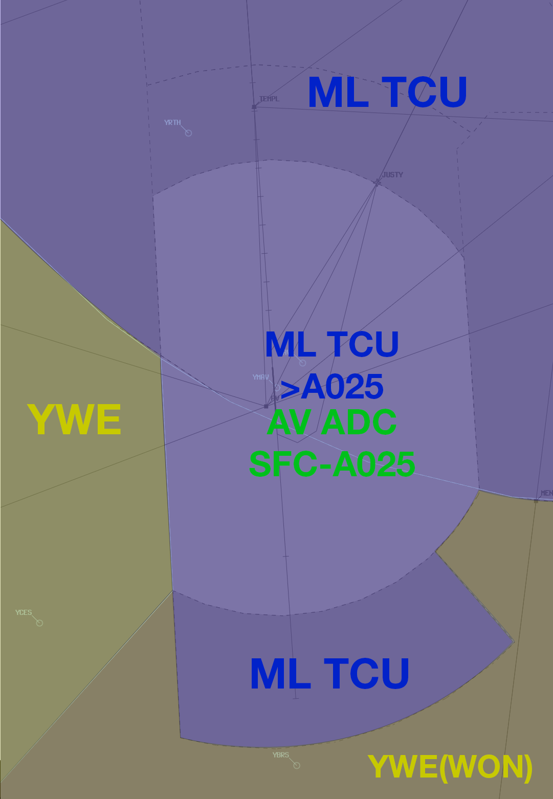

--8<-- "includes/abbreviations.md"

## Positions
| Name               | Callsign       | Frequency        | Login Identifier                         |
| ------------------ | -------------- | ---------------- | ---------------------------------------- |
| **Avalon ADC**      | **Avalon Tower**   | **120.100**          | **AV_TWR**                                   |
| Avalon ATIS     |                | 118.200         | YMAV_ATIS                                |

## Airspace
AV ADC is responsible for the Class D Airspace within the AV CTR `SFC` to `A025`. This airspace may be released to ML TCU with the concurrence of both controllers.  
ML TCU is responsible for the Class E Airspace to the North, South, and Above the AV CTR.  
ML TCU is repsonsible for the Class G Airspace to the East of the AV CTR, and to the West of the AV CTR within 30 DME ML.  
YWE is responsible for the Class G Airspace to the West of the AV CTR outside 30 DME ML.  
YWE(WON) is responsible for the Class G Airspace to the South East of the AV CTR outside 30 DME ML.

<figure markdown>
{ width="500" }
</figure>

Refer to [Class D Tower Separation Standards](../../../separation-standards/classd) for more information.

## SID Selection
Aircraft planned via **ML** shall be assigned the **JUSTY** SID.

Aircraft **not** planned via **ML**, and tracking to the North East, shall be recleared via ML, and assigned the **JUSTY** SID.

All other IFR aircraft shall be assigned the **Radar SID**.

### Circuit Direction
| Runway | Direction |
| ------ | ----------|
| 18     | Left  |
| 36     | Right |

## Coordination
### ML TCU
#### Departures
'Next' coordination is **not** required to ML TCU for aircraft that are:   
  a) Departing from a runway nominated on the ATIS; or  
  b) Assigned the standard assignable level; or  
  c) Assigned a **Procedural** SID

All other aircraft require a 'Next' call to ML TCU.

!!! example
    **AV ADC** -> **MDS**: "Next, UJI, Runway 18"  
    **MDS** -> **AV ADC**: "UJI, heading 030, unrestricted"  
    **AV ADC** -> **MDS**: "Heading 030, UJI"

The Standard Assignable level from AV ADC to ML TCU is the lower of `A040` or the `RFL`.

#### Arrivals/Overfliers
ML TCU will heads-up coordinate arrivals/overfliers from Class C to AV ADC.  
IFR aircraft will be cleared for the coordinated approach (Instrument or Visual) prior to handoff to AV ADC, unless AV ADC nominates a restriction.  
VFR aircraft will not be coordinated, and will need to receive their airways clearance from AV ADC.

!!! example
    **MDS** -> **AV ADC**: "via TEMPL for the ILS-Y 18, JST631"  
    **AV ADC** -> **MDS**: "JST631, ILS-Y 18"  

!!! tip
    Remember that IFR aircraft are only separated from other IFR or SVFR aircraft in class D. You should *generally* be able to issue a clearance for an approach and use other separation methods (visual separation, holding a departure on the ground) if separation is required with these aircraft.

#### Runway Change
Any Runway change must be prior coordinated to the relevant [TCU Controller](#tcu-controller).

#### TCU Controller
When **MDN** and/or **MDS** are online, the relevant TCU controller is whoever is responsible for **MDS**.

### YWE/WON
AV ADC only borders YWE/WON Class G airspace, and as such, no coordination is required between AV ADC and YWE/WON.