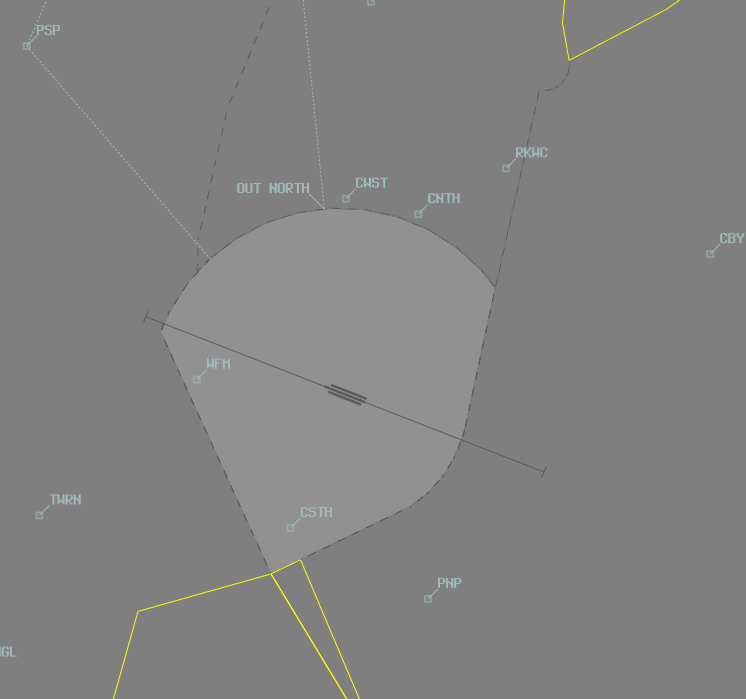

--8<-- "includes/abbreviations.md"

## Positions
| Name               | Callsign       | Frequency        | Login ID                         |
| ------------------ | -------------- | ---------------- | ---------------------------------------- |
| **Bankstown ADC North**  | **Bankstown Tower**  | **132.800**         | **BK_TWR**                        |
| Bankstown ADC (Circuit) :material-information-outline:{ title="Non-standard position"}  | Bankstown Tower  | 123.600        | BK-C_TWR                        |
| **Bankstown SMC**   | **Bankstown Ground**   | **119.900**         | **BK_GND**                       |
| **Bankstown ATIS**        |                | **120.900**          | **YSBK_ATIS**                                |

!!! abstract "Non-Standard Positions"
    :material-information-outline: Non-standard positions may only be used in accordance with [VATPAC Air Traffic Services Policy](https://vatpac.org/publications/policies){target=new}.  
    Approval must be sought from the **bolded parent position** prior to opening a Non-Standard Position, unless [NOTAMs](https://vatpac.org/publications/notam){target=new} indicate otherwise (eg, for events).

### Dual ADC Operations
When Bankstown ADC (Circuit) is online, responsibility for the **Runway**, **Circuit**, and **Airspace** is divided between the two ADC controllers.

ADC North takes responsibility for the Northern Runways, Circuit and Airspace (Runway **11L/29R**, **11C/29C**), and Southern Airspace at **at A015**.

ADC (Circuit) takes responsibility for the Southern Runway, Circuit and Airspace (Runway **11R/29L**), **not above A010**

ADC (Circuit) is **not permitted** online when *Single Runway* Operations are in use.

Refer to the [ATIS section](#runway-nomination) for information on ATIS formatting when ADC (Circuit) is online.

## Airspace
BK ADC is responsible for the Class D airspace in the BK CTR `SFC` to `A015`.

<figure markdown>
{ width="700" }
  <figcaption>BK ADC Airspace</figcaption>
</figure>

Refer to [Class D Tower Separation Standards](../../../separation-standards/classd) for more information.

## Fixed-Wing Operations
### VFR Inbound Procedures
VFR aircraft will report inbound at PSP or TWRN. They should be instructed to join the circuit as below:

| VFR Approach Point | RWYs 29  | RWYs 11 |
| ----------------| --------- | ---------- |
| PSP    | *"Join right downwind runway 29R, maintain A015"*, then when abeam RWYs 11 threshold or clear of departing traffic, *"Cleared visual approach"*       | *"Join final runway 11L, report 3nm"*        |
| TWRN   | *"Join crosswind runway 29R, maintain A015"*, then when abeam RWYs 11 threshold or clear of departing traffic, *"Cleared visual approach"* | *"Join final runway 11L, report at Warwick Farm"*  |

!!! note
    Aircraft joining final in the RWY 11 direction are not assigned a level and are expected to commence a visual approach in accordance with the tracking instructions issued by ADC. Aircraft are required to enter the control zone at `A010`. There is no need to clear these aircraft for a visual approach.

### VFR Outbound Procedures
VFR aircraft should report ready to **BK ADC** with their departure intentions.  A takeoff clearance constitutes a clearance to depart the zone by extending the pilot's requested leg of the circuit.  Aircraft departing the zone into class G airspace will transfer to area frequency upon leaving the zone, **no explicit frequency transfer is given to these aircraft**.

Aircraft departing a leg of the circuit will climb to and maintain the following levels until clear of the zone:  
RWY 29 direction: `A010`  
RWY 11 direction: `A015`

## Departures into CTA
Aircraft planned into the overlying Class C airspace shall be issued an airways clearance by **BK ADC** and assigned `A030`. These aircraft must be Next coordinated to the relevant TCU controller, who will assess the current traffic picture and provide a release when able. During times of peak TMA traffic, there may be extensive delays for departure and pilots may elect to depart directly into class G. See [Departure Coordination](#departures) for coordination requirements.

### Circuits
The circuit direction changes depending on time of day and runway being used.

| Runway | Day  | Night |
| ----------------| --------- | ---------- |
| 11L    | Left       | -        |
| 11C   | Left | Right  |
| 11R    | Right | -  |
| 29L     | Left        | -  |
| 29C    | Right | Left         |
| 29R    | Right        | -  |

Circuits to be flown at `A010`

## Adjacent Runways
### Proximity
There is 106 metres between the centrelines of Runway **11R/29L** & **11C/29C**, and 106 metres between the centrelines of Runway **11C/29C** & **11L/29R**.
Due to the close proximity in critical stages of flight, there are additional considerations (below).

### Dependent Runway Operations (Departures Only)
At Bankstown, all Runways are considered Independent unless a Multi-Engined OR Jet aircraft departs from an adjacent Runway. 
In this instance, runways are treated as dependent *for departures ONLY*. Controllers should apply the same Runway standard across all dependant Runways. Arriving aircraft are exempt from this clause.

Definitions;
Independent: Runways can operate simultaneously without restriction.
Dependent: Runways are operated with restrictions, often one at a time.

Example A; A King Air (Multi-Engine) is ready to depart Runway 29R. A Cherokee is departing Runway 29L. Runways are not adjacent, and are therefore independent of each other.
Example B; A Citation (Jet) is ready Runway 11C. Both Runways 11L & 11R are adjacent, and a Runway Separation Standard should be applied across ALL three Runways. Note: Arriving Aircraft are exempt.
Example C; A PC12 (Single Engine) is ready Runway 29C. There aircraft is a single-engined aircraft and the Runways are treated independently from one another.
Example D; A Seminole (Multi-Engine) is cleared a Touch & Go on Runway 11R. Any aircraft departing from the adjacent Runway (11C) must have a Runway separation standard applied.

### Opposite Bases (Arrivals Only)
DO NOT allow aircraft to turn final simultaneously AND in close proximity.
Controllers should allow at least one aircraft to become established on final prior to the second commencing their turn to final, and MUST pass mutual traffic.

!!! phraseology
    **BK ADC:** "FWC, Traffic is a King Air, late right base assigned the middle runway"

### Holding Aircraft Between Runways
As per YSBK ERSA, all aircraft should remain on Tower frequency when between Runways.
The largest aircraft that can safely hold between Runways is a BE20 (King Air). All larger aircraft are considered to be occupying the runway behind until clear of all active Runways. 
All helicopters are considered to be larger than a King Air for the purpose of this clause.

## Helicopter Operations
### General
These procedures apply during hours of daylight only. During hours of darkness, all helicopters must revert to fixed-wing operations.  

The Main Pad (abeam taxiway Mike) is treated like a runway and requires a takeoff/landing clearance. Helicopters are permitted to become airborne from a limited number of other locations on the aerodrome, such as taxiway November Two, and should be instructed to *"report airborne"* or *"report on the ground"*.

### Reporting Points
Three helicopter reporting points help keep helicopters segregated from other traffic.  

CWST: Michels Patisserie located 1.2nm west of CNTH on the water pipeline  
CNTH: Northern end of Regents Park Railway Station, roughly 300 metres north of the water pipeline  
CSTH: Intersection of two creeks enclosing a sewage treatment works 2.1nm south of the aerodrome reference point

### Inbound Procedures
Helicopters should track inbound at `A007` via one of the normal inbound points (PSP or TWRN) or via *Olympic Park* and report to **BK ADC** at that point. In response, **BK ADC** should instruct the aircraft to track as below:

| Inbound Point | RWY 11 Config | RWY 29 Config |
| ----------------| --------- | ---------- |
| PSP | *"Report CWST"*, then  *"Join base main pad"* | *"Report CNTH"*, then  *"Join base main pad"* |
| TWRN | *"Report CSTH, A005"*, then  *"Overfly midfield at A005, join downwind main pad"* | *"Report CSTH, A005"*, then  *"Overfly midfield at A005, join downwind main pad"* |
| *Olympic Park* | *"Report CWST"*, then  *"Join base main pad"* | *"Report CNTH"*, then  *"Join base main pad"* |

!!! note
    Helicopters tracking via CSTH will pass over the runway complex midfield at `A005` to join downwind. Be mindful of aircraft in the fixed-wing circuit and pass traffic information to both aircraft prior to the fixed-wing aircraft turning final.  

    Example:  
    *"LOI, traffic is a helicopter overflying the aerodrome to the north at A005, runway left, cleared touch and go"*  
    *"YZD, traffic is a Cherokee turning final for runway left, overfly midfield at A005, join downwind main pad"*

### Outbound Procedures
Helicopters should track outbound via one of the helicopter reporting points at `A007`. Departures to the north must track via CWST when RWY 29s are in use and CNTH when RWY 11s are in use.

Helicopters shall report ready to **BK ADC** with their departure intentions. In response, **BK ADC** will clear the aircraft for takeoff and instruct them to track via the appropriate exit gate.

!!! phraseology
    **YZD:** "Bankstown Tower, helicopter YZD, main pad, for Choppers North departure, ready"  
    **BK ADC:** "YZD, Bankstown Tower, depart Choppers North, main pad, cleared for takeoff"

!!! note
    Helicopters tracking via CSTH will pass over the runway complex midfield at `A005` to join downwind. Be mindful of aircraft in the fixed-wing circuit and pass traffic information to both aircraft prior to the helicopter becoming airborne.  

    Example:  
    *"XEL, traffic is a helicopter overflying the aerodrome to the south at A005, runway left, cleared touch and go"*  
    *"YZD, traffic is a Cherokee turning final for runway left, depart Choppers South, main pad, cleared for takeoff"*

### Circuits
Circuits are conducted within the lateral confines of the fixed-wing circuit at `A007`, in the same direction as the current runway config. The termination point of the circuit is the Main Pad.

!!! phraseology
    **BK ADC:** "SUA, main pad, cleared stop and go"

## ATIS
### Runway Nomination
The ATIS must indicate the current runway config and nominate what each parallel runway is being used for. The northern runway (11L/29R) is primarily used for VFR arrivals and departures, the southern runway (11R/29L) for circuit training, and the centre runway for IFR arrivals/departures and VFR overflow.  

This should be reflected on the ATIS as below:  

- Single ADC: `RWY 11L/29R FOR ARRS AND DEPS. RWY 11R/29L FOR CCT TRAINING. RWY 11C/29C IN USE`
- Dual ADC: `RWY 11L/29R FOR ARRS AND DEPS, FREQ 132.8. RWY 11R/29L FOR CCT TRAINING, FREQ 123.6. RWY 11C/29C IN USE`

### Operational Info
When the crosswind component exceeds 15 knots, the OPR INFO field must include:  
`CROSSWIND ALERT – DO NOT PASS THROUGH FINAL FOR YOUR ASSIGNED RUNWAY`

## Coordination
### Departures
[Next](../../controller-skills/coordination.md#next) coordination is required from BK ADC to SY TCU for all aircraft **entering SY TCU CTA**.

The Standard Assignable level from **BK ADC** to **SY TCU** is:

| Aircraft | Level |
| --- | -----|
| All | `A030` |

Aircraft shall be instructed to contact SY TCU passing `A015`.

### Arrivals/Overfliers
SY TCU will heads-up coordinate arrivals/overfliers from Class C to BK ADC.  
IFR aircraft will be cleared for the coordinated approach (Instrument or Visual) prior to handoff to BK ADC, unless BK ADC nominates a restriction.  
VFR aircraft require a level readback.

!!! phraseology
    **SY TCU** -> **BK ADC**: "via GRB, UJN"  
    **BK ADC** -> **SY TCU**: "UJN, A010"

!!! tip
    Remember that IFR aircraft are only separated from other IFR or SVFR aircraft in class D. You should *generally* be able to issue a clearance for an approach and use other separation methods (visual separation, holding a departure on the ground) if separation is required with these aircraft.

#### ADC (Circuit) Online
When ADC (Circuit) is online, SY TCU may not be familiar with which controller owns what airspace. Best practice is to receive the coordination no matter what, and if it was meant for the other ADC controller, relay the coordination to them internally.

### BK ADC Internal
BK ADC must heads-up coordinate **all aircraft** transiting from one ADC controller to the other.

!!! phraseology
    **BK ADC C** -> **BK ADC N**: "via TWRN, EWY for an overhead join"  
    **BK ADC N** -> **BK ADC C**: "EWY, A015"

BK ADC must coordinate **all helicopter traffic** via CSTH. Coordination must take place prior to Take-Off clearance bring issued (departures) OR before issuing a clearance beyond CSTH (arrivals). When responding to coordination, ADC2 should pass aircraft type and position of any aircraft likely to affect the crossing midfield at A005.

!!! phraseology
    **BK ADC N** -> **BK ADC C**: "Choppers South Inbound/Outbound"  
    **BK ADC C** -> **BK ADC N**: "Roger, Traffic is a Cherokee late downwind"

## SMC
### Maneuvering Area
Taxiways considered as part of the maneuvering area and are to be treated like an apron area:

- L, K, N, M, P, H & J North of 11L/29R
- F, G & taxiway E (South of taxiway B)

It is common for aircraft to taxi and hold short of the controlled movement area prior to requesting departure clearance or taxi instructions.

More information can be found at this link: https://www.casa.gov.au/bankstown-manoeuvring-area-map&ved=2ahUKEwi0h_fG_46MAxVkUaQEHQkQO28QFnoECAwQAQ&usg=AOvVaw3Im1Lcspy-MyOdbEmiHXl2