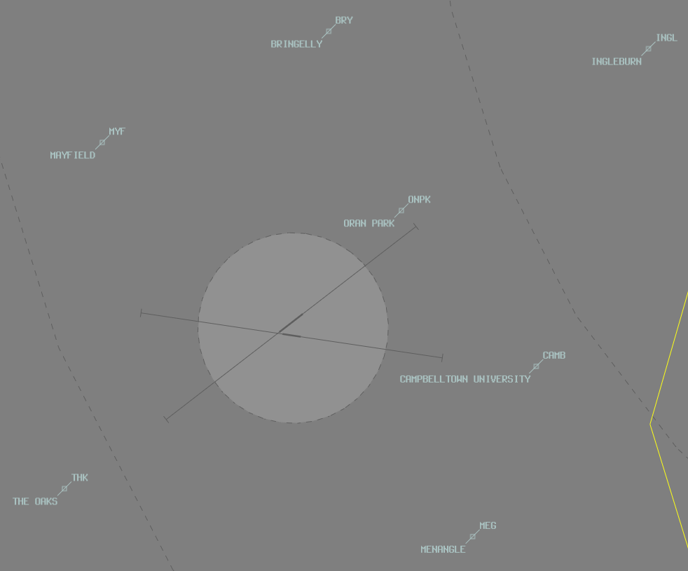

--8<-- "includes/abbreviations.md"

## Positions
| Name               | Callsign       | Frequency        | Login ID                         |
| ------------------ | -------------- | ---------------- | ---------------------------------------- |
| **Camden ADC** | **Camden Tower** | **120.100**          | **CN_TWR**                        |
| **Camden SMC**  | **Camden Ground**   | **121.900**          | **CN_GND**                      |
| **Camden ATIS**        |                | **125.100**          | **YSCN_ATIS**                                |

## Airspace
CN ADC is responsible for the Class D airspace in the CN CTR `SFC` to `A020`.

<figure markdown>
{ width="700" }
<figcaption>CN ADC Airspace</figcaption>
</figure>  

Refer to [Class D Tower Separation Standards](../../../separation-standards/classd) for more information.

## Local Procedures 
### Instrument Approaches
The only instrument approach at YSCN is the RNP W approach.  This approach commences OCTA and enters the Camden control zone.  

SY TCU **will not** clear aircraft for the approach (as it commences OCTA) and will transfer aircraft to **CN ADC** at `SCNWI`.  **CN ADC** shall issue airways clearance on first contact in accordance with the table below.  

| Scenario | Clearance |
| -------- | --------- |
| Aircraft is visual & circuit traffic exists | "*Cleared RNP-W approach, not below A018*" |
| Aircraft not visual or no circuit traffic | "*Cleared RNP-W approach, runway 06/24*" |

!!! note
    The circuit altitude at YSCN is `A013` and the overfly altitude is `A018`.  Aircraft issued a restriction to descend not below `A018` should be instructed to join the circuit once clear of traffic established in the circuit area.

## VFR Operations
## Departures
All aircraft must depart at `A013` via an extended leg of the circuit.
Upon reaching 2NM CN, all VFR aircraft should monitor the appropriate area frequency (Sydney Approach). A frequency transfer will not be issued to VFR aircraft.
Departing IFR aircraft will receive a frequency transfer.

### Depart On Climb
Some aircraft may request to leave the CTR on climb above `A013`.  If there is no reported traffic above the zone and no conflicting traffic at `A018`, aircraft may be cleared to depart on climb.

!!! phraseology
    **CN ADC:** "PCN, runway 06, cleared for takeoff"  
    **PCN:** "Runway 06, cleared for takeoff, PCN"  

    **PCN:** "PCN, request depart on climb"  
    **CN ADC:** "PCN, depart on climb"

## Arrivals
### VFR Inbound Procedures
VFR aircraft should track via one of the VFR inbound points and be instructed as below:

| VFR Approach Point | RWYs 06  | RWYs 24 |
| ----------------| --------- | ---------- |
| BRY    | *"Join Downwind RWY 06, Maintain A018, Report 2NM"*     | *"Join Final RWY 24, Maintain A018, Report Oran Park (ONPK)"*       |
| MEG  | *"Overfly Camden to join Mid-Field Crosswind RWY 06, Maintain A018, Report Overhead"*      | *"Overfly Camden to join Mid-Field Crosswind RWY 24, Maintain A018, Report Overhead"*       |
| PIC   | *"Overfly Camden to join Mid-Field Crosswind RWY 06, Maintain 1800ft, Report Overhead"*      | *"Overfly Camden to join Mid-Field Crosswind RWY 24, Maintain A018, Report Overhead"*       |
| THK  | *"Join Final RWY 06, Maintain A018, Report 3NM"*    | *"Join Downwind RWY 24, Maintain A018, Report 2NM"*      |
| MYF   | *"Join Base RWY 06, Maintain A018, Report 2NM"*      | *"Join Base RWY 24, Maintain A018, Report 2NM"*       |

When Aircraft are clear of conflicting traffic below, aircraft may *"cleared visual approach"*.

When an aircraft reports at their specified report point (or on downwind), issue the aircraft its sequence in the circuit.
!!! phraseology
    *"XEM, number 3 Runway 06, follow the C172 on base"*

## Runway Modes
### Circuits
The circuit direction changes depending on time of day and runway being used.

| Runway | Day  | Night |
| ----------------| --------- | ---------- |
| 06    | Left       | Left        |
| 24   | Right | Right  |
| 10 (Grass) | Left | - |
| 28 (Grass) | Right | - |

Circuits are flown at `A013` (High Performance Aircraft: `A018`)

When an aircraft reports on downwind, indicate their position in the sequence (and give a follow instruction if the sequence has changed since the last circuit).
!!! phraseology
    **JKA:** "JKA, downwind, touch and go"  
    **CN ADC:** "JKA, number 2"

## ATIS
### Approach Expectation
When there is more than SCT cloud on the YSCN METAR area below `A035`, the APCH field must include `EXP INST APCH`.

## Coordination

### Departures
CN ADC must advise SY TCU when the aircraft has called 'Ready'. In response to a ready call, SY TCU will issue a traffic statement.

!!! phraseology
    **CN ADC** -> **SRI**: "Ready, MHQ, Runway 06"  
    **SRI** -> **CN ADC**: "MHQ, traffic is MEH, an IFR AC50, tracking SHL RAKSO SB2WI, A035, estimate RAKSO time 35" (or "No Reported IFR Traffic")  
    **CN ADC** -> **SRI**: "Traffic is MEH tracking SHL RAKSO SB2WI A035, RAKSO at 35"  
    
    **CN ADC:** "MHQ, traffic is MEH, IFR AC50 tracking SHL RAKSO SB2WI at A035, estimating RAKSO at time 35, runway 06, cleared for takeoff"  
    **MHQ:** "Runway 06, cleared for takeoff, MHQ"
      
    **CN ADC:** "MHQ, contact Sydney Centre on 124.55"  

!!! note
    Note: Because aircraft enter Class G after departure, an airways clearance should not be issued by CN ADC. This will be done on first contact with Sydney TCU.
    Therefore, *departure instructions* are not required. You must however, pass the above (ready) coordination & obtain a traffic statement.

### Arrivals/Overfliers
SY TCU will coordinate inbound IFR aircraft. CN ADC is responsible for issuing a clearance into the CN CTR and for coordination with SY TCU in the event of a missed approach (or on completion of airwork if applicable).

SY TCU will **NOT** clear the aircraft for the approach.

!!! phraseology
    **SRI** -> **CN ADC**: “via RNP W, HRP”  
    **CN ADC** -> **SRI**: “HRP”   

**CN ADC** must issue an airways clearance to these aircraft on first contact.

### IFR overflying YSCN
SRI will advise CN ADC of observed IFR aircraft overflying CN CTR below `A025`.