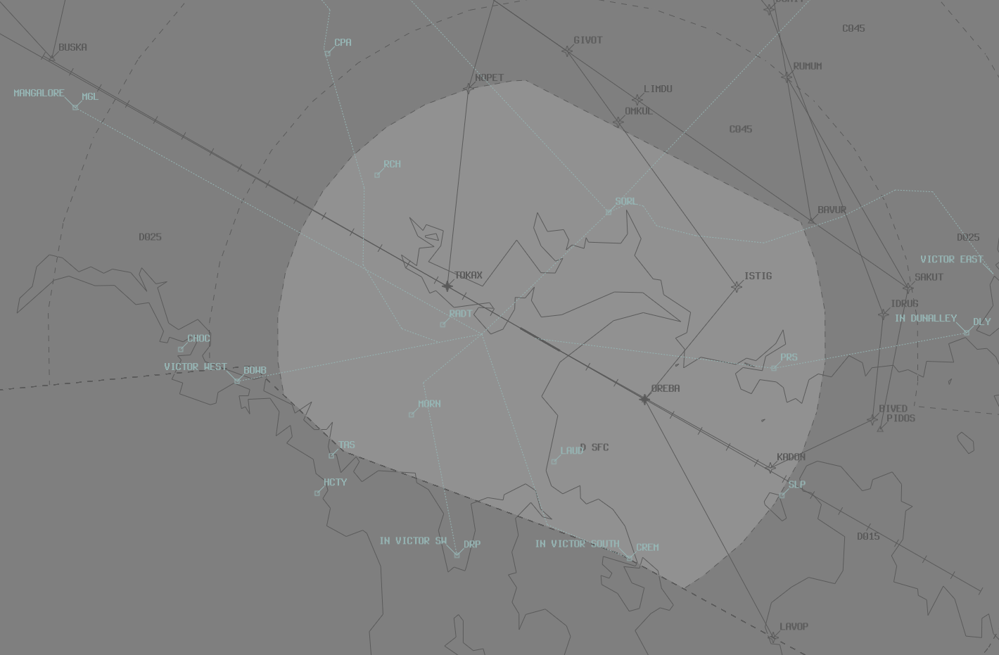
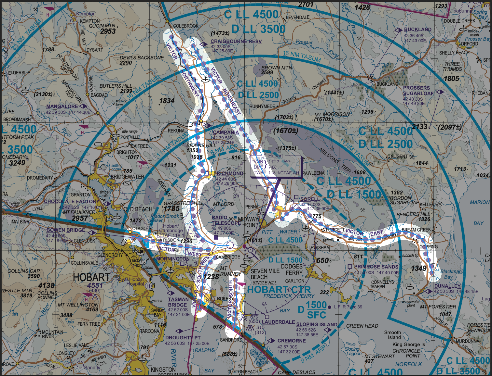

--8<-- "includes/abbreviations.md"

## Positions
| Name              | Callsign       | Frequency        | Login ID                         |
| ----------------- | -------------- | ---------------- | ---------------------------------------- |
| **Hobart ADC**    | **Hobart Tower**   | **118.100**     | **HB_TWR**                            |
| **Hobart SMC**    | **Hobart Ground**  | **121.700**     | **HB_GND**                  |
| **Hobart ATIS**       |                | **128.450**          | **YMHB_ATIS**                                |

## Airspace
HB ADC is responsible for the Class D airspace in the HB CTR:  
North of the Runway Centreline: `SFC` to `A015`  
South of the Runway Centreline: `SFC` to `A025`

<figure markdown>
{ width="700" }
  <figcaption>HB ADC Airspace</figcaption>
</figure>

Refer to [Class D Tower Separation Standards](../../../separation-standards/classd) for more information.

## SID Selection
Jet Aircraft planned via **RIBLI**, **LATUM**, or **LAVOP**, shall be assigned the **Procedural SID** that terminates at the appropriate waypoint.

Non-Jet Aircraft planned via **RIBLI**, **KANLI**, or **LAVOP**, shall be assigned the **Procedural SID** that terminates at the appropriate waypoint.

Other aircraft shall be assigned an appropriate **Procedural SID** or a visual departure.

## ATIS
YMHB ATIS identifiers range from `N` to `Y`, as YMLT uses `A` through `M`. 

## Cambridge (YCBG)
Due to it's close proximity, HB ADC & SMC are responsible for clearances into and out of Cambridge (YCBG), which sits inside the Hobart Class D control zone.

### Departures
Prior to leaving the apron, all outbound aircraft will establish communications with **HB SMC** for airways clearance.  

All IFR aircraft departing Cambridge shall be assigned a **Visual Departure** or one of Hobart's **Procedural SIDs**.

!!! note
    Both VFR and IFR aircraft require a clearance to operate in Class D airspace (even if this is an implied clearance to depart a leg of the circuit).  The examples below show an IFR aircraft departing.

!!! phraseology
    **NDR:** "Hobart Ground, NDR, for Devonport, request clearance"  
    **HB SMC:** "NDR, cleared to Devonport via KANLI flight plan route, KANLI3 departure, climb via SID A045, squawk 4432"

!!! warning "Important"
    As the assigned SID is applicable to a different departure aerodrome, it will not auto-populate in vatSys. HB SMC must write the name of the SID in the Global Ops Field of the FDR and amend the flight plan route to include all relevant tracking points.

When ready to taxi and prior to leaving the apron aircraft must contact **HB ADC**, advising intended runway for departure and receipt of YMHB ATIS, to obtain traffic information.

!!! phraseology
    **NDR:** "Hobart Tower, NDR, taxiing Cambridge Runway 32, received Hobart Information D"  
    **HB ADC:** "NDR, no reported IFR traffic, report ready"  
    **NDR:** "Wilco, NDR"

Takeoff clearances are not given. Aircraft will remain clear of the active runway and report ready to HB ADC. Aircraft must not enter an active runway or become airborne until departure instructions have been issued.

!!! phraseology
    **NDR:** "NDR, ready"  
    **HB ADC:** "NDR, report airborne"  
    **NDR:** "Wilco, NDR"

Where a delay is required, withhold departure instructions until a suitable separation standard exists.

!!! phraseology
    **NDR:** "NDR, ready"  
    **HB ADC:** "NDR, short delay due to inbound traffic"  
    **NDR:** "NDR"

### Arrivals
Inbound aircraft who are tracking via the HBA CTA will be given an airways clearance by HBA and transferred to ADC. Any clearance limits will be coordinated by HBA. Aircraft entering the Hobart CTR directly from Class G will contact HB ADC directly for clearance. Aircraft should be instructed to join a leg of the circuit and cleared for a visual approach (traffic permitting).  In IMC, IFR aircraft will fly one of Hobart's instrument approaches until visual, then break off to circle to land.

As a landing clearance is not given, aircraft should instead be informed of any traffic operating on the aerodrome and instructed to report clear of the runway.

!!! phraseology
    *UJA is an IFR Aero Commander who has been cleared the YMHB RNAV-Z RWY 30 approach by HBA and handed off to HB ADC.*  
    **UJA:** "Hobart Tower, UJA"  
    **HB ADC:** "UJA, Hobart Tower, report visual"  
    **UJA:** "Wilco, UJA"  

    **UJA:** "UJA, visual"  
    **HB ADC:** "UJA, track for final runway 30, no reported traffic, report clear of the runway"  
    **UJA:** "Track for final runway 30, wilco, UJA"

!!! phraseology
    *KLR is a VFR Cherokee who is tracking inbound on the Victor East VFR route.*  
    **HB ADC:** "KLR, enter the control zone tracking via the Victor East, A015, clearance limit Sorell"  
    **KLR:** "Enter control zone tracking via the Victor East, A015, clearance limit Sorell, KLR"  

    **KLR:** "KLR, approaching Sorell"  
    **HB ADC:** "KLR, join base runway 12, cleared visual approach, no reported traffic, report clear of the runway"  
    **KLR:** "Join base runway 12, cleared visual approach, wilco, KLR"

## VFR Operations

### Circuit Direction
| Runway | Direction |
| ------ | ----------|
| 12     | Left  |
| 30     | Right |

### Inbound / Outbound
| Victor    | Inbound       | Outbound        | 
| --------- | -------------- | ---------------- | 
| Northwest |  CBV-CPA-RCH west of the Colebrook/Richmond Road to west abeam RADT  | West abeam RADT-RCH-CPA-CBV west of the Richmond/Colebrook Road    | 
| Northeast |  CBV-CPA-Orielton-SORL east of Colebrook Road to CPA then Orielton east of Tasman HWY to SORL |  As directed by ATC to SORL then Orielton east of Tasman HWY, thence east of Colebrook Rd east of CPA to CBV   | 
| East      |  DLY-SORL north of the Arthur HWY        |  As directed by ATC to SORL   | 
| Southwest |  DRP to-YCBG west of Mt Rumney        |  Eest of Mt Rumney to DRP        | 
| South     |  CREM-LAUD-YCBG            |  LAUD-CREM          | 
| West      |  BOWB to Risdon Vale thence Cambridge township   |  Risdon Vale thence BOWB | 

<figure markdown>
{ width="700" }
</figure>

Clearances for aircraft entering the CTR must be worded so as to leave no possibility for misinterpretation by the pilot.

!!! phraseology
    **NDR:** "Hobart Tower, NDR, CPA, A015, on the Victor Northwest, received Romeo, request clearance"  
    **HB ADC:** "NDR, enter the CTR tracking via the Victor Northwest at A015."

## Coordination
### Departures
[Next](../../controller-skills/coordination.md#next) coordination is **not** required to HBA for aircraft that are:   

- Departing from a runway nominated on the ATIS; and  
- Assigned the standard assignable level; and  
- Assigned a SID; or  
- Not entering HBA CTA

All other aircraft require a 'Next' call to HBA.

!!! note
    All departures from YCBG who will enter the HBA CTA must be Next coordinated by ADC.

The Standard Assignable level from **HB ADC** to **HBA** is:  

| Flight Rules | Level |
| ----- | ----- |
| IFR | `A080` |
| VFR | The lower of `A045` and `RFL` |

#### Airways Clearance
**HB SMC** shall give [heads-up](../../controller-skills/coordination.md#airways-clearance) coordination to HBA controller prior to the issue of the following clearances:

- VFR departures entering HBA CTA
- Aircraft using a runway not on the ATIS

### Arrivals/Overfliers
HBA will heads-up coordinate arrivals/overfliers from Class C to HB ADC.  
IFR aircraft will be cleared for the coordinated approach (Instrument or Visual) prior to handoff to HB ADC, unless HB ADC nominates a restriction.  
VFR aircraft require a level readback.

!!! phraseology
    **HBA** -> **HB ADC**: "via BAVUR for the RNAV-W RWY 12, QJE1551"  
    **HB ADC** -> **HBA**: "QJE1551, RNP-W RWY 12"  
