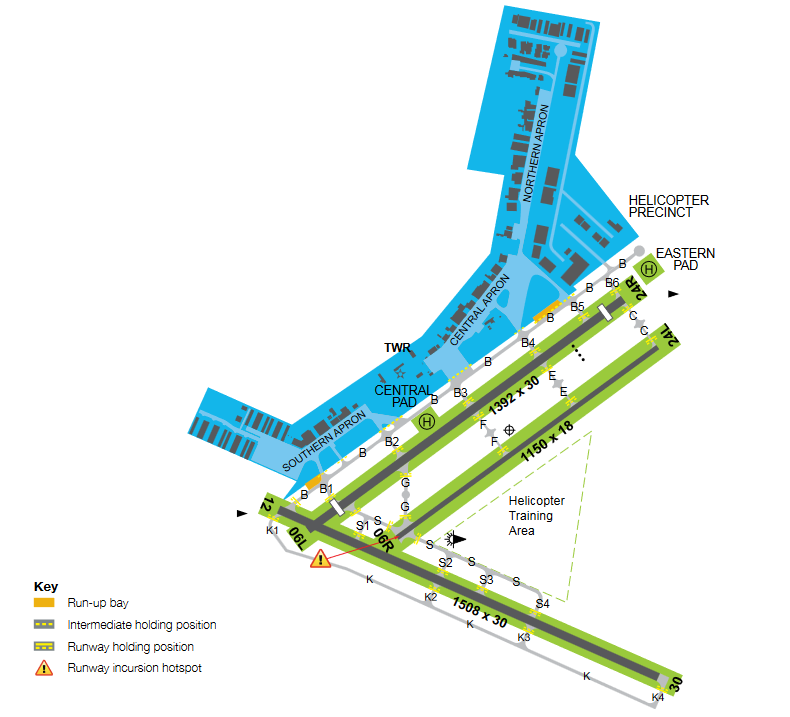

--8<-- "includes/abbreviations.md"

## Positions

| Name               | Callsign       | Frequency        | Login Identifier                         |
| ------------------ | -------------- | ---------------- | ---------------------------------------- |
| Jandakot ADC  | Jandakot Tower  | 118.100          | JT_TWR                        |
| Jandakot SMC  | Jandakot Ground   | 124.300          | JT_GND                       |
| Jandakot ATIS     |                | 128.650          | YPJT_ATIS                                |

<figure markdown>
{ width="500" }
  <figcaption>Maneuvering Area</figcaption>
</figure>

## Airspace
JT ADC is responsible for the Class D airspace in the JT CTR `SFC` to `A015`.

<figure markdown>
{ width="700" }
  <figcaption>JT ADC Airspace</figcaption>
</figure>

## Fixed-Wing Operations
### VFR Arrivals
VFR aircraft will report inbound at BOAT, POWR, OAKF or RUSS at `A015`. JT ADC will instruct aircraft to maintain `A015` or remain outside the control zone (workload permitting). Aircraft will then report again at ADWD when inbound from BOAT or POWR, or FDL when inbound from OAKF or RUSS. They should then be instructed to join the circuit as below:

| VFR Approach Point | RWYs 06  | RWYs 24 | RWY 12 | RWY 30 |
| ----------------| --------- | ---------- | ---------- | --------- |
| ADWD   | *"Join base runway 06L"* | *"Join right downwind runway 24R, maintain A015"*, until the aircraft are clear of RWY 24R departures via *Fiona Stanley Hospital* and FREM, then *"Cleared Visual Approach"*  | *"Join final runway 12"* | *"Join downwind ruwnay 30, maintain A015"*, until the aircraft is clear of RWY 30 departures via YGB, then *"Cleared Visual Approach"* |
| FDL  | *"Join downwind runway 06L, maintain A015"*. Aircraft should fly overhead the airfield between the control tower and the upwind end of the runway and join the circuit. Once established in the circuit, *"Cleared visual approach"* | *"Join right downwind runway 24R, maintain A015"*. Aircraft should fly overhead the airfield between the control tower and the upwind end of the runway and join the circuit. Once established in the circuit, *"Cleared visual approach"* | *"Join right downwind runway 12"* | *"Join final runway 30"* |

All aircraft will arrive on runway 06L/24R or 12/30.

!!! note
    Circuit joining instructions given without an assigned altitude imply clearance to conduct the visual approach. There is no need to clear these aircraft for a visual approach.

### VFR Departures
VFR aircraft should report ready to **JT ADC** with their departure intentions.  A takeoff clearance constitutes a clearance to depart the zone by extending the pilot's requested leg of the circuit.  Aircraft departing the zone into class G airspace will transfer to area frequency upon leaving the zone, **no explicit frequency transfer is given to these aircraft**.

Aircraft departing a leg of the circuit will climb to and maintain the following levels until clear of the zone:  
All runways: `A010`  

VFR aircraft will depart via set outbound departure routes. Aircraft will track extended circuit legs to the departure point. These departure points include: YGB, FREM via *Fiona Stanley Hospital*, and SHOP.

Departures via FREM and YGB will depart on runway 06L/24R. Runway 06R/24L is used for circuit traffic and departures via SHOP.

### IFR Arrivals
**PH TCU** will coordinate all IFR arrivals in accordance with coordination procedures.

### IFR Departures
All IFR Departures must be assigned the most appropriate SID in accordance with the aircraft's direction of flight.

| Direction | SID   |
| -------| ----- |
| South/West    | TONEG  |
| North/North-west    | ISPET |
| East/North-east    | SCARP |

### Circuits
The circuit direction changes depending on tower opening hours and runway being used.

| Runway | Tower Open   | Tower Closed |
| -------| ----- | ----- |
| 06L    | Left  | Right |
| 06R    | Right | -  |
| 24L    | Left  | -   |
| 24R    | Right | Left  |
| 12     | Left  | Left  |
| 30     | Left  | Left  |

Circuits to be flown at `A010`

## Helicopter Operations
### General
Unless otherwise depicted in the `ERSA FAC YPJT`, all helicopters must comply with fixed wing procedures.

### Circuits
Circuits are conducted within the lateral confines of the fixed-wing circuit at `A008`, in the same direction as the current runway config.  The termination point of the circuit is the Main Pad.

## ATIS
### Runway Nomination
The ATIS must indicate the current runway config and nominate what each parallel runway is being used for.  The northern runway (06L/24R) is primarily used for VFR arrivals and departures, the southern runway (06R/24L) for circuit training and departures via `SHOP`, and the cross runway (12/30) for arrivals/departures when weather is unsuitable for parallel rwunay operations.  

This should be reflected on the ATIS as below:  
`RWY 06R FOR CIRCUITS AND DEPARTURES VIA ARMADALE SHOPS; RWY 06L FOR ARRIVALS AND ALL OTHER DEPARTURES`  
`RWY 24L FOR CIRCUITS AND DEPARTURES VIA ARMADALE SHOPS; RWY 24R FOR ARRIVALS AND ALL OTHER DEPARTURES`

When PH RWY 03 is in operation, the ATIS should include:
`DUE PERTH DUTY RUNWAY 03, CAUTION WAKE TURBULANCE`
## Coordination
### Next Call
When the aircraft is ready for departure, JT ADC will coordinate with the relevant PH TCU controller above them for permission to release the aircraft into their CTA.

!!! example
    **JT ADC** -> **PH TCU**: "Next, FD420, runway 24R"  
    **PH TCU** -> **JT ADC**: "FD420, Unrestricted"  
    **JT ADC** -> **PH TCU**: "FD420"  

The Standard Assignable level from JT ADC to PH TCU is the lower of `A030` or the `RFL`, any other level must be prior coordinated.

### Arrivals/Overfliers
PH TCU will heads-up coordinate arrivals/overfliers from Class C to JT ADC.  
IFR aircraft will be cleared for the coordinated approach (Instrument or Visual) prior to handoff to JT ADC, unless JT ADC nominates a restriction.  
VFR aircraft require a level readback.

!!! example
    **PH TCU** -> **JT ADC**: "via RNAV-Z RWY 06L, FD416, circling to land RWY 24R"  
    **JT ADC** -> **PH TCU**: "FD416, RNAV-Z RWY 06L with a circle to land RWY 24R"  

!!! tip
    Remember that IFR aircraft are only separated from other IFR or SVFR aircraft in class D.  You should *generally* be able to issue a clearance for an approach and use other separation methods (visual separation, holding a departure on the ground) if separation is required with these aircraft.