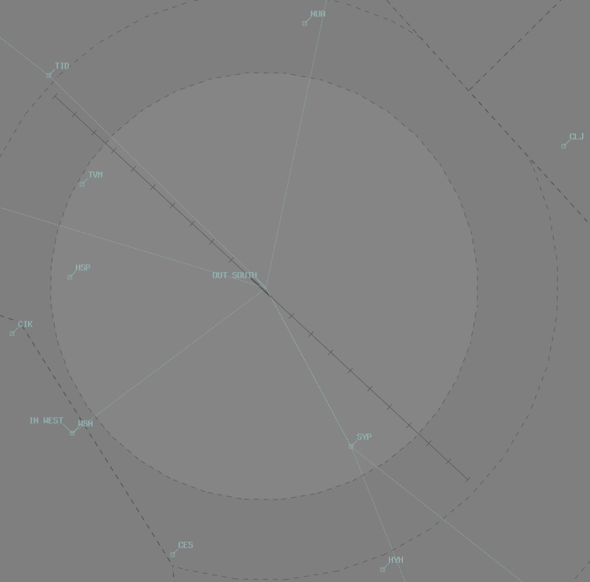

--8<-- "includes/abbreviations.md"

## Positions

| Name                | Callsign              | Frequency   | Login ID      |
| ------------------- | --------------------- | ----------- | ------------- |
| **Launceston ADC**  | **Launy Tower**       | **118.700** | **LT_TWR**    |
| **Launceston ATIS** |                       | **134.750** | **YMLT_ATIS** |

## Airspace
LT ADC is responsible for the Class D airspace in the LT CTR `SFC` to `A015`.

<figure markdown>
{ width="700" }
</figure>

Refer to [Class D Tower Separation Standards](../../../separation-standards/classd) for more information.

## Runway Modes
### Circuits
#### Circuit Direction
| Runway | Day | Night |
| ------ | ------ | ----|
| 14R    | Right | Right |
| 32L     | Left  | Left |

## SID Selection
Aircraft planned via **MIKIS**, **TASUM**, or **VEKLO** shall be assigned the relevant Procedural SID.

Aircraft planned via **IRSOM**, **MORGO**, **FLIKI**, **VIMAP**, **NUNPA**, or **MOTRA**, departing Runway 32L, shall be assigned the relevant **ALPHA** Procedural SID.

Aircraft planned via **FLIKI**, **VIMAP**, **NUNPA**, or **MOTRA**, departing Runway 14R, shall be assigned the relevant **BRAVO** Procedural SID.

**Non-Jet** Aircraft planned via **IRSOM**, **FLIKI**, or **MORGO** may be assigned the relevant **CHARLIE** Procedural SID *on pilot request*.

Aircraft **not** planned via any of the above waypoints, shall be recleared via the most appropriate one, and assigned the **Procedural SID**.

Aircraft unable to accept a SID, or that cannot practically accept amended routing via the above points, shall be assigned the **RADAR SID**.

## ATIS
### ATIS Identifiers
YMLT ATIS identifiers range from `A` to `M`, as YMHB uses `N` through `Y`.

## Coordination
### Departures
[Next](../../controller-skills/coordination.md#next) coordination is not required to LTA for aircraft that are:   

- Departing from a runway nominated on the ATIS; and  
- Assigned the standard assignable level; and  
- Assigned a SID; or  
- Not entering LTA CTA

All other aircraft require a 'Next' call to LTA. 

The Standard Assignable level from **LT ADC** to **LTA** is:  

| Flight Rules | Level |
| ------- | ------ |
| IFR | `A080` |
| VFR | The lower of `A045` and `RFL` |

LT ADC shall give [heads-up](../../controller-skills/coordination.md#airways-clearance) coordination to LTA controller prior to the issue of the following clearances:  

- VFR departures entering LTA CTA
- Aircraft using a runway not on the ATIS 

### Arrivals/Overfliers
LTA will heads-up coordinate arrivals/overfliers from LTA CTA to LT ADC.  
IFR aircraft will be cleared for the coordinated approach (Instrument or Visual) prior to handoff to LT ADC, unless LT ADC nominates a restriction.  
VFR aircraft require a level readback.

!!! phraseology
    **LTA** -> **LT ADC**: "via IRSOM for the DGA, TFW"  
    **LT ADC** -> **LTA**: "TFW, DGA"  
