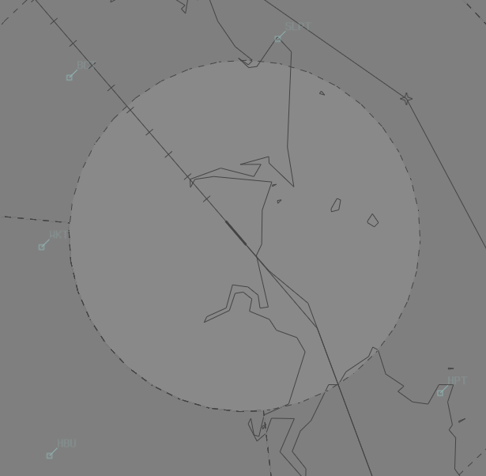

--8<-- "includes/abbreviations.md"

## Positions
| Name | Callsign | Frequency | Login ID |
| ---- | -------- | --------- | ---------------- |
| **Mackay ADC** | **Mackay Tower** | **124.500** | **MK_TWR** |
| **Mackay SMC** | **Mackay Ground** | **121.700** | **MK_GND** |
| Mackay ATIS |    | 128.000 | YBMK_ATIS |

## Airspace
MK ADC is responsible for the Class D airspace in the MK CTR `SFC` to `A010`.

<figure markdown>
{ width="700" }
</figure>

Refer to [Class D Tower Separation Standards](../../../separation-standards/classd) for more information.

## Coordination
### Departures
#### Auto Release
'Next' coordination is **not** required to MKA for aircraft that are:   
  a) Departing from a runway nominated on the ATIS; and  
  b) Assigned the standard assignable level; and  
  c) Assigned a **Procedural** SID; or  
  d) Not entering MKA CTA

!!! example
    **MK ADC** -> **MKA**: "Next, ABC, runway 14"  
    **MKA** -> **MK ADC**: "ABC, Heading 150 Visual, unrestricted"  
    **MK ADC** -> **MKA**: "Heading 150 Visual unrestricted, ABC"

The TCU controller can suspend/resume Auto Release at any time, with the concurrence of **MKA**.

The Standard Assignable level from MKADC to MKA is the lower of `A060` or the `RFL`.

#### SMC
The controller assuming responsibility of **SMC** shall give heads-up coordination to **MKA** prior to the issue of the following clearances:  

- VFR Departures  
- Aircraft using a runway not on the ATIS

### Arrivals/Overfliers
MKA will heads-up coordinate arrivals/overfliers from Class C to MK ADC.  
IFR aircraft will be cleared for the coordinated approach (Instrument or Visual) prior to handoff to MK ADC, unless MK ADC nominates a restriction.  
VFR aircraft require a level readback.

!!! example
    **MKA** -> **MK ADC**: "Via BAVAM for the RNP RWY 32, VOZ1164”  
    **MK ADC** -> **MKA**: "VOZ1164, RNP RWY 32"  