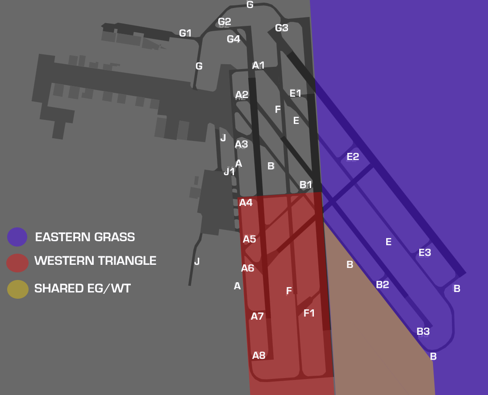

--8<-- "includes/abbreviations.md"

## Positions

| Name               | Callsign             | Frequency   | Login ID     |
|--------------------|----------------------|-------------|--------------|
| **Moorabbin ADC**  | **Moorabbin Tower**  | **118.100** | **MB_TWR**   |
| **Moorabbin SMC**  | **Moorabbin Ground** | **134.250** | **MB_GND**   |
| Moorabbin ATIS     |                      | 120.900     | YMMB_ATIS    |

---

## Airspace
MB ADC is responsible for the Class D airspace in the MB CTR from `SFC` to `A025`.

<figure markdown>
{ width="1000" }
  <figcaption>MB ADC Airspace</figcaption>
</figure>

Refer to [Class D Tower Separation Standards](../../../separation-standards/classd) for more information.

---

## Runway Modes

Preferred runway modes are as follows (in order of preference):

1. Runway 35L/35R  
2. Runway 17L/17R  
3. Runways 13/31 (equal preference)

Crosswind operations are limited to **10KT**, and tailwind use is discouraged unless required.

Runway 04/22 may only be used operationally and is **not available for circuit training**. Consideration must be given to it's limited length.

---

## VFR Inbound Procedures

Aircraft should report at the standard VFR entry points:  
- **BTO** (to the west)  
- **BAW** (to the north)  
- **CARR** (to the southeast)  
- **GMH** (to the east)  
- **ACE** (to the south)  
- **SHOAL** (to the southwest)

| Entry Point | RWY 13 | RWY 17 | RWY 31 | RWY 35 |
|-------------|--------|--------|--------|--------|
| BTO         | Join final 13R | Join base 17R | Join downwind 31L | Join oblique downwind 35L |
| BAW         | Join base 13R  | Join base 17R | Join oblique downwind 31L | Join base 35L |
| CARR        | Join downwind 13R | Join downwind 17R | Join oblique base 31L | Join final 35L |
| GMH         | Join downwind 13L | Join base 17L | Join oblique base 31R | Join base 35R |
| ACE         | Join base 13L | Join oblique base 17L | Join base 31R | Join oblique downwind 35R |
| SHOAL       | Join base 13L | Join base 17L | Join base 31R | Join base 35R |

CTR Entry Altitude: `A010`.

---

## Departures into CTA

The overlying Class C airspace extends down to `A025` to the north and `A045` to the south.

- Aircraft departing into Class C must be cleared to `A050` or `RFL` (if lower) by **MB ADC**.  
- Coordination with TCU for release is required before issuing a takeoff clearance.  
- VFR aircraft departing into Class G must advise intentions with their "Ready" call and will be cleared accordingly.
- During times of peak TMA traffic, there may be extensive delays for departures and pilots may elect to depart directly into class G.

See [Departure Coordination](#departures) for coordination requirements.

---

## Circuits

### Fixed wing

Circuit altitude: `A010`.

| Runway  | Day Circuit Direction | Night Circuit Direction |
|---------|------------------------|--------------------------|
| 13L     | Left                  | Left                    |
| 13R     | Right                 | N/A                     |
| 31L     | Left                  | N/A                     |
| 31R     | Right                 | Right                   |
| 17L     | Left                  | Left                    |
| 17R     | Right                 | N/A                     |
| 35L     | Left                  | N/A                     |
| 35R     | Right                 | Right                   |

## Coordination

### Departures

- Autorelease is not in effect. Coordination for "Next" is required required for departures into overlaying Class C. They must not be issued a takeoff clearance until a release has been obtained.
- Standard assignable level: `A050` (or `RFL` if lower).  
!!! example
    **MB ADC** -> **MDS**: "Next, SGE"  
    **MDS** -> **MB ADC**: "SGE, unrestricted"

Aircraft departing directly into Class C airspace should be instructed to report passing A025 and transferred to the TCU at that point.

!!! example 
    **SGE**: "SGE, A025"  
    **MB ADC**: "SGE, contact Melbourne Departures on 129.4" 

Aircraft who will transit Class G airspace on climb into CTA will be **cleared to leave and re-enter controlled airspace** on climb to their assigned level.

!!! example
    **MB ADC**: "SGE, cleared to leave and re-enter controlled airspace climbing to A050, no reported IFR traffic. Contact Melbourne Departures on 129.4"  
    **SGE**: "Cleared to leave and re-enter controlled airspace climbing to A050, Departures 129.4, SGE"

### Arrivals/Overfliers

= ML TCU will heads-up coordinate arrivals/overfliers from Class C to MB ADC.  
- **IFR arrivals** will be cleared for the coordinated approach (Instrument or Visual) prior to handoff to MB ADC, unless MB ADC nominates a restriction.  
- **VFR arrivals** will not be coordinated, and will need to receive their airways clearance from MB ADC.

!!! example
    **MDS** -> **MB ADC**: "To the west, PLE, for the NDB-A"  
    **MB ADC** -> **MDS**: "PLE, NDB-A"

!!! tip
    Remember that IFR aircraft are only separated from other IFR or SVFR aircraft in class D. Use other separation methods, such as holding a departure on the ground, if separation is required with these aircraft.

## Helicopters

### Circuits

#### Day VFR Circuits
Helicopter circuits are conducted from designated areas based on the active runway:

<figure markdown>
{ width="700" }
<figcaption>Eastern Grass and Western Triangle</figcaption>
</figure>

- **RWY 17/35**: Circuits are conducted from the **Eastern Grass**.
- **RWY 13/31**: Circuits are conducted from the **Western Triangle**.
- Circuit operations are **parallel to the duty runway** and inside the fixed-wing circuit.

**Radio Procedure**:
- Pilots will report “AIRBORNE” before each circuit, or if departing additionally they will include their intentions. Aircraft are expected to remain under 300 feet until you acknowledge.
- Reply with simply the aircraft callsign for a leg of the circuits, or departure instructions. Hold the aircraft if they will conflict with other traffic.
- On completion of circuit training, the pilot will nominate their landing HLS during the airborne call and report downwind before transitioning to the arrival procedure.

!!! example
    **RJB**:: "MB Gnd, RJB, At the southern apron, with information mike, request circuits"
    **MB SMC**: "RJB, cleared for circuit, Eastern Grass, report airborne"      
    **RJB**: "Cleared for circuits, Eastern Grass, RJB"  
    *(After departure)*  
    **RJB**: "Moorabbin Tower, RJB, airborne"  
    **MB ADC**: "RJB"

#### Night Circuits
Night operations must comply with fixed wing circuits and altitudes.

### Departures

Day VFR helicopter departures must remain at `A007`. Helicopters must nominate a aiming point or HLS on first contact with MB SMC.

1. **Aiming Points**:
   - Direct helicopters departing from the **Southern Aiming Point** to hold short of **TWY A**.
   - Direct helicopters departing from the **Northern Aiming Point** to hold short of **TWY G**.

2. **Departure Procedures**:
    - Ensure departures remain clear of duty runways and provide instructions to:
        - **Pass east of the tower**.
        - **Track**:
            - For **northbound departures**: Track north until clear of the tower.
            - For **southbound departures**: Track south until clear of airport buildings.

<figure markdown>
{ width="700" }
<figcaption>Aiming Locations</figcaption>
</figure>

### Arrivals

- ML TCU will heads-up coordinate arrivals/overfliers from Class C to MB ADC.  

- **From the East**:
    - Helicopters arriving from the east should be instructed to fly a close base leg and pass over the duty threshold at **not below `A005`**.
    - For duty runways **13** or **17**, helicopters arriving for the northern or main aprons may be instructed to overfly the duty threshold at **not below `A005`** for a short right circuit.
    - For **circuits**, helicopters arriving may directly join a leg of the circuit.

- **From the West**:
    - For **southerly approaches** full stop: Instruct helicopters to remain clear of duty runways, track east of the tower, and proceed directly to the **Southern HLS** or southern aiming point.
    - For **northerly approaches** full stop: Instruct helicopters to remain clear of duty runways, track east of the tower, and proceed to the northern or main aprons.
    - For **circuits** have the aircraft fly overhead the tower and report. Instruct the aircraft to join a leg of the circuit.

!!! example
    A helicopter, RJB, is looking to join the circuits from the west at Cerberus, with runway 17L/R active.
    **RJB**: "MB Twr, RJB, Heli R44, Cerberus 1500, inbound, with Mike, for circuits"
    **MB ADC**: "RJB, MB Twr, maintain 1500, report overhead tower"
    **RJB**: "RJB overhead"
    **MB ADC**: "RJB, descend and maintain 700, join downwind runway 17R"
    **RJB**: "Descend and main 700, join downwind runway, 17R"