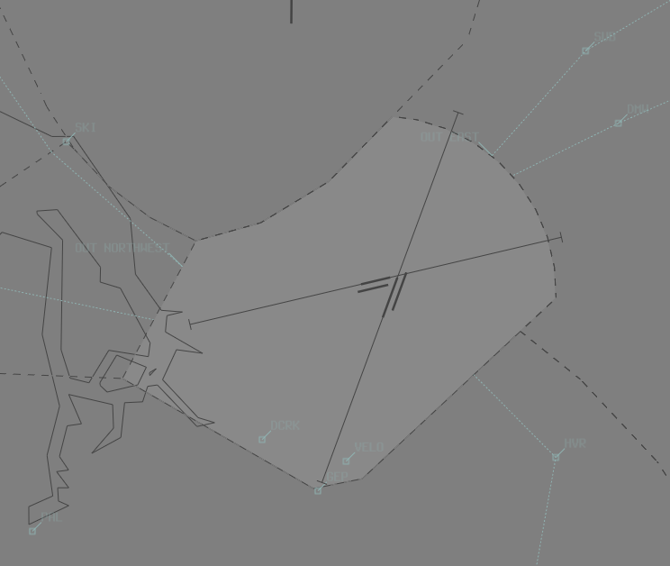

--8<-- "includes/abbreviations.md"

## Positions
| Name               | Callsign       | Frequency        | Login ID                         |
| ------------------ | -------------- | ---------------- | ---------------------------------------- |
| **Parafield ADC**  | **Parafield Tower**  | **118.700**          | **PF_TWR**                        |
| **Parafield SMC**  | **Parafield Ground** | **119.900**          | **PF_GND**                       |
| Parafield ATIS        |                | 120.900          | YPPF_ATIS                                |

## Airspace
PF ADC is responsible for the Class D airspace in the PF CTR `SFC` to `A015`.

<figure markdown>
{ width="700" }
  <figcaption>PF ADC Airspace</figcaption>
</figure>

## Circuits
Circuits to be flown at `A010`

| Runway | Day  | Night |
| -------| -----| ------|
| 03L  | Left   | Left  |
| 03R  | Right  | -     |
| 21L  | Left   | -     | 
| 21R  | Right  | Right |
| 08L  | Left   | -     |
| 08R  | Right  | -     |
| 26L  | Left   | -     |
| 26R  | Right  | -     |

## VFR Inbound Procedures
| VFR Approach Point | RWYs 03 | RWYs 21 | RWYs 08 | RWYs 26 |
| ----------------| --------- | ---------- | ----- | ----- |
| OHB   | Join base (or downwind) RWY 21R | Join base (or downwind) RWY 03L | Join final RWY 08L| Join downwind RWY 26R | 
| DMW | Join downwind RWY 03R | Join 3NM final RWY 21L| Join downwind RWY 08L | Join final RWY 26R |

!!! note
    Visually monitor all aircraft to ensure tracking South of Bolivar Strobe, to ensure aircraft remain outside of Edinburgh CTR. 
    <figure markdown>
    { width="700" }
    </figure>

## ATIS
### Operational Info
ATIS broadcast **BY DAY** shall follow the format:   
`RWY 21R (OR 03L) FOR ARRS & DEPS WEST, RWY 21L (OR 03R) ARRS & DEPS EAST`  
OR   
`RWY 26R (OR 08L) FOR ARRS & DEPS, RWY 26L (OR 08R) FOR CCT TRAINING`
   
ATIS broadcast **BY NIGHT** shall follow the format:  
`RWY 21R (OR 03L) FOR ALL OPERATIONS`  

### Approach Expectation
The APCH field should include `EXP INST APCH` when:   
  - the ceiling is at or below `A020`; or  
  - visibility is less than 5000m  

## Coordination
### Departures
When the aircraft is ready for departure, PF ADC will coordinate with the relevant Class C sector above them for permission to release the aircraft into their CTA.

!!! example
    **PF ADC** -> **AAW**: "Next, XMM, 03L"  
    **AAW** -> **PF ADC**: "XMM, Heading 020, unrestricted"  
    **PF ADC** -> **AAW**: "Heading 020, XMM"

The Standard Assignable level from PF ADC to AD TCU is the lower of `A030` or the `RFL`, any other level must be prior coordinated.
### Arrivals
AD TCU will heads-up coordinate arrivals/overfliers from Class C to PF ADC.  
IFR aircraft will be cleared for the coordinated approach (Instrument or Visual) prior to handoff to PF ADC, unless PF ADC nominates a restriction.  
VFR aircraft require a level readback.

!!! example
    **AAW** -> **PF ADC**: "via PAL, YTS"  
    **PF ADC** -> **AAW**: "YTS, A010"

!!! tip
    Remember that IFR aircraft are only separated from other IFR or SVFR aircraft in class D. You should *generally* be able to issue a clearance for an approach and use other separation methods (visual separation, holding a departure on the ground) if separation is required with these aircraft.