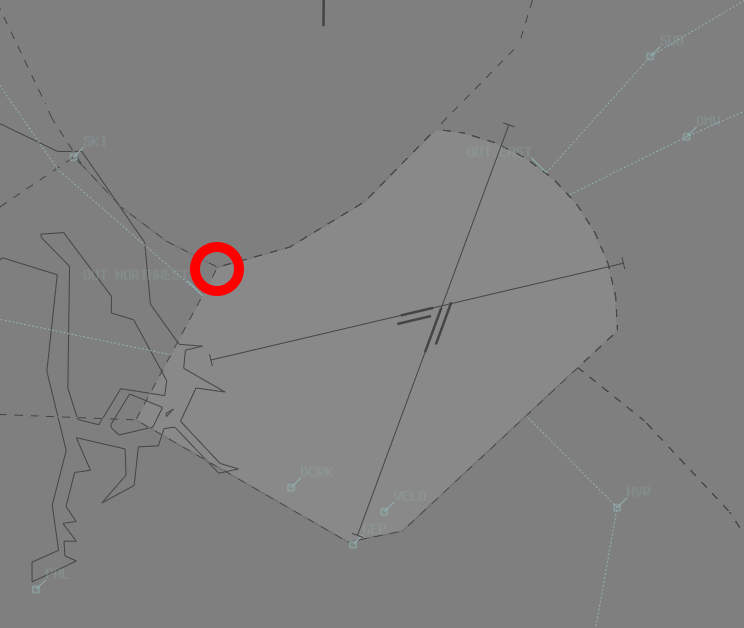

--8<-- "includes/abbreviations.md"

## Positions
| Name               | Callsign       | Frequency        | Login ID                         |
| ------------------ | -------------- | ---------------- | ---------------------------------------- |
| **Parafield ADC**  | **Parafield Tower**  | **118.700**          | **PF_TWR**                        |
| Parafield ADC 2†  | Parafield Tower  | 124.600        | PF-2_TWR                        |
| **Parafield SMC**  | **Parafield Ground** | **119.900**          | **PF_GND**                       |
| Parafield ATIS        |                | 120.900          | YPPF_ATIS                                |

† *Non-standard positions* may only be used in accordance with [VATPAC Air Traffic Services Policy](https://vatpac.org/publications/policies){target=new}

### Dual ADC Operations
When Parafield ADC 2 is online, responsibility for the **Runway**, **Circuit**, and **Airspace** is divided between the two ADC controllers.

ADC 1 takes responsibility for the South/East Runway, Circuit and Airspace (Runway **08R/26L** and **03R/21L**).

ADC 2 takes responsibility for the North/West Runway, Circuit and Airspace (Runway **08L/26R** and **03L/21R**).

ADC 2 is **not permitted** online when *Single Runway* Operations are in use.

Refer to the [ATIS section](#runway-nomination) for information on ATIS formatting when ADC 2 is online.

## Airspace
PF ADC is responsible for the Class D airspace in the PF CTR `SFC` to `A015`.

<figure markdown>
{ width="700" }
  <figcaption>PF ADC Airspace</figcaption>
</figure>

### Dual ADC Operations
Airspace Ownership when ADC 2 is online, is split down the middle of the two active extended centrelines.

## Circuits
Circuits to be flown at `A010`

| Runway | Day  | Night |
| -------| -----| ------|
| 03L  | Left   | Left  |
| 03R  | Right  | -     |
| 21L  | Left   | -     | 
| 21R  | Right  | Right |
| 08L  | Left   | -     |
| 08R  | Right  | -     |
| 26L  | Left   | -     |
| 26R  | Right  | -     |

## VFR Operations
### Arrivals
| VFR Approach Point | RWYs 03 | RWYs 21 | RWYs 08 | RWYs 26 |
| ----------------| --------- | ---------- | ----- | ----- |
| OHB   | Join base (or downwind) RWY 21R | Join base (or downwind) RWY 03L | Join final RWY 08L| Join downwind RWY 26R | 
| DMW | Join downwind RWY 03R | Join 3NM final RWY 21L| Join downwind RWY 08L | Join final RWY 26R |

!!! warning "Important"
    Visually monitor all aircraft to ensure tracking South of **Bolivar Strobe** (located at the Southern tip of the EDN CTR), to ensure aircraft remain outside of EDN CTR. 
    <figure markdown>
    { width="400" }
    </figure>

## IFR Operations
### Departures
IFR Departures from YPPF shall be assigned **PF RADAR** SID when Runway 03/21 is in use.

## ATIS
### Runway Nomination

| Priority | Runway Mode |
| ------ | ------ |
| =1     | 03L & 03R |
| =1     | 21L & 21R |
| =2     | 08L & 08R |
| =2     | 26L & 26R |
| 3     | Any Single Runway Operations |

When 2 ADC controllers are online, the ATIS shall be formatted: `RWY 03R/08R/21L/26L FOR ARRS AND DEPS EAST, FREQ 118.7. RWY 03L/08L/21R/26R FOR ARRS AND DEPS WEST, FREQ 124.6`

By Night, Only Runway **03L/21R** may be used.

### Approach Expectation
The APCH field should include `EXP INST APCH` when:   
  - the ceiling is at or below `A020`; or  
  - visibility is less than **5000m**  

## Coordination
### Departures
When the aircraft is ready for departure, PF ADC will coordinate with the relevant Class C sector above them for permission to release the aircraft into their CTA.

!!! phraseology
    **PF ADC** -> **AAW**: "Next, XMM, 03L"  
    **AAW** -> **PF ADC**: "XMM, Heading 020, unrestricted"  
    **PF ADC** -> **AAW**: "Heading 020, XMM"

The Standard Assignable level from PF ADC to AD TCU is the lower of `A030` or the `RFL`, any other level must be prior coordinated.

### Arrivals
AD TCU will heads-up coordinate arrivals/overfliers from Class C to PF ADC.  
IFR aircraft will be cleared for the coordinated approach (Instrument or Visual) prior to handoff to PF ADC, unless PF ADC nominates a restriction.  
VFR aircraft require a level readback.

!!! phraseology
    **AAW** -> **PF ADC**: "via PAL, YTS"  
    **PF ADC** -> **AAW**: "YTS, A010"

!!! tip
    Remember that IFR aircraft are only separated from other IFR or SVFR aircraft in class D. You should *generally* be able to issue a clearance for an approach and use other separation methods (visual separation, holding a departure on the ground) if separation is required with these aircraft.

#### ADC 2 Online
When ADC 2 is online, AD TCU may not be familiar with which controller owns what airspace. Best practice is to receive the coordination no matter what, and if it was meant for the other ADC controller, relay the coordination to them internally.

### PF ADC Internal
PF ADC must heads-up coordinate **all aircraft** transiting from one ADC controller to the other.

!!! phraseology
    **PF ADC 2** -> **PF ADC**: "via OHB, YNM for an overhead join"  
    **PF ADC** -> **PF ADC 2**: "YNM, A015"