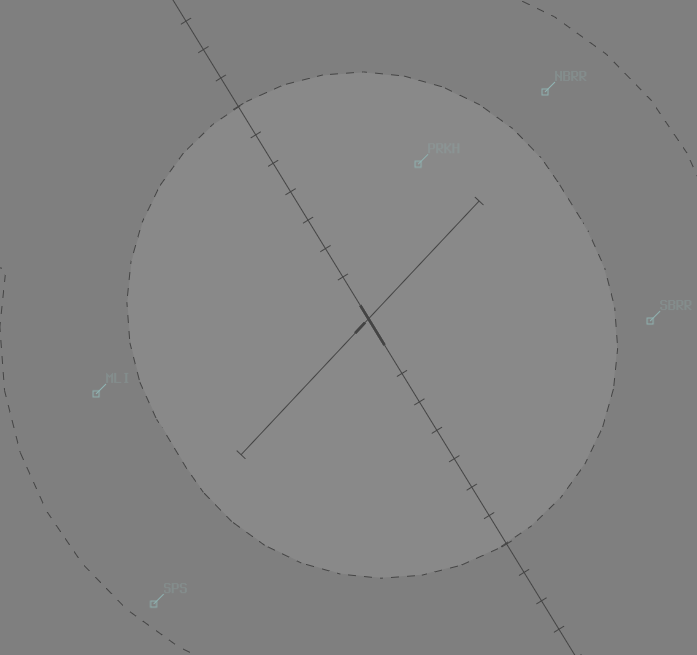

--8<-- "includes/abbreviations.md"

## Positions

| Name | Callsign | Frequency | Login Identifier |
| ---- | -------- | --------- | ---------------- |
| **Rockhampton ADC** | **Rocky Tower** | **118.100** | **RK_TWR** |
| **Rockhampton SMC** | **Rocky Ground** | **121.800** | **RK_GND** |
| Rockhampton ATIS |    | 128.500 | YBRK_ATIS |

## Airspace
RK ADC is responsible for the Class D airspace in the RK CTR `SFC` to `A010`.

<figure markdown>
{ width="700" }
</figure>

Refer to [Class D Tower Separation Standards](../../../separation-standards/classd) for more information.

## Coordination
### Departures
#### Auto Release
'Next' coordination is **not** required to **RKA** for aircraft that are:   
  a) Departing from a runway nominated on the ATIS; and  
  b) Assigned the standard assignable level; and  
  c) Assigned a **Procedural** SID

!!! example
    **RK ADC** -> **RKA**: "Next, VJE"  
    **RKA** -> **RK ADC**: "VJE, Track Extended Centreline, Unrestricted"  
    **RK ADC** -> **RKA**: "Track Extended Centreline, VJE"

The TCU controller can suspend/resume Auto Release at any time, with the concurrence of **RKA**.

The Standard Assignable level from MK/RK ADC to MKA/RKA is the lower of `A060` or the `RFL`.

#### MK/RK SMC
The controller assuming responsibility of **SMC** shall give heads-up coordination to **RKA** controller prior to the issue of the following clearances:  

- VFR Departures  
- Aircraft using a runway not on the ATIS

### Arrivals/Overfliers
RKA will heads-up coordinate arrivals/overfliers from Class C to RK ADC.  
IFR aircraft will be cleared for the coordinated approach (Instrument or Visual) prior to handoff to RK ADC, unless RK ADC nominates a restriction.  
VFR aircraft require a level readback.

!!! example
    **RKA** -> **RK ADC**: "Via SARUS for the visual approach, VJN”  
    **RK ADC** -> **RKA**: "VJN, visual approach"  