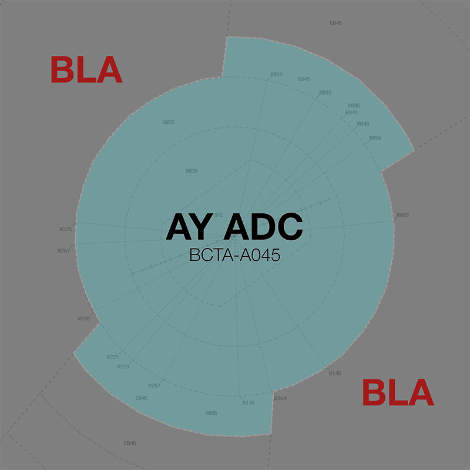

--8<-- "includes/abbreviations.md"

## Positions
| Name              | Callsign              | Frequency   | Login ID      |
| ----------------- | --------------------- | ----------- | ------------- |
| **Albury ADC**    | **Albury Tower**      | **123.250** | **AY_TWR**    |
| **Albury SMC**    | **Albury Ground**     | **121.800** | **AY_GND**    |
| **Albury ATIS**   |                       | **133.850** | **YMAY_ATIS** |

## Airspace
<figure markdown>
{ width="700" }
  <figcaption>AY ADC Airspace</figcaption>
</figure>

AY ADC is responsible for the Class D airspace in the AY keyhole `BCTA` to `A045`.

Refer to [Class D Tower Separation Standards](../../../separation-standards/classd) for more information.

## Separation
### Local Lateral Separation Points
Due to the convergence of inbound/outbound air routes approaching AY, the [geographic feature separation standard](../../separation-standards/visual.md#geographic-features) may be useful to efficiently process opposite direction aircraft from the north.

The **Hume Highway** is a good reference for this standard.

!!! phraseology
    *XEB is inbound to YMAY from the north and has reported visual. They are vertically separated from an outbound aircraft departing YMAY to the northeast.*  
    **AY ADC:** "XEB, track to remain at least 1nm west of the Hume Highway, report established"  
    **XEB:** "Track to remain at least 1nm west of the Hume Highway, XEB"  

    **XEB:** "XEB, established 1nm west of the Hume Highway"  
    *XEB is now laterally separated from aircraft over east of the highway*  
    **AY ADC:** "XEB, requirement to remain at least 1nm west of the highway, cleared visual approach"  
    **XEB:** "Remain at least 1nm west of the highway, cleared visual approach, XEB"

### Surveillance
Surveillance coverage can be expected to be available at all levels in the AY CTR. Although AY ADC is **not permitted** to use surveillance for separation, BLA may assist by establishing surveillance separation standards via coordination

## SID Selection
Aircraft planned via **DUGGI** and **UGVER** shall be assigned the **Procedural SID** that terminates at the appropriate SID terminus. Aircraft **not** planned via any of these waypoints shall receive amended routing via the most appropriate SID terminus, unless the pilot indicates they are unable to accept a Procedural SID.

## Coordination
### Departures
[Next](../../controller-skills/coordination.md#next) coordination is required from AY ADC to BLA for all aircraft **entering BLA CTA**.

The Standard Assignable level from **AY ADC** to **BLA** is:

| Aircraft | Level |
| ---- | ---- |
| All | The lower of `A070` and `RFL` |

### Arrivals/Overfliers
BLA will heads-up coordinate all arrivals/overfliers to AY ADC

!!! phraseology
    **BLA** -> **AY ADC**: "Via ARRAN1 Arrival, RXA6783”  
    **AY ADC** -> **BLA**: "RXA6783"  

The Standard Assignable level from BLA to AY ADC is `A080`, any other level must be prior coordinated.