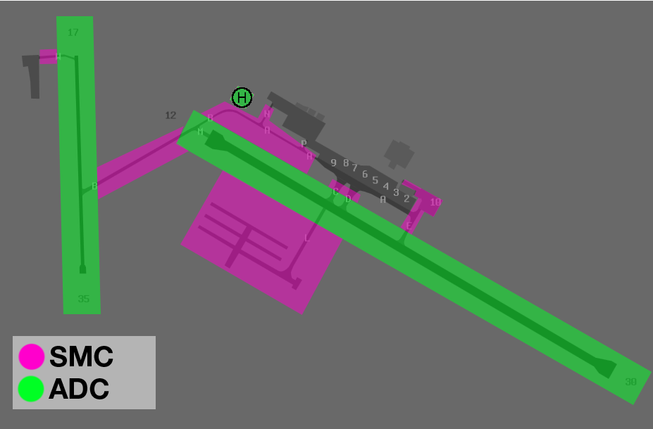

--8<-- "includes/abbreviations.md"

## Positions
| Name                   | Callsign        | Frequency   | Login ID      |
| ---------------------- | --------------- | ----------- | ------------- |
| **Alice Springs ADC**  | **Alice Tower** | **118.300** | **AS_TWR**    |
| **Alice Springs ATIS** |                 | **123.000** | **YBAS_ATIS** |

## Airspace
AS ADC is responsible for the Class D airspace `BCTA` to `A045`, as well as the Class C airspace `A045` to `A065`, within 22DME AS.

<figure markdown>
{ width="1000" }
  <figcaption>AD ADC Airspace</figcaption>
</figure>

Refer to [Class D Tower Separation Standards](../../../separation-standards/classd) for more information.

## Manoeuvring Area Responsibility
<figure markdown>
{ width="609" }
  <figcaption>Manoeuvring Area</figcaption>
</figure>

## Separation
### Surveillance
Surveillance coverage can be expected to be available at all levels in the AS CTR. Although AS ADC is **not permitted** to use surveillance for separation, ASP may assist by establishing surveillance separation standards via coordination.

## VFR Operations
### VFR Routes
Alice Springs has 10 VFR routes that follow prominent geographic features and highways. These established routes begin at various reporting points, providing entry to the CIRA. VFR Routes 8 and 9 provide separation from R215 Pine Gap.

<figure markdown>
{ width="650" }
  <figcaption>YBAS VFR Routes</figcaption>
</figure>

!!! phraseology 
    **SDA**: "Alice Tower, Cirrus SDA, DPW, `A065`, inbound, received J, request clearance"  
    **AS ADC**: "SDA, Alice Tower, cleared to Alice Springs via VFR Route 5, maintain `A065`"  
    **SDA**: "Cleared to Alice Springs via VFR Route 5, maintain `A065`, SDA"  

!!! tip
    You can find details of all VFR Routes on the [Alice Springs / Uluru VTC](https://www.airservicesaustralia.com/aip/aip.asp){target=new}.

## SID Selection
Aircraft planned via **DESET**, **DIGLA**, **ELLOW**, **GAFER**, **HONGI**, **IDANU**, **KALUG**, **LUGSA**, **MATMA**, **PULOL**, **PUMAK**, **RUPUS**, **SADEL**, **SOTMI**, **TNK**, and **TUMSO**  shall be assigned the **Procedural SID** that terminates at the appropriate SID terminus.

 **RNP (0.3)** approved operators planned via **DIGLA**, **ELLOW**, **GAFER**, **KALUG**, **PULOL**, **SADEL**, **RUPUS**, and **YOTHU** shall be assigned the **OCTAV** or **MUDMO** procedural SIDs.

Aircraft **not** planned via any of these waypoints shall receive amended routing via the most appropriate SID terminus, unless the pilot indicates they are unable to accept a Procedural SID.

## Coordination
### Departures
[Next](../../controller-skills/coordination.md#next) coordination is required from AS ADC to ASP for all aircraft **entering ASP CTA**.

The Standard Assignable level from **AS ADC** to **ASP** is:

| Aircraft | Level |
| ---- | ---- |
| All | The lower of `A070` and `RFL` |

### Arrivals/Overfliers
ASP will heads-up coordinate all arrivals/overfliers to AS ADC

!!! phraseology
    **ASP** -> **AS ADC**: "Via SADEL, QFA1956”  
    **AS ADC** -> **ASP**: "QFA1956"  

The Standard Assignable level from ASP to AS ADC is `A080`, any other level must be prior coordinated.