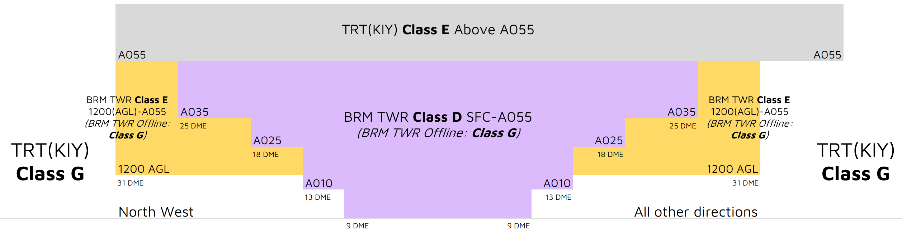

--8<-- "includes/abbreviations.md"

## Positions
| Name | Callsign | Frequency | Login ID |
| ---- | -------- | --------- | ---------------- |
| **Broome ADC** | **Broome Tower** | **126.000** | **BRM_TWR** |
| **Broome SMC** | **Broome Ground** | **121.700** | **BRM_GND** |
| Broome ATIS |  | 128.200 | YBRM_ATIS |

## Airspace
<figure markdown>
{ width="700" }
  <figcaption>BRM ADC Airspace</figcaption>
</figure>

BRM ADC is responsible for the Class D airspace `SFC` to `A055`, as well as the Class E airspace `1200ft AGL` to `A055`, within the BRM CTR.

Refer to [Class D Tower Separation Standards](../../../separation-standards/classd) for more information.

## Surveillance
Surveillance coverage can be expected to be available at all levels in the BRM CTR. Although BRM ADC is **not permitted** to use surveillance for separation, TRT(KIY) may assist by establishing surveillance separation standards via coordination

## Coordination
### Departures
A 'next' call is made for all aircraft when they are next to depart. BRM ADC must inform TRT(KIY) if the aircraft does not depart within **2 minutes** of the next call.

!!! example
    **BRM ADC** -> **KIY**: "Next, NWK1653"  
    **KIY** -> **BRM ADC**: "NWK1653, Unrestricted"  
    **BRM ADC** -> **KIY**: "NWK1653"

The Standard Assignable level from BRM ADC to TRT(KIY) is the lower of `A050` or the `RFL`, any other level must be prior coordinated.

### Arrivals/Overfliers
TRT(KIY) will heads-up coordinate all arrivals/overfliers to BRM ADC

!!! example
    **KIY** -> **BRM ADC**: "Via CIN, ANO332”  
    **BRM ADC** -> **KIY**: "ANO332"  

The Standard Assignable level from TRT(KIY) to BRM ADC is `A060`, any other level must be prior coordinated.
