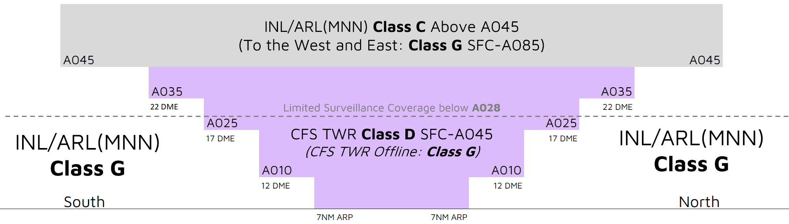

--8<-- "includes/abbreviations.md"

## Positions
| Name | Callsign | Frequency | Login ID |
| ---- | -------- | --------- | ---------------- |
| **Coffs Harbour ADC** | **Coffs Tower** | **118.200** | **CFS_TWR** |
| Coffs Harbour ATIS |  | 130.300 | YCFS_ATIS |

## Airspace
<figure markdown>
{ width="700" }
  <figcaption>CFS ADC Airspace</figcaption>
</figure>

CFS ADC is responsible for the Class D airspace in the CFS CTR `SFC` to `A045`.

Refer to [Class D Tower Separation Standards](../../../separation-standards/classd) for more information.

## Surveillance
Surveillance coverage can be expected to be not available below `A028` in the CFS CTR. Although CFS ADC is **not permitted** to use surveillance for separation, ARL(MNN) or INL may assist by establishing surveillance separation standards via coordination

## Coordination
### Departures
A 'next' call is made for all aircraft when they are next to depart. CFS ADC must inform INL/ARL(MNN) if the aircraft does not depart within **2 minutes** of the next call.

!!! example
    **CFS ADC** -> **MNN**: "Next, QJE1573"  
    **MNN** -> **CFS ADC**: "QJE1573, Unrestricted"  
    **CFS ADC** -> **MNN**: "QJE1573"

The Standard Assignable level from CFS ADC to INL/ARL(MNN) is the lower of `A070` or the `RFL`, any other level must be prior coordinated.
### Arrivals/Overfliers
INL/ARL(MNN) will heads-up coordinate all arrivals/overfliers to CFS ADC.

!!! example
    **INL** -> **CFS ADC**: "Via KADSI, RXA6416”  
    **CFS ADC** -> **INL**: "RXA6416"  

The Standard Assignable level from INL/ARL(MNN) to CFS ADC is `A080`, any other level must be prior coordinated.