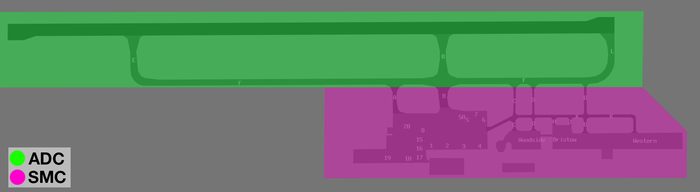

--8<-- "includes/abbreviations.md"

## Positions

| Name              | Callsign              | Frequency   | Login ID      |
| ----------------- | --------------------- | ----------- | ------------- |
| **Karratha ADC**  | **Karratha Tower**    | **127.350** | **KA_TWR**    |
| **Karratha SMC**  | **Karratha Ground**   | **123.550** | **KA_GND**    |
| **Karratha ATIS** |                       | **134.550** | **YPKA_ATIS** |

## Airspace
<figure markdown>
{ width="700" }
  <figcaption>KA ADC Airspace</figcaption>
</figure>

KA ADC is responsible for the Class D airspace within 31DME KA `BCTA` to `A055`.

Refer to [Class D Tower Separation Standards](../../../separation-standards/classd) for more information.

## Manoeuvring Area Responsibility
**ADC** is responsible for all taxiways between **F** and the Runway.

<figure markdown>
{ width="700" }
  <figcaption>YPKA Manoeuvring Area Responsibility</figcaption>
</figure>

## Separation
### Surveillance
Surveillance coverage can be expected to be available at all levels in the KA CTR. Although KA ADC is **not permitted** to use surveillance for separation, OLW may assist by establishing surveillance separation standards via coordination

## Coordination
### Departures
[Next](../../controller-skills/coordination.md#next) coordination is required from KA ADC to OLW for all aircraft **entering OLW CTA**.

The Standard Assignable level from **KA ADC** to **OLW** is:

| Aircraft | Level |
| ---- | ---- |
| All | The lower of `A050` and `RFL` |

### Arrivals/Overfliers
OLW will heads-up coordinate all arrivals/overfliers to KA ADC

!!! phraseology
    **OLW** -> **KA ADC**: "Via PD, KPG, Overflier”  
    **KA ADC** -> **OLW**: "KPG, A040"  

The Standard Assignable level from OLW to KA ADC is `A060`, any other level must be prior coordinated.