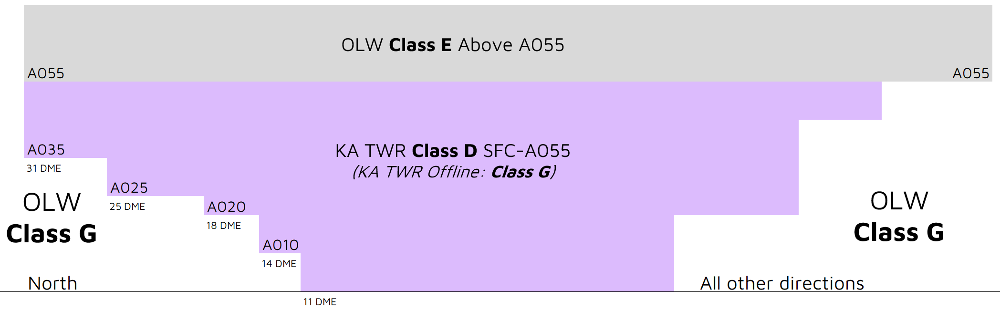

--8<-- "includes/abbreviations.md"

## Positions

| Name | Callsign | Frequency | Login ID |
| ---- | -------- | --------- | ---------------- |
| **Karratha ADC** | **Karratha Tower** | **127.350** | **KA_TWR** |
| **Karratha SMC** | **Karratha Ground** | **123.550** | **KA_GND** |
| Karratha ATIS |  | 134.550 | YPKA_ATIS |

## Airspace
<figure markdown>
{ width="700" }
  <figcaption>KA ADC Airspace</figcaption>
</figure>

KA ADC is responsible for the Class D airspace in the KA CTR `SFC` to `A055`.

Refer to [Class D Tower Separation Standards](../../../separation-standards/classd) for more information.

## Surveillance
Surveillance coverage can be expected to be available at all levels in the KA CTR. Although KA ADC is **not permitted** to use surveillance for separation, OLW may assist by establishing surveillance separation standards via coordination

## Coordination
### Departures
A 'next' call is made for all aircraft entering OLW CTA when they are next to depart. KA ADC must inform OLW if the aircraft does not depart within **2 minutes** of the next call.

!!! example
    **KA ADC** -> **OLW**: "Next, NWK694"  
    **OLW** -> **KA ADC**: "NWK694, Unrestricted"  
    **KA ADC** -> **OLW**: "NWK694"

The Standard Assignable level from KA ADC to OLW is the lower of `A050` or the `RFL`, any other level must be prior coordinated.

### Arrivals/Overfliers
OLW will heads-up coordinate all arrivals/overfliers to KA ADC

!!! example
    **OLW** -> **KA ADC**: "Via PD, KPG, Overflier”  
    **KA ADC** -> **OLW**: "KPG, A040"  

The Standard Assignable level from OLW to KA ADC is `A060`, any other level must be prior coordinated.