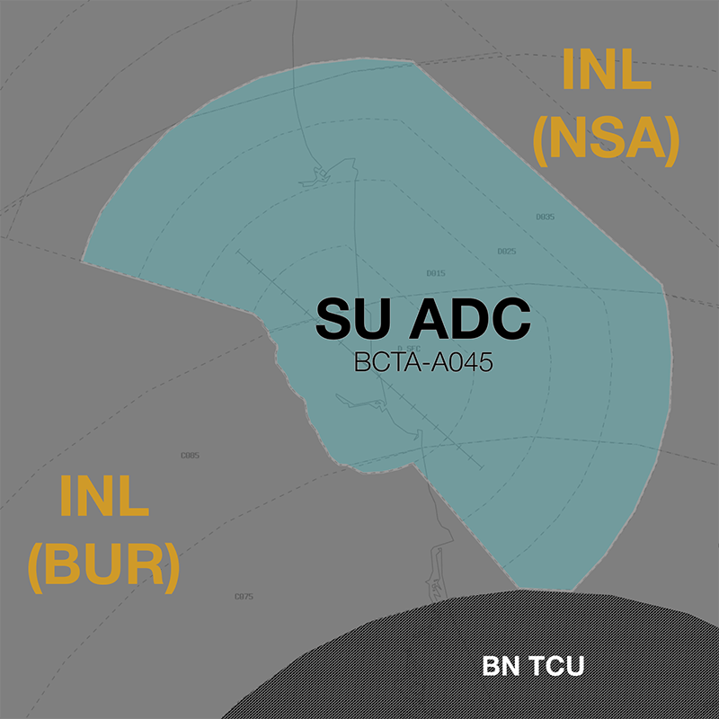

--8<-- "includes/abbreviations.md"

## Positions

| Name                    | Callsign                  | Frequency   | Login ID      |
| ----------------------- | ------------------------- | ----------- | ------------- |
| **Sunshine Coast ADC**  | **Sunshine Coast Tower**  | **124.400** | **SU_TWR**    |
| **Sunshine Coast SMC**  | **Sunshine Coast Ground** | **121.100** | **SU_GND**    |
| **Sunshine Coast ATIS** |                           | **119.800** | **YBSU_ATIS** |

## Airspace
<figure markdown>
{ width="700" }
  <figcaption>SU ADC Airspace</figcaption>
</figure>

SU ADC is responsible for the Class D airspace within 20DME SU `BCTA` to `A045`.

Refer to [Class D Tower Separation Standards](../../../separation-standards/classd) for more information.

## Local Instructions
### Old Scenery
Pilots with old simulators/scenery may not have the newer Runway 13/31 config (replacing the old 18/36 config). If a pilot reports this to be the case, try to facilitate their flight as best as possible, whilst giving them lower priority to other traffic. Coordinate as you deem necessary with adjacent units.

## Separations
### Local Lateral Separation Points
Due to the convergence of inbound/outbound air routes approaching SU, the [geographic feature separation standard](../../separation-standards/visual.md#geographic-features) may be useful to efficiently process opposite direction aircraft from the north or south.

The **coastline** is a good reference for this standard.

!!! phraseology
    *VOZ609 is inbound to YBSU from the north and has reported visual. They are vertically separated from an outbound aircraft departing YBSU to the north.*  
    **SU ADC:** "VOZ609, track to remain 1nm offshore, report established"  
    **VOZ609:** "Track to remain 1nm offshore, VOZ609"  

    **VOZ609:** "VOZ609, established 1nm offshore"  
    *VOZ609 is now laterally separated from aircraft over land, allowing ADC to issue further descent.*  
    **SU ADC:** "VOZ609, descend to A050"  
    **VOZ609:** "Descend A050, VOZ609"  

    *Once both aircraft have passed and/or another separation standard is available (e.g. vertical separation), the geographic feature standard can be relaxed.*  
    **SU ADC:** "VOZ609, cancel the offshore requirement, track for final runway 13, cleared visual approach"

## Surveillance
Surveillance coverage can be expected to be not available below `A012` in the SU CTR. Although SU ADC is **not permitted** to use surveillance for separation, INL(NSA) may assist by establishing surveillance separation standards via coordination

## SID Selection
Jet Aircraft planned via **MOOLO** or **TAPET**, shall be assigned the **Procedural SID** that terminates at the appropriate waypoint, unless the pilot indicates they are unable to accept a Procedural SID.

All other aircraft may be assigned a visual departure, or a standard IFR departure.

## Coordination
### Departures
[Next](../../controller-skills/coordination.md#next) coordination is required from SU ADC to INL(NSA/BUR) for all aircraft **entering INL(NSA/BUR) CTA**.

The Standard Assignable level from **SU ADC** to **INL(NSA/BUR)** is:

| Aircraft | Level |
| ---- | ---- |
| All | The lower of `A040` and `RFL` |

Where operationally possible, INL(NSA/BUR) will assign a higher level to high performance aircraft during next coordination. This level assignment should be communicated to the aircraft during the takeoff clearance or when they provide a departure report after takeoff.

!!! phraseology
    **SU ADC**: "VOZ924, climb to FL120, runway 31, cleared for takeoff"

### Arrivals/Overfliers
NSA will heads-up coordinate arrivals/overfliers from Class C to SU ADC. Aircraft will be cleared for the coordinated approach prior to handoff to SU ADC, unless SU ADC nominates a restriction.

!!! phraseology
    **NSA** -> **SU ADC**: "Via ITIDE2W Arrival, QJE1756”  
    **SU ADC** -> **NSA**: "QJE1756"  

The Standard Assignable level from INL(NSA/BUR) to SU ADC is `A060`, any other level must be prior coordinated.
### BN TCU
BN TCU Class G shares a tiny border with SU ADC, however there are no SIDs, STARs, or airways through this gap. The only possible way for an aircraft to directly enter BN TCU's airspace from SU ADC's jurisdiction, is in to Class G, and as such, no coordination is required to BN TCU.

<figure markdown>
{ width="700" }
  <figcaption>BN TCU / SU ADC Border</figcaption>
</figure>
