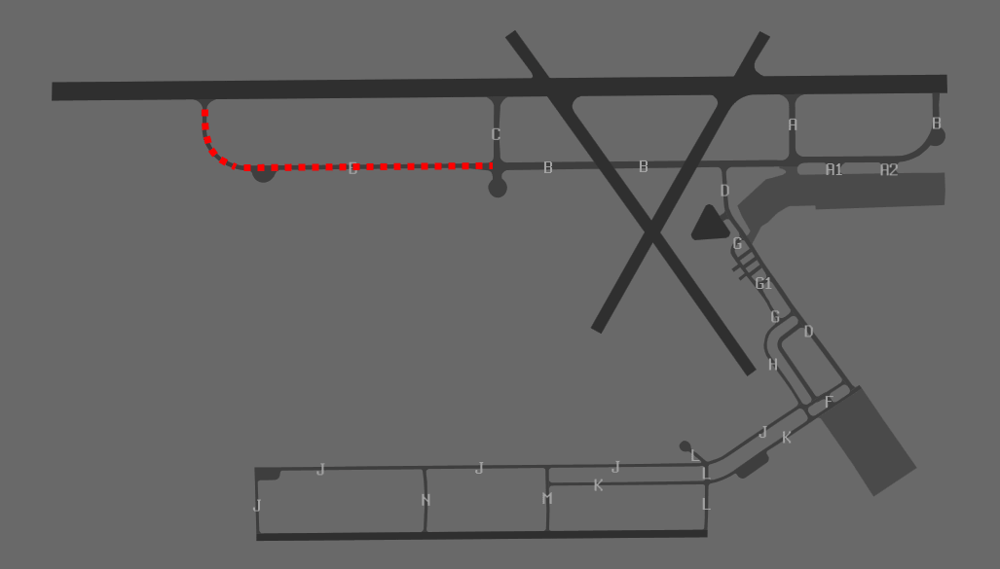
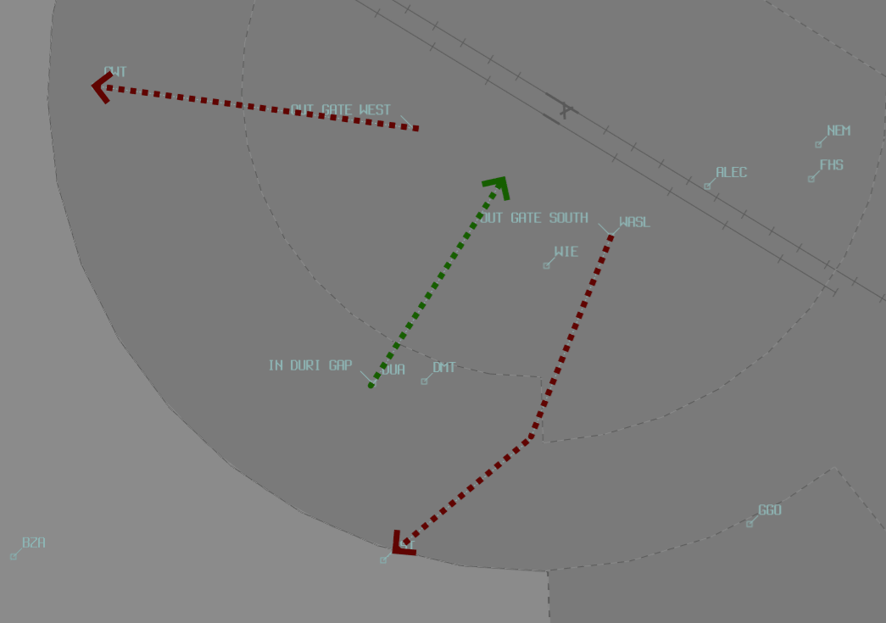

--8<-- "includes/abbreviations.md"

## Positions

| Name              | Callsign              | Frequency   | Login ID      |
| ----------------- | --------------------- | ----------- | ------------- |
| **Tamworth ADC**  | **Tamworth Tower**    | **119.400** | **TW_TWR**    |
| Tamworth ADC South :material-information-outline:{ title="Non-standard position"} | Tamworth Tower | 118.250 | TW-S_TWR |
| **Tamworth SMC**  | **Tamworth Ground**   | **121.900** | **TW_GND**    |
| **Tamworth ATIS** |                       | **123.800** | **YSTW_ATIS** |

!!! abstract "Non-Standard Positions"
    :material-information-outline: Non-standard positions may only be used in accordance with [VATPAC Air Traffic Services Policy](https://vatpac.org/publications/policies){target=new}.  
    Approval must be sought from the **bolded parent position** prior to opening a Non-Standard Position, unless [NOTAMs](https://vatpac.org/publications/notam){target=new} indicate otherwise (eg, for events).

## Airspace
<figure markdown>
{ width="800" }
  <figcaption>TW ADC Airspace</figcaption>
</figure>

TW ADC is responsible for the Class D airspace in the TW keyhole `BCTA` to `A045`, as well as the Class C airspace between `A045` and `A065` within 23DME TW.

Refer to [Class D Tower Separation Standards](../../../separation-standards/classd) for more information.

### Dual ADC Operations
When ADC South is Online, they are responsible for the airspace between the **TW** 160 Radial, West through to the 295 Radial.

<figure markdown>
{ width="600" }
  <figcaption>TW Dual ADC Airspace</figcaption>
</figure>

ADC North takes responsibility for the North Runway, Circuit and Airspace (Runway **12L/30R**).

ADC South takes responsibility for the South Runway, Circuit and Airspace (Runway **12R/30L**).

ADC South is **not permitted** online when *Single Runway* Operations are in use.

Refer to the [ATIS section](#runway-mode-formatting) for information on ATIS formatting when ADC South is online.

## Manoeuvring Area
### Taxiway Restrictions
Taxiway B west of C is limited to 8000KG AUW and 23M MAX wingspan. Common airliners including Dash 8 Q400s will need to enter/exit runway 12L/30R via intersection C.

<figure markdown>
{ width="800" }
  <figcaption>Twy B west of C shown in red</figcaption>
</figure>

### Standard Taxi Procedures
Standard taxi routes establish an implied set of taxi instructions which pilots are expected to comply with in the absence of other instructions. All runway crossings require an explicit crossing instruction.

Controllers **do not** need to explicitly say each taxiway provided it is covered by a standard taxi route in the tables below.

!!! warning "Important"
    Not all pilots are aware of the existence of standard taxi routes. When in doubt, provide full taxi instructions detailing the full desired route.

#### Southern Runway Departures
[waiting for ground charts]

!!! phraseology
    **83C**: "Tamworth Ground, Cherokee 83C, departure details"  
    **TW SMC**: "83C"  
    **83C**: "83C, at IFTT, received A, for a GST departure, request taxi"  
    **TW SMC**: "83C, Tamworth Ground, taxi to holding point J Runway 12R"  
    **83C**: "Taxi to holding point J Runway 12R, 83C"

#### Northern Runway Departures
[waiting for ground charts]

!!! phraseology
    **ZFN**: "Tamworth Ground, Cherokee ZFN, departure details"  
    **TW SMC**: "ZFN"  
    **ZFN**: "Tamworth Ground, Cherokee ZFN, at IFTT, received A, request airways and taxi clearance to YSTW via MAL"  
    **TW SMC**: "ZFN, Tamworth Ground, cleared to YSTW via MAL flight planned route, climb to `A045`, squawk 3761, taxi to holding point B Runway 12L, cross runways 18 and 24"  
    **ZFN**: "Cleared to YSTW via MAL flight planned route, climb to `A045`, squawk 3761, taxi to holding point B Runway 12L, cross runways 18 and 24, ZFN"

## Separation
### Local Lateral Separation Points
The positions in each table header below are procedurally separated from each other, provided the conditions in each table row are met. At least one condition must be met in each column.

| South and East of New England Highway - Manilla Rd | vs | 040 Radial |
| ----------- | ----------------- | ----------------- |
| LLC South of **Moonbi township** LLC East of **Tamworth City** | | LLC South of **11 DME** |

| South and East of New England Highway - Manilla Rd | vs |  030 Radial |
| ----------- | ----------------- | ----------------- |
| LLC East of **Tamworth City** | | |

| East of New England Highway | vs | 168 Radial |
| ----------- | ----------------- | ----------------- |
| LLC North of **GGO** | | LLC North of **14 DME** |

| East of New England Highway | vs | 180 Radial |
| ----------- | ----------------- | ----------------- |
| LLC North of **WBH** | | LLC North of **25 DME** |

| East of New England Highway | vs | 190 Radial |
| ----------- | ----------------- | ----------------- |
| Always laterally separated | | |

| Visual fixes | vs | ILS 30R |
| ----------- | ----------------- | ----------------- |
| LLC South of **Duri Township, Round Hill, GGO, and NUN** | | |
| LLC North of **DGN - NEM - Tamworth City - MAL via Manilla Rd** | | |

| Visual fixes | vs | VOR 12L |
| ----------- | ----------------- | ----------------- |
| LLC West of **GWT** | | |
| LLC North of **DGN - NEM - Tamworth City - MAL via Manilla Rd** | | |

The [geographic feature separation standard](../../separation-standards/visual.md#geographic-features) may also be useful to efficiently process aircraft.

The **Oxley** and **New England** Highways are good references for this standard.

### Surveillance
Surveillance coverage can be expected to be not available below `A034` in the TW CTR. Although TW ADC is **not permitted** to use surveillance for separation, ARL/MDE may assist by establishing surveillance separation standards via coordination

## VFR Operations

### Departures
#### Northern Runway Departures
VFR aircraft not departing between the 160 radial through to the 295 radial shall make a standard CTA departure from the northern runway (12L/30R).

!!! phraseology
    **NRF**: "Tamworth Tower, Cherokee NRF, holding point B, for a CTA departure, ready"  
    **TW ADC**: "NRF, Tamworth Tower, Runway 12L, cleared for takeoff, make left turn"  
    **NRF**: "Runway 12L, cleared for takeoff, left turn, NRF"

#### Southern Runway Departures
VFR aircraft departing between the 160 radial through to the 295 radial should report either for a GST or GWT departure from the southern runway (12R/30L).

!!! phraseology
    **83C**: "Tamworth Tower, Cherokee 83C, holding point J, for a GST departure, ready"  
    **TW ADC**: "83C, Tamworth Tower, depart via GST, cleared for takeoff"  
    **83C**: "Depart via GST, cleared for takeoff, 83C"

<figure markdown>
{ width="800" }
  <figcaption>VFR Routes</figcaption>
</figure>

### Arrivals
#### DUA Arrivals
VFR arrivals between the 160 radial through to the 295 radial should route via **DUA**. Clearance required prior to DUA. Aircraft should report at 5NM for circuit entry instructions.

!!! phraseology
    **XCW**: "Tamworth Tower, Cherokee XCW, 5 miles west of DUA, `A030`, received A, inbound"  
    **TW ADC**: "XCW, Tamworth Tower, cleared DUA, TW, maintain `A030`, report at 5 miles"  
    **XCW**: "Cleared DUA, TW, maintain `A030` XCW"

#### CTA Arrivals
VFR arrivals not between the 160 radial and 295 radial shall request clearance from an inbound reporting point or radial with DME.

!!! phraseology
    **XGN** "Tamworth Tower, Cherokee XGN, NUN at 4500ft, 2 POB, in receipt of A, inbound"  
    **TW ADC**: "XGN, Tamworth Tower, cleared NUN to TW, maintain 4500, report ready for descent"  
    **XGN**: "Cleared NUN to TW, maintain 4500, wilco XGN"

## Runway Modes
### Preferred Runway Modes
Winds must always be considered for Runway modes (Crosswind <20kts, Tailwind <5kts), however the order of preference is as follows:

| Priority - Mode | Arrivals  | Departures | Circuits |
| --------------- | --------- | ---------- | -------- |
| =1 - 12 PROPS   | 12R (via DUA, and single engine VFR from 160° radial clockwise to 295° radial). 12L (all other arrs) | 12R (via GST or GWT), 12L (all other deps) | 12R |
| =1 - 30 PROPS   | 30L (via DUA, and single engine VFR from 160° radial clockwise to 295° radial). 30R (all other arrs)  | 30L (via GST or GWT), 30R (all other deps) | 30L |

### Special Runway Operations
#### PROPS
During day VMC only, simultaneous parallel runway operations may be used between runways 12L/R or 30L/R. The [ATIS](#operational-info) must be updated to reflect this mode.

Controllers must closely monitor the base and final legs of the circuit to ensure pilots do not pass through their assigned runway centreline.

### Circuits
Circuits are to be flown in the direction coinciding with the Runway designator (Left/Right) at `A023`.

## ATIS
### Runway Mode Formatting
The ATIS must indicate runway configuration in the format below:

| Mode        | ATIS Runway information |
| ----------- | ----------------------- |
| 12 PROPS | `RWY 12L AND R FOR ARRS AND DEPS` |
| 30 PROPS | `RWY 30L AND R FOR ARRS AND DEPS` |

### Operational Info
When parallel runway operations are in use, the ATIS OPR INFO field shall include:  
`SIMUL PARL RWY OPS IN USE. EXP TFC ON FINAL AND OPP BASE OF THE PARL RWY`

## Coordination
### Departures
[Next](../../controller-skills/coordination.md#next) coordination is required from TW ADC to ARL/MDE for all aircraft **entering ARL/MDE CTA**.

The Standard Assignable level from **TW ADC** to **ARL/MDE** is:

| Aircraft | Level |
| ---- | ---- |
| All | The lower of `A070` and `RFL` |

### Arrivals/Overfliers
ARL/MDE will heads-up coordinate all arrivals/overfliers that are entering the TW CTR/CTA to TW ADC

!!! phraseology
    **MDE** -> **TW ADC**: "Via MOR DCT for the VOR-A, FD272”  
    **TW ADC** -> **MDE**: "FD272, VOR-A"  

The Standard Assignable level from ARL/MDE to TW ADC is `A080`, any other level must be prior coordinated.

#### ADC South Online
When ADC South is online, ARL/MDE may not be familiar with which controller owns what airspace. Best practice is to receive the coordination no matter what, and if it was meant for the other ADC controller, relay the coordination to them internally.

### TW ADC Internal
TW ADC must heads-up coordinate **all aircraft** transiting from one ADC controller to the other.

!!! phraseology
    **TW ADC S** -> **TW ADC**: "via GWT, SPP for an overfly"  
    **TW ADC** -> **TW ADC S**: "SPP, A035"
