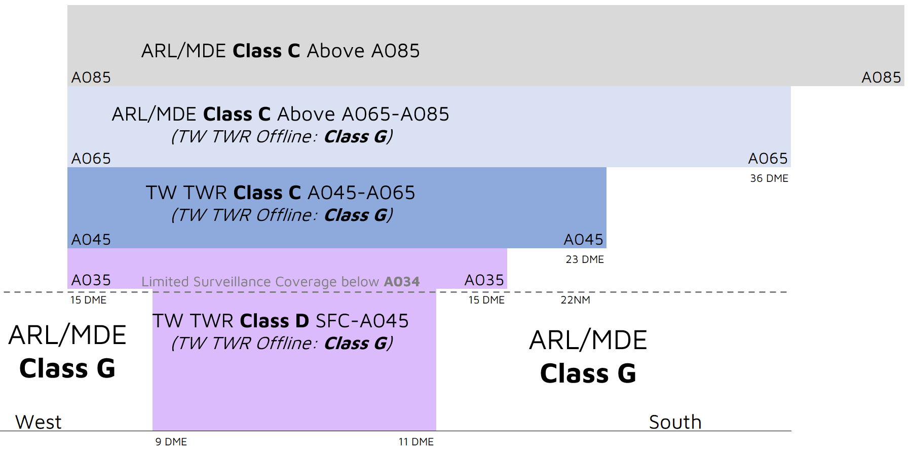
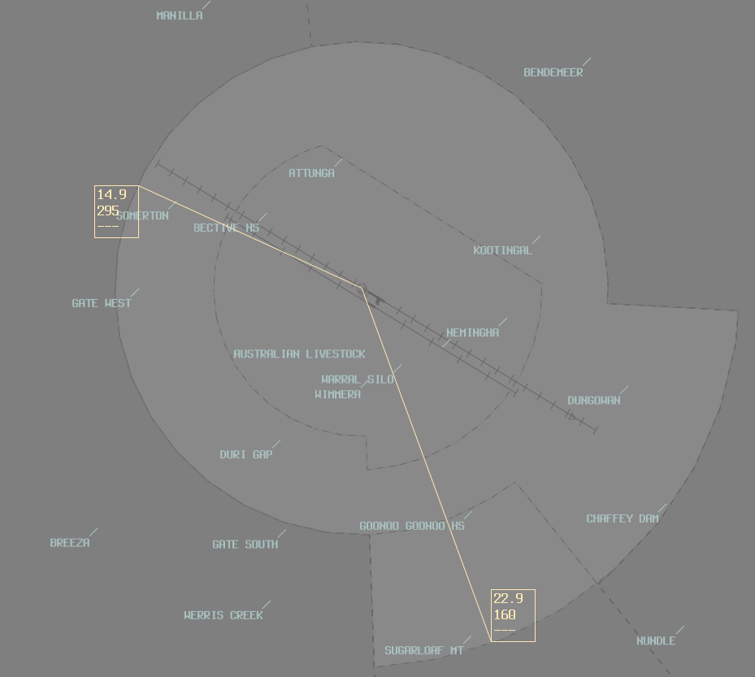

--8<-- "includes/abbreviations.md"

## Positions

| Name | Callsign | Frequency | Login ID |
| ---- | -------- | --------- | ---------------- |
| **Tamworth ADC** | **Tamworth Tower** | **119.400** | **TW_TWR** |
| Tamworth ADC South :material-information-outline:{ title="Non-standard position"}  | Tamworth Tower  | 118.250        | TW-S_TWR                        |
| **Tamworth SMC** | **Tamworth Ground** | **121.900** | **TW_GND** |
| **Tamworth ATIS** |  | **123.800** | **YSTW_ATIS** |

!!! abstract "Non-Standard Positions"
    :material-information-outline: Non-standard positions may only be used in accordance with [VATPAC Air Traffic Services Policy](https://vatpac.org/publications/policies){target=new}.  
    Approval must be sought from the **bolded parent position** prior to opening a Non-Standard Position, unless [NOTAMs](https://vatpac.org/publications/notam){target=new} indicate otherwise (eg, for events).

### Dual ADC Operations
When Tamworth ADC South is online, responsibility for the **Runway**, **Circuit**, and **Airspace** is divided between the two ADC controllers.

ADC North takes responsibility for the North Runway, Circuit and Airspace (Runway **12L/30R**).

ADC South takes responsibility for the South Runway, Circuit and Airspace (Runway **12R/30L**).

ADC South is **not permitted** online when *Single Runway* Operations are in use.

Refer to the [ATIS section](#runway-nomination) for information on ATIS formatting when ADC 2 is online.

## Airspace
<figure markdown>
{ width="800" }
  <figcaption>TW ADC Airspace</figcaption>
</figure>

TW ADC is responsible for the Class D airspace in the TW CTR, as well as the Class C airspace between `A045` and `A065`.

Refer to [Class D Tower Separation Standards](../../../separation-standards/classd) for more information.

### Dual ADC Operations
When ADC South is Online, they are responsible for the airspace between the **TW** 160 Radial, West through to the 295 Radial.

<figure markdown>
{ width="600" }
  <figcaption>TW Dual ADC Airspace</figcaption>
</figure>

## Surveillance
Surveillance coverage can be expected to be not available below `A034` in the TW CTR. Although TW ADC is **not permitted** to use surveillance for separation, ARL/MDE may assist by establishing surveillance separation standards via coordination

## Local Lateral Separation Points
The positions in each table header below are procedurally separated from each other, provided the conditions in each table row are met. At least one condition must be met in each column.

| South and East of New England Highway - Manilla Rd | vs | 040 Radial |
| ----------- | ----------------- | ----------------- |
| LLC South of **Moonbi township** LLC East of **Tamworth City** | | LLC South of **11 DME** |

| South and East of New England Highway - Manilla Rd | vs |  030 Radial |
| ----------- | ----------------- | ----------------- |
| LLC East of **Tamworth City** | | |

| East of New England Highway | vs | 168 Radial |
| ----------- | ----------------- | ----------------- |
| LLC North of **GGO** | | LLC North of **14 DME** |

| East of New England Highway | vs | 180 Radial |
| ----------- | ----------------- | ----------------- |
| LLC North of **WBH** | | LLC North of **25 DME** |

| East of New England Highway | vs | 190 Radial |
| ----------- | ----------------- | ----------------- |
| Always laterally separated | | |

| Visual fixes | vs | ILS 30R |
| ----------- | ----------------- | ----------------- |
| LLC South of **Duri Township, Round Hill, GGO, and NUN** | | |
| LLC North of **DGN - NEM - Tamworth City - MAL via Manilla Rd** | | |

| Visual fixes | vs | VOR 12L |
| ----------- | ----------------- | ----------------- |
| LLC West of **GWT** | | |
| LLC North of **DGN - NEM - Tamworth City - MAL via Manilla Rd** | | |

The [geographic feature separation standard](../../separation-standards/visual.md#geographic-features) may also be useful to efficiently process aircraft.

The **Oxley** and **New England** Highways are good references for this standard.

## Runway Modes
Equal preference is shared between runways 12L/R and 30L/R.

Runway 12R/30L shall be used for:

- All single-engine VFR arrivals and departures from the 160 Radial through West to the 295 Radial
- Arrivals via DUA
- Departures via GST or GWT
- Single-engine circuit training

Runway 12L/30R shall be used for all other operations. 

### Simultaneous Parallel Runway Ops
During day VMC only, simultaneous parallel runway operations may be used between runways 12L/R or 30L/R. The [ATIS](#operational-info) must be updated to reflect this mode. Controllers must closely monitor the base and final legs of the circuit to ensure pilots do not pass through their assigned runway centreline.

In the absense of day VMC, dependent parallel runway operations may be conducted, with an adequate separation standard in place between aircraft operating from adjacent runways.

## Circuits
Circuits are to be flown in the direction coinciding with the Runway designator (Left/Right) at `A024`.

## ATIS
### Runway Nomination
When 2 ADC controllers are online, the ATIS shall be formatted: `RWY 12R/30L FOR CCTS AND ARRS AND DEPS SOUTH WEST, FREQ 118.25. RWY 12L/30R FOR ALL OTHER ARRS AND DEPS, FREQ 119.4`

### Operational Info
When parallel runway operations are in use, the ATIS OPR INFO field shall include:  
`SIMUL PARL RWY OPS IN USE. EXP TFC ON FINAL AND OPP BASE OF THE PARL RWY`

## Coordination
### Departures
[Next](../../controller-skills/coordination.md#next) coordination is required from TW ADC to ARL/MDE for all aircraft **entering ARL/MDE CTA**.

The Standard Assignable level from **TW ADC** to **ARL/MDE** is:

| Aircraft | Level |
| ---- | ---- |
| All | The lower of `A070` and `RFL` |

### Arrivals/Overfliers
ARL/MDE will heads-up coordinate all arrivals/overfliers to TW ADC

!!! phraseology
    **MDE** -> **TW ADC**: "Via MOR DCT for the VOR-A, FD272”  
    **TW ADC** -> **MDE**: "FD272, VOR-A"  

The Standard Assignable level from ARL/MDE to TW ADC is `A080`, any other level must be prior coordinated.

#### ADC 2 Online
When ADC 2 is online, ARL/MDE may not be familiar with which controller owns what airspace. Best practice is to receive the coordination no matter what, and if it was meant for the other ADC controller, relay the coordination to them internally.

### TW ADC Internal
TW ADC must heads-up coordinate **all aircraft** transiting from one ADC controller to the other.

!!! phraseology
    **TW ADC S** -> **TW ADC**: "via GWT, SPP for an overfly"  
    **TW ADC** -> **TW ADC S**: "SPP, A035"