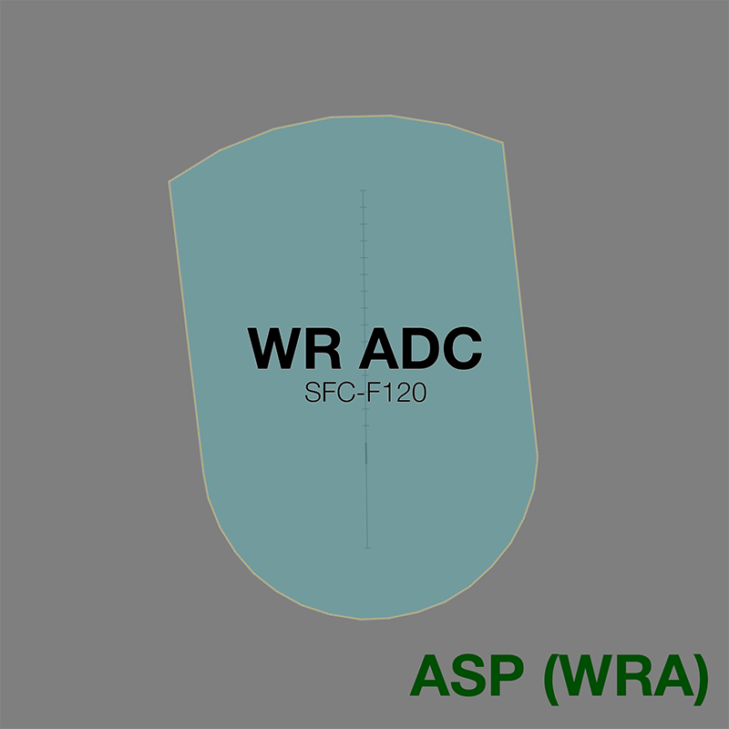
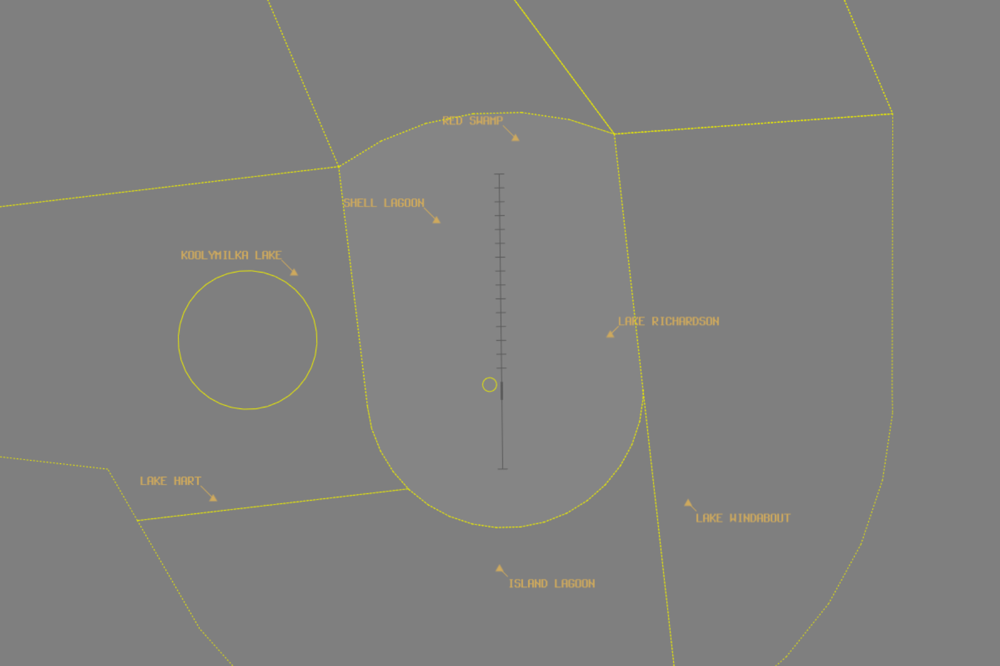

--8<-- "includes/abbreviations.md"

## Positions

| Name              | Callsign              | Frequency   | Login ID      |
| ----------------- | --------------------- | ----------- | ------------- |
| **Woomera ADC**   | **Woomera Tower**     | **118.300** | **WR_TWR**    |
| **Woomera ATIS**  |                       | **118.100** | **YPWR_ATIS** |

!!! note
    YPWR is a [military aerodrome](../../../controller-skills/military/#military-aerodromes) and procedures can differ significantly to those at a civil aerodrome. Ensure you are familiar with the [military controller skills](../../../controller-skills/military) necessary to provide a quality service.

## Airspace
<figure markdown>
{ width="700" }
  <figcaption>WR ADC Airspace</figcaption>
</figure>

**WR ADC** is responsible for the Class D airspace within the **R222F** [restricted area](../../../sua/#restricted-areas), `SFC` to `F120`.

Refer to [Class D Tower Separation Standards](../../../separation-standards/classd) for more information.

### Special Use Airspace
When **WR ADC** is online, the **R222F** restricted area `SFC` to `F120` is [activated](../../../sua/#activation-of-sua) by default.

#### SUA in Enroute Airspace
Military operations taking place in SUA in enroute airspace are outside the jurisdiction of TL TCU.

WR ADC must give **heads up** coordination to relevant enroute controllers before providing airways clearance to an aircraft intending to operate in a currently inactive SUA.

This gives the enroute controller sufficient time to assess the request, make necessary adjustments to any aircraft in the area currently, and activate the SUA; or alternately to refuse the activation request before the aircraft is in the air.

!!! phraseology
    *BFLO11 is requesting clearance to operate in the R560A restricted area.*  
    **WR ADC** -> **WRA**: "On the ground YPWR, BFLO11, requests activation of R222C `SFC-F290`, from 0100 until 0300."  
    **WRA** -> **WR ADC**: "BFLO11, expect activation of R222C `SFC-F290` at 0100 until 0300."  
    **WR ADC** -> **WRA**: "BFLO11.

## Local Procedures
### Initial and Pitch
The [intial points](../../controller-skills/military/#initial-and-pitch) are aligned with Taxiway C at the following locations.

| RWY  | Initial Point | Altitude |
| ---- | ------------- | ------------------------ |
| 18   | 3NM north, at Yandandarre Creek | `A025` |
| 30   | 2NM south, at Camp Rapier | `A025`      |

### Military Gates
There are several visual waypoints established throughout WR ADC airspace which serve as [military gates](../../../controller-skills/military/#military-gates) when lateral separation is required.

<figure markdown>
{ width="700" }
  <figcaption>WR Visual Gates</figcaption>
</figure>

| Visual Gate         | Position |
| ------------------- | -------- |
| Island Lagoon       | WR180013 |
| Koolymilka Lake     | WR300017 |
| Lake Hart           | WR249022 |
| Lake Richardson     | WR061009 |
| Lake Windabout      | WR121016 |
| Red Swamp           | WR004018 |

!!! phraseology
    *BFLO11 plans to enter the R222C restricted area for military training and airwork. It is a busy day, and WR ADC is utilising the visual waypoints to establish [lateral separation](../../../separation-standards/procedural/#lat-sep-table) between different operating groups*  
    **BFLO11**: "Woomera Tower, BFLO11, for R222C, request taxi."  
    **WR ADC**: "BFLO11, Woomera Tower. Taxi to holding point A, runway 36. Expect clearance via Lake Hart."  
    **BFLO11**: "Taxi to holding point A, runway 36, BFLO11."  
    *...*  
    **BFLO11**: "Woomera Tower, BFLO11 ready runway 36."  
    **WR ADC**: "BFLO11, make left turn, track direct Lake Hart. Runway 36, cleared for take off."

When there is no conflicting traffic, aircraft can be cleared to track directly to/from their desired SUA.

## Separation
### Surveillance
Surveillance coverage can be expected to be available at all levels in the WR CTR. Although WR ADC is **not permitted** to use surveillance for separation, ASP(WRA) may assist by establishing surveillance separation standards via coordination

## Coordination
### Departures
Next coordination is not required from WR ADC to ASP(WRA). 

Aircraft leaving WR ADC airspace both **laterally** and **vertically** will enter ASP(WRA) uncontrolled airspace. However, it is good practice for WR ADC to provide [heads-up](../../controller-skills/coordination/#heads-up) coordination for aircraft leaving WR ADC airspace **vertically** to help faciltiate an uninterrupted climb.

!!! phraseology
    **WR ADC** -> **WRA**: "via WR 180 bearing outbound, LYBD11.”  
    **WRA** -> **WR ADC**: "LYBD11, `F240`, no reported traffic."   
    **WR ADC** -> **WRA**: "`F240`, LYBD11."  

    **WR ADC**: "LYBD11, leave and re-enter controlled airspace on climb to `F240`, no reported IFR traffic"  
    **LYBD11**: "Leave and re-enter controlled airspace on climb to `F240`, LYBD11"
 
### Arrivals/Overfliers
As with departures, there is no inherent requirement for ASP(WRA) to coordinate arrivals or overfliers with WR ADC. However, it is good practice for ASP(WRA) to provide [heads-up](../../controller-skills/coordination/#heads-up) coordination for aircraft arriving into directly into WR ADC airspace.

## Charts
!!! abstract "Reference"
    In addition to the civilian `ERSA` and `AIP` publications, [the RAAF AIP website](https://ais-af.airforce.gov.au/australian-aip){target=new} contains the necessary charts (available in the TERMA) and description of procedures (in each airports' FIHA).