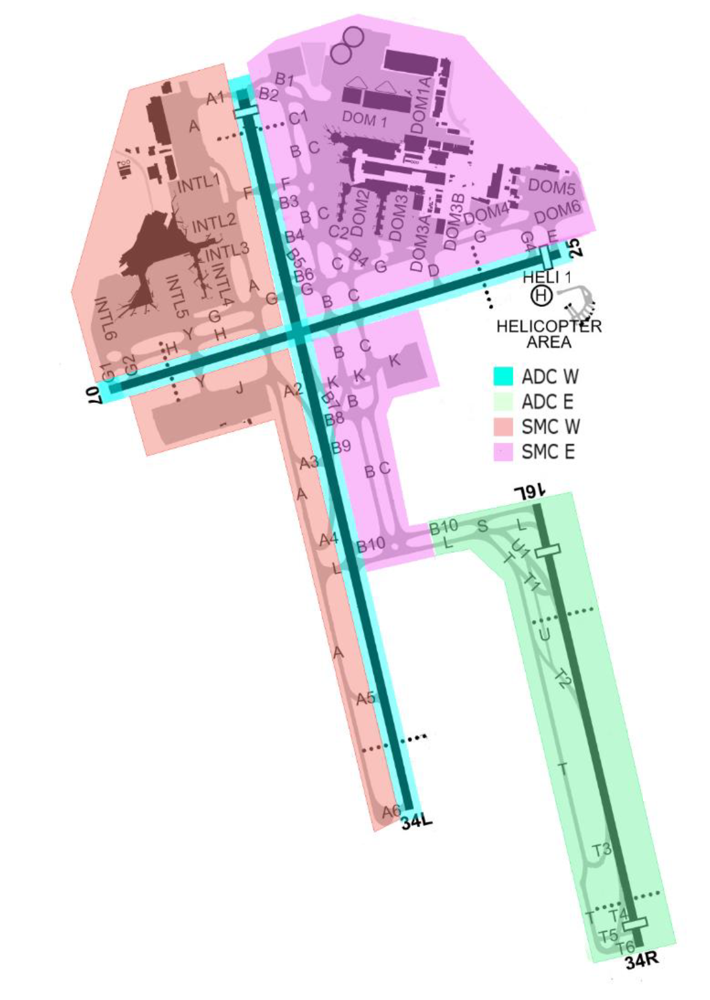

--8<-- "includes/abbreviations.md"

## Positions

| Name               | Callsign       | Frequency        | Login Identifier                         |
| ------------------ | -------------- | ---------------- | ---------------------------------------- |
| **Sydney ADC West**    | **Sydney Tower**   | **120.500**          | **SY_TWR**                                   |
| Sydney ADC East†   | Sydney Tower   | 124.700          | SY-E_TWR                                 |
| **Sydney SMC West**    | **Sydney Ground**  | **126.500**          | **SY_GND**                                   |
| Sydney SMC East†   | Sydney Ground  | 121.700          | SY-E_GND                                 |
| Sydney Coordinator† | Sydney Coordinator   | 127.600          | SY-C_GND                                |
| **Sydney ACD**         | **Sydney Delivery**| **133.800**          | **SY_DEL**                                   |
| Sydney ATIS        |                | 126.250          | YSSY_ATIS                                |

† **Non-standard position** – may only be used in accordance with VATPAC Ratings and Controller Positions Policy (link)

In the absence of an ACD controller, SMC shall asssume the ACD responsibilities.  
In the absence of an SMC controller, ADC shall assume the SMC and ACD responsibilities.
### Maneuvering Area Responsibility
<figure markdown>
{ width="500" }
  <figcaption>Maneuvering Area</figcaption>
</figure>

#### Standard Taxi Routes

Except when the traffic situation warrants, taxi clearances shall conform to the following diagram:
<figure markdown>
{ width="500" }
  <figcaption>Standard Taxi Routes</figcaption>
</figure>

!!! tip
    For aircraft taxiing northbound on B, consider instructing them to hold short of taxiway B8 when 34L or 16R are in use for arrivals, in order to separate from aircraft using the B7 & B9 rapid exits.

Intersection departures are not permitted for Jet aircraft on runway 34L. `ERSA FAC YSSY`
## Airspace
Tower airspace is defined as between SFC to 500 FT, within the lateral limits:
a) Wanda Helicopter Route; then
b) along the SY CTR boundary; to
c) Long Bay; then
d) direct to YSSY.

<figure markdown>
{ width="700" }
  <figcaption>Sydney Tower Airspace</figcaption>
</figure>

### Helicopter Operations
#### Departures
VFR helicopters are generally processed via one of Sydney's Helicopter Routes.  IFR helicopters should conform to fixed wing ops and be processed via the **Radar SID** from an appropriate runway, unless a visual departure is acceptable.

SY ACD will issue airways clearance for a Helicopter Route through a coded clearance.
!!! tip
    You can find details of each Helicopter Route (including applicable clearance limits) in the YSSY ERSA FAC.

!!! example
    **YOE:** "Sydney Delivery, helicopter YOE, for the Harbour Bridge 5 outbound, request clearance"  
    **SY ACD:** "YOE, Delivery, cleared Harbour Bridge 5 outbound, squawk 0215, departure frequency 123.0"  
    **YOE:** "Cleared Harbour Bridge 5 outbound, squawk 0215, departure frequency 123.0, YOE"

Most helicopters will be capable of departing from their company helipad.  If reposition is required to Helipad 1 (the primary helipad), this must be approved by **SY ADC**.
!!! example
    **YOE:** "Sydney Tower, helicopter YOE, Hotel 7, request reposition Hotel 1"  
    **SY ADC:** "YOE, reposition approved"

Helipad 1 is controlled by **SY ADC** and treated like a runway (takeoff clearances required).  All other pads are outside Tower's jurisdiction and do not require a takeoff/landing clearance, however, approval must still be sought for helicopters to become airborne in the SY CTR.  This approval is communicated in the form of a requirement to *'report airborne'*.
!!! example
    **HWD:** "Sydney Tower, helicopter HWD, Hotel 7, for the Harbour Bridge 5 outbound, ready"  
    **SY ADC:** "HWD, Sydney Tower, report airborne"  
    **HWD:** "HWD"  
     
    **SY ADC:** "HWD, contact departures"  
    **HWD:** "Departures, HWD"

Helicopter operations should be accommodated without unduly delaying fixed wing traffic to/from the aerodrome.  Where possible, visually separate helicopters and fixed wing aircraft, and when necessary, delegate responsibility for separation to the helicopter.
!!! example
    **SY ADC:** "HSZ, traffic is a 737 shortly rolling on runway 34R, report in sight"  
    **HSZ:** "Traffic sighted, HSZ"  
    **SY ADC:** "HSZ, maintain own separation, caution wake turbulence, report airborne"

#### Arrivals
VFR helicopters are generally processed via by one of Sydney's Helicopter Routes.  IFR helicopters should conform to fixed wing ops and be processed via an appropriate runway.

SY TCU will clear helicopters for all inbound Helicopter Routes, with the exception of the `CAPE BANKS 5 INBOUND` and `WANDA 5 INBOUND`.  Tower controllers should assess the current traffic situation and issue clearances for these aircraft when available.  Each procedure is delivered as a coded clearance, which includes automatic altitude assignment, tracking, and a clearance limit designed to separate helicopters from fixed-wing aircraft.

!!! example
    **YZD:** "Sydney Tower, helicopter YZD, Jibbon Point, 500ft, received Tango, request Cape Banks 5 Inbound"  
    **SY ADC:** "YZD, Sydney Tower, cleared Cape Banks 5 Inbound, report at the Container Terminal"  
    **YZD:** "Cleared Cape Banks 5 Inbound, YZD"  

    **YZD:** "YZD, Container Terminal"  
    **SY ADC:** "YZD, cleared visual approach, report on the ground"  
    **YZD:** "Cleared visual approach, wilco, YZD"

During times of peak fixed wing traffic, instruct helicopters to hold at their designated clearance limit on their Helicopter Route and maintain own separation on approach to the heliport.
!!! example
    **SY ADC:** "YOE, traffic is a 717 on a 4nm final to runway 25, report in sight"  
    **YOE:** "Traffic sighted, YOE"  
    **SY ADC:** "YOE, pass behind that aircraft, maintain own separation, caution wake turbulence, cleared visual approach, report on the ground"  
    **YOE:** "Pass behind the 717, maintain own separation, cleared visual approach, YOE" 

    *Remember to pass traffic information to both aircraft.*  
    **SY ADC:** "QJE1745, traffic is a helicopter, currently 3nm north of the field, they'll maintain own separation and pass behind you on approach to the heliport, runway 25, cleared to land"  
    **QJE1745:** "Runway 25, cleared to land, QJE1745" 
    
    **YOE:** "YOE, on the pad"  
    **SY ADC:** "YOE"

Helipad 1 is controlled by **SY ADC** and treated like a runway (landing clearances required).  All other pads are outside Tower's jurisdiction and do not require a takeoff/landing clearance.  Helicopters should be instructed to *'report on the ground'* so the controller knows when they are no longer active in their airspace.

## Runway Modes
Winds must always be considered for Runway modes (Crosswind <20kts, Tailwind <5kts), however the order of preference is as follows:

| Priority - Mode | Arrivals  | Departures |
| ----------------| --------- | ---------- |
| 1 - SODPROPS    | 34L       | 16L        |
| 2 - 34 PROPS    | 34L & 34R | 34L & 34R  |
| 2 - 16 PROPS    | 16L & 16R | 16L & 16R  |
| 3 - 16D/07A     | 07        | 16L & 16R  |
| 3 - 25D/34A     | 34L & 34R | 25         |
| 4 - 16D/25A     | 25        | 16L & 16R  |
| 5 - 07          | 07        | 07         |
| 5 - 25          | 25        | 25         |
| *Curfew         | 34L       | 16R        |

*Permitted between the hours of 2300 and 0600 Local. If the pilot does not want to participate in curfew mode operations, the controller must accommodate this request.

!!! note
    In general, the SODPROPS, 16D/07A, and 25D/34A modes are most suitable for Noise Abatement. The PROPS modes are most suitable for higher capacity. Since for the most part, neither of these are a factor on VATSIM, it is up to you which runway mode you would like to operate, subject to winds. Consider favouring the higher capacity PROPS modes during busy times, such as events like Milk Run Monday or Panic Stations.

!!! tip
    Take in to account an aircraft's weight when runways 16L/34R or 07/25 are in use. Heavier aircraft may operationally require the longer Runway 16R/34L, or pilots may prefer a departure from 16R instead of 16L so they have a shorter taxi. If in doubt, ask the pilot and try to be accommodating of these requests.

When using the SODPROPS mode, pass traffic information to aircraft that are departing and landing at the same time.

!!! example
    **SY ADC:** "JST521, traffic is a 737 on a 3nm final for the opposite direction parallel runway, runway 16L, cleared for takeoff"  
    **JST521:** "Runway 16L, cleared for takeoff, JST521"  
    **SY ADC:** "VOZ954, traffic is an A320 departing from the opposite direction parallel runway to the southeast, runway 34L, cleared to land"  
    **VOZ954:** "Runway 34L, cleared to land, VOZ954"  
## Parallel Runway Operations

#### Go-arounds / Missed Approaches
When operating under PROPS, go around headings shall diverge from the extended centreline of the parallel runway by at least 30°. Aircraft cleared the ILS or IVA may follow the published missed approach in order to meet this requirement.  
Go arounds / missed approaches shall be coordinated with the SY TCU as per the standard procedure.

#### Runway Selection
Unless operationally required, aircraft shall be assigned the following runways for departure when PROPS are in progress:

| Aircraft tracking | Runway  |
| ----------------| --------- |
| via KADOM   | 16R/34L      |
| via WOL | 16R/34L |
| via RIC| 16R/34L |
| via ENTRA | 16L/34R |
| Other aircraft: |
| To the NORTH and EAST | 16L/34R |
| To the SOUTH and WEST | 16R/34L |

#### SID Selection

Jet Aircraft planned via **KADOM**, **WOL**, **RIC**, or **ENTRA**, shall be assigned the **Procedural SID** that terminates at the appropriate waypoint.

!!! example
    Jet Aircraft planned via ENTRA, assigned runway 16L, shall be given KEVIN# departure, ENTRA transition.

Jet Aircraft **not** planned via **KADOM**, **WOL**, **RIC**, or **ENTRA**, and **not** using Runway 25, shall be assigned the **Procedural SID** appropriate to their runway, with the **RADAR** transition.

!!! example
    Jet Aircraft planned via EVONN, assigned runway 34R, shall be given MARUB# departure, RADAR transition.

!!! note
    Heavier aircraft on long-haul flights may not be able to achieve the Climb Gradient required of the Procedural SIDs. In this instance, they shall be assigned the **Radar SID**, as it has a shallower minimum Climb Gradient. If in doubt, ask the pilot.

All other aircraft (non-jet aircraft, aircraft requiring a shallow climb gradient, and all aircraft using runway 25) shall be assigned the **Radar SID**.

!!! example
    Non-Jet Aircraft planned via CORDO, assigned runway 16R, shall be given the SYDNEY# departure.

!!! tip
    A radar SID (e.g. SYDNEY 2 departure) is distinct from a procedural SID with a RADAR transition (eg, RICHMOND 5 departure, RADAR transition). A Radar SID can be identified in the DAPs (link) as having a "(RADAR)" at the end of the name.
## ATIS
#### Approach Types

| Cloud Base             | Visibility     | Approach                             |
| -----------------------| -------------- | -------------------------------------|
| >3000FT                | >5000M         | `EXP INDEP VISUAL APCH` |
| Between 2000FT & 3000FT| >5000M         | `EXP INST APCH THEN INDEP VISUAL APCH WHEN VISUAL`|
| Below 2000FT **or**    | <5000M         | `EXP INST APCH`                |

When Independent Visual Approaches are run during PROPS, the APCH field must also include:  
`DO NOT PASS THRU ASSIGNED RWY CL`

#### Operational Info

When parallel runways are used for departures but inbound traffic levels don't necessitate independent approaches (low traffic levels), the ATIS OPR INFO shall include:  
`INDEP PARL DEPS IN PROG`  

When parallel runways are used for departures and the arrival sequence requires independent approaches (high traffic levels), the ATIS OPR INFO shall include:  
`INDEP PARL APPROACHES AND DEPS IN PROG`   

When SODPROPS are in operation, the ATIS OPR INFO shall include:  
`SIMUL OPP DIR PARL RWY OPS IN PROG`  

!!! example
    <figure markdown>
        
    </figure>

## Coordination
### SY ADC / SY TCU
#### Auto Release

"Next" Coordination is a procedure where the **SY ADC** controller gives a heads-up to the SY TCU controller about an impending departure. The SY TCU controller will respond by assigning a heading to the aircraft, for the **SY ADC** controller to pass on with their takeoff clearance.

!!! example
    **SY ADC** -> **SY TCU**: "Next, ABC"  
    **SY TCU** -> **SY ADC**: "ABC, Heading 030"  
    **SY ADC** -> **SY TCU**: "Heading 030, ABC"  
    **SY ADC** -> **ABC**: "ABC, Assigned heading right 030, Runway 34R, Cleared for Takeoff"  
    **ABC** -> **SY ADC**: "Right heading 030, Runway 34R, Cleared for Takeoff, ABC"  
    `AIP GEN 3.4`

"Next" Coordination to SY TCU is additionally required for:  
    a) Departures to YSBK  
    b) Jets departing 16L via WOL, except during SODPROPS  
    c) after a go-around, the next departure from that runway

The SY TCU controller can suspend/resume Auto Release at any time, with the concurrence of **SY ADC**.

"Next" Coordination to SY TCU is not required for aircraft assigned a **Procedural SID** and the Standard Assignable Level, or an aircraft assigned a **Radar SID** and assigned a standard assignable heading (see Coordination below).

### SY ADC / SY SMC
#### Ground Operations
As per this (link) diagram, **SY ADC** has Responsibility of the Runways, meaning **SY SMC** must always coordinate with **SY ADC** to allow aircraft to cross runways whilst taxiing. **SY SMC** may request, or **SY ADC** may elect, to release certain runways to the **SY SMC** controller, so they may let aircraft cross the runway without coordination (For example, Releasing runway 07/25 to **SY SMC** whilst PROPS are in progress.) This Release may also be cancelled at the controller's discretion.

### SY ACD / SY TCU
The controller assuming responsibility of **SY ACD** shall give heads-up coordination to the relevant SY TCU controller prior to the issue of the following clearances:  
a) VFR Departures  
b) Aircraft using a runway not on the ATIS

!!! example
    **TEK:** "Sydney Delivery, TEK, for Shellharbour via Cronulla, A025, request clearance"  
    **SY ACD:** "TEK, Sydney Delivery, standby"    

    **SY ACD** -> **SY TCU**: "TEK, requesting clearance for Shellharbour via Cronulla, A025"  
    **SY TCU** -> **SY ACD**: "TEK, cleared to Shellharbour via Cronulla, A025"  
    **SY ACD** -> **SY TCU**: "Cleared to Shellharbour via Cronulla, A025, TEK"   

    **SY ACD:** "TEK, cleared to Shellharbour via Cronulla, climb A025, squawk 0552, departure frequency 123.0"  
    **TEK:** "Cleared to Shellharbour via Cronulla, climb A025, squawk 0552, departure frequency 123.0, TEK"  

## Standard Assignable Departure Headings

Aircraft that have been cleared the **Radar SID** must receive an assigned heading with their line up or takeoff clearance. 'Next' coordination is not required to the SY TCU controller when the departing aircraft has been assigned the standard assignable level and assigned one of the headings listed below:

| Runway | Jet | Non-Jet 
| ----------------- | -------------- | ---------------- |
| 07                | 070         | 020, 110       |
| 16L                | 125          | 125 (RWY 25 in use), 090 (RWY 25 not in use) |
| 16R               | 170         | 210         |
| 25                | 300, 240          | 020, 210, 240 |
| 34L                | 290          | 230 |
| 34R                | 030, 070          | 350 |

!!! information
    Where multiple standard assignable headings are available, assign the heading most suitable for the aircraft's direction of flight.

!!! tip
    If strong winds are present at altitude, TWR/DEP should discuss slight changes to these headings (+/- 5 degrees) to compensate for large crosswind components.

## Standard Assignable Departure Levels

Jets: `A050`  
Non-jets: `A030` or `RFL` if lower