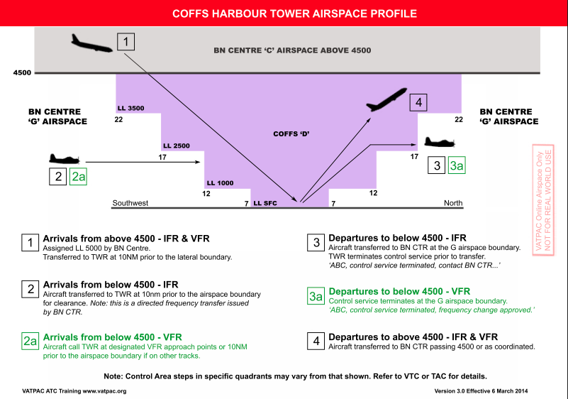

--8<-- "includes/abbreviations.md"

## Positions

| Name | Callsign | Frequency | Login Identifier |
| ---- | -------- | --------- | ---------------- |
| Coffs Harbour ADC | Coffs Harbour Tower | 118.200 | CFS_TWR |
| Coffs Harbour ATIS | N/A | 130.300 | YCFS_ATIS |

## Airspace

<figure markdown>
{ width="700" }
  <figcaption>YCFS Airspace</figcaption>
</figure>

## Surveillance
TW TWR is permitted to use Surveillance standards for separation. Surveillance coverage can be expected to be not available below **3400 feet** in the TW CTR.  
For simulation purposes, visual separation is assumed to exist below the cloud base, and within 5nm. Visual separation can still be used to separate from aircraft on an instrument approach, below the cloud base.

## Instrument Approaches
Only one aircraft is permitted to conduct an instrument approach at any time, due to limited surveillance coverage. TW TWR must ensure that all aircraft are procedurally separated from any portion of an instrument approach and missed approach that is conducted below **3400 feet**.  

If required, TW TWR can pass amended tracking/level instructions to an aircraft for a missed approach for separation purposes, as long as the aircraft can be issued **uninterrupted climb** to the LSALT/MSA once identified.

## Coordination
### CFS ADC / ENR

#### Taxi Call
A taxi call shall be made between CFS TWR and BN CTR as an aircraft is given taxi clearance. Center will respond by acknowledging the callsign and activating FDR.

!!! example
    **CFS_TWR** -> **BN-INL_CTR**: "Taxis QLK105D for YSSY via SORTI"  
    **BN-INL_CTR** -> **CFS_TWR**: "QLK105D"  

#### Next Call
A next call is made for all aircraft when they are next to depart and will be departing within two minutes. Center will respond by either acknowledging the callsign or offering a higher level. Any higher level issued will be passed along in the takeoff clearance. If the controller is in a high workload environment, a next call may be omitted, in favour of taxi and departure coordination.

!!! example
    **CFS_TWR** -> **BN-INL_CTR**: "Next QLK105D"  
    **BN-INL_CTR** -> **CFS_TWR**: "QLK105D, FL120"  
    **CFS_TWR** -> **BN-INL_CTR**: "FL120, QLK105D"  

#### Departure Call
A departure call should be made as the aircraft becomes airborne. If not already issued, CTR will issue a higher level. The aircraft should be transferred to CTR as they climb through the upper level of the CFS Class D airspace.

!!! example
    **CFS_TWR** -> **BN-INL_CTR**: "Departure QLK105D at 06"  
    **BN-INL_CTR** -> **CFS_TWR**: "QLK105D"

#### Arrival Coordination
BN_CTR will coordinate all arrivals into Coffs Harbour Prior to handing over to tower in the following format:

- Callsign & Aircraft Type
- Estimate
- Inbound Radial/Procedure
- Assigned Level
- Sequence Number (if applicable)

!!! example
    **BN-INL_CTR** -> **CFS_TWR**: "QLK116D, DH8D, estimates Coffs Harbour 52, RNP 03 via CFSSG, A055, number 1”
    **CFS_TWR** -> **BN-INL_CTR**: "QLK116D"
## Standard Assignable Level
In IMC, aircraft must be assigned a minimum of `A070`. This shall be coordinated with CTR.  
In VMC, aircraft may be issued `A040 VISUAL` without prior coordination regarding the level.
