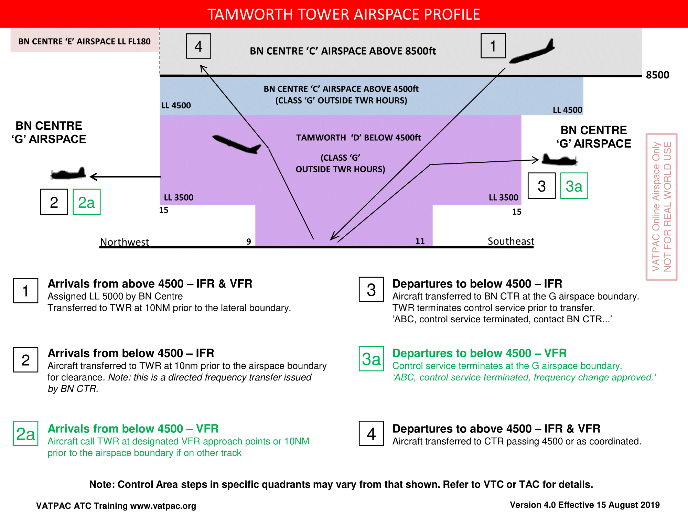

--8<-- "includes/abbreviations.md"

## Positions

| Name | Callsign | Frequency | Login Identifier |
| ---- | -------- | --------- | ---------------- |
| Tamworth ADC | Tamworth Tower | 119.400 | TW_TWR |
| Tamworth SMC | Tamworth Ground | 121.900 | TW_GND |
| Tamworth ATIS | N/A | 123.800 | YSTW_ATIS |

## Airspace

<figure markdown>
{ width="800" }
  <figcaption>Tamworth Tower Airspace</figcaption>
</figure>

TW TWR is responsible for the Class D airspace in the TW CTR, as well as the Class C airspace between A045-A065.

Refer to [Class D Tower Skills](../../controller-skills/classdtwr) for more information.

## Surveillance
TW TWR is permitted to use Surveillance standards for separation. Surveillance coverage can be expected to be not available below **3400 feet** in the TW CTR.  
For simulation purposes, visual separation is assumed to exist below the cloud base, and within 5nm. Visual separation can still be used to separate from aircraft on an instrument approach, below the cloud base.

TW TWR must establish a [Procedural Standard](../../controller-skills/classdtwr/#standards) prior to losing surveillance identification of an aircraft.

!!! caution
    An aircraft becoming identified, or maintaining identification, *below* 3400 feet, cannot be assumed to be able to maintain identification at that level. A procedural and/or visual standard **must** be put in place for all aircraft below 3400 feet.

## Instrument Approaches
Only one aircraft is permitted to conduct an instrument approach at any time, due to limited surveillance coverage. TW TWR must ensure that all aircraft are procedurally separated from any portion of an instrument approach and missed approach that is conducted below **3400 feet**.  

If required, TW TWR can pass amended tracking/level instructions to an aircraft for a missed approach for separation purposes, as long as the aircraft can be issued **uninterrupted climb** to the LSALT/MSA once identified.

## Local Lateral Separation Points

| South and East of New England Highway - Manilla Rd | vs | 040 Radial |
| ----------- | ----------------- | ----------------- |
| LLC South of **Moonbi township** LLC East of **Tamworth City** | | LLC South of **11 DME** |

| South and East of New England Highway - Manilla Rd | vs |  030 Radial |
| ----------- | ----------------- | ----------------- |
| LLC East of **Tamworth City** | | |

| East of New England Highway | vs | 168 Radial |
| ----------- | ----------------- | ----------------- |
| LLC North of **GGO** | | LLC North of **14 DME** |

| East of New England Highway | vs | 180 Radial |
| ----------- | ----------------- | ----------------- |
| LLC North of **WBH** | | LLC North of **25 DME** |

| East of New England Highway | vs | 190 Radial |
| ----------- | ----------------- | ----------------- |
| Always laterally separated | | |

| Visual fixes | vs | ILS 30R |
| ----------- | ----------------- | ----------------- |
| LLC South of **Duri Township, Round Hill, GGO, and NUN** | | |
| LLC North of **DGN - NEM - Tamworth City - MAL via Manilla Rd** | | |

| Visual fixes | vs | VOR 12L |
| ----------- | ----------------- | ----------------- |
| LLC West of **GWT** | | |
| LLC North of **DGN - NEM - Tamworth City - MAL via Manilla Rd** | | |

## Runway Operations
Runway 12R/30L shall be used for:

- All single-engine VFR arrivals and departures from the 160 Radial through West to the 295 Radial
- Arrivals via DUA
- Departures via GST or GWT
- Single-engine circuit training

Runway 12L/30R shall be used for all other operations. `ERSA FAC YSTW`

## Circuits
Circuits are to be flown in the direction coinciding with the Runway designator (Left/Right) at `A024`.

## Coordination
### Departures
A 'next' call is made for all aircraft when they are next to depart. TW TWR must inform ARL/MDE if the aircraft does not depart within **2 minutes** of the next call.

!!! example
    **TW TWR** -> **ARL**: "Next, QLK5D"  
    **BLA** -> **AY TWR**: "QLK5D"    

### Arrivals
ARL/MDE will coordinate the sequence to TW TWR.

!!! example
    **MDE** -> **TW TWR**: "New Sequence of 2. Via MOR DCT, FD272, Number 1. Via NBR DCT, AM217, Number 2”  
    **TW TWR** -> **MDE**: "FD272, Number 1. AM217, Number 2"  

## Standard Assignable Levels

Aircraft departing from Tamworth shall be assigned `A070` or `RFL` if lower.

Aircraft arriving into Tamworth shall be assigned `A080` by ARL/MDE.