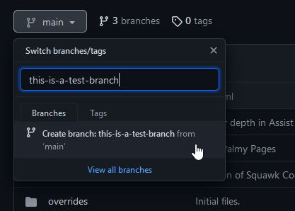
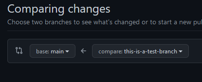
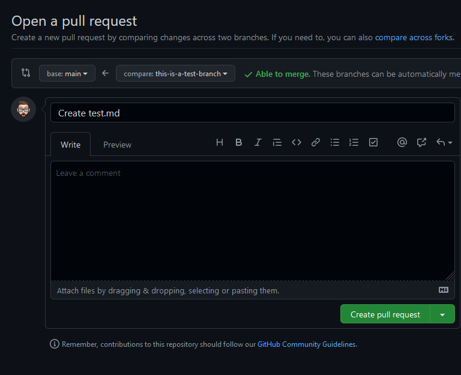

--8<-- "includes/abbreviations.md"

!!! tip
    As a general rule of thumb, it's not a good idea to make changes directly to the `main` branch of a repository. When your working on these SOPs, we require you to create a new branch, that we can then merge into `main`.

{ align=left width="350"}

So how do we contribute a new item or section? Let's have a look!

- Fork the project into your personal account on GitHub.
- Create a new branch from `main`, with a clear name of what you're implementing - seen in the image on the right.
- Checkout your new branch, and commit some changes.
- Open a new Pull Request for your changes/branch. 
    - This can be done by heading to the sops repository, and finding `Pull requests`

{ align=left width="350"}

- Click on the green button, saying `New pull request`

!!! tip ""
    **Make note of the arrow!** In the image to the left, you can see that the arrow shows that we're wanting to merge `this-is-a-test-branch` into `main`.

- After making sure the arrows are correct, click on the green `Create pull request` button.

{ align=left width="350" }

- Make sure your title clearly explains the changes you've made, but is still concise.
- Fill out the main content of your PR as necessary. 

!!! tip ""
    The main content of your PR serves as the project tracker for that feature or fix. Feel free to add in checkboxes of important steps, or whatever you need.
    
    Other people are also able to make changes to your branch, and may occasionally have some discussion on your PR.

- Once you're happy, smash the green `Create pull request` button!