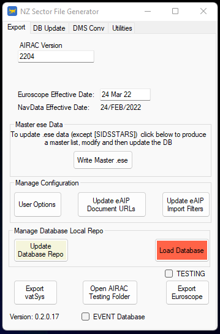
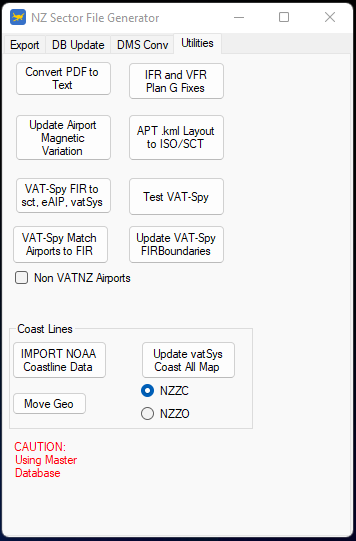

--8<-- "includes/abbreviations.md"

This section will run through the buttons on each interface screen, and link to the respective page within the SFG guide.

{ align=right width="350"} 

### Export Tab

* `AIRAC Version` allows you to set the current version being worked on. This also dictates the name of the current working directory in the `AIRAC Testing` folder.

* `Euroscope Effective Date` will automatically populate depending on the AIRAC version. This is automatically appended in the EuroScope disclaimer, and [INFO] output. This can be manually edited for a rush revision.

* ++"Write Master .ese"++ exports the master `.ese` file to the current working directory.

* ++"User Options"++ allows you to change various configuration options, such as the `ControllerInfo` text, MySQL access config and the Holding Pattern draw config.

* ++"Update eAIP Document URLs"++ allows you to define the web locations of the PDF files on the ANR website. ++"Update eAIP Import Filters"++ allows you to edit the import regex filters.

* ++"Export vatSys"++ and ++"Export Euroscope"++ do exactly that - export the NZZC and Pacific datasets to the current working directory.

### DB Update Tab

{ align=right width="350"}

* ++"Procedure Editor"++ opens the Procedure Editor screen - [more information](DataManagement/ProcedureEditor.md){ target=blank }

* ++"Extract and Import all eAIP Data"++ downloads and import the latest ANR data - [more information](DataManagement/ImportingANRData.md){ target=blank }

* `eAIP Manual Import` section contains various methods for manual data entry - [more information](DataManagement/ImportingANRData.md){ target=blank }

* ++"Import ESE"++ imports the master .ese file, which is used for the POF table, amongst other uses - [more information](DataManagement/MasterESE.md){ target=blank }

* ++"Import Manual IFR Fix"++ allows you to import missing NZZC fixes, such as procedural waypoints for RNP procedures.

* ++"Import Arpt Layout File"++ allows for the importing of aerodrome ground layouts for export to both vatSys and ES.

* ++"Import Pacific Data"++ updates the Pacific airspace data in the database - [more information](DataManagement/ImportingANRData.md){ target=blank }

* ++"Airspace Converter"++ is a manual conversion utility, allowing for the conversion between eAIP draw definitions and other formats.

### Utilities Tab

{ align=right width="350"}

* ++"Convert PDF to Text"++ allows for the manual conversion of ANR files from PDF to text.

* ++"IFR and VFR Plan G Fixes"++ exports all IFR and VFR fixes into a CSV format  - [more information](LNMVFRFixes/){ target=blank }

* ++"Update Airport Magnetic Variation"++ updates all aerodrome magnetic variations. This should be done once a year.

* ++"APT .kml Layout to ISO/SCT"++ converts a .kml layout from Google Earth into the necessary EuroScope and vatSys files - [more information](ADLayouts/){ target=blank }

* The four VATSpy buttons are explained in the [VATSpy section](VATSpy/){ target=blank } of the documentation.

* The various coastline functions are [explained here](DataManagement/UpdatingCoastlines.md){ target=blank }.

### DMS Conversion Tab

{ align=right width="350"}

This tab allows for the conversion between SCT/eAIP/Decimal and ISO coordinate formats.

This tab also allows for the conversion between RGB values, and the weird format that EuroScope uses. 

