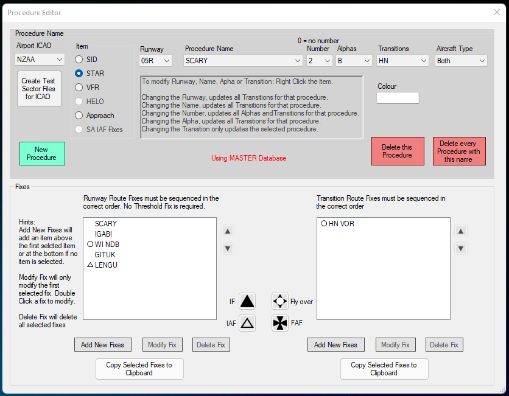

--8<-- "includes/abbreviations.md"

Arrivals are the easiest procure to model in the dataset, due to most arrivals being fix-to-fix navigation.

Most of the principles of procedure editing laid out in the [SID section](departures.md) are also applicable here -

* Fixes should be entered in the order in which they are flown.
* For procedures with transitions, the base procedure should be added first, with the transitions added after.
* The delete buttons behave in the same way.
* The general screen layout is the same.

## Editor

### The STAR Screen

<figure markdown> 
  { width="500" }
</figure>

STARs have to contain at least two fixes in the base procedure, and should still be entered in the order that they are flown.

!!! information
    Where a procedure has only one waypoint in the base procedure, you will need to enter a custom coordinate that is close to the fix. This is due to both Euroscope and vatSys having to draw a procedure from point-to-point.  

    You can find this coordinate by following the same directions as shown on the SID page for creating a custom coordinate.

### Add New Procedure 

Adding a new procedure can be done by following the same directions as for adding a SID.

The only difference here is that you should designate what fix is the Initial Approach Fix (IAF). This can be done by clicking on the desired point, and clicking on the `IAF` button. 

!!! tip "Additional Context"
    Clicking the `IAF` button does two things -

    * Tells the SFG to create a text label for that waypoint in the various map layers, and
    * Will assist the SFG in automatically linking STARs and Approaches together in the export. 

### Modifying a Procedure

Procedures can be modified by finding the procedure in the main window, and then modifying the respective data. The data will save if you attempt to navigate away from the procedure by either closing the window or select another procedure.

### Deleting a Procedure

Procedures can be deleted by navigating to the procedure, and clicking either the ++"Delete this Procedure"++ or ++"Delete every Procedure with this name"++ buttons. 

++"Delete this Procedure"++ will delete only the procedure selected. In the case that you attempt to delete a base procedure while transitions for that procedure still exist, you will need to delete all transitions first.

++"Delete every Procedure with this name"++ will delete every procedure with that have the same procedure name. This is regardless of the Runway, Number or Alpha fields. **You should not use this function if you wish to delete a single procedure**.