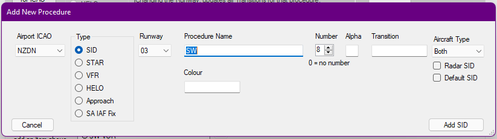

--8<-- "includes/abbreviations.md"

SIDs are often the more difficult procedure to model in the dataset, as they often have a lot of variables associated with them, such as aircraft performance based turns; and differing ARINC leg types such as course to fix and altitude to fix.

{ width=350 align=right }

When translating procedures, it is often better to translate them as it they were for the average aircraft. For example, in a performance-influenced departure like the `ECHO5` out of Palmerston North, a prop will make a more drastic turn at a lower speed when compared to a faster jet aircraft. 

## Editor

### The SID Screen

<figure markdown> 
  { width="500" }
</figure>

The above image shows the screen for a fully populated procedure. The screen is well annotated within the app, although there are a few key things to know about the behaviour of the app -

* Changing the Runway will update all transitions for that procedure. 
* Changing the Name will update all transitions for that procedure.
* Changing the Number will update all alphas and transitions for that procedure.
* Changing the Alpha will update all transitions for that procedure.
* Changing the Transition will update only the selected procedure.

The aircraft type box will alter what aircraft this SID can be made available to in the vatSys FDRs. Ticking the `Radar SID` box will make the SID the default for non-RNP/RNAV aircraft. Ticking the `Default SID` box will make it the default SID assigned to traffic for that runway. 

The ++"Delete this Procedure"++ button will delete the individual procedure selected. If you have a transition selected, it will only delete that transition. The ++"Delete every Procedure with this name"++ button will delete every procedure with the same Procedure Name - regardless of whether or not it is on the same runway or not.

The two boxes below are the fix boxes. The procedures should flow from top to bottom in the order that they should be flown. The box on the left is the 'base procedure'

### Add New Procedure 

<figure markdown> 
  { width="100%" }
</figure>

Adding a new procedure is relatively simple - you select the runway applicable, and fill out the other respective fields.

You can add a SID for either a single runway, or all runways at an aerodrome. Where a procedure might be for multiple but not all runways, you should select all.

!!! tip 
    When adding a procedure that has various transitions, you are required to add the base procedure first. This is the part of the procedure that is common to all of the transitions. Usually on charts, this is solid line portion of the procedure.

    Subsequent transitions can be added by adding a new procedure, entering the base procedure, and then adding the desired transition fix in the `Transition` box. Clicking ++"Add SID"++ will open to the main screen, where you can add the transition route to the right hand text box.

!!! tip
    You can also add custom coordinates to create a custom path, or a manual turning point. This is often used for a 500ft turn point, as can be seen in the above illustration of the `ECHO5` procedure out of Palmerston North.

    You can create this point by looking at the procedure in LittleNavMap, displaying the procedure and placing a custom waypoint where the turn commences. This coordinate can then be converted in the SFG's `DMS Conv` utility to the SCT format, and can be added like any other fix.

<figure markdown style="float: right;">
  
</figure>

The example above shows the `RUXOX4S` for Runway 07 at Palmerston North. 

* The `PM25T` and `PM07T` fixes are threshold fixes. Normally the opposite end threshold fix is not required, but has been added here, as `VEPUR` is slightly offset from the runway centreline.
* `RUXOX` is the final common fix for the procedure. 
* Waypoints `OLMUX`, `OH VOR` and `RUGVI` make up the rest of the transition, and are entered in the order that they are flown. 
* The circle next to `OH VOR` designated that it is a ground-based navigation aid, not an IFR waypoint. VOR/DMEs and NDBs all show as a circle.

!!! warning
    Modifying the base procedure while a Transition is selected will update the base procedure for all transitions. 

!!! information
    The `IF`, `IAF`, `Fly over` and `FAF` buttons are not applicable for SIDs.

### Modifying a Procedure

Procedures can be modified by finding the procedure in the main window, and then modifying the respective data. The data will save if you attempt to navigate away from the procedure by either closing the window or select another procedure.

### Deleting a Procedure

Procedures can be deleted by navigating to the procedure, and clicking either the ++"Delete this Procedure"++ or ++"Delete every Procedure with this name"++ buttons. 

++"Delete this Procedure"++ will delete only the procedure selected. In the case that you attempt to delete a base procedure while transitions for that procedure still exist, you will need to delete all transitions first.

++"Delete every Procedure with this name"++ will delete every procedure with that have the same procedure name. This is regardless of the Runway, Number or Alpha fields. **You should not use this function if you wish to delete a single procedure**.