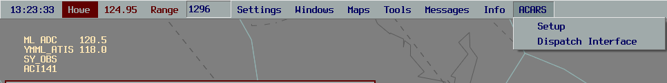
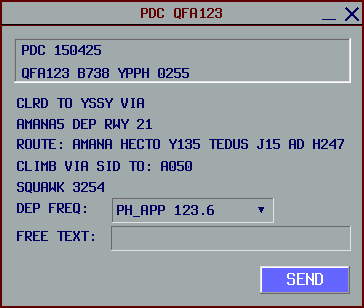
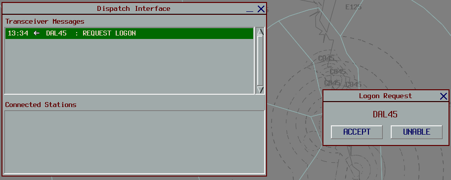
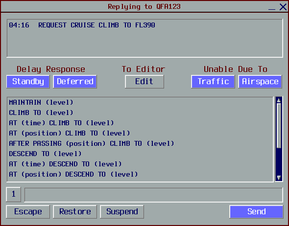
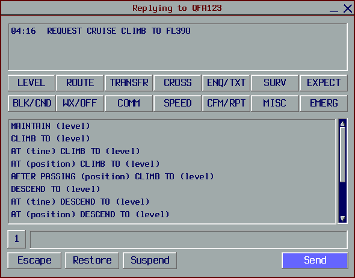
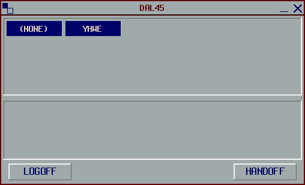

--8<-- "includes/abbreviations.md"

In the real world, CPDLC is generally used by aircraft within Class A airspace above `F245`.

CPDLC may also be used by pilots to request a PDC.    
PDCs utilising vatACARS are solicited by the pilot, however, the standalone vatSys functionality can be used in lieu of vatACARS without a pilot-initated request.

!!! Note
    **CPDLC in its enroute capacity should only be used by Enroute (C1) controllers or above.**

    PDCs may be issued using the vatACARS client by any controller.

## Setup

The vatACARS client can be downloaded [here](https://vatacars.com/){target=new}.  

The vatACARS client requires controllers to have a [Hoppies ACARS](https://www.hoppie.nl/acars/system/register.html) account and logon code, plus a [vatACARS Token](https://vatacars.com/me).

If the client is installed correctly, there will be an *ACARS* drop-down box available in vatSys.

<figure markdown>
{ width="700" }
</figure>

## Pre-Departure Clearance

To utilise vatACARS for issuing PDCs, the controller must be logged into a TCU, ADC, SMC, or ACD position.

!!! Note
    If multiple controllers are present at one airport, the controller responsible for the ACD position will manage PDCs through vatACARS.

After logging onto the VATSIM network, controllers **MUST** note in their controller remarks section that PDCs are available in the format below.

<figure markdown>
{ width="700" }
</figure>

The controller should then open the vatACARS *Setup* window, fill in the relevent details, and click *Connect*.

<figure markdown>
{ width="700" }
</figure>

**Station Code:** Must be the identifier of the position which is being controlled.          
**vatACARS Token:** Must be your unique vatACARS Token, found [Here](https://vatacars.com/me).          
**Logon Code:** Must be your [Hoppies ACARS](https://www.hoppie.nl/acars/system/register.html) Code.            

Once connected with CPDLC enabled, pilots will connect to the vatACARS plugin via their aircraft's CPDLC system. The controller will normally receive a *'Request PDC'* message through vatACARS. The controller should left-click the received message to issue the PDC. A self-explanatory window will appear; fill in the *DEP FREQ* and, if required, *FREE TEXT* field and send this back to the aircraft. Note that the pilot's strip **MUST** be filled out in order to issue a PDC through vatACARS. Once the aircraft has received their PDC, the pilot will usually respond with *'Roger'* or similar to show they have received the clearance.

<figure markdown>
{ width="700" }
</figure>

Pilots must still read back their SID, squawk, and bay number on the frequency, even if they have acknowledged receipt of the PDC through vatACARS with the *'Roger'* response.

!!! Note
    If providing a top-down service as an enroute station, pilots requesting a PDC via CPDLC will be required to connect to your Enroute Station Code; E.g. YISA, YBIK, etc

## Enroute

To utilise CPDLC, the controller must be logged into an enroute or oceanic position.

**CPDLC (except for PDCs) must not be used below `F245`.**

After logging onto the VATSIM network, controllers **MUST** note in their controller remarks section that PDCs are available in the format below.

<figure markdown>
{ width="700" }
</figure>

The controller should then open the vatACARS *Setup* window, fill in the relevent details, and click *Connect*.

<figure markdown>
{ width="700" }
</figure>

**Station Code:** Must be the identifier of the position which is being controlled.          
**vatACARS Token:** Must be your unique vatACARS Token, found [Here](https://vatacars.com/me).          
**Logon Code:** Must be your [Hoppies ACARS](https://www.hoppie.nl/acars/system/register.html) Code.            

Some major enroute positions do not use CPDLC as a primary means of communication, however, controllers may use CPDLC in lieu of voice when applicable.

### Station Codes

| Position | Station Code | Primary Communication Method |
| --- | ---- | ----- |
| ARL | YARL | Voice |
| HWE | YHWE | **CPDLC** |
| INL | YINL | Voice |
| ISA | YISA | **CPDLC** |
| KEN | YKEN | Voice |
| TRT | YTRT | **CPDLC** |
| ASP | YASP | **CPDLC** |
| BIK | YBIK | Voice |
| ELW | YELW | Voice |
| HUO | YHUO | Voice |
| OLW | YOLW | **CPDLC** |
| PIY | YPIY | Voice |
| TBD | YTBD | Voice |
| YWE | YYWE | Voice |
| TSN | YTSN | **CPDLC** |
| FLD | YFLD | **CPDLC** |
| IND | YIND | **CPDLC** |
| NFFF | NFFF | **CPDLC** |
| NZZO | NZZO | **CPDLC** |
| KZAK | KZAK | **CPDLC** |

!!! Note
    If a non-standard subsector is online, the Station Code will be required to change to match the controlled subsector.

### Accepting an Aircraft

Once connected and with CPDLC enabled, pilots will connect to the vatACARS plugin via their aircraft's CPDLC system. The controller will normally recieve a *'Logon Request'* message through vatACARS.         

The controller should left click their callsign to respond to this initial message, and respond with an *'Accept Logon'*  to show the pilot that they have successfully connected. 

<figure markdown>
{ width="700" }
</figure>

This aircraft will now be automatically added to your Dispatch Interface.

### Message Editor

When either a pilot sends a request or ATC wishes to send a message to the pilot, left click the callsign in the dispatch window to open the message editor.         
This is used to select from a group of relevant messages to send back to the pilot.   

<figure markdown>
{ width="700" }
</figure>

If the message you wish to send is not shown in this initial dispatch window, click the *Edit* button to show more messages to send to the pilot.

<figure markdown>
{ width="700" }
</figure>

Left-clicking the number next to the text box cycles forward through up to five lines of text, while right-clicking moves to the previous line.

### Handing over Aircraft

#### ENR/OCN

When transferring between enroute or oceanic sectors, ATC should right click on the aircraft which will bring up a handover window. The controller should select the next ATC unit to transfer the aircraft.

<figure markdown>
{ width="700" }
</figure>

#### ENR/TCU

Standard Voice frequency transfers must be used for aircraft below `F245` and between ENR to TCU Positions. 

### Terminating CPDLC

If CPDLC is no longer available or required, ATC should right-click on the aircraft and select *'LOGOFF'* to the aircraft a CPDLC logoff message.

<figure markdown>
{ width="700" }
</figure>
