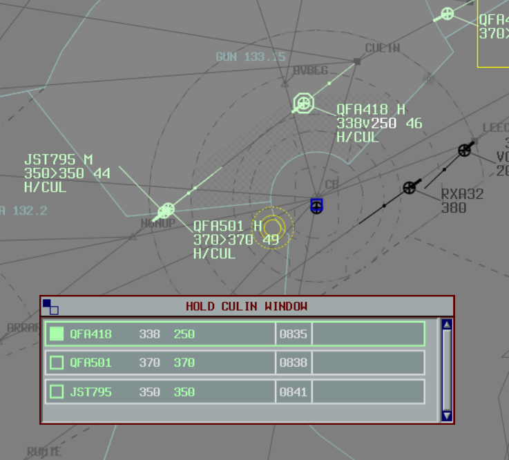
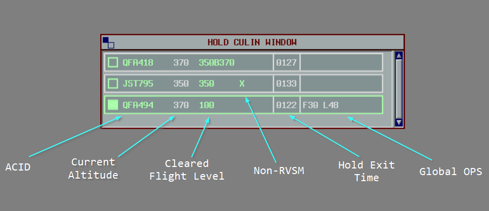
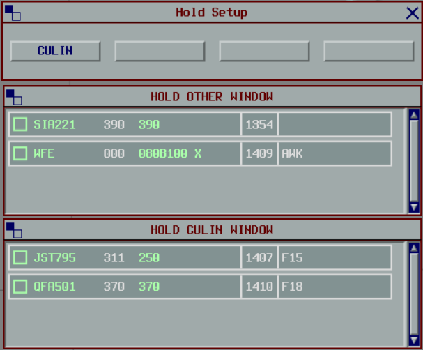

--8<-- "includes/abbreviations.md"

## Background

The Hold plugin replicates the Eurocat Hold window and functionality, helping Enroute and Terminal controllers manage traffic in holding stacks or performing airwork over a specified location.

<figure markdown>
{ width="600" }
</figure>

## Installation

The plugin can be installed through the [vatSys Plugin Manager](https://github.com/badvectors/PluginManager){target=new}.

Alternatively, download the plugin from [GitHub](https://github.com/YuKitsune/HoldPlugin/releases) and place it in your vatSys Plugins folder.

## Initiating a Hold

To initiate a hold, enter the hold details into the Label Data.
The hold information should be formatted as `H\RIVET`, where `RIVET` is the name of the holding waypoint.
The waypoint name can be shortened to as little as three characters (e.g. `H\RIV`).

An exit time can be specified by appending it to the holding point name, e.g. `H\RIVET\29` to depart `RIVET` at 29-minutes past the hour.

The exit time can be adjusted directly from the list or by modifying the label.

When the exit time is set, the ETO for all subsequent waypoints are adjusted to reflect the hold exit time.

The hold can be cancelled by removing the details from the Label Data, or by rerouting the flight past the holding point.

## Hold Lists

The hold list displays flights ordered by their CFL.

When a block clearance has been issued, the CFL is displayed as `xxxByyy`, where `xxx` is the lower level, and `yyy` is the upper level.

An `X` will be displayed if the aircraft is non-RVSM.

The hold exit time is displayed in the label and can be adjusted by clicking on it to select a new exit time.

The `OP_DATA` can also be viewed and edited from the hold label.

<figure markdown>
{ width="700" }
</figure>

## Configuring Lists

Up to 4 holding lists are available.
When a hold is initiated at a waypoint that does not already have a list, one is created automatically.
When all holds at that waypoint are removed, the list is freed and the slot becomes available again.

Lists can also be configured manually via Tools > Hold Setup.
Manually configured lists are not freed automatically; they must be cleared via the Hold Setup window.

Any aircraft holding at a waypoint when all 4 lists are already occupied will be placed in the `OTHER` list.

<figure markdown>
{ width="550" }
</figure>
