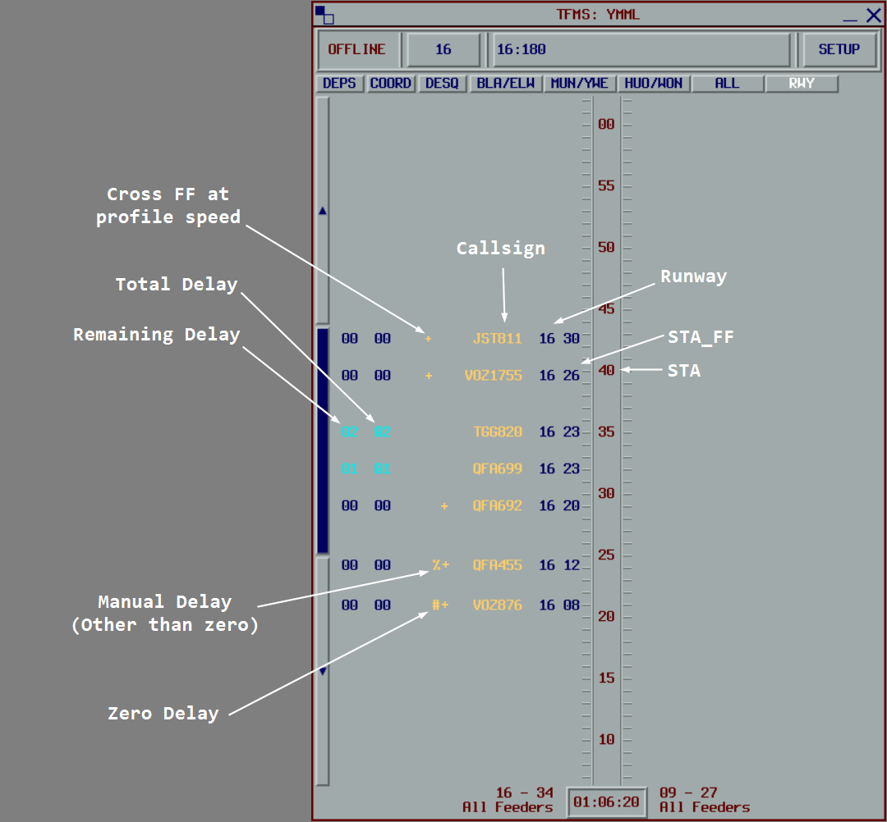

--8<-- "includes/abbreviations.md"

MAESTRO (pronounced my-stro), also and otherwise known as Traffic Flow Management System (TFMS), is an arrival manager used to generate a sequence of aircraft inbound to an airport from multiple directions.

For a detailed explanation of the system and operations, see the [MAESTRO User Guide](https://maestro.eoinmotherway.dev).

MAESTRO is a semi-automatic system, and will sequence arrivals generally without intervention.
When the number of arriving aircraft increases, a flow controller is required to 'drive' the system, make adjustments as required, and communicate sequencing information to the respective ENR and APP controllers.

MAESTRO is generally not used by TWR controllers, however it allows them to have situational awareness of the flow of inbound aircraft.

The MAESTRO plugin can be accessed from the vatSys menu bar under TFMS.

## Abbreviations

| Abbreviation | Definition |
| ------------ | ---------- |
| Feeder Fix (FF) | A point on the TMA boundary. |
| `ETA` | Estimated time of arrival **at the runway**. |
| `STA` | **Scheduled** time of arrival at the runway (landing time) calculated by Maestro. |
| `ETA_FF` | Estimated time of arrival at the **feeder fix**. |
| `STA_FF` | **Scheduled** time of arrival at the feeder fix calculated by Maestro. |

## How it works

Maestro tracks flights within 2 hours of the feeder fix or when an FDR is activated for flights from departure airports. vatSys provides updated position information every 30 seconds, and Maestro recalculates estimates and sequence position based on the flight's state.

Flights from departure airports are placed in the Pending list and must be manually inserted by the flow controller. These flights can be inserted prior to departure to absorb delay on the ground.

Maestro calculates landing times (`STA`) based on estimates (`ETA`) and applies delays when the time between consecutive flights is less than the acceptance rate. The `STA_FF` is calculated by subtracting the arrival `ETI` from the `STA`.

### The Timeline

Each timeline displays flights at their `STA` (runway view) or `STA_FF` (feeder view).
Each tick on the timeline corresponds to one minute.

Flight labels are mirrored on either side of the timeline, and contain (from innermost to outermost):

1. `STA` (in feeder view) or `STA_FF` (in runway view)
2. Assigned runway
3. Callsign
4. Approach Type (if applicable)
5. `#` if zero delay has been assigned
6. `%` if manual delay (other than zero) has been assigned
7. `+` if the flight must cross the feeder-fix at published speed
8. `*` if the FDR is not coupled to a radar track
9. Total delay required (based on the initial `ETA`)
10. Delay remaining (based on the current `ETA`)

The total delay required remains unchanged as the flight absorbs delay. The remaining delay progressively reduces as delay is absorbed. When the remaining delay reads `00`, all required delay has been absorbed.

!!! note
    After a flight has passed the feeder fix, the `ETA` is calculated based on the `ATO` of the feeder fix, thus, the remaining delay figure will not change once the flight enters the TMA.

### Flight States

Maestro uses various states that affect how flights are processed. Each state is indicated by a specific color on the flight label:

**Unstable**: All new flights start in this state and remain unstable for at least 5 minutes. After each update, unstable flights are re-positioned in the sequence based on their calculated `ETA`, and their `STA_FF` and `STA` times are re-calculated.

**Stable**: Flights become stable 25 minutes prior to the `ETA_FF`. Stable flights keep their position in the sequence unless a flight appears, disappears, or moves before it. Stable flights can be displaced by a preceding flight being moved by controller action or a new flight entering the sequence with an earlier `ETA_FF`.

**Super Stable**: Flights become super stable at the original `ETA_FF`. Super stable flights are fixed in position. All new flights are positioned after super stable flights. Super stable flights can only be moved manually by controller interaction.

**Frozen**: Flights become frozen within 15 minutes of the `STA`. No changes can be made to frozen flights. They remain locked in their scheduled position and time.

**Landed**: Flights become landed at the `STA`. No changes can be made to landed flights. The last 5 landed flights remain in the system in case of an overshoot, after which they are automatically removed.

### Delaying Action

The delay figure on the flight label is color coded to indicate the suggested delaying action:

- **Expedite**: The aircraft needs to make up the time shown (a minus sign will be in front of the delay number)
- **No delay**: No delaying action required. The aircraft can maintain their profile speed.
- **Speed reduction**: A short delay is required for the flight to meet their `STA`.
- **Holding recommended**: Extended delay is required.

## Interactions

Right-click on a flight label to access the following functions:

| Function | Description |
| -------- | ----------- |
| Change Runway | Change the runway assigned to this flight. The flight is re-inserted into the sequence based on its `ETA`. |
| Change Approach Type | Change the approach type assigned to this flight. |
| Insert Slot | Insert a slot before or after this flight to reserve runway capacity. |
| Insert Flight | Insert a new flight before or after this flight (overshoot flights, dummy flights). |
| Coordination | Send a flight-specific coordination message for this flight. |
| Change ETA_FF | Manually adjust the `ETA_FF` if the system estimate is inaccurate. |
| Information | Display detailed sequencing information related to this flight. |
| Manual Delay | Assign a manual delay to increase flight priority. The flight will receive no more than the specified delay. |
| Remove | Remove the flight from the sequence (diversions). |
| Recompute | Re-compute the flight's position and landing time as if it were a new flight. Cancels manual delay and manual ETA_FF. |
| Desequence | Move the flight to the De-sequenced list, temporarily removing it from the sequence (holding). |
| Make Pending | If this flight is departing from a departure airport and has not yet departed, place them back into the pending list. |

Additional functions:

| Button | Function |
| ------ | -------- |
| `DEPS` | Opens the Insert a Flight window to manually insert pending flights from departure airports. |
| `COORD` | Opens the Coordination window for sending pre-defined messages to other controllers. |
| `DESQ` | Opens the Desequenced window showing flights that have been de-sequenced. |
| Move Flight | Left-click a flight to select it, then left-click on the timeline to move it to a new time or runway. |
| Swap Flights | Left-click a flight to select it, then left-click another flight to swap their `STA` and runways. |

## General Responsibilities

### Recompute Function

Avoid using the Recompute function unless the Change ETA_FF function is impractical. Recompute recalculates the flight's entire profile and may cause unnecessary disruption to the sequence, while Change ETA_FF allows for targeted corrections to estimate accuracy.

### Runway Assignment

Maestro automatically assigns runways based on the flight's feeder fix the current TMA configuration. The runway assignment is based on pre-configured rules for each feeder fix.

Maestro does not source runway assignments from vatSys. When a flight is assigned a new runway by ATC, the runway must be changed in Maestro using the Change Runway function (right-click the flight, select Change Runway).

Runway assignments can be manually overridden, however avoid changing the runway less than 15 minutes prior to the `ETA_FF` to prevent disrupting the stable sequence. If a runway change is required during this period, coordinate with the flow controller.

### Exchanging Flights

The swap flights function allows two flights to exchange positions in the sequence. This should be used to reflect the actual sequence when tactical control actions have resulted in a different landing order than planned.

Do not swap flights until they are Stable, Super Stable, or Frozen. Unstable flights are continuously being re-sequenced, and swapping them may result in immediate re-sequencing that negates the swap.

To swap two flights:

1. Left-click the first flight to select it
2. Left-click the second flight
3. Confirm the swap when prompted

The two flights will exchange their `STA` and runway assignments.

## Enroute Responsibilities

### Issuing Runway Assignments

Issue the arrival runway to the flight based on the Maestro allocation. This can be done while the flight is unstable.

If a runway other than the assigned runway is required, advise the flow controller.

### Unstable Flights

Do not issue delay instructions to unstable flights. Unstable flights are continuously being re-sequenced and their delay requirements may change rapidly. Wait until the flight becomes stable before issuing delay instructions.

### Estimate Accuracy

Ensure the `ETA_FF` is accurate at least 10 minutes prior to the feeder fix. If the system estimate is inaccurate, use the Change ETA_FF function (right-click the flight, select Change ETA_FF) to manually adjust it.

Remove any PETOs (Pilot Estimated Time Over) that may affect the accuracy of the system estimates.

### Re-routing

When re-routing a flight via a new feeder fix, use the Recompute function (right-click the flight, select Recompute) after the re-route has been processed. This will recalculate the flight's feeder fix, estimates, and position in the sequence.

### High Priority Flights

For high priority flights (generally used during busy events like WorldFlight), use Manual Delay `00` to ensure the flight receives minimal delay. If a re-route is required, perform the re-route before selecting Manual Delay `00`.

### Feeder Fix Crossing

Ensure flights cross the feeder fix at the `STA_FF`. Use speed control, vectors, or holding to manage the aircraft's arrival time at the feeder fix.

Advise TMA when a flight is more than 1 minute early or 30 seconds late.

### Speed Control

When no `+` symbol is present on the flight label, instruct the aircraft to cross the feeder fix at 250 kts for jets, 210 kts for turboprops, and profile speed for all other props.

Aircraft with the `+` [profile speed indicator](#the-timeline) should cross the feeder fix at profile speed.

### Close `STA_FF` Times

When two aircraft have close `STA_FF` times and longitudinal separation is required, determine the landing order using the runway view or the Information window. The runway view will show the landing sequence and the relative landing times.

### Coordination with Flow

Advise the flow controller when:

- A taxi call is received for flights bound for a Maestro airport. FMP will insert the flight into the sequence from the pending list.
- A runway other than the assigned runway is required.
- Route changes occur (re-routing to a new feeder fix)
- The Recompute, Desequence, or Swap function will be used. Enroute can perform these actions, but Flow must be advised when they occur.

Flow may advise when they are performing large changes to the sequence by sending internal coordination messages.

!!! warning "Important"
    Do not issue delay instructions to aircraft if Flow has sent the `Flow planning in progress...` coordination message. Wait until the `Maestro delay times accurate...` message is received.

## Approach Responsibilities

### Sequence Monitoring and Workload Management

Monitor the incoming sequence and anticipate the impending workload.

Coordinate with the flow controller if the arrival rate needs to be adjusted.

### Absorb Remaining Delay

If an aircraft enters the TMA with any delay remaining, use speed control and vectoring to absorb the remaining delay.

### Inserting Overshoots

If coordination with the flow controller is not required, and an aircraft conducts a missed approach or a go-around, approach controllers may re-insert the flight into the sequence either by moving them up the ladder, or using the Insert Flight function.

!!! note
    Frozen flights cannot be moved. Overshoot flights may need to be inserted after the last Frozen flight (before the first SuperStable flight) if there is not enough space between Frozen flights.

### Coordination with Flow

Advise the flow controller when:

- A taxi call is received for flights within the TMA bound for a Maestro airport. FMP will insert the flight into the sequence from the pending list.
- An aircraft conducts a missed approach or go-around.
- The Insert, Move, Swap, or Desequence functions will be used. Approach can perform these actions, but Fow must be advised when they occur.

## Flow Responsibilities

### Sequence Monitoring

Monitor the sequence for any anomalies, including:

- Flights with excessive delay
- Flights tracking via unexpected feeder fixes
- Uncoupled flights (indicated by `*` on the label)
- Flights requiring runway changes
- Pending flights that need to be inserted

### Sequence Adjustments

Adjust the sequence as required using the available functions (Move Flight, Change Runway, Manual Delay, etc.).

Before making large adjustments to the sequence:

1. Send the `Flow planning in progress...` coordination message to all positions
2. Make the required adjustments
3. Once completed, send the `Maestro delay times accurate...` message to all positions

This alerts controllers that delay figures may be temporarily inaccurate and prevents them from issuing outdated delay instructions.

### Pending Flights

Regularly review the Pending list (click `DEPS`) and insert flights from departure airports at appropriate times.

Coordinate with relevant units regarding pending flights, and advise them of the expected delay.

!!! tip
    Maestro will calculate delays for pending flights on the ground.
    Advise pilots of the expected delay prior to departure to allow them to absorb the delay on the ground rather than in the air.

### Slots

Create slots as required to restrict arrivals and manage traffic flow. Slots reserve runway capacity for special operations or configuration changes.

To insert a slot:

1. Right-click on the timeline in a runway view
2. Select `Insert Slot`
3. Adjust the start and end times as necessary
4. Click `OK` to insert the slot

Slots can be modified by left-clicking on the slot to reopen the Insert Slot window. Non-frozen flights within a slot will be automatically delayed until after the slot has ended.

### TMA Configuration Changes

Adjust landing rates and TMA configuration as required based on traffic demand and operational requirements.

Before making changes to the TMA configuration:

1. Send the `Standby for configuration change...` coordination message to all positions
2. Make the configuration change using the TMA Configuration window
3. Review the sequence and make any necessary adjustments
4. Once completed, send the `Maestro delay times accurate...` message to all positions

When scheduling a future configuration change, ensure the transition time allows sufficient buffer for aircraft in the sequence to land under the current configuration.

## Synchronisation

When connected to the Maestro server, the sequence is synchronised between all connected controllers. This allows multiple controllers to view and interact with the same sequence in real-time.

Connection to the Maestro server is established using the `SETUP` button in the Configuration Zone.

### Permissions

When Flow is online, different positions have different levels of access to Maestro functions.
The following table shows which functions are available to each position:

| Function | Enroute | Approach | Flow | Description |
| -------- | ------- | -------- | ---- | ----------- |
| Change TMA Configuration | | | ✓ | Modify TMA configuration and runway modes |
| Change Landing Rates | | | ✓ | Adjust runway acceptance rates |
| Move Flight | | ✓ | ✓ | Move a flight to a different time or runway |
| Change Feeder Fix Estimate | ✓ | | ✓ | Manually adjust the `ETA_FF` |
| Manage Slots | | | ✓ | Insert, modify, or remove slots |
| Insert Overshoot | | ✓ | ✓ | Insert overshoot flights into the sequence |
| Insert Departure | | | ✓ | Insert pending departures into the sequence |
| Insert Dummy | | | ✓ | Insert dummy flights into the sequence |
| Make Pending | ✓ | ✓ | ✓ | Move a departure back to the pending list |
| Change Runway | ✓ | ✓ | ✓ | Change the runway assigned to a flight |
| Manual Delay | ✓ | ✓ | ✓ | Assign a manual delay to increase flight priority |
| Make Stable | ✓ | | ✓ | Force a flight to become stable |
| Recompute | ✓ | | ✓ | Re-compute the flight's position and landing time |
| Desequence | ✓ | ✓ | ✓ | Move a flight to the de-sequenced list |
| Resequence | | | ✓ | Re-insert a de-sequenced flight into the sequence |
| Remove Flight | ✓ | ✓ | ✓ | Remove a flight from the sequence |
| Coordination | ✓ | ✓ | ✓ | Send coordination messages |

### Status Indicator

The Online Status Indicator in the Configuration Zone displays the current connection status:

| Status | Meaning |
| ------ | ------- |
| `OFFLINE` | Not connected to the Maestro server. All processing is local, and all functions are available. |
| `READY` | Connected to the Maestro server but not yet connected to VATSIM. No data is synchronised. |
| `FMP` | Connected as Flow. Your instance processes the sequence and distributes it to other controllers. |
| `APP` | Connected as Approach. Some functions are restricted (see [Permissions](#permissions)). |
| `ENR` | Connected as Enroute. Some functions are restricted (see [Permissions](#permissions)). |
| `ENR/FMP` or `APP/FMP` | Connected as Enroute or Approach with Flow authority. No dedicated Flow controller is online. All functions are available. |
| `OBS` | Connected as Observer. The sequence is read-only. |
