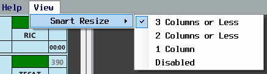
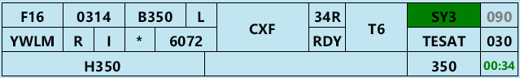
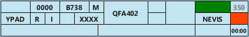
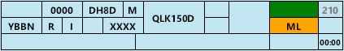
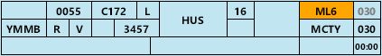
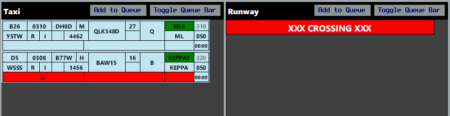
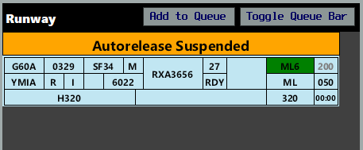

--8<-- "includes/abbreviations.md"

In the real world, aerodrome controllers use strips to provide a visual representation of aerodrome activity, beyond what looking out the window or at a radar screen can provide.

Within vatSys, this can be emulated using the [OzStrips plugin](https://maxrumsey.xyz/OzStrips/){target=new}. Strip state is shared between controllers operating at the same aerodrome.

## Setup
### Installation
The OzStrips plugin is included by default in the Australia and Pacific vatSys profiles provided by VATPAC. Alternatively, it can be downloaded using the [vatSys Plugin Manager](https://github.com/badvectors/PluginManager){target=new}.  

If the client is installed correctly, there will be an *OzStrips* option in the Window dropdown menu.

<figure markdown>
{ width="700" }
</figure>

### Connecting
After logging onto the network, open the plugin from the dropdown menu, and select the desired aerodrome, or type the ICAO code into the text field.

<figure markdown>
{ width="500" }
</figure>

A connection attempt will be made and if successful, the *CONN STAT* field in the Control Bar will turn green.

!!! tip
    Pressing `[` and `]` will cycle through the aerodromes in the dropdown menu, allowing controllers to provide top down coverage to multiple locations easily.

### Configuring Views
Once connected to the relevant aerodrome, controllers should select the view mode which is most suitable for their position. Use the **View Mode** menu item to select a layout.

<figure markdown>
{ width="250" }
</figure>

The size of each strip can be adjusted using the **Strip Scale** slider, under **Help** > **Settings**. Users with limited screen real estate may benefit from using a smaller strip size.

The plugin window will adjust to being resized, automatically collapsing into a two and single column layout, which is helpful for users with small screens.

<figure markdown>
{ width="400" }
</figure>

By default, the height of each strip bay is fixed, however using the **Smart Resize** functionality, they can be set to a dynamic height based on the number of strips in each bay. This is helpful when using the plugin in a collapsed column layout or with limited screen height.

<figure markdown>
{ width="400" }
</figure>

## Stripboard
<figure markdown>
{ width="800" }
</figure>

The stripboard is divided into multiple bays, each representing a stage in an aircraft's flight thread.

Strips can be moved in between strip bays by clicking on their callsign, and clicking the bay where you want them to go. Strips can be moved to the next bay by clicking on the SID box (referred to as *SID triggering*).

!!! Note
    Strips can not be *SID triggered* from the **Holding Point Bay** to the **Runway Bay**, to prevent accidental placement onto the runway.

### Missing Strips
Selecting a track on the Ground Radar or ASD will select the relevant strip in OzStrips, and vice versa. If a strip is missing from the stripboard, select the ground track from the vatSys Ground window, then click the desired OzStrips bay to place the strip there.

### Control Bar 
The bottom of the window holds the Control Bar. This panel contains the server connection status, aerodrome selected and ATIS code, among other elements. 

Each button has the following function:

| Button | Function |
| ------ | -------- |
| **INHIBIT** | Hides a strip from the stripboard (used when a strip is no longer needed) |
| **XX CROSS XX** | Adds a red highlight to the selected strip, denoting an intention to cross a runway |
| **ADD BAR** | Allows controllers to place a variety of fixed bars anywhere on the stripboard, reflecting status changes (e.g. autorelease cancellation or runway crossing) and allowing additional queues to be build (e.g. Sydney Coordinator functions) |
| **FLIP FLOP** | Toggles the selected strip between Departure, Arrival & Local states (for aircraft with both ADES and ADEP fields matching the current aerodrome) |

### Strips
The background colour of the strip corresponds to its status as an arrival or a departure. **Departing** aircraft have a blue strip, **arriving** aircraft have a yellow strip, and [**local**](#local-flights) aircraft have a pink strip.

<figure markdown>
{ width="600" }
</figure>

| Number | Content | Left Click | Right Click |
|---------|-------------|--------------| ----------- |
| **1** | **Bay Number** | Edit Bay Number | |
| **2** | **Filed Off Blocks Time** | Cock Strip | |
| **3** | **Aircraft Type** | Open Flightplan | |
| **4** | **Wake Turbulence Category** | | |
| **5** | **Destination** | Open Flightplan | |
| **6** | **Voice Capability Indicator** <small>*Empty* = Voice Capable **R** = Receive Only **T** = Text Only</small> | Show Route | |
| **7** | **Flight Rules** | Show Route | |
| **8** | **PDC Sent Indicator** <small>*Empty* = PDC not sent **P** = PDC sent</small> | Open PDC Window | Open Private Message |
| **9** | **SSR Code** | Autogenerate Code | |
| **10** | **Callsign** | Select Strip | |
| **11** | **Runway** | Change Runway | |
| **12** | **Ready Flag** | Toggle Ready Flag | |
| **13** | **Holding Point** | Edit Holding Point | |
| **14** | **SID** | Move strip to next bay | Change SID |
| **15** | **First Waypoint** | Open flightplan | Open Reroute Window |
| **16** | **Requested Level** | Open flightplan | |
| **17** | **Cleared Level** | Change CFL | |
| **18** | **vatSys Global Ops Field** | Edit | |
| **19** | **OzStrips Remarks** | Edit | |
| **20** | **Departure Heading** | Edit Departure Heading | |
| **21** | **Takeoff Timer** | Start / Reset | |

<figure markdown>
{ width="600" }
    <figcaption>An example strip</figcaption>
</figure>

#### Local Flights
Aircraft intending to conduct operations entirely on the ADC frequency (most commonly circuits or helicopter operations in ADC jurisdiction) should be marked as a **local strip**.

Select the strip, then use the [flip flop](#control-bar) button to 'flip' the strip into a pink, local strip.

Aircraft who have filed flightplans which depart from and arrive back to the same aerodrome can be toggled between Departure and Arrival states using the [flip flop](#control-bar) button.

!!! note
    Only aircraft who will remain on the ADC frequency should be marked as local strips. If an aircraft will depart the aerodrome and conduct operations elsewhere, then return for landing, they should be treated as a departure. These strips should then be flipped to Arrival state when they return.

## Keyboard Shortcuts
The following keyboard shortcuts exist to improve workflow efficiency.

| Shortcut | Function |
| --- | --- |
| `Enter` | SID trigger selected strip to next bay |
| `Tab` | Cock/uncock selected strip |
| `Space` | Queue/unqueue selected strip |
| `Backspace` | Inhibit selected strip |
| `F` | Flip (cycle between Departure, Arrival & Local states) selected strip |
| `X` | Toggle crossing highlight to selected strip |
| `Alt + X` | Add RUNWAY CROSSING bar to Runway Bay |
| `[` / `]` | Change aerodrome |
| `↑` / `↓` | Move selected strip position in the current bay |
| `Ctrl + ↑` / `Ctrl + ↓` | Move selected strip towards nearest bar |

## Workflow
Due to it's shared state, OzStrips works best if all controllers follow a standardised workflow. Controllers are strongly encouraged to follow the workflow below.

### Delivery
<figure markdown>
{ width="800" }
    <figcaption>An example of the ACD layout and workflow</figcaption>
</figure>

Fill out the strip of recently connected aircraft so that you can identify any problems with their filed flight plan before they request clearance. Aircraft wishing to conduct circuits or other operations, remaining entirely on the ADC frequency, should be marked as [local strips](#local-flights).

!!! tip 
    With a strip selected, press `F` to flip it between Departure, Arrival, and Local states.

#### Issuing Clearance
When an aircraft requests airways clearance, select the strip to avoid losing it from view, then deliver the clearance. Upon receiving a correct readback, enter the aircraft's parking bay in the Bay field, then move it to the **Cleared Bay**.

If multiple aircraft request clearance at once, [queue](#queue-management) the strips for each aircraft, in the order in which they called.

SIDs with a transition are indicated by a yellow border on the SID box. Hover over the box to reveal the transition.

<figure markdown>
{ width="500" }
    <figcaption>QFA427 assigned the MARUB7 SID with WOL transition</figcaption>
</figure>

For flight plans with a GPS waypoint as the first tracking point, the First Waypoint box will show `#GPS#`.

For flight plans with a custom waypoint derived from position bearing distance (e.g. `WLM045008`), the First Waypoint box will show the waypoint followed by a **plus** (e.g. `WLM +`).

In both cases, ACD must open the FDR to read the first waypoint.

#### Flight Plan Errors
OzStrips will flag any potentially invalid routes and incorrect hemispherical levels. Hover over a flag to learn more about the error.

<figure markdown>
{ width="450" }
    <figcaption>A potentially invalid level, shown by the red background on the CFL box</figcaption>
</figure>

<figure markdown>
{ width="450" }
    <figcaption>A potentially invalid route, shown by the yellow background on the first waypoint box</figcaption>
</figure>

Right mouse click on the yellow First Waypoint box to open the Reroute menu. From here, controllers can select a more compliant route. The [VATPAC Tools](https://vatpac.org/membership-hub/tools){target=new} page can be helpful to double check these routes.

!!! warning "Important"
    The invalid route detection system compares the filed route against any ERSA FPR requirements. Some **valid routes may flag** where step climbs interrupt an airway or a pre-filed STAR changes the end of the route. Some **invalid routes may not flag** where no FPR guidance exists for that aerodrome pairing.

    ACD controllers must ensure they continue to check each route for errors regardless of strip error status.

<figure markdown>
{ width="450" }
    <figcaption>A VFR aircraft assigned a SID, shown by the yellow background on the SID box</figcaption>
</figure>

#### Pushback Requests on ACD
When [pushback requests](../controller-skills/grounddelaymanagement.md#pushback-requests-on-acd) are being managed by ACD, the procedures set out in [Coordinator](#coordinator) below shall be followed.

### Coordinator
At locations like [Brisbane](../aerodromes/classc/Brisbane.md#pushback-requests-on-acd), [Melbourne](../aerodromes/classc/Melbourne.md#pushback-requests-on-acd), [Perth](../aerodromes/classc/Perth.md#pushback-requests-on-acd), and [Sydney](../aerodromes/classc/Sydney.md#sydney-coordinator), a Coordinator role is sometimes performed during times of high traffic. See each aerodrome-specific page for the requirements to open and set up the Coordinator position.

!!! note
    At most aerodromes, this duty is performed by ACD (when required), but for simplicity, this section will refer to the controller performing the role as 'Coordinator'.

Once all coordination has been completed and the Coordinator position has been opened, all outbound aircraft must first request pushback or taxi on the Coordinator frequency before being passed to SMC. 

Place a `STANDBY FOR GROUND` [bar](#control-bar) in the **Cleared Bay** queue. Any strips below this bar respresent aircraft who have been instructed to standby for ground on the appropriate SMC frequency. Aircraft who are ready for pushback or taxi, but have not been told to monitor SMC, are placed in the queue, above the Standby for Ground bar.

Ensure that no more than **three** strips are ever present below the Standby for Ground bar. When SMC takes a strip from below the Standby for Ground bar and places it in the **Pushback** or **Taxi Bay**, instruct the aircraft next in line (in the queue but above the Standby for Ground bar) to monitor SMC, and move them below the bar.

<figure markdown>
{ width="800" }
    <figcaption>Coordinator Ops with OzStrips <small>Three aircraft are waiting on the SMC frequency (below the Queue bar), and QFA121 and RXA6416 have both requested push/taxi but are being held on the Coordinator frequency. QFA121 is closer to the bottom, so will be next to be told to standby for SMC.</small></figcaption>
</figure>

### Ground
<figure markdown>
{ width="800" }
    <figcaption>An example of the SMC layout and workflow</figcaption>
</figure>

#### Departures
When a departure is issued pushback, move them to the **Pushback Bay**. If pushback is unable to be given at that time, [queue](#queue-management) the strip in the **Cleared Bay**.

!!! tip
    See [Coordinator](#coordinator) above for the procedure to follow when a Coordinator position is active (or [pushback requests](../controller-skills/grounddelaymanagement.md#pushback-requests-on-acd) are being managed by ACD). Remember that the bottom most aircraft is always the first in line.

When taxi instructions are issued, move the strip to the **Taxi Bay** and enter the relevant instructions in the Global Ops field. When the aircraft is given taxi to the holding point at their assigned departure runway, enter the holding point in the Holding Point field.

OzStrips will check the output of a departure's transponder to ensure they are squawking the assigned SSR code and have selected Mode C. If either of these two conditions are not met, the squawk box will highlight orange.

<figure markdown>
{ width="500" }
    <figcaption>TGG721 is either not squawking the assigned code or not squawking Mode C</figcaption>
</figure>

As the aircraft approaches the holding point, or when frequency transfer is given to Tower (for international aircraft or new pilots), move the strip to the **Holding Point Bay** and clear the Global Ops field (so ADC can use it for their purposes).

#### Arrivals
As an arriving aircraft vacates the runway, ADC will move the strip from the **Runway Bay** to the **Taxi Bay**. Enter the pilot's nominated parking bay in the Bay field and record any taxi instructions in the Global Ops field.

When an aircraft is cleared to the bay, put `BAY` in the Holding Point box.

When an aircraft arrives at their nominated parking position, [inhibit](#control-bar) the strip to remove it from the stripboard.

#### Runway Crossings
For aircraft who need to cross an active runway, select the strip and use the [XX CROSS XX](#control-bar) button to highlight it as a runway crossing. SMC should hotline ADC to request each runway crossing and/or place the strip in the **Holding Point Bay**  with the crossing highlight applied, as a visual trigger to ADC that an aircraft needs to cross. Once ADC has approved the runway crossing, place the strip back in the **Taxi Bay** and remove the highlight.

!!! tip
    You can quickly toggle the crossing highlight by selecting an aircraft and pressing `X`.

<figure markdown>
{ width="700" }
    <figcaption>QFA721 is instructed to hold short of RWY 34L (expecting a full length departure) and placed in the **Holding Point Bay** with the crossing highlight</figcaption>
</figure>

Coordinated runway releases should be recorded by placing a `RUNWAY XX RELEASED TO SMC` [bar](#control-bar) in the **Runway Bay**. There is no need to highlight a taxiing aircraft crossing a runway which has been released to SMC.

<figure markdown>
{ width="700" }
    <figcaption>Runway 27 released to SMC</figcaption>
</figure>

### Tower
<figure markdown>
{ width="800" }
    <figcaption>An example of the ADC layout and workflow</figcaption>
</figure>

#### Departures
When a departing aircraft calls ready, click the Ready flag to denote this on their strip. You can adjust the order of the departure sequence by selecting each strip and using the arrow keys to move them up and down. Strips at the bottom of the bay are first in line. 

!!! tip
    The Ready flag will highlight orange if the aircraft is in the **Holding Point Bay** and the aircraft has not called ready (to prevent inadvertent takeoff clearances being issued).

For aircraft on a radar SID or visual departure, record any assigned heading instructions in the Departure Heading field. This will also populate the Global Ops field automatically. The Departure Heading box will highlight orange for aircraft assigned a radar SID who have not yet had their departure instructions entered.

<figure markdown>
{ width="450" }
    <figcaption>RXA6418 is assigned the radar SID but no departure instructions have been entered</figcaption>
</figure>

When an instruction to line up is given, move the strip to the **Runway Bay**. When a takeoff clearance is issued, start the Takeoff Timer.

When the aircraft has been transferred to the Departures controller, move the strip to the **Departed Bay**.

If the TCU suspends autorelease, record this by placing the `AUTORELEASE SUSPENDED` [bar](#control-bar) in the **Runway Bay**.

<figure markdown>
{ width="500" }
    <figcaption>RXA3656 assigned heading 320 with autorelease suspended</figcaption>
</figure>

#### Arrivals
When an aircraft calls you on Tower frequency, click the Ready flag (to show that they are on frequency). When a landing clearance is issued, move the strip to the **Runway Bay**.

After the aircraft vacates the runway, move the strip to the **Taxi Bay**.

!!! tip
    By default, the **Taxi Bay** is not visible in the ADC layout. To move a strip from the **Runway Bay** to the **Taxi Bay**, SID trigger the strip (or use the appropriate keyboard shortcut). This works for *arrivals only*, and departing strips SID trigger to the **Departed Bay**.

#### Circuits
Pink [local strips](#local-flights) denote aircraft who's planned operation remains entirely on the ADC frequency (they will not be passed to Departures or leave ADC's jurisdiction). Normal [departure procedures](#departures_1) apply for recording when the circuit aircraft calls ready and is eventually cleared for takeoff.

Once the aircraft is airborne, move the strip to the **Arrivals Bay** and sequence them with any other arriving aircraft. On each circuit, move the strip to the **Runway Bay** when a landing/touch & go/other clearance is issued, then move them back to the **Arrivals Bay** when they become airborne again.

When the aircraft lands for the final time and vacates the runway, use the [flip flop](#control-bar) button to change their state to **Arrival** and place them in the **Taxi Bay** in accordance with normal [arrival procedures](#arrivals_1).

!!! tip 
    With a strip selected, press `F` to flip it between Departure, Arrival, and Local states.

Coordinated circuit area airspace releases should be recorded by placing a `CIRCUIT AREA RELEASED` [bar](#control-bar) in the **Runway Bay**.

#### Runway Crossings
Aircraft who need to cross an active runway will be coordinated by SMC by hotline and/or by SMC placing the strip in the **Holding Point Bay** with the red crossing highlight applied.

<figure markdown>
{ width="700" }
    <figcaption>QFA721 is instructed to hold short of RWY 34L (expecting a full length departure) and placed in the **Holding Point Bay** with the crossing highlight</figcaption>
</figure>

Where workload permits, ADC may proactively coordinate with SMC to approve runway crossings based the presence of a strip in the **Holding Point Bay**.

When approval is given for the runway crossing, place the `XXX CROSSING XXX` [bar](#control-bar) in the **Runway Bay** to prevent inadvertent takeoff or landing clearances from being issued. Once the aircraft is clear, remove the bar.

<figure markdown>
{ width="450" }
    <figcaption>**Runway Bay** blocked out during a runway crossing</figcaption>
</figure>

!!! tip
    You can quickly add a Crossing bar to the **Runway Bay** by pressing `ALT + X`. To remove the bar, select it, then press `BACKSPACE`.

Coordinated runway releases should be recorded by placing a `RUNWAY XX RELEASED TO SMC` [bar](#control-bar) in the **Runway Bay**.

<figure markdown>
{ width="700" }
    <figcaption>Runway 27 released to SMC</figcaption>
</figure>

### Multiple ADC/SMC Positions
When multiple ADC or SMC positions are online at a given aerodrome, place divider bars in the relevant bays, allowing each controller to process only the aircraft relevant to them.

<figure markdown>
{ width="800" }
    <figcaption>An example of the SMC layout with custom bars to differentiate between SMC positions</figcaption>
</figure>

!!! tip
    With a strip selected, use `CTRL + UP/DOWN ARROW` to push that strip up or down to the next bar (or queue bar). 

## Workload Management
Several features of OzStrips allow controllers to effectively manage their workload. Ensure that every instruction which is issued over the radio is also recorded in the aircraft's strip.

!!! warning "Important"
    Ensure that you communicate instructions concurrently while you move strips in OzStrips. Don't move strips before you do the action or obtain a readback, incase you get interrupted.

### Cocking Strips
Left clicking on the strip's EOBT will highlight and cock the strip, making it stand out. It is recommended to mark strips this way if there is an outstanding request.

!!! tip
    With a strip selected, pressing `TAB` will cock or uncock it.

### Queue Management
When multiple aircraft have outstanding requests, it is recommended you 'queue up' the strip, by placing them below the queue bar. This can be done quickly by selecting the strip then pressing "Add to Queue". 

!!! tip
    With a strip selected, pressing `SPACEBAR` will queue or unqueue it.

Strips can be moved vertically by pressing the keyboard arrow keys while a strip is selected. Aircraft at the bottom of the queue are first in line.

When an aircraft is in a queue, make sure the strip's bay location represents its current state. 

!!! example
    An aircraft in a queue for an airways clearance, would remain in the **Preactive Bay**, below the queue bar, not in the **Cleared Bay**.

### Runway Crossings
As per [Runway Crossings](#runway-crossings), the red crossing highlight should be applied to any aircraft who need to cross an active runway. SMC should consider doing this in conjunction with issuing the initial taxi instructions, as a visual reminder of the coordination which will be required. SMC should hotline ADC for each crossing and/or place the highlighted strip in the **Holding Point Bay**, as a prompt to ADC that a crossing is required.

**ADC** should monitor the **Holding Point Bay** and proactively hotline SMC where a suitable gap exists to facilitate the runway crossing. Alternatively, **SMC** should hotline ADC to request the crossing when required. Planning runway crossings in advance, including crossing multiple aircraft at different taxiways at the same time, can drastically improve overall runway efficiency.

!!! tip
    On long runways with readily available rapid exit taxiways (e.g. RWY 34L at YSSY), ADC may instruct landing aircraft to *'report taxiway B9 assured'* and upon receiving this confirmation, hotline SMC to approve the crossing of an aircraft further upwind of the runway exit.