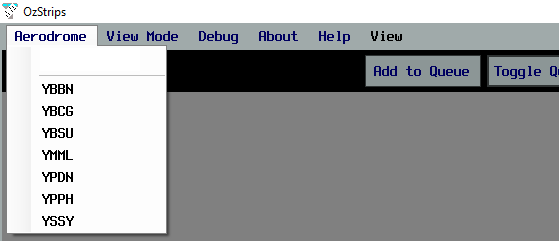
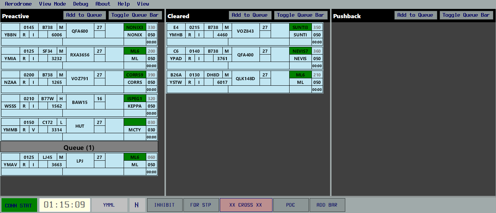
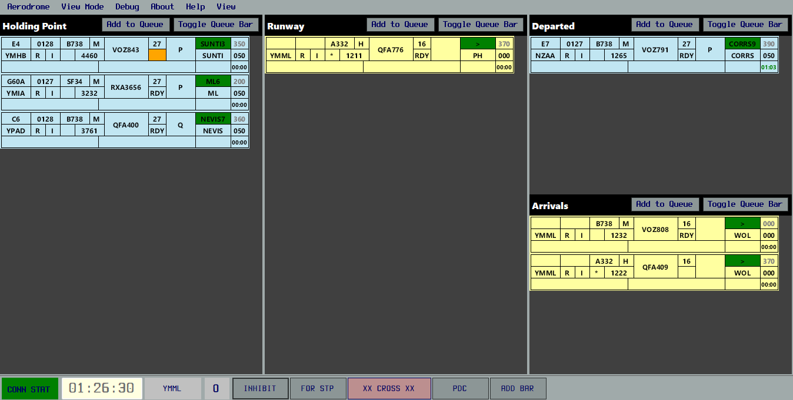

--8<-- "includes/abbreviations.md"

In the real world, aerodrome controllers use strips to provide a visual representation of aerodrome activity, beyond what looking out the window or at a radar screen can provide.

Within vatSys, this can be emulated using the [OzStrips plugin](https://maxrumsey.xyz/OzStrips/){target=new}. Strip state is shared between controllers operating at the same aerodrome.

## Setup
### Installation
The OzStrips plugin can be downloaded using the [vatSys Plugin Manager](https://github.com/badvectors/PluginManager){target=new}.  

If the client is installed correctly, there will be an *OzStrips* option in the Window dropdown menu.

<figure markdown>
{ width="700" }
</figure>

### Connecting
After logging onto the network, open the plugin from the dropdown menu, and select the desired aerodrome, or type the ICAO code into the text field.

<figure markdown>
{ width="500" }
</figure>

A connection attempt will be made and if successful, the *CONN STAT* field in the Control Bar will turn green.

### Configuring Views
Once connected to the relevant aerodrome, controllers should select the view mode which is most suitable for their position. Use the **View Mode** menu item to select a layout.

<figure markdown>
{ width="300" }
</figure>

The size of each strip can be adjusted using the **View** menu item. Users with limited screen realestate may benefit from using a smaller strip size.

<figure markdown>
{ width="300" }
</figure>

Finally, the plugin window will adjust to being resized, automatically collapsing into a two and single column layout, which is helpful for users with small screens.

## Stripboard
<figure markdown>
{ width="700" }
</figure>

The stripboard is divided into multiple bays, each representing a stage in an aircraft's flight thread.

Strips can be moved in between strip bays by clicking on their callsign, and clicking the bay where you want them to go, or by clicking on the green *SID Trigger*. A variety of keyboard shortcuts also exist.

Selecting a track on the Ground Radar or ASD will select the relevant strip in OzStrips, and vice versa.

!!! Note
    Strips can not be *SID triggered* from **Holding Point** to **Runway**, to prevent accidental placement onto the runway.

### Control Bar 
The bottom of the window holds the Control Bar. This panel contains the server connection status, aerodrome selected and ATIS code among other elements. 

Each button has the following function:

| Button | Function |
| ------ | -------- |
| **INHIBIT** | Removes a strip from the stripboard (used when a strip is no longer needed) |
| **FOR STP** | Creates a strip on the stripboard for the selected aircraft (vatSys FDR must be selected before pressing button) |
| **XX CROSS XX** | Adds a red highlight to the selected strip, denoting a clearance to cross a runway |
| **PDC** | Opens the default vatSys PDF editor |
| **ADD BAR** | Allows controllers to place a variety of fixed bars anywhere on the stripboard, reflecting status changes (e.g. autorelease cancellation or runway crossing) and allowing additional queues to be build (e.g. Sydney Coordinator functions) |

!!! Note
    PDCs through OzStrips are sent via Private Message. To send a PDC through [vatACARS](./cpdlc.md), you'll be required to dispatch it manually.

### Strips
The background colour of the strip corresponds to its status as an arrival or a departure. Departing aircraft have a blue strip, while arrivals have a yellow strip.

<figure markdown>
{ width="700" }
</figure>

| Number | Content | Action |
|---------|-------------|--------------|
| 1 | Bay Number | Change |
| 2 | Filed Off Blocks Time | Cock Strip |
| 3 | Aircraft Type | Open Flightplan |
| 4 | Destination | Open Flightplan |
| 5 | Route Indicator | Show Route |
| 6 | Flight Rules | |
| 7 | Correct SSR Code + Mode C Received | |
| 8 | SSR Code | Autogenerate Code |
| 9 | Wake Turbulence Category | |
| 10 | Callsign | Select Strip |
| 11 | Runway | Change |
| 12 | Holding Point / Clearance Limit | Change |
| 13 | SID | Move strip to next bay |
| 14 | First Waypoint | Open flightplan |
| 15 | Departure Heading | Change |
| 16 | Requested Level | Open flightplan |
| 17 | Cleared Level | Change |
| 18 | Takeoff Timer | Start / Reset |
| 19 | vatSys Global Ops Data | Change |
| 20 | OzStrips Remarks | Change |

## Recommended Workflow
Due to it's shared state, OzStrips works best if all controllers follow a standardised workflow. Controllers are highly encouraged to follow the workflow below.

### Delivery
Format the strip of recently connected aircraft so that you can identify any problems with their filed flight plan before they request clearance. 

#### Issuing Clearance
When an aircraft requests airways clearance, select the strip to avoid losing it from view, then deliver the clearance. Upon receiving a correct readback, enter the aircraft's parking bay in the Bay field, then move it to the **Cleared** bay.

If multiple aircraft request clearance at once, [queue](#queue-management) the strips for each aircraft, in the order in which they called.

<figure markdown>
{ width="800" }
    <figcaption>An example of the ACD layout and workflow</figcaption>
</figure>

#### Flight Plan Errors
OzStrips will flag any potentially invalid routes and incorrect hemispherical levels. Hover over a flag to learn more about the error.

<figure markdown>
{ width="600" }
    <figcaption>A potentially invalid level, shown by the red background on the CFL box</figcaption>
</figure>

Right mouse click on the yellow SID highlight to open the Reroute menu. From here, controllers can select a more compliant route. The [VATPAC Tools](https://vatpac.org/membership-hub/tools){target=new} page can be helpful to double check these routes.

<figure markdown>
{ width="600" }
    <figcaption>A potentially invalid route, shown by the yellow background on the SID box</figcaption>
</figure>

### Coordinator
- copy from SY ADC page

### Ground
- coord and flagging strip

<figure markdown>
{ width="800" }
    <figcaption>An example of the SMC layout and workflow</figcaption>
</figure>

### Tower
- takeoff timer when cleared for takeoff
- ready call for inbounders
- taking strip from runway to taxi for inbounders
- adjust order using arrow keys
- autorelease cancelled
- assigned heading

<figure markdown>
{ width="800" }
    <figcaption>An example of the ADC layout and workflow</figcaption>
</figure>

### Handling Multiple Positions
- add bars for positions
- add example screenshot at SY

<figure markdown>
{ width="800" }
    <figcaption>An example of the SMC layout with custom bars to differentiate between SMC positions</figcaption>
</figure>

## Workload Management
While the use of OzStrips can aid situational awareness, it is ideal to be used in such a manner that it doesn't negatively impact your productivity.

!!! Tip
    It is important that you communicate instructions concurrently while you move strips in OzStrips. Don't move strips before you do the action or obtain a readback, incase you get interrupted.

### Cocking Strips
Left clicking on the strip's EOBT will highlight and cock the strip, making it stand out. It is recommended to mark strips this way if there is an outstanding request.

### Queue Management
When multiple aircraft have outstanding requests, it is recommended you 'queue up' the strip, by placing it below the queue bar. This can be done quickly by selecting the strip then pressing "Add to Queue". Strips can be moved vertically by pressing the keyboard arrow keys while a strip is selected.

Aircraft at the bottom of the queue are first in line.

When an aircraft is in a queue, make sure the strip's bay location represents its current state. 

!!! Example
    An aircraft in a queue for an airways clearance, would remain in the *Preactive* bay, below the queue bar, not in the *Cleared* bay.