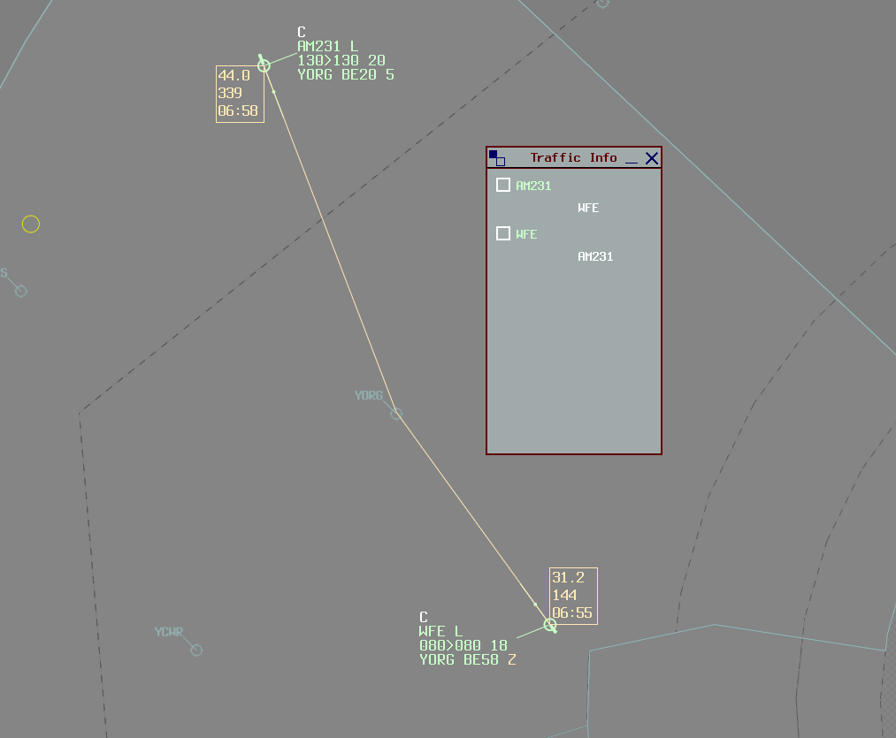
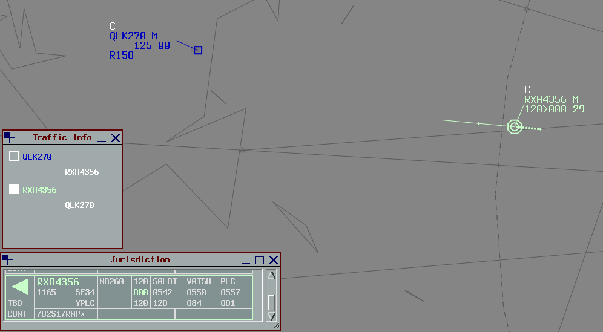
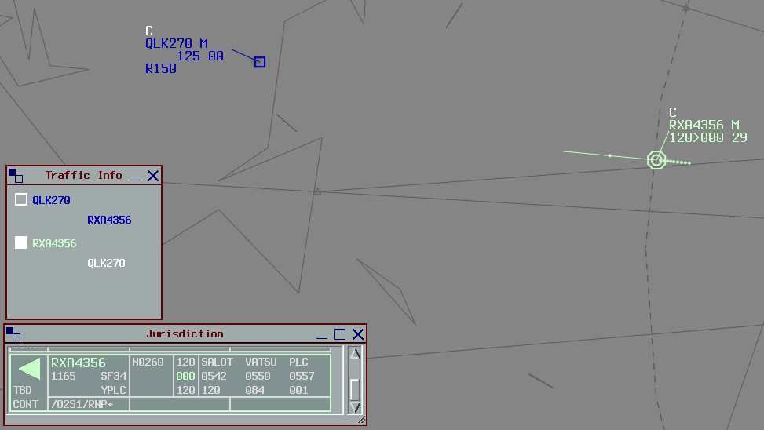
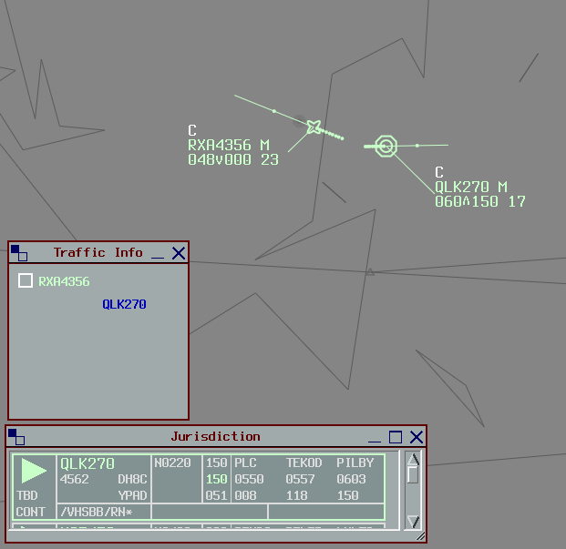

--8<-- "includes/abbreviations.md"

## Background
The Traffic Info plugin replicates the Eurocat window of the same name, which helps real world controllers manage the issuance of traffic information to pilots. Traffic pairings can be created between two or more aircraft, providing a place for controllers to record when traffic information is provided to each pilot.

The plugin is targeted towards Terminal and Enroute controllers.

<figure markdown>
{ width="700" }
</figure>

## Installation
The plugin is included by default in the Australia and Pacific vatSys profiles provided by VATPAC. No installation action is required from controllers.

!!! warning "Important"
    Controllers should not install the plugin manually when using the Australia or Pacific vatSys profiles, as doing so can create unstable plugin behaviour.

## Usage
Controllers should create a pairing between two aircraft requiring traffic information as early as possible. This can act as a visual cue to ensure that they don't forget to issue the traffic information to each pilot.

### Create a Pairing
With an aircraft selected, hold the `Create Pairing` keybind and select a second aircraft.

!!! tip
    The `Create Pairing` keybind is `F7` by default, but can be modified in the vatSys Keyboard Settings Window.

The Traffic Info window will open (if it isn't already) and the traffic pairing will be created. Each individual aircraft is listed, with each relevant aircraft nested below. The callsign of each primary aircraft is coloured depending on their FDR state and owner.

<figure markdown>
{ width="700" }
</figure>

<video style="max-width: 100%;" controls>
  <source src="https://private-user-images.githubusercontent.com/66302734/586813063-aa6c9e22-3839-4931-ae04-a11f1860b023.mp4?jwt=eyJ0eXAiOiJKV1QiLCJhbGciOiJIUzI1NiJ9.eyJpc3MiOiJnaXRodWIuY29tIiwiYXVkIjoicmF3LmdpdGh1YnVzZXJjb250ZW50LmNvbSIsImtleSI6ImtleTUiLCJleHAiOjE3ODEwNzUwOTEsIm5iZiI6MTc4MTA3NDc5MSwicGF0aCI6Ii82NjMwMjczNC81ODY4MTMwNjMtYWE2YzllMjItMzgzOS00OTMxLWFlMDQtYTExZjE4NjBiMDIzLm1wND9YLUFtei1BbGdvcml0aG09QVdTNC1ITUFDLVNIQTI1NiZYLUFtei1DcmVkZW50aWFsPUFLSUFWQ09EWUxTQTUzUFFLNFpBJTJGMjAyNjA2MTAlMkZ1cy1lYXN0LTElMkZzMyUyRmF3czRfcmVxdWVzdCZYLUFtei1EYXRlPTIwMjYwNjEwVDA2NTk1MVomWC1BbXotRXhwaXJlcz0zMDAmWC1BbXotU2lnbmF0dXJlPTA4MzQ4NzE4OGYxMjYxZTMwZjg2YjJkNWY2MWUxYWI0MWExYjRhYjgxYjExNGNjYjIxNmU3NTA1OTdlYmNlOGQmWC1BbXotU2lnbmVkSGVhZGVycz1ob3N0JnJlc3BvbnNlLWNvbnRlbnQtdHlwZT12aWRlbyUyRm1wNCJ9.zzy_PcXjC8Zdl_n5d0DG5OQIf_yxzis4IoRtM6PG-iY" type="video/mp4">
  Your browser does not support the video tag.
</video>

<figcaption style="text-align: center;">Workflow with the Traffic Info plugin</figcaption>

### Record Traffic Info
Once traffic information has been passed to a pilot, `left click` the nested callsign to change it from white to blue.

To mark traffic information as outstanding (not yet completed), `right click` the nested callsign to change it from blue to white.

<figure markdown>
{ width="700" }
    <figcaption>Traffic information on RXA4356 has been provided to QLK270 but the reciprocal information to RXA4356 is still outstanding.</figcaption>
</figure>

### Delete Aircraft
When traffic information is no longer required or relevant, remove the traffic pairing.

`Middle click` the indented aircraft to remove them from the window. Deleting an aircraft will **not** delete the reciprocal pairing (i.e. deleting DEF from ABC **will not** delete ABC from DEF).

<figure markdown>
{ width="600" }
</figure>