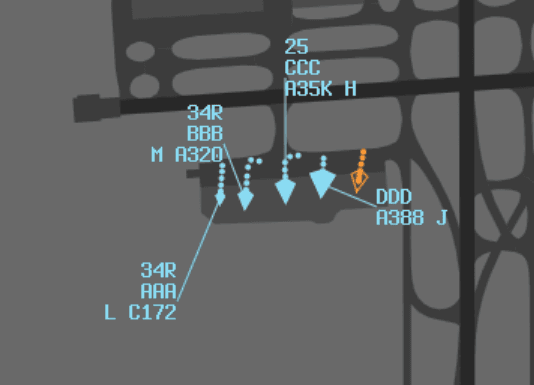
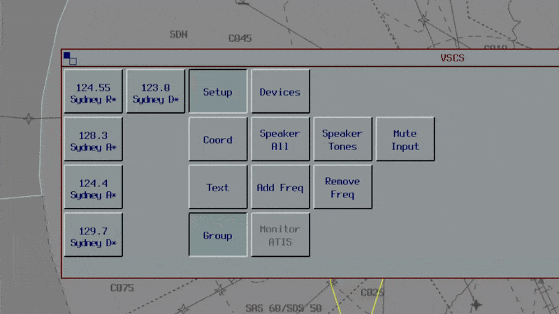

--8<-- "includes/abbreviations.md"

## Screen Setup
Although much of the detailed setup is up to personal preference, the following settings are **strongly** recommended to help best execute the appropriate role.

=== "Enroute"
	**Display**
	
	- ATC List: **ON**
	
	**Strip Setup**
	
	- Sort: **TIME**  
	- Strips: **STATE**
	
	**Windows displayed**
	
	- **JURISDICTION**
	- **PREACTIVE**  
	- **ANNOUNCED**  
	- **HANDOVER-IN**  
	- **ARRIVAL LIST** or **TFMS** (if airport is busy, eg during events)  
	- **All ATIS**es in your airspace  
	
	**Maps**
	
	- **Dynamic Infill**  
	- **AIRWAY_NOTES**
	- **ALL_CTA**  
	- ALL_POINTS_HIGH *(Optional)*  
	- **ALL_ROUTES_HIGH**  
	- **ALL_SECTORS**
	- CDO_MAP *(Optional)*  	
	- **COAST_ALL**  
	- **ENR_LL_LABELS**  
	- **UPPER_SECTOR_FREQS**  
	
	**Tools**
	
	- Velocity Vector: **2 MINS**  
	- Short Route Probe: **OFF** (Toggled on for non-identified tracks)  
	- History Trails: **9**  
	- FPASD: **ON**  
	- Extended Labels: **ON**  
	
	**Info**
	
	- **AREA QNH**  
	- **AIS DISPLAY** for major airports in your airspace

=== "TCU"
	**Display**
	
	- ATC List: **ON**
	
	**Strip Setup**
	
	- Sort: **TIME**  or **ALPHA** as preferred  
	- Strips: **BEACON**
	
	**Windows displayed** 
	
	- **ADEP (Towered airports in airspace)**  
	- **Other**  
	- **ARRIVAL LIST** or **TFMS**  
	- **All ATISes** in your airspace  
	
	**Maps**
	
	- **Dynamic Infill**  
	- **ALL_CTA**  
	- **ALL_SECTORS**  
	- **TMA_LL_LABELS**  
	- **UPPER_SECTOR_FREQS**  
	- *Local*
	    - **XX_COAST**  
     	- **XX_(RWY CONFIG)**  
	    - XX_(RWY CONFIG)_NAMES *(Optional)*  
	    - **XX_RTCC**  
	    - **XX_TCU**  
	
	**Tools**
	
	- Velocity Vector: **1 MIN**  
	- Short Route Probe: **OFF**  
	- History Trails: **5**  
	- FPASD: **ON**  
	- Extended Labels: **OFF** (Toggled on for aircraft not arriving at main airport) 
	
	**Info**
	
	- **AIS DISPLAY** for major airports in your airspace

=== "Tower"

	**Display**
	
	- ATC List: **ON**
	
	**Strip Setup**
	
	- Method: **OzStrips**  
	- View Mode: **As applicable to your current position**
	
	**Windows displayed**
	
	- **ARRIVAL LIST** (if airport is busy, eg during events)  
	- **ATIS**
	
	**Maps**
	
	- **Dynamic Infill**  
	- **ALL_CTA**  
	- **TMA_LL_LABELS** (if situated inside TCU, and if you own CTA steps)  
	- **ENR_LL_LABELS** (if not situated inside TCU)  
	
	- *Local Maps*
	    - **XX_COAST**  
	    - **XX_(RWY CONFIG)** (if applicable)  
	    - **XX_(RWY CONFIG)_NAMES** (if applicable)  
	    - **XX_TCU**  
	    - **XX_TCU_NAMES**  
	
	**Tools**
	
	- Velocity Vector: **1 MIN**  
	- Short Route Probe: **OFF** (Toggled on for non-identified tracks)  
	- History Trails: **5**  
	- FPASD: **ON**  
	- Extended Labels: **OFF** (Toggled on for aircraft not arriving at main airport)
	
## Ground Window
VATPAC has altered the vatSys Ground Window to use symbols which differ from those in the vatSys documentation, with the aim of providing controllers with clearer, more informative surface radar tags.

The assigned departure runway appears at the top of each aircraft's surface radar tag. All surface radar targets use an arrow head symbol to indicate aircraft direction. The symbol's size reflects the aircraft's wake turbulence category.

The target is either filled or hollow, depending on whether the aircraft is squawking Mode C.

| Symbol Type | Aircraft Transponder Mode |
|-------------|---------|
| **Filled arrow head** | Mode C |
| **Hollow arrow head** | Standby |

The colour of the target reflects whether the aircraft is an arrival or departure.

| Color | Meaning |
|-------|---------|
| **Blue** | Correlated departures |
| **Yellow** | Correlated arrivals |
| **Orange** | Uncorrelated tags |

<figure markdown>
{ width="450" }
</figure>

## Frequency Cross-Coupling
Cross-coupling allows controllers to simulataneously receive and transmit across multiple VHF frequencies. Cross-coupling can only be used in accordance with the [VATPAC Air Traffic Services Policy](https://vatpac-home.s3.ap-southeast-2.amazonaws.com/Air_Traffic_Services_Policy_9c2de1cc2a.pdf). 

### Enroute
Enroute controllers must cross-couple frequencies when offering [extended coverage](../controller-skills/extending/#frequency-management). This ensures that pilots will always remain in VHF coverage.

### TCU
TMA controllers are **always required** to cross-couple all non-standard TCU frequencies, excluding Sydney Director (SFW/SFE) and Brisbane Finals. This ensures TCU staffing changes do not invalidate previously-issued frequencies to pilots, avoids time-consuming frequency changes when a TMA controller logs on or off, and allows sector responsibilities to be easily delegated between multiple TMA controllers for workload management (e.g. delegating the Class G responsibilities of SRI to the least busy Sydney TMA controller).

The mandatory cross-couple frequencies will appear by default in the VSCS when connecting to a TCU position.

<figure markdown>
{ width="600" }
</figure>

When multiple TCU controllers are online, the ownership of these frequencies can be delegated as desired based on the traffic disposition, when agreed between the controllers, provided that all standard frequencies are covered.

!!! example
	During a busy event at Sydney, four TMA controllers delegated sector responsibilities as follows:

	- SY_APP is responsible for the SAS frequency
	- SY-N_APP is responsible for (and has cross-coupled) the SAN and SDN frequencies.
	- SY_DEP is responsible for (and has cross-coupled) the SDS and SRI frequencies.
	- SY-D_APP is responsible for the SFW frequency.

	All mandatory frequencies (SAS, SAN, SDS, SDN, and SRI) are open (plus the additional SFW frequency), and therefore this configuration is compliant.

!!! note
	Internal handoffs to a cross-coupled frequency (e.g. an instruction to "CONTACT ME XXX.XX") should not generally be conducted in the TMA. In other words, aircraft should not be instructed to contact the same controller on a new frequency, even if they enter an airspace sector covered by a different frequency.

    However, where a controller is temporarily covering another controller's frequency or it is anticipated that another TMA controller will shortly open an adjacent sector, internal handoffs should be conducted to prepare for the splitting of those frequencies.

#### Aerodrome to TCU Handoffs
ACD must ensure that the most appropriate departure frequency is issued based on the TCU controllers currently online. Each relevant aerodrome page includes a Departure Frequency table to help controllers achieve this.

!!! tip
    OzStrips [Autofill](./towerstrips.md#autofill) function will automatically set the most appropriate departure frequency in each aircraft's strip, based on their departure runway, direction of travel, and available online controllers.

#### Enroute to TCU Handoffs
Enroute controllers should hand inbound aircraft tags to the TMA controller responsible for the TMA sector the aircraft will enter (even if this is not their primary sector) and transfer the aircraft to that *sector's* frequency, if it is primed.

!!! example
    ARL and SAS are online. ARL would hand tags of aircraft inbound to YSSY to SAS and transfer them to the SAN frequency (124.4), if it is primed.

Enroute controllers can determine the correct TMA frequency using the Airspace Division maps in the SOPs or by referencing the runway mode map in vatSys.