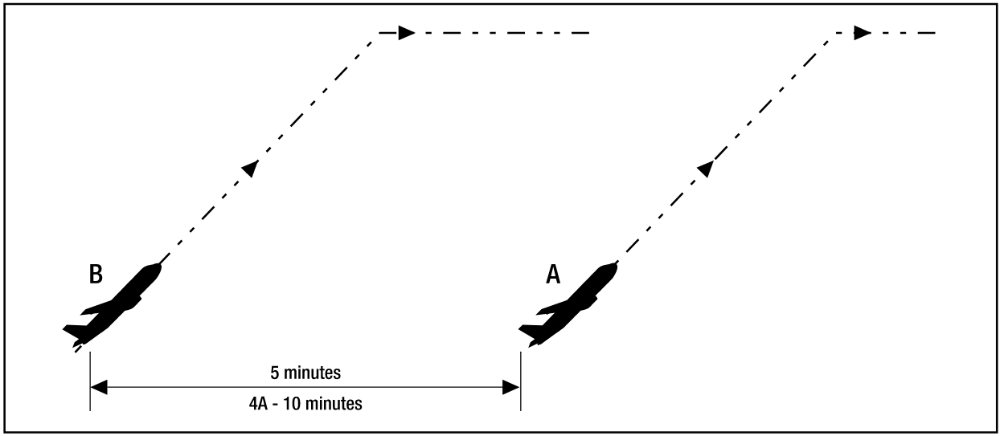
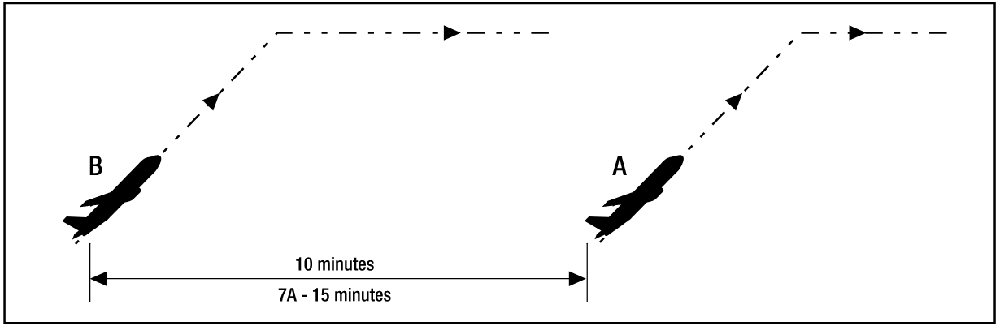
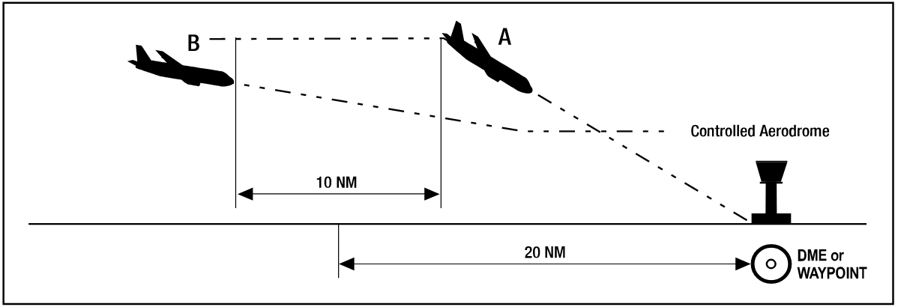
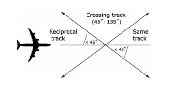
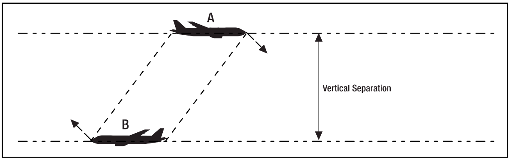
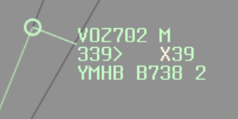
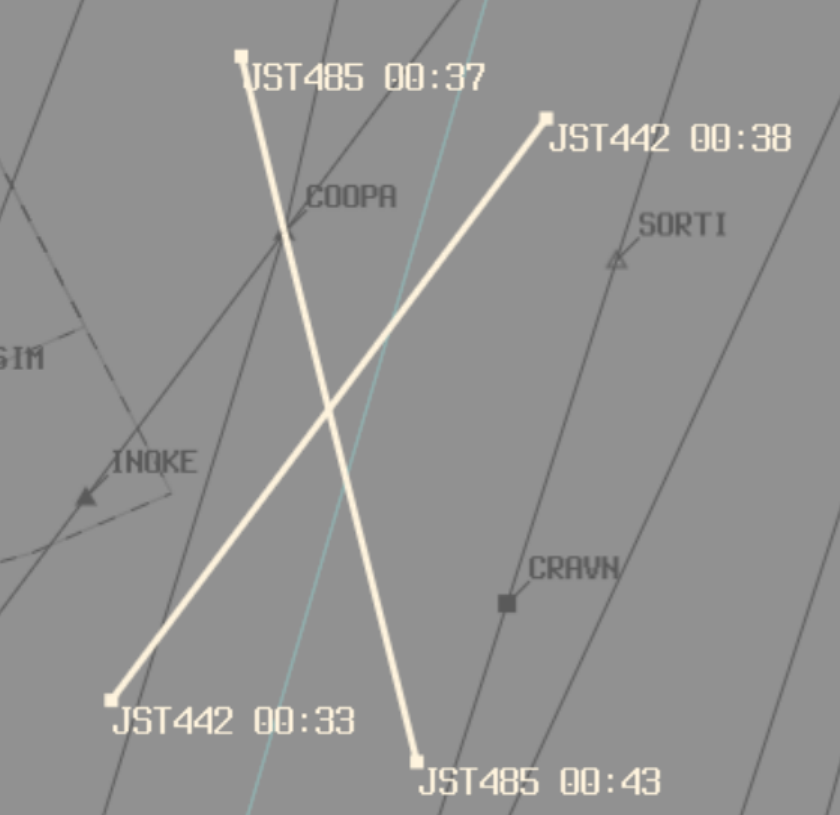

--8<-- "includes/abbreviations.md"

## Surveillance
### Enroute
**Lateral** - 5NM

**Vertical**

| Altitude/Flight Level | Separation standard |
| --------------------- | ------------------- |
| `SFC` - `F290` | `A010` |
| `F290` - `F410` | RVSM: `A010`, NON-RVSM: `A020` |
| `F410` - `F600` | `A020` |
| Supersonic Aircraft | `A030` |

### TCU

**Lateral** - 3NM

**Vertical** - `A010`

### Tower/Ground

#### Apron
ATC is not responsible for aircraft operations on aprons, parking areas or any other area that is outside the manoeuvring area. Therefore, contrary to popular belief, an ATC clearance is not required to operate in these areas. ATC helps by providing traffic information about other aircraft entering or leaving the same apron or parking area. `AIP ENR 1.1`

#### Manoevering Area
ATC responsibility for collision avoidance covers the parts of the aerodrome used for the take-off, landing and taxiing of aircraft, excluding aprons and parking areas. This is known as the manoeuvring area and is defined in `AIP GEN 2.2.`

On the manoeuvring area, it is a joint pilot-controller responsibility to avoid a collision. 

#### Runway Operations

Do not clear an aircraft for take off until the preceding departure is airborne and has:

- passed the upwind threshold of the runway;
- commenced a turn; 
- reached a point at least 1800M (6000FT) along the runway (subject to wake turbulence and enroute sequencing considerations).

Do not clear an aircraft for take off until the preceding arrival has vacated the runway and don't clear an aircraft to take off or land until a departing aircraft on the crossing runway has crossed the intersection, or an arriving aircraft has either crossed the intersection or landed and stopped short of the intersection.

#### 2400m Reduced Runway Separation Minima
The standard allows for two aircraft to occupy the runway at one time, provided the lead aircraft has a MTOW of 7,000KG or more, and environmental conditions support normal approaches, good visibility and good braking characteristics. The lead aircraft must remain in motion and vacate the runway without backtracking. The following aircraft may be any weight or category but wake turbulence separation must still be applied between the aircraft. Traffic information will be provided to the following aircraft, for example: `VOZ123 TRAFFIC IS AN A330 ON THE RUNWAY VACATING (TWY), RWY 03 CLEARED TO LAND`.

Other than traffic information and/or ATC direction to vacate, there will be no indication to the pilot whether the 2,400M runway standard is in use. ATC will advise if a roll-through is available, pilots should not request it unless operationally required. If the aircraft is not directed to roll-through, aircraft should expect to vacate the runway via the exit taxiways specified in Aerodrome DAP Airport Efficiency Procedures to ensure minimum runway occupancy time and support optimum spacing on final.

### Wake Turbulence

#### Distance-based Wake Turbulence

| Lead Aircraft | Following Aircraft | Distance (NM) |
| ------------- | ------------------ | ------------- |
| Super (A380) | Super | - | 
|  | Heavy | 6 |
|  | Medium | 7 |
|  | Light | 8 |
| Heavy | Heavy | 4 |
|  | Medium | 5 |
|  | Light | 6 |
| Medium | Heavy | - |
|  | Medium | - |
|  | Light | 5 |

#### Time-based Wake Turbulence

| Lead Aircraft | Following Aircraft | Time (min) |
| ------------- | ------------------ | ---------- |
| Super (A380) | Super | - | 
|  | Heavy | 2 |
|  | Medium | 3 |
|  | Light | 3 |
| Heavy | Heavy | - |
|  | Medium | 2 |
|  | Light | 2 |
| Medium | Heavy | - |
|  | Medium | - |
|  | Light | 2 |

## Visual
### ATC Responsibility
With sufficient visibility and an adequately high cloud base, controllers may visually separate two aircraft by visually acquiring and identifying them both, and determining that their projected flight paths do not conflict.  

Controllers can utilise visual separation by using Tower View linked to a flight simulator or simulating pseudo-visual separation through vatSys.  It is generally practical within about **5nm** of the aerodrome.  

This technique is useful for situations such as:<ul><li>Procedural towers processing aircraft at altitudes below usable surveillance</li><li>Making more efficient use of runways at major aerodromes by allowing departures to roll with aircraft on final</li><li>Processing VFR aircraft arriving or departing during a busy established sequence (e.g. helicopter operations at Sydney)</li></ul>
### Pilot Responsibility
Pilots can be instructed to maintain own separation with other aircraft provided:  
a) Both aircraft are operated at or below `A100`, and  
b) One pilot reports the other aircraft in sight.  

Pilots will continue to follow ATC instructions but the controller will no longer be responsible for maintaining a separation standard between the two aircraft.  If the pilot loses sight of the aircraft, an alternative separation standard will need to be used.  

Where an aircraft is instructed to maintain own separation with an IFR aircraft, traffic information should be passed to the IFR aircraft, including advice of assignment of separation responsibility to the other aircraft. 

This technique is useful for situations such as:<ul><li>VFR aircraft manoeuvring behind another aircraft on approach to land (e.g. helicopter operations at Sydney)</li><li>Allowing aircraft to conduct airwork in a position which would normally conflict with other aircraft</li><li>Providing track shortening or expedited clearances where a delay would normally occur due to other aircraft</li></ul>

!!! example
    *RSCU203 is a VFR helicopter who wishes to depart from Royal Prince Alfred Hospital, which sits directly under the YSSY RWY 16L approach path.*  
    **SY ADC:** "RSCU203, report sighting a Jetstar A320 on a 6nm final RWY 16L"  
    **RSCU203:** "Traffic sighted, RSCU203"  
    **SY ADC:** "RSCU203, maintain own separation with that aircraft, report airborne"  

    **SY ADC:** "JST219, traffic is a helicopter becoming airborne from RPA, approximately 4nm final, maintaining own separation with you, runway 16L, cleared to land"

## Procedural
### Departures
#### 5 min
| Conditions | |
| ------------- | ------------------ |
| a) Both aircraft report reaching the cruising level; b) If the following aircraft reaches that level first, apply another form of separation immediately; and c) CLIAS and cruising IAS of the following aircraft is at least 10 kt slower and not more than 90% of the CLIAS and cruising IAS or Mach number of the leading aircraft. | <figure markdown>
{ width="600" }
</figure> |

#### 10 min
| Conditions | |
| ------------- | ------------------ |
| a) Both aircraft report reaching the cruising level; b) If the following aircraft reaches cruising level first, apply another form of separation immediately; and c) CLIAS of the following aircraft is less than or equal to the CLIAS of the leading aircraft. | <figure markdown>
{ width="600" }
</figure> |

### Arrivals
#### 10nm
| Conditions | |
| ------------- | ------------------ |
| a) Both aircraft are inbound and the leading aircraft is within 20 NM of a controlled aerodrome with DME or a published waypoint; and b) The aircraft are assigned vertically separated levels. | <figure markdown>
{ width="600" }
</figure> |

### Longitudinal

<figure markdown>

</figure>

Longitudinal separation shall only be applied between aircraft on same or reciprocal tracks.

Longitudinal time separation must be established by using pilot estimates and ensuring that the time between two aircraft is equal or greater than the longitudinal time separation minimum.  

!!! Example
    "ABC, Cross ALPHA at time 1051 or later"  
    "DEF, Hold at BRAVO to leave BRAVO at time 2215 or later"

#### Time
##### Same Track
Aircraft that are on the same track, including situations where one aircraft is climbing or descending through the level of another, are to be separated by **10 minutes**
<figure markdown>

</figure>

##### Reciprocal Track
Aircraft flying on reciprocal tracks may only be separated vertically. Such separation must exist **at least 10 minutes** prior to the estimated time of passing
<figure markdown>

</figure>

After the estimated time of passing, aircraft may not climb or descend through the level of the opposite direction aircraft until **10 minutes** after the estimated time of passing. It is possible to reduce this requirement if definite passing has been achieved, and this will be explained later in this section.

#### Distance
##### Distance Reports
The lead aircraft must be tracking directly to/from the aid. Always ask the lead aircraft for their distance report prior to the following aircraft.  

Distance checks must be conducted as per the following table:

| If | Conduct Distance checks at intervals of not less than |
| ------------- | ------------------ |
| No speed control has been applied | 15 mins |
| Speed control has been applied to limit closing to less than or equal to 35kts or Mach 0.06 | 15 mins |
| There is closing of more than 35kts or Mach 0.06 | The standard is not valid |
| Speed control has been applied to have opening or stable distance | 30 mins |

##### Same track
###### 20nm
| Conditions | |
| ------------- | ------------------ |
| | <figure markdown>
{ width="600" }
</figure> |

##### Reciprocal track
###### 5nm Definite Passing
| Conditions | |
| ------------- | ------------------ |
| Reports indicate that the aircraft have passed and the distance is opening | <figure markdown>
{ width="600" }
</figure> |

###### Sight and Pass
| Conditions | |
| ------------- | ------------------ |
| a) Both aircraft report sighting and passing the other by day (and in Oceanic airspace by night); b) Both aircraft are above A100; and c) You ensure there is no possibility of incorrect identification by either aircraft. | <figure markdown>
{ width="600" }
</figure> |

###### Opposite sides of visual fix
| Conditions | |
| ------------- | ------------------ |
| a) Both aircraft report passing the same visual fix; and b) The visual fix must be a prominent topographical feature within 10,000 FT of the levels of each aircraft | <figure markdown>
{ width="600" }
</figure> |

### Lateral

#### Time-based crossing track
Aircraft that are on crossing tracks, including situations where one aircraft is climbing or descending through the level of another, are to be separated by **15 minutes** at the point of intersection
<figure markdown>

</figure>

Where a difference 15 minutes does not exist at the crossing point, vertical separation shall be applied from the time at which the second aircraft is 15 minutes from the crossing point until the first aircraft is 15 minutes past the crossing point.
<figure markdown>

</figure>

#### Conflict Area

The Quickest and easiest way to assess lateral conflict scenarios is with the *Conflict Area tool*. Unfortunately, whilst its quick and easy to *use*, it's fairly complex and long to understand the rules and concepts.  
The first thing to note, is that there are many different unusual remarks and equipment codes that pilots file on VATSIM, primarily because not everyone knows what they mean. A little bit of background knowledge is required to understand these concepts.

##### NAVCAPs
All aircraft have a NAVCAP, associated with a ***Circular Error of Position***. This determines which number to select when using the Conflict Area Tool:

| NAVCAP Code | Meaning | Cicular Error of Position (CEP) |
| ---- | ----------- | -------- |
| A | All | 7nm |
| 2 | RNP2 | 7nm |
| 4 | RNP4 | 14nm |
| 5 | RNAV5 | 14nm |
| T | RNAV10 | 14nm |
| Z | None | 30nm |

<figure markdown>
{ width="300" }
  <figcaption>NAVCAP Z Example</figcaption>
</figure>

<figure markdown>
{ width="300" }
  <figcaption>NAVCAP 2 Example</figcaption>
</figure>

The minimum number you must select when using the tool, is equal to: **Aircraft 1 CEP + Aircraft 2 CEP + 1nm**

!!! example
    Aircraft 1 NAVCAP: 4  
    Aircraft 2 NAVCAP: Z  
    14+30+1=**45**  

!!! example
    Aircraft 1 NAVCAP: 2  
    Aircraft 2 NAVCAP: A  
    7+7+1=**15**  

!!! tip
    The best scenario is to have 2 aircraft that are RNP2 approved. "Feed the beast" in order to get what you want, that is to say "QFA12, confirm you are RNP2 approved?", and they'll probably say yes. Enter `NAV/RNP2` in the flight plan remarks, and you can use a 7nm CEP.

##### Working with Conflict Area

<figure markdown>
{ width="300" }
  <figcaption>Conflict Area Example 1</figcaption>
</figure>

Once you've established the Conflict area, you now know the area in which the aircraft are in **lateral conflict**. You can now either separate from the conflict area using a Time Standard, or a Distance Standard:  
**Time standard** (**5 minutes** prior to time shown at entry, or **5 minutes** after time shown at exit); or  
**Distance standard** (Use BRL to measure a distance to/from a waypoint that is outside of the conflict area, and use it to implement a vertical standard after exiting, or prior to entering the lateral conflict area)

##### Time Standard (5 in, 5 out)

Using the time standard, aircraft are considered to have entered the conflict area **5 minutes prior** to the estimate shown, and to have left the conflict area **5 minutes after** the estimate shown.

<figure markdown>
{ width="600" }
<figcaption>Conflict Area Example 2</figcaption>
</figure>

!!! example
    JST801 estimate for entering conflict area: **0250**  
    JST801 **enters lateral conflict** 0250-5: **0245**  
    JST801 estimate for leaving conflict area: **0257**  
    JST801 **leaves lateral conflict** 0257+5: **0302**  
    JST801 is considered to be **in the conflict area** from time **0245** until time **0302**  
    SIA7286 estimate for entering conflict area: **0230**  
    SIA7286 **enters lateral conflict** 0230-5: **0225**  
    SIA7286 estimate for leaving conflict area: **0238**  
    SIA7286 **leaves lateral conflict** 0238+5: **0243**  
    SIA7286 is considered to be **in the conflict area** from time **0225** until time **0243**  
    SIA7286 **leaves lateral conflict** prior to the time that JST801 **enters lateral conflict**. Therefore, the 2 aircraft are **not** in lateral conflict

When aircraft **are** in lateral conflict, a vertical standard must be applied for that period.

!!! example
    "Climb to reach (vertically separated level) by (prior to entering lateral conflict)"  
    "Expect requested level at (time aircraft leaves lateral conflict)"  

##### Distance Standard
Use BRL to measure a distance to/from a waypoint that is outside of the conflict area, and use it to implement a vertical standard after exiting, or prior to entering the lateral conflict area

!!! example
    "Climb to reach (vertically separated level) by (GNSS distance outside entry of conflict area)"  
    "Report (GNSS distance outside exit of conflict area) for requested level"  

#### Lat Sep Table

Lateral Separation works off the basis off establishing a *Lateral Separation Point* (Lat Sep point). That is, when given an angle that 2 tracks intersect at, a distance at which lateral separation is considered to exist procedurally. These figures are detailed in the table below:

| Tracks intersecting at | Lat Sep point |
| ------------- | ------------------ |
| 0°-15° | No lateral separation |
| 16°-44° | 11nm |
| 44°-135° | 8nm |
| 136°-180° | No lateral separation |

In a more visual form, ABC can be considered to be laterally separated from aircraft in the green areas, and not laterally separated from aircraft in the red areas. This only applies to intersecting angles **at the crossing point**, and both aircraft tracking directly to/from the crossing point.

<figure markdown>
{ width="700" }
  <figcaption>Lateral Separation Diagram</figcaption>
</figure>

This can be used to plan restrictions as required when surveillance coverage cannot be assured.
### Vertical

Vertical separation is the most common form of separation that is employed within oceanic airspace, as a controller can have two aircraft flying at vertically separated levels with no risk of a loss of separation until one needs to climb or descend.

The primary source of aircraft altitudes and levels shall be pilot reports. 

!!! Note
    You cannot clear an aircraft to climb/descend into levels that were previously occupied by another aircraft until that aircraft reports clear of the levels in question.

| Altitude/Flight Level | Separation standard |
| --------------------- | ------------------- |
| **BLW FL290** | 1000FT |
| **FL290 - FL410** | RVSM: 1000FT, NON-RVSM: 2000FT |
| **FL410 - FL600** | 2000FT | 
| Supersonic Aircraft | 3000FT |

!!! Note
    RVSM airspace exists between FL290 and FL410

