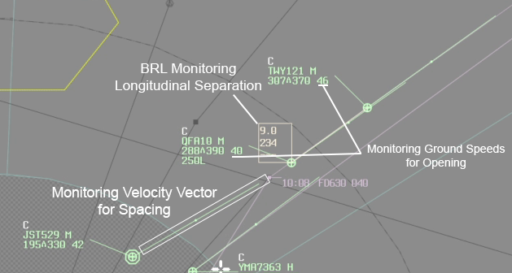

--8<-- "includes/abbreviations.md"

## Separation Assurance

Colloquially, separation assurance could be described as: if you turn away from the screen for 5 minutes, no standard could possibly be infringed. Officially, `MATS 10.1.1.1.1` defines Separation assurance as:  

*(Assuring) separation through the process of assessing traffic, identifying conflicts, planning to ensure separation, executing the plan and monitoring the situation to ensure the standard is not infringed*.  

Here are some techniques to help aid with each of those elements.

### Assessing traffic and Identifying conflicts

There are 3 different ways aircraft could be in conflict;

**Laterally** - Tracks intersecting at more than 45°, but less than 135°, and the aircraft come within 5nm of each other.  
**Longitudinally** - Tracks intersecting at less than 45°, either as a faster following, or opposite direction scenario.  
**Vertically** - Aircraft assigned the same level, or assigned climb/descend through the other aircraft's level(s).  

### Planning to ensure separation
This is where you decide the method for separation assurance. Are you going to implement a restriction to reach a certain altitude by a certain point? Are you going to place a BRL between the aircraft to monitor closing speed? Are you going to anchor a BRL at the point where lateral conflict is infringed, to monitor the aircraft vertically clear? Are you going to give one aircraft a vector to keep clear? There are several different ways to approach resolving these conflicts, so choose the one that best suits the situation, and that you are comfortable with.

### Execute the plan and Monitor the situation

Executing the plan may involve passing instructions to pilots, coordinating with other controllers, and using system tools (eg BRL, Closest Approach), as neccessary. Monitoring the situation is all about using the system tools to your advantage, some examples include:

1) After passing a speed restriction to an aircraft to slow down, watching to make sure the GS has reduced.  
2) Anchoring a BRL between 2 aircraft to see if the distance between is opening or closing.  
3) Using a BRL and velocity vectors to measure distances between conflicts in 1 min, 2 mins, 3 mins, so on.  

<figure markdown>
{ width="700" }
  <figcaption>Monitoring Tools</figcaption>
</figure>

The BRL Tool has many uses, and is critical to the act of separation assurance.

## Sequencing

It's all well and good maintaining separation standards in your airspace, but if you handoff 2 aircraft to ML_APP overhead LIZZI at the same speed, 1000ft apart, you're not going to make any friends. By default, aircraft must be sequenced **2 minutes** apart at the **Feeder Fix** (ie, the first waypoint of the STAR).  

It's important to remember that aircraft aren't just arriving from your sector, they can be coming in from all directions at similar times. **Maestro** is a tool used to help aid with Sequencing, and you can find more info at https://maestro.vatpac.org/about (link)

In real life, controllers have the luxury of putting a fair bit of the onus of forming the sequence on the pilots, by issuing instructions like *"Adjust speed to cross RIVET at time 52 at 250kts in to published speeds"*. On VATSIM, every pilot may be using a different clock, potentially even different weather, and the pilot may simply not be proficient enough to meet a FF time. As such, all sequencing is best left in the hands of you, the controller.

There are 3 ways to control the sequence:

### Speed Control
Speed Control is simply slowing aircraft down and speeding aircraft up as required. As a general rule of thumb, Speed Control is most useful to achieve anywhere between a 1 minute expedition, to a 2 minute delay (depending on how far out from the FF). Some handy indicators to put in the aircraft's label whilst doing speed control are:  
**.78** - Aircraft report - Mach .78  
**M78** - Controller instruction - Maintain Mach .78  
**M78G** - Controller instruction - Maintain Mach .78 or Greater  
**M78L** - Controller instruction - Maintain Mach .78 or Less  
**S260** - Aircraft report - 260kts Indicated  
**260** - Controller instruction - Maintain 260kts Indicated  
**260G** - Controller instruction - Maintain 260kts Indicated or Greater  
**260L** - Controller instruction - Maintain 260kts Indicated or Less  
**MIN** - Controller instruction - Reduce to Minimum Speed  
**MX** - Controller instruction - Increase to Maximum Speed  

### Vectoring
Vectoring aircraft is best to achieve anywhere between a 2 minute and a 6 minute delay (again, depending on how far out from the FF). Vectoring aircraft for sequencing involves pointing aircraft away from their route (somewhere between 30° and 60°) for as long as necessary to achieve the delay. Whilst vectoring, you can anchor a BRL between the aircraft and the Feeder Fix to monitor how much time needs to be lost, then turn the aircraft back on route once the required delay has been achieved.

!!! note
    The times shown at waypoints when displaying an aircraft's route are not completely accurate. They are calculated based on a combination of the aircraft's ***planned TAS, Forecast GRIB winds, and estimated climb/descent profiles***. Times shown on the BRL anchored from an aircraft to a waypoint are based on the aircraft's ***current ground speed***. As a general rule of thumb, a jet aircraft will tend to add approximately 1-2 minutes to a BRL time on descent. A propeller aircraft will not add any time on descent. Both the route time and the BRL time can provide situational awareness and more info, but use whatever is appropriate for the situation.

!!! tip
    In practice, vectoring for sequencing is done a lot simply by feel. Once magnetic variation, winds, changes in aircraft speeds, rate of turns, etc, are factored in, there's a lot of variability to worry about. It can be a bit like making pancakes, the first one's always a bit screwed up... But it'll give you a good idea of the effect of winds, changes in times, and other aforementioned factors.

### Holding
Holding is the final delaying action, useful for when a delay of 6 minutes or more is required. Published Holds exist on common useful holding fixes all around Australia, usually either at the Feeder Fix, or a waypoint before the Feeder Fix. Locations of Published Holds can be found on ERC Charts.

!!! example
    **YWE:** "BNZ135, Showing an 8 minute delay at ARBEY. Fly published hold at APPLE, when ready, descend to reach F250 by APPLE."  
    **BNZ135:** "Fly Published hold at APPLE, when ready, descend to reach F250 by APPLE, BNZ135"  
    ...  
    **YWE:** "BNZ135, Cancel hold, cleared APPLE, ARBEY, to rejoin the STAR, when ready, descend via STAR to A090, QNH 1013"  
    **BNZ135:** "Cancel hold, cleared APPLE, ARBEY, to rejoin the STAR, when ready, descend via STAR to A090, QNH 1013, BNZ135" 

Using standard `AIP GEN 3.4` phraseology *"Hold at (waypoint)"*, lends itself to pilots unfamiliar with the published hold procedures being less likely to speak up, and more likely to just do whatever they want. This is why it is preferred that instead, the phrase *"Fly published hold at (waypoint)"* is used, to give the pilot a chance to let the controller know that they're not sure what the instruction means. In this instance, and if you need to hold at a non-published point, Utilise the full `AIP GEN 3.4` hold phraseology:

!!! example
    **ELW:** "VOZ888, Showing a 7 minute delay at LIZZI. Hold at NABBA, Inbound track 224 degrees, Left hand pattern, Outbound time 2 minutes. When ready, descend to reach F250 by NABBA."  
    **VOZ888:** "Hold at NABBA, Inbound track 224 degrees, Left hand pattern, Outbound time 2 minutes. When ready, descend to reach F250 by NABBA, VOZ888"  
    ...  
    **ELW:** "VOZ888, Cancel hold, cleared NABBA, BULLA, TAREX, LIZZI, to rejoin the STAR, when ready, maintain F250"  
    **VOZ888:** "Cancel hold, cleared NABBA, BULLA, TAREX, LIZZI, to rejoin the STAR, when ready, maintain F250, VOZ888" 

## Level Check

Unless a level has been "locked in" for an aircraft entering your airspace, either from being inside a change parameter, receiving heads-up coordination, or being a standard assignable level, their CFL cannot be used for separation purposes. Certain aircraft may require additional time to plan restrictions, identify conflicts, etc (For example, as **ELW**, an aircraft cutting across the YMML departure/arrival path at F230), and this is where a **level check** may be useful. If you want to "lock in" a level for an aircraft coming from an adjacent sector, use the following phraseology:

!!! example
    **ELW** -> **YWE**: "Level Check, VOZ456, F360"  
    **YWE** -> **ELW**: "VOZ456, F360"  

Any changes to VOZ456's level would now need to be coordinated by YWE, so no surprises!

Level checks are also useful for when you have identified a conflict, and you need to assign a different level to the one currently assigned by the controlling sector in order to assure separation.

!!! example
    **BIK** -> **SDS**: "Level Check, JST123, Assigned F200 due crossing traffic"  
    **SDS** -> **BIK**: "JST123, F200"  

When using the level check technique, bear in mind the sector that you're coordinating with may have no idea what a Level Check is. Use plain english as required to get the message across (and be nice 😊).
## Level Management
When issuing a climb or descent instruction, as yourself, what altitude/level can assign which results in the smallest number of transmissions.

A common habit is to see controllers clearing aircraft "when ready" to FL250 on descent, despite there being no reason to do so. If there is no traffic restrictions and CTA LL permits, descent the aircraft to the CTA LL.

!!! Example
    VOZ888 is tracking from Sydney to Melbourne via the Q29 airway to LIZZI for the LIZZI8A arrival runway 34.

    "VOZ888, when ready, descend via the STAR to A090, QNH 1009."

!!! note
    An appropriate time to assign F250 for descent would be, for example, an aircraft tracking on the Y59 airway to YSSY, when CB_APP is online (since they own the CB TMA up to F245). In this example, you would not assign lower than F250 until the aircraft is 2.5nm clear of the CB TMA.  
    Do not assign levels through another sector's airspace without coordination, even if it would take a 20,000ft/min descent rate to clip the airspace! Either wait until the aircraft is 2.5nm clear, or coordinate with the sector.

Use "descend via STAR" phraseology when CTA protection is in place, through the use of height requirements on the STAR.

!!! Example
    RXA4652 is tracking via ODALE for the ODALE7 STAR to runway 34R. CTA LL is 8000FT, but the STAR has built-in CTA protection (8000FT ABOVE at KABLO)

    "RXZ4652, Sydney Approach, runway 34R, descend via the STAR to 6000FT"