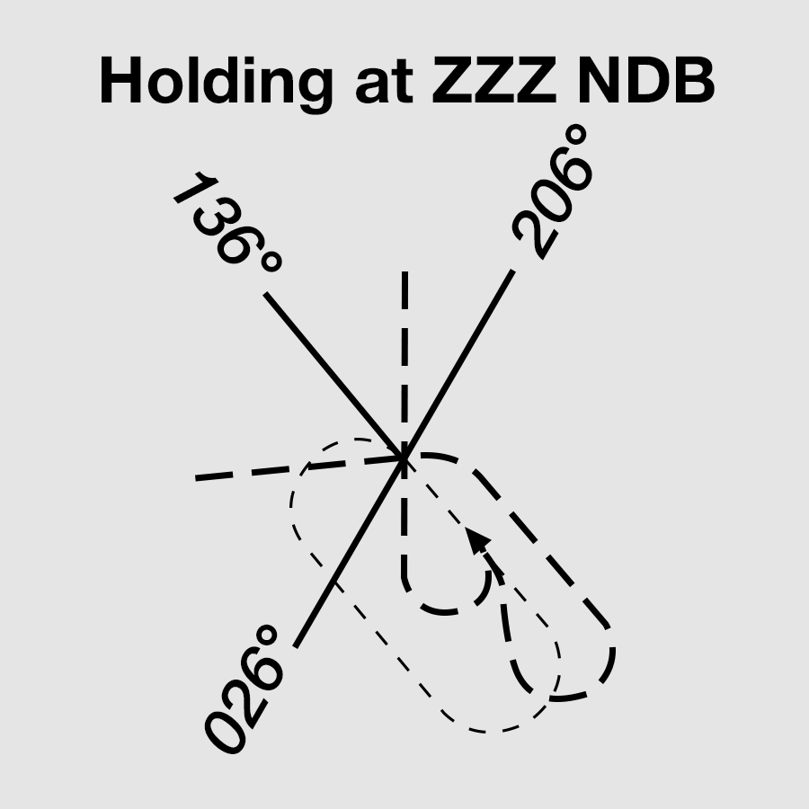
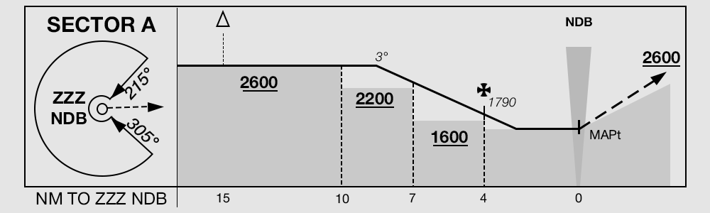
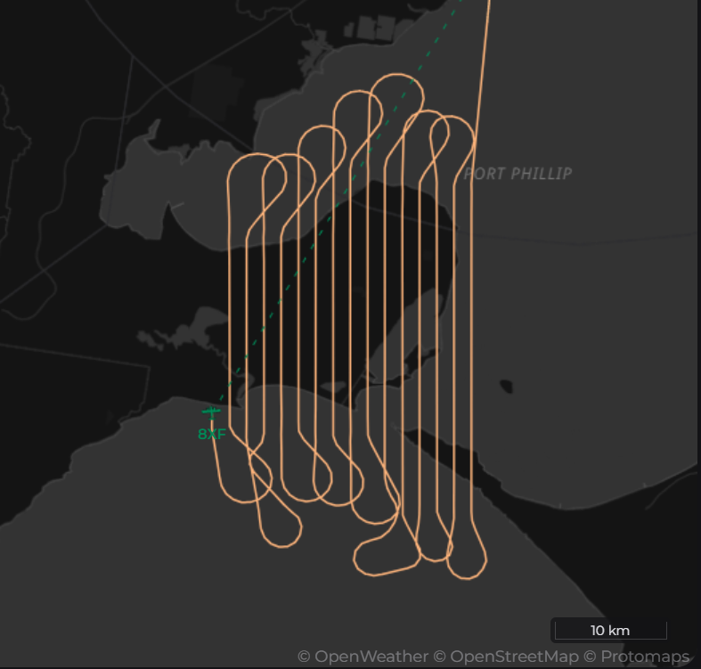
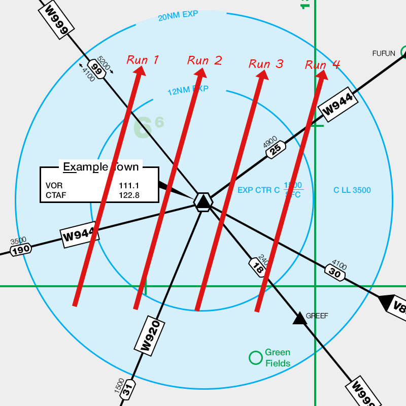
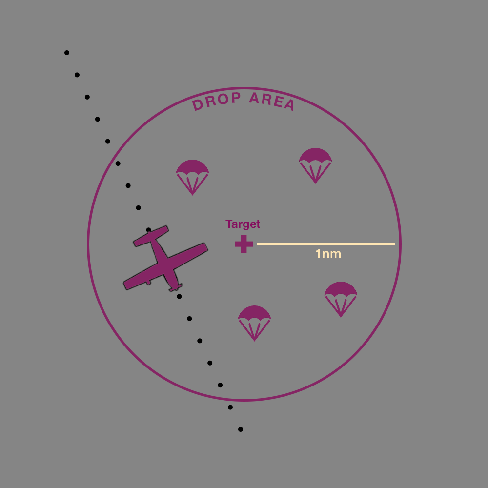
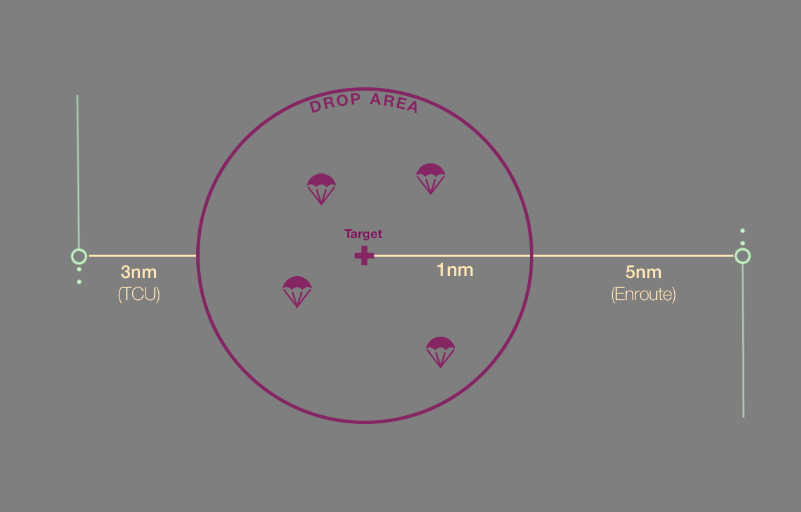

--8<-- "includes/abbreviations.md"

Not all flights online consist of an aircraft flying between airports. **Airwork** refers to any aerial operation that doesn't involve simply going from A to B. Providing control services to aircraft performing airwork requires specific skills and procedures, but offers a unique and rewarding experience for both pilots and controllers.

!!! warning
	Certain types of airwork, including search and rescue, firefighting, and other emergency operations are restricted under the [VATSIM Code of Conduct](https://vatsim.net/docs/policy/code-of-conduct){target=new}. See [Military and Special Operations](../miitary) for more information.

## Area of Operation
Airwork must be conducted within a defined **area of operation**. This is genenerally nominated by the pilot when first passing airwork details, but can be adjusted or alternately defined by the controller when necessary. An area of operation should be defined with both **lateral** and **vertical** limits.

!!! example
    Lateral limits can be defined in a number of ways, most commonly:
    
    - Radius from a fix, navaid, coordinate, or aerodrome. (e.g. *within a 20nm radius of KII*)
    - a [SUA] Area. (e.g. *within the D205 danger area*)
    - a polygon defined by a set of fixes, navaids, or coordinates. (e.g. *within an area between HID VOR-ZIN-YSII-1000S14200E*)
    - a visual topographical feature (e.g. *within Lake Eyre*)

### Uncontrolled Airspace
IFR Aircraft, and VFR aircraft receiving an identification service must the controller of their intentions prior to commencing airwork.

!!! phraseology
    *PPB is an IFR aircraft intending to perform a series of practice approaches at YPKU - an uncontrolled aerodrome*
    **PPB**: "PPB, with airwork details"  
    **KIY**: "PPB"  
    **PPB**: "PPB, will be conducting airwork within a 20nm radius of YPKU, not above A040, ops normal time 50."  
    **KIY**: "PPB, no reported IFR traffic"  
    **PPB**: "PPB"

### Controlled Airspace
Aircraft must obtain clearance to perform airwork within CTA, even when airwork details are included in their flightplan. Clearances must include **lateral** and **vertical** restrictions.

!!! phraseology
    *A2B is an IFR aircraft intending to perform airwork within 10nm of WG VOR, A090-A100.*
    **A2B**: "A2B, with airwork details"  
    **BLA**: "A2B"  
    **A2B**: "A2B, request airwork within a 10nm radius of WG, between `A090` and `F130`, for the next 15 minutes."  
    **BLA**: "A2B, cleared to operate within a 10nm radius of WG, `A090` to `F130`."  
    **A2B**: "Cleared to operate within a 10nm of WG, `A090` to `F130`, A2B"
    
!!! tip
    Before providing a clearance to perform airwork to an aircraft, it is good practice to take extra time to assess to potential for conflicts, and determine if any coordination is required with adjacent positions.

#### Partially Controlled Airspace
Aircraft should only receive clearance to perform airwork within CTA. When an aircraft requests clearance to perform airwork in an area partially CTA and OCTA, controllers should provide clearance **only** for the controlled portion of the airspace, and provide traffic information for the uncontrolled portion.

!!! phraseology
    *MDIA403 is an IFR helicopter intending to perform airwork within 4nm of DRLD, `SFC` to `A050`; CTA exists above `A035`.*
    **MDIA403**: "MDIA403, with airwork details"  
    **BDN**: "MDIA403"  
    **MDIA403**: "MDIA403, request airwork within a 4nm radius of DRLD, not above `A050`, for the next 30 minutes, ops normal time 45."  
    **BDN**: "MDIA403, cleared to operate within a 4nm radius of DRLD, between `A035` and `A050`, no reported IFR traffic"  
    **MDIA403**: "Cleared to operate within a 4nm radius of DRLD, `A035` to `A050`, copy traffic, MDIA403"

### Ops Normal
If an aircraft is to be conducting airwork that does not require them to talk to ATC for an extended period (30 mins or more), an "operations normal" time should be agreed upon: a time by which an aircraft is required to "check-in" with ATC by to confirm that the flight is still operating normally.

!!! tip
    The operations normal time can be set as a timer on the aircraft by right clicking on the callsign in the aircraft's tag, and selecting the agreed time. A 'SAR' alert will trigger when the timer expires, prompting you to follow-up with the aircraft if they haven't checked in.

If the pilot does not volunteer an operations normal time, provide them with one that is on an even hour or half hour, anywhere from thirty to sixty minutes from the current time.
    
!!! phraseology
    Time is 0648Z  
    **OBF**: "OBF will be conducting airwork within a 20nm radius of YBLT, not above `A050` for the next 60 minutes"  
    **YWE**: "OBF, no reported IFR traffic, call ops normal time 30."  
    **OBF**: "Ops normal time 30, OBF"

## Flight Plan Remarks
Aircraft planning to perform airwork should declare their intentions in the remarks of their flight plan. This should be indicated using the **DLE/** format: DLE/*Waypoint**Delay in HHMM*. Details about [practice instructment approaches](#practice-instrument-approaches) and other special airwork should also be included.

!!! example
    A pilot is conducting a training flight around the Melbourne Basin, with [practice approaches](#practice-instrument-approaches) at YMAV (for 20 min) and YMMB (for 30 min).  
    **Filed Route**: `DCT AV DCT MB DCT`  
    **Remarks**: `DLE/AV0020 MB0030 RMK/AV36VOR MBNDBA`

!!! example
    A pilot is conducting [Survey Operations](#aerial-surveys) at `F125` for 1 hour and 30 minutes near Wagga Wagga, starting at YERI and ending at WG127010.  
    **Filed Route**: `DCT WG YERI WG127010 WG DCT`  
    **Remarks**: `DLE/YERI0130 RMK/SVY125`
    
### Special Remark Codes
Remark codes are also used to advise intentions to perform specific types of airwork that may not be associated with a delay. Most are not relevant in the virtual environment, however there are some that you may encounter online.

| RMK/ Code  | Description                      |
| ---------- | -------------------------------- |
| PJE        | [Parachute Jumping Exercise](#parachute-operations) |
| SAR        | [Search and Rescue Operations](../military/#searh-and-rescue) |
| NOCOM      | [Non-Continuous Communication](../military/#nocom-operations) |
| MILSPECREQ | Special Military Requirements, e.g. [MARSA](../military/#marsa-operations) |
    
!!! example
    A pilot is conducting [PJE](#parachute-operations) at `F140` for 20 minutes near Flagstaff Point, located within the D353 danger area.  
    **Filed Route**: `DCT WOL WOL020010 WOL DCT`  
    **Remarks**: `RMK/PJE OPS IN D353`

### Practice Instrument Approaches
A practice instrument approach is simply an aircraft conducting an instrument approach with no intention of landing. Pilots will frequently request lesser-used procedures, such as VOR or NDB approaches, than would otherwise be used in normal operations.

Outside controlled airspace, providing a simple traffic statement (as in the [example above](#uncontrolled-airspace)) gives the pilot sufficient information to conduct the planned approaches safely. Within controlled airspace, a pilot must receive an explicit approach clearance.

!!! phraseology
    **QRS**: "Melbourne Approach, QRS, request direct MOSVO for the practice YMEN LOC Runway 26 Approach"  
    **MAE**: "QRS, track direct MOSVO cleared LOC approach. At the minima, fly published missed approach."
    **QRS**: "Track direct MOSVO, cleared LOC approach. At the minima, fly published missed approach, QRS."    

!!! tip
    Practice instrument approaches can introduce vexing complications when conducted in controlled airspace. When receiving a request for practice instrument approaches from a pilot, controllers should take time to consider all aspects of the procedure.
    
    Some of the **key considerations** include:
    
    - **Approach Path**: How will the aircraft join the approach? What is the most appropriate IAF? Is a [sector entry](#sector-entries) required? What is the missed approach path?
    - **Airspace**: What are the classes of airspace involved? 
    - **Separation**: Is there separation assurance from other traffic on all legs of the approach? 
    - **Coordination**: Is any coordination required with adjacent units?
    - **Workload**: Does the current workload allow you to facilitate this request? Is there an imminent increase in traffic that could cause you to be overwhelmed?
    
    After giving an aircraft clearance to perform a practice instrument approach, maintain your situational awareness with good client usage:
    
    - **Label Data**: Use label data to indicate the approach tye (e.g. *VORA*, *ILSZ*)
    - **Cleared Flight Level**: Adjust the aircrafts CFL to a block altitude from `000` to the cleared missed approach altitude (e.g. `000-030`).
    - **Text Labels**: Consider adding a text label (default shortcut `F6`) to notate any non-standard instructions or other relevant information.
    
#### Sector Entries
A **Sector Entry** is a procedure for aligning an aircraft with the final approach path by performing a procedural turn to enter published holding pattern, often over the IAF.

<figure markdown>
{ width="600" }
  <figcaption>Sector Entry Diagram Example</figcaption>
</figure>

Sector Entries are generally required used when an aircraft would need to turn greater than 30° to join the first track of the procedure. If there is any uncertainty, it is still good practice to confirm with the pilot if a sector entry is required.

!!! phraseology
    **YNJ**: "Adelaide Approach, YNJ, Requesting Practice YPPF VOR-A Approach"
    **AAE**: "YNJ, will you be requiring a sector entry?"  
    **YNJ**: "Affirm will require a sector entry, YNJ"  
    **AAE**: "YNJ, copy, make sector entry, cleared VOR-A Approach. Report established."  
    **YNJ**: "Make Sector Entry, cleared VOR-A approach, wilco, YNJ"

#### DME and GNSS Arrivals
A **DME** or **GNSS** arrival is a procedure by which aircraft follow charted descent guidance along a specified track or sector until they reach the the visual circling area.

<figure markdown>
{ width="600" }
  <figcaption>GNSS Arrival Diagram Example</figcaption>
</figure>

!!! phraseology
    **CS1**: "WXY, cleared DME arrival"
    **WXY**: "Cleared DME arrival, WXY"

Aircraft cleared for a DME or GNSS arrival are permitted to manoeuvre within the circling area to position the aircraft on final for landing. When an aircraft cannot be cleared for the entire approach, the aircraft must be issued with a specific descent "not below the DME/GNSS steps".

    **CS1**: "EFG, descend `A030`, not below the DME steps."  
    **EFG**: "Descend `A030` not below the DME steps, EFG."  

### Aerial Surveys
Aerial surveys involve aircraft flying precise, repetitive flight paths in order to collect data about the ground below: most commonly used for mapping, environmental monitoring, and aerial photography. Aircraft simulating aerial survey operations will fly in a series of equally-spaced, parallel tracks (termed **runs**) over a defined survey area.

<figure markdown>
{ width="500" }
  <figcaption>Aerial Survey Example</figcaption>
</figure>

Pilots intending to conduct an aerial survey should include details of their planned airwork in their [flight plan](#flight-plan-remarks), but will need to provide specific information about the extent and direction of their desired runs. The easiest (and best) way to provide this information is by providing a map of their intended operations illustrating the desired survey area, location, and direction of each run.

<figure markdown>
{ width="500" }
  <figcaption>Aerial Survey Map Example</figcaption>
</figure>

!!! phraseology
    *SVY301 is intending to conduct airwork over the Melbourne metropolitan area, within MDS CTA. They have provided the controller a map of their operation, and their first run begins at MB335004*
    
    **MDS**: "SVY301, cleared direct to start of Run 1, climb to `F138`"  
    **SVY301**: "Cleared direct to start of Run 1, climb to `F138`, SVY301"
    
    *...* 
    **MDS**: "SVY301, cleared for Runs 1 through 4, report at the completion of each run"  
    **SVY301**: "Cleared for runs 1 through 4, wilco, SVY301"

!!! tip
    Aircraft performing aerial surveys will often require very specific, non-standard altitudes (e.g. `A078`) and have operational constraints on their manoeuvres. They may require runs to be performed in a particular order or direction, and they should only be diverted in the middle of a run as a last resort. Before approving survey operations, controllers should take extra care to consider all aspects of the request.
    
    Some of the **key considerations** include:
    
    - **Survey Area**: What area does the survey cover? Does it overlap with any airways, SIDs or STARs?
    - **Airspace**: What are the classes of airspace involved? 
    - **Separation**: Is there separation assurance from other traffic on all runs? 
    - **Coordination**: Is any coordination required with adjacent units? Does an existing voiceless coordination arrangement need to be adjusted?
    - **Workload**: Does the current workload allow you to facilitate this request? Is there an imminent increase in traffic that could cause you to be overwhelmed?
    
    After giving an aircraft clearance to perform a survey approach, maintain your situational awareness with good client usage:
    
    - **Label Data**: Use label data to indicate the operation being conducted (e.g. *"SVY"*)
    - **Cleared Flight Level**: Adjust the aircrafts CFL to match the cleared altitude - this may need to be manually entered into the CFL in the Flight Plan Window if a non-standard altitude is used. Consider the benefits of clearing the aircraft to a block altitude.
    - **Text Labels**: Use text labels to outline the dimensions of the survey area, and location of each run.

### Parachute Operations
Parachute Operations (PJE) present unique complexities and complications for controllers to consider: not only do they have to consider separation between aircraft, but for the parachutists as well!

During PJE, one or more parachutists will jump from a plane (the **jump aircraft**) and freefall until opening their parachute somewhere between 1,800FT and 4,400FT AGL. The parachutists will then land at a predetermined area called the **drop zone**. Parachutists are required to remain within **1nm** of the centre of the drop zone as they descend; the airspace through which they descend is known as the **drop area**.

<figure markdown>
{ width="500" }
  <figcaption>Diagram of PJE</figcaption>
</figure>

Most PJE operations occur at or below `F140`, with regular parachuting locations protected in defined [danger areas](../sua/#danger-areas), although an aircraft may request PJE outside of these danger areas, and at any altitude. PJE aircraft may operate either as IFR or VFR and should include details of their planned airwork in their [flight plan](#flight-plan-remarks).

Before the drop, all PJE aircraft are required to make broadcasts alerting nearby traffic and, if in controlled airspace, receive clearance from the relevant controller. 

##### Uncontrolled Airspace
Both IFR and VFR aircraft OCTA will announce their intentions on the relevant area frequency. Controllers should provide relevant traffic information to these aircraft.

!!! phraseology
    **ZA3**: "Melbourne Centre and YPBH traffic, VFR Cessna Caravan ZA3, five minutes to parachute drop from A090 overhead YPBH, expect six canopies, YPBH traffic."
    **MUN**: "ZA3, copied, no reported traffic YPBH."

##### Controlled Airspace
Where PJE ops are occuring in CTA, controllers must ensure there is no conflicting traffic in the drop area, and will provide PJE aircraft with clearance to drop once separation is assured.

!!! phraseology
    *DJV has been cleared to operate within a 5nm of their drop zone, located at Flagstaff Point.*
    **DJV**: "Sydney Departures and Wollongong city traffic, VFR Cessna Caravan DJV, five minutes to parachute drop from F140 overhead Flagstaff Point, expect nine canopies, Wollongong City traffic."
    **SDS**: "DJV, no reported traffic OCTA Wollongong city."
    *...*
    **DJV**: "DJV, broadcasts complete, request drop and descent"
    **SDS**: "DJV, clear to drop, leave controlled airspace descending, [not below parachutists](#not-below-parachutists). Report parachutists outside controlled airspace."
    **DJV**: "Clear to drop and leave controlled airspace descending, not below the parachutists, wilco, DJV."
    *...*
    **DJV**: "DJV, parachutists and aircraft OCTA."  
    **SDS**: "DJV, identification terminated, frequency change approved."  
    **DJV**: "DJV"

!!! tip
    PJE is a complex operation, and requires aircraft to be separated from a large **drop area** for a significant amount of time. Further, once drop operations have commenced it is not possible to cancel the clearance to fix a sudden separation issue (parachutists are generally unable to reboard an aircraft they have just left). Before permitting an aircraft to perform PJE within CTA, controllers should take care to consider all aspects of the operation.
    
    Some of the **key considerations** include:
    
    - **Drop Zone**: Where is the drop zone? Is it in an area where PJE would interfere with other traffic?
    - **Airspace**: What are the classes of airspace for the drop zone? At what altitude will the parachutists reach OCTA? 
    - **Separation**: Is there separation assurance for the entire drop area?
    - **Coordination**: Is any coordination required with adjacent units? PJE ops in particular are likely to require coordination with adjacent positions or ADC controllers.
    - **Workload**: Does the current workload allow you to facilitate this request? Is there an imminent increase in traffic that could cause you to be overwhelmed?
    
    After giving an aircraft clearance to perform a survey approach, maintain your situational awareness with good client usage:
    
    - **Restricted Areas** Activate the [Restricted or Danger Area](sua/#danger-areas), if applicable.
    - **Label Data**: Use label data to indicate the operation being conducted (e.g. *"PJE"*)
    - **Cleared Flight Level**: Adjust the aircrafts CFL to a block altitude from `000` to the cleared drop altitude (e.g. `000-140`).
    - **Text Labels**: Use text labels to outline the dimensions of the drop area, and location of the drop zone

#### Separation Standards
**Lateral** and **vertical** separation must be applied between non-PJE aircraft and the **drop area**, until:

- All parachutists are reported to be on the ground, or
- The PJE pilot reports that all parachutists are clear of controlled airspace.

<figure markdown>
{ width="500" }
  <figcaption>Illustration of Separation between PJE and non-PJE traffic</figcaption>
</figure>

##### Not Below Parachutists
Instructing an aircraft to remain *not below parachutists* allows controllers to use the indicated height of the drop aircraft as the maximum vertical extent of the operation for the purposes of separation.

Without that instruction, separation needs to be applied from the maximum height of the drop area, until the parachutists are reported to be OCTA.

<!---
## Glider operations

## Other Non-Normal Aircraft Operations
### Practice/Simulated Failures

### Fuel Dumping
--->

## Emergencies
Persuant to the [VATSIM Code of Conduct](https://vatsim.net/docs/policy/code-of-conduct){target=new} controllers may simulate higher priority operations, such as emergency aircraft and MEDEVAC operations, by giving track shortening and conducting coordination as long as it does not impose an undue delay on any other aircraft (beyond reasonably expected delays, such as sequencing).

!!! note
    `VATSIM Code of Conduct - Section B6`
    *No flight may declare itself to have priority over another. Pilots are permitted to declare in-flight emergencies only when under air traffic control. If, for any reason, air traffic control requests the pilot to terminate the emergency, then the pilot shall do so IMMEDIATELY or disconnect from the network. Pilots are not permitted to simulate any unlawful act including, but not limited to, declaring a hijack by any method, including entering a transponder code of 7500.*

When an aircraft declares an emergency, controllers should re

!!! phraseology
    **ABC**: "Mayday, Mayday, Mayday, Brisbane Centre, Cessna ABC, sudden loss of engine power, turning right direct to SU for emergency landing at YBSU."
    **NSA**: "ABC, roger mayday."
    

### Handoffs
All aircraft who have declared an emergency require coordination before handoff.

!!! phraseology
    **NSA** -> **SU ADC**: **Via ."  
    **SU ADC** -> **GUN**: "Sydney Approach"

!!! phraseology
    **NSA**: "ABC, contact Sunshine Coast Tower, 124.4"
    **ABC**: "124.4, ABC"
    *...*
    **ABC**: "Sunshine Coast Tower, Cessna ABC."
    **NSA**: "ABC, mayday acknowledged. Runway 13, cleared to land."
    **ABC**: "Cleared to land runway 13, ABC."
    
    
#### Emergency Descent
When an aircraft has reported an emergency descent