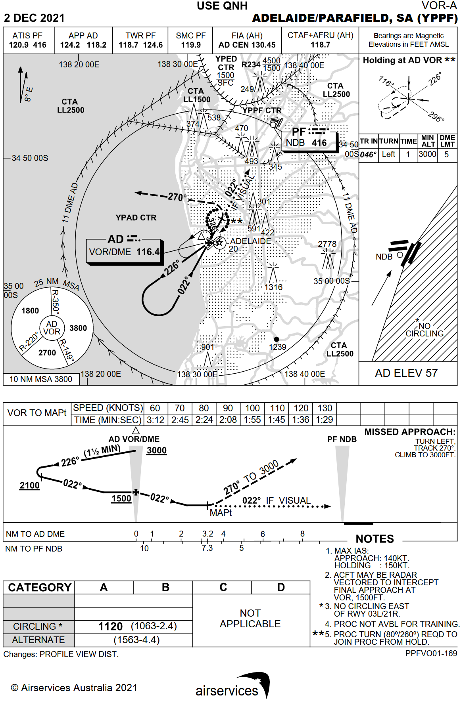
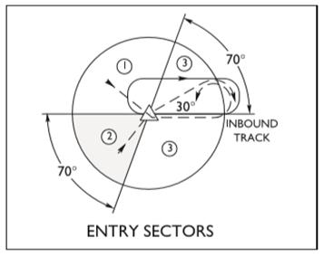
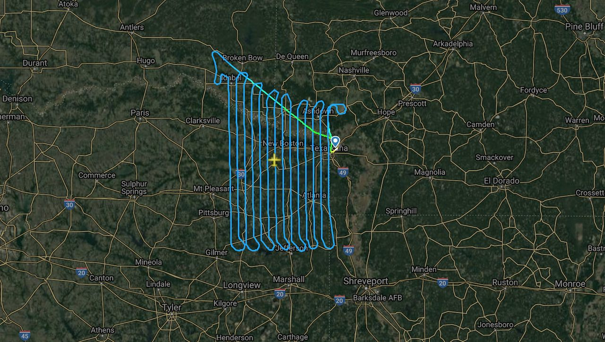
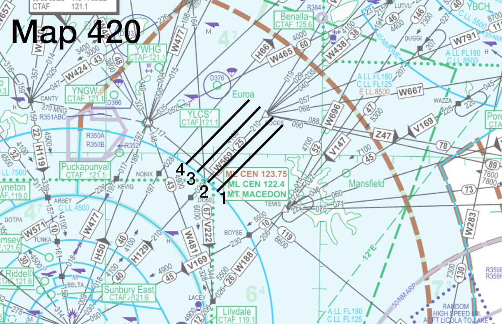
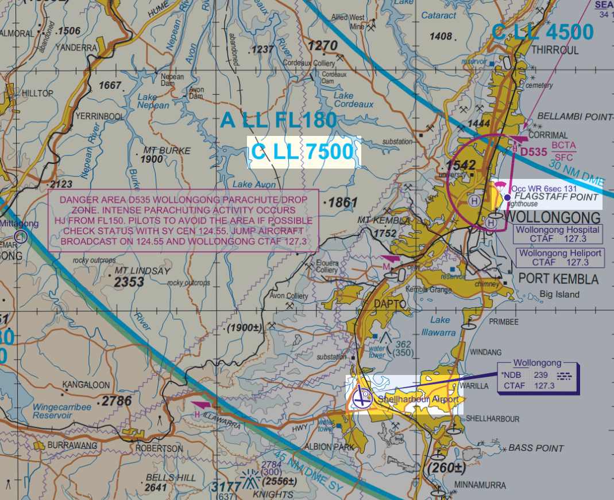
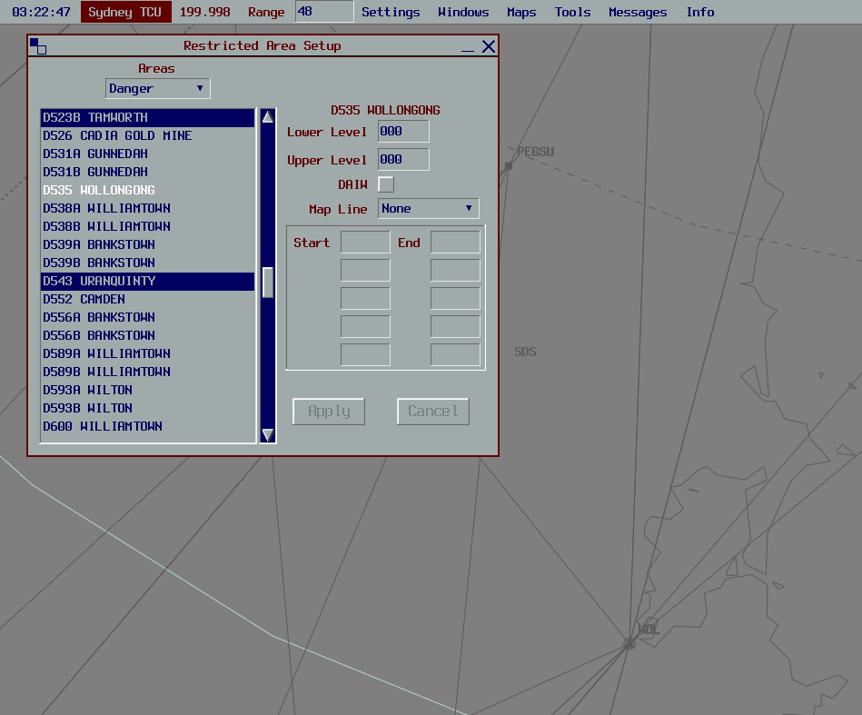
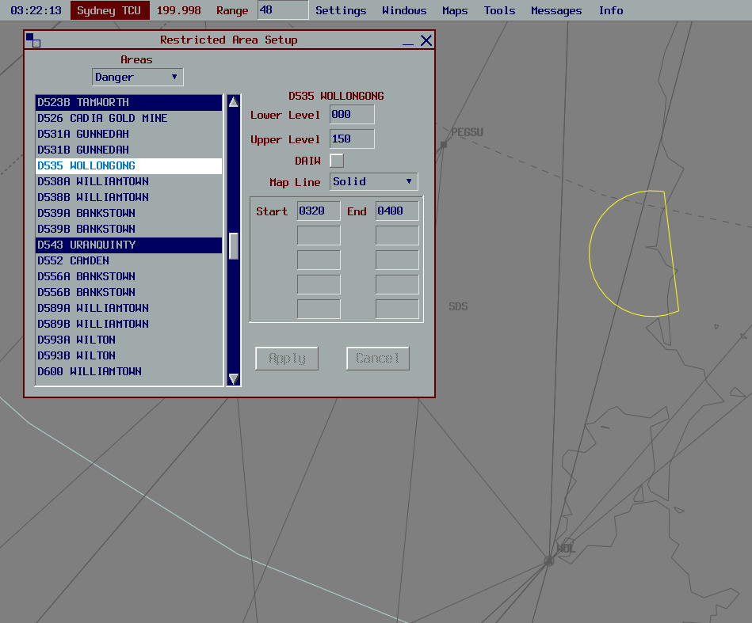

--8<-- "includes/abbreviations.md"

Airwork

## Airwork
Airwork is essentially defined as an aerial operation that doesn't involve simply going from A to B. They can complicate things from an air traffic control perspective, because it's not necessarily as clear exactly what the aircraft is about to do just from looking at their label. In order to facilitate separation and the orderly flow of traffic whilst Airwork is taking place, there are a few procedures to follow.

Airwork can be conducted in any defined area specified by the pilot or ATC. This can be a radius from a fix (eg within a 20nm Radius of YBMK), a Survey Area (eg Operating within [Map 420 Survey Area](#survey-map-example)), a defined polygon (eg Operating within an area between BNA-IDNER-VEGAH-TUCAB), a visual topographical feature (eg Operating within the Port Phillip Bay area), or any other area specified by Pilot or ATC.

!!! phraseology
    **PPB**: "PPB, with Airwork Details"  
    **KIY**: "PPB"  
    **PPB**: "PPB, will be conducting Airwork within a 20nm radius of YPKU, not above A040, for the next 20 minutes. Will call Ops Normal time 30"  
    **KIY**: "PPB, No Reported IFR Traffic"  
    **PPB**: "PPB"

Remarks

### Remarks
An aircraft's Flight Plan Remarks can be the first sign that airwork will be occurring. It can help you as a controller start your planning nice and early, and stay ahead of the game. If the pilot has left detailed remarks, it also means you can spend less time on the frequency asking them what they're doing.
#### STS/ (Status) field
(Aircraft that has declared a Mayday)  
(Aircraft that has declared a Pan Pan)  
`STS/MEDEVAC` - Aircraft engaged in life critical transportation of severely ill patients  
`STS/FFR` - Aircraft engaged in Fire or Flood Relief operations  
`STS/SAR` - Aircraft engaged in Search and Rescue Operations  
`STS/HEAD STATE` - Aircraft carrying the Prime Minister  
`STS/STATE` - Aircraft part of the defence force, military, or customs.  
`STS/HOSP` - Aircraft engaged in non-life-critical transportation of medical operations, personnel, or ill patients.

##### VATSIM Code of Conduct
[Section B6](https://vatsim.net/docs/policy/code-of-conduct){target=new}:  
*"No flight may declare itself to have priority over another. Pilots are permitted to declare in-flight emergencies only when under air traffic control. If, for any reason, air traffic control requests the pilot to terminate the emergency, then the pilot must do so IMMEDIATELY or disconnect from the network. Pilots are not permitted to simulate any unlawful act including, but not limited to, declaring a hijack by any method, including entering a transponder code of 7500."*

Persuant to the above, you are permitted to simulate the higher priority operations above, such as emergency aircraft and MEDEVAC operations, by giving track shortening and conducting coordination as required, as long as it does not impose a delay on any other aircraft (other than normal delays associated with sequencing, weather, etc).
#### Examples
`DLE/ESDAN0010 AV0020 MB0030 RMK/ESDAN26ILS AV36VOR MB4000NDB`  
A pilot intending to do the ILS Runway 26 at YMEN, followed by the VOR Runway 36 at YMAV, then the 4000ft NDB-A at YMMB.

`STS/SAR DLE/2352S13601E0130 RMK/SAR OPERATIONS WI 10NM OF 2352S13601E`  
A pilot intending to conduct Search and Rescue operations within a 10nm radius centred on 10° 52' S 136° 01' E.

`RMK/PJE OPS ROCKINGHAM`  
A pilot intending to conduct Parachute Operations overhead Rockingham

`RMK/SVY OPS WI MAP 420`  
A pilot intending to conduct Aerial Survey Operations as per Map 420

General Operations

### General Operations

#### Ops Normal time
If an aircraft is to be conducting airwork that does not require them to talk to ATC for an extended period (30 mins or more), an "Ops Normal" time should be agreed upon. This is a time that the aircraft confirms they will "check-in" with ATC by, to confirm that they're still alive essentially. If the pilot does not volnteer an Ops Normal time, provide them with one that is on an even hour or half hour, anywhere from 30 mins to 60 mins from the current time.

!!! phraseology
    Time is 0648Z  
    **OBF**: "OBF will be conducting Airwork within a 20nm radius of YBLT Not above A050 for the next 60 minutes"  
    **MUN**: "OBF, No Reported IFR Traffic, Call Ops Normal time 30."  
    **OBF**: "Ops Normal time 30, OBF"

You can then set the timer on the aircraft, by right clicking on the ACID in the Label, and entering the agreed upon time.

#### Checklist
Not often that a "Checklist" is required in an ATC environment, but when Airwork is involved, it can assist greatly. The items are as follows:

- **Preactive**

    This is your first opportunity to become aware of the airwork occuring. You may see a flightplan in the Preactive Window that states their intentions in the remarks, and this is a good time to start planning on how to manage the airwork, and checking up on your SOPs references (hopefully that's why you're here!)

- **Initial Call**

    In the absence of a flightplan, or not seeing a Preactive Strip, this may also be your first opportunity to become aware of the airwork occurring. Ascertain the pilot's exact intentions, requirements, area of operations, and any other relevant info as soon as possible

- **Assessment**

    Assess for Airspace, Traffic, Separation, and Coordination

- **Situational Awareness Tools**

    Consider using Text-on-Screen, Activation of Danger Areas, Label Data, Off Track Deviations, Block Levels, etc, to enhance your situational awareness as to the aircraft's intentions

- **Coordination**

    Coordinate to all affected adjacent units as required. Ascertain who is responsible for separation, who will take the aircraft on frequency, any any other info pertinent to the operation.

- **Clearance**

    Pass the aircraft their airways clearance if operating in controlled airspace

- **Ops Normal time**

    Confirm an ops normal time if required

Search and Rescue (SAR) Operations

### Search and Rescue (SAR) Operations
SAR Operations are conducted more or less as a standard airwork procedure. Handle the aircraft as any other normal aircraft transiting your airspace, with the airwork procedures shown above.

SAR Operations are most commonly flown in a circular area (eg Radius from a Fix, or Radius from a Lat/Long), or a Straight line pattern (eg, back and forth on a line between 2 Fixes, or 2 Lat/Longs).

!!! phraseology
    **DDU**: "DDU, Requesting Traffic for Search and Rescue operations for the next 90 minutes, within a 10nm Radius of 23 52 South, 136 01 East, Not above A060"  
    **ASP**: "DDU, No Reported IFR Traffic. Call Ops Normal time on the hour"  
    **DDU**: "Ops Normal on the hour, DDU"  

Practice Instrument Approaches

### Practice Instrument Approaches
A Practice Instrument Approach is simply an aircraft conducting an Instrument Approach with no intention of a full-stop landing. This is pretty straight-forward outside controlled airspace, as the pilot will often just request a traffic statement for a given radius from a fix. In controlled airspace, however, there can be quite a few things to consider.

!!! note
    VFR aircraft are still allowed to do Instrument Approaches

#### Initial Call
!!! phraseology
    **YNJ**: "Adelaide Approach, YNJ, Requesting Practice YPPF VOR-A Approach"  
    **AAE**: "YNJ, Adelaide Approach, Standby"  

#### Assessment
First thing to do, is to bring up the approach chart from the [Airservices Australia DAPs](http://www.airservicesaustralia.com/aip/current/dap/AeroProcChartsTOC.htm){target=new}

<figure markdown>
{ width="600" }
  <figcaption>YPPF VOR-A</figcaption>
</figure>

Then we continue our assessment. Assess for:

- **Airspace** (What classes of Airspace will the aircraft be operating in? Will the aircraft require a clearance?)  
- **Traffic/Separation**  
- **Coordination** (What adjacent units will be affected?)
- **Approach specifics** (Will a Sector Entry be required? Will a Hold be Required? Will the Published Missed Approach be suitable?)

!!! tip
    Sometimes, Practice Instrument Approaches in the vicinity of busy Class C Aerodromes such as YMML, YSSY, YBBN, etc, will cause too much of a traffic headache to be viable. Practice Instrument Approaches are a low priority item, and can be denied if the traffic situation impedes it

#### Sector Entries and Holds
<figure markdown>
{ width="500" }
  <figcaption>Sector Entry Diagram</figcaption>
</figure>

A Sector Entry is a procedure pilots use to commence an approach. The type of turn made prior to the commencement of the approach differs based on which direction the aircraft is joing from. That is all we really need to know as a controller. No need to overcomplicate things as a controller, simply ask the following:

!!! phraseology
    **AAE**: "YNJ, Will you be requiring a Sector Entry or Hold for the Approach?"  
    **YNJ**: "Affirm will require a Sector Entry, but no hold, YNJ"  
    **AAE**: "YNJ"

#### Situational Awareness Tools
Label Data, Block Levels, and Text-on-Screen are all useful for Practice Instrument Approaches. Use Label Data to indicate the approach type (eg *"VORA"*), use Block Levels to indicate the cleared altitude in the Missed Approach (eg, Published Missed Approach for YPPF VOR-A, Block 000-030), use Text-on-Screen to indicate any non-standard instructions or other pertinent information (eg, a Heading issued for the Missed Approach, Approach type).

#### Coordination
Conduct Coordination to any affected adjacent units as required

!!! phraseology
    **AAE** -> **AAW**: "via AD, YNJ, for a Practice VOR-A approach at YPPF, with your concurrence, I'll clear them for the approach, and will call you overhead AD. Your coord with AD ADC"  
    **AAW** -> **AAE**: "YNJ calls me overhead AD with approach clearance, concurred. My onwards with AD ADC"

!!! phraseology
    **AAW** -> **AD ADC**: "Cancel Auto Release temporarily, I've got an aircraft doing the VOR-A for YPPF"  
    **AD ADC** -> **AAW**: "Copied, Auto Release cancelled"

#### Clearance (if required)
!!! phraseology
    **AAE**: "YNJ, Cleared VOR-A Approach, make Sector Entry. At the minima, Fly Published Missed Approach"  
    **YNJ**: "Cleared VOR-A Approach, make Sector Entry. At the minima, Fly Published Missed Approach, YNJ"

Aerial Surveys

### Aerial Surveys
<figure markdown>
{ width="800" }
  <figcaption>Aerial Survey Example</figcaption>
</figure>

Aerial Survey Work involves flying in a pattern similar to that shown above. Pilots will often request oddly specific altitudes (eg F143) whilst doing these operations. A lot of information is required to have the required situational awareness to facilitate aerial survey work, and it is important to cooperate with the pilot on this. The best thing the pilot can give you, is a survey map showing their area of operations, which may look something like this:

#### Survey Map Example
<figure markdown>
{ width="800" }
  <figcaption>Aerial Survey Map Example</figcaption>
</figure>

The numbers signify "Runs" that the survey aircraft can be cleared for. It is important to note, that the pilot may require to do these runs in a particular order and direction, and at a particular altitude. They also may have some flexibility. Ask the pilot questions if you need more information about how much freedom you have to move them where you want for separation purposes

#### Initial Call
!!! phraseology
    **MZI**: "Melbourne Centre, MZI, Conquest, POB 1, IFR, Taxis Runway 36 at YMNG for Survey Operations"  
    **ELW**: "MZI, Melbourne Centre, Squawk 3601, No Reported IFR Traffic"  
    **MZI**: "Squawk 3601, MZI"

#### Assessment
Assess for:

- **Airspace** (What classes of Airspace will the aircraft be operating in? Will the aircraft require a clearance?)  
- **Traffic/Separation**  
- **Coordination** (What adjacent units will be affected?)

#### Situational Awareness Tools
Dropping Text-on-Screen of the letter "X" at the vertices of the rough area in which the aircraft will be operating is probably the best way to give yourself some situational awareness, however everything is personal preference. Remember that you are only needing to seperate from the survey aircraft, so it's ok if the locations are a little rough

#### Coordination
In this example, lets say the aircraft is intending to operate at F168. Boundary Coordination to ML TCU is not technically required, however, they have a voiceless coordination to you for aircraft assigned the DOSEL and NONIX SID, Climbing to F240. This would place YMML departures directly in conflict with the survey aircraft. A negotation should be made to assure separation between departures and the survey aircraft.

!!! phraseology
    **ELW** -> **MDN**: "For Ident, MZI, conducting Survey work between DOSEL and BOGES at F168. All departures via NONIX and DOSEL to have restriction to reach F180 by 30 miles ML, or assigned level at or below F150, until advised"  
    **MDN** -> **ELW**: "Copied all departures to be assigned restriction to reach F180 by 30 miles ML, or F150 or lower, reference MZI"

#### Clearance (if required)
Start by clearing the aircraft to where they need to go

!!! phraseology
    **ELW**: "MZI, Cleared directly to the start of Run 1, Climb to F168"  
    **MZI**: "Cleared directly to the start of Run 1, Climb to F168, MZI"

Then when ready, clear the aircraft for the survey work

!!! phraseology
    **ELW**: "MZI, Cleared for Runs 1 through 4, Report at the completion of each run"  
    **MZI**: "Cleared for Runs 1 through 4, Wilco, MZI"

!!! tip
    Continue to ask the pilot questions in order to know exactly what they are doing. For separation assurance with the departing YMML traffic, you could ask *"Confirm you will be able to remain outside 40 DME ML?"*. You could ask the pilot what kind of turn they will be making at the completion of each run. You could also instruct the pilot to maintain a heading on the completion of a run for separation purposes.

Parachute Operations

### Parachute Operations
Pilots on the network may choose to simulate Parachute Operations (PJE).  
There are lots of different variables at play when considering how to handle parachuting operations, such as:

- Is the aircraft VFR or IFR?  
- Which class(es) of airspace is the aircraft operating in?  
- What height will the aircraft be dropping from?  
- How busy are you?  

#### Initial Call
The exact nature of Parachute Operations can vary significantly at different drop zones around the country, so it's very important to ascertain the pilot's exact intentions prior to them entering controlled airspace.

!!! phraseology
    **DJV**: "Sydney Departures, Caravan, DJV, Airborne YSHL for Parachute Operations overhead Flagstaff Point, Requesting F140"  
    **SDS**: "DJV, Sydney Departures, Standby"

#### Tag
The aircraft may or may not have filed a flightplan. Search in the Preactive window or Flight Plan Window for their callsign. If you find a flight plan, activate it, and pass the aircraft their squawk code.  
If there is no flight plan, simply create a Quicktag for the aircraft, and assign them the displayed code.

!!! phraseology
    **SDS**: "DJV, Sydney Departures, Squawk 3601"  
    **DJV**: "Squawk 3601, DJV"

#### Assessment
<figure markdown>
{ width="800" }
  <figcaption>YSHL Area VTC</figcaption>
</figure>

Assess for:

- **Airspace** (What classes of Airspace will the aircraft be operating in? Will the aircraft require a clearance?)  
- **Traffic/Separation**  
- **Coordination** (What adjacent units will be affected?)

In this case, the aircraft will be operating in Class G and Class C airspace, therefore will need a clearance. Boundary Coordination will need to be completed to **SAS**.

#### Situational Awareness Tools
Many drop zones around the country have associated Danger Areas, that can be seen on VTC, VNC, TAC or ERC-L Charts. For example, the D535 Danger Area as shown in the VTC Screenshot above. It is good practice to activate these Danger Areas via the **Restricted Areas** window in vatSys, for Situational Awareness purposes.

<figure markdown>
{ width="700" }
</figure>

<figure markdown>
{ width="700" }
</figure>

#### Coordination
Conduct Coordination to any affected adjacent units as required

!!! phraseology
    **SDS** -> **SAS**: "For Ident, DJV, conducting Parachute Operations at Flagstaff Point, do you have any restrictions or requirements?"  
    **SAS** -> **SDS**: "DJV, no restrictions, no requirements"

#### Clearance (if required)
Best practice is to clear the aircraft to operate within a reasonably sized radius area of the drop zone, 5nm for example. If the pilot has special requests to add to the clearance, it is their responsibility to communicate it to you. 

!!! phraseology
    **SDS**: "DJV, Cleared to operate within a 5nm radius of Flagstaff Point, Climb to F140. Report Ready for Drop and Descent"  
    **DJV**: "Cleared to operate within a 5nm radius of Flagstaff Point, Climb to F140, Wilco, DJV"

Ensure you maintain separation assurance with other aircraft in the area. There is nothing wrong with assigning an interim level, holding them at a particular level, or vectoring them away from their intended area of operation, in order to facilitate the movements of other traffic.

#### Broadcasts
Throughout the Parachute operations, you can expect the PJE aircraft to make multiple broadcasts on your frequency to traffic in the area. Unless the aircraft addresses you directly (eg *"Sydney Departures and traffic in the Wollongong area"*), there is no need to respond to these traffic broadcasts

!!! phraseology
    **DJV**: "Traffic in the Wollongong city area, DJV is a Caravan, 5 minutes to Parachute drop from flight levels overhead Flagstaff Point, expect 6 canopies, Traffic Wollongong city area"

#### Drop and Descent
!!! phraseology
    **DJV**: "DJV, Broadcasts complete, Request Drop and Descent"  

You are required to separate all aircraft from a **2nm Radius** of the Drop Zone (ie, the appropriate radar standard, 3nm for TCU, 5nm for Enroute, **Plus** 2nm Radius of the Drop Zone), once a drop clearance has been given. This is because you are no longer just separating from the aircraft, but the Parachutes themselves as well. Your responsibility for separating from the Parachutes terminates once the pilot reports the chutes are OCTA.

Once again, when giving drop and descent clearance, consider giving an interim level, or a heading, if required for separation.

!!! phraseology
    **SDS**: "DJV, Cleared to Drop and leave controlled airspace descending, not below the chutes, tracking DCT YSHL, No Reported IFR Traffic. Report chutes OCTA."  
    **DJV**: "Cleared to Drop and leave controlled airspace descending, not below the chutes, tracking DCT YSHL, Wilco, DJV."  

!!! note
    *"Not below the chutes"* is so that you can separate from the last level vacated by the aircraft. If you do not instruct the aircraft to descend not below the chutes, then you would need to separate all the way from the drop height (in this case, F140) until the chutes are reported as OCTA.

!!! phraseology
    **DJV**: "DJV, Chutes and aircraft OCTA."  
    **SDS**: "DJV, Identification terminated, Frequency change approved"  
    **DJV**: "DJV"

!!! note
    "Frequency change approved" is given in this instance, as DJV is now a VFR aircraft in Class G airspace. DO NOT approve a frequency change to any PJE aircraft in Class E airspace, or any IFR PJE aircraft.

#### IFR Operations
Most procedures are the same for IFR aircraft, just remember that the situation changes when Class E airspace is involved, as it is now Controlled, and you must separate other IFR aircraft from the PJE aircraft and the chutes inside Class E airspace. As a controller, remember that you need to hold SARWATCH over the IFR aircraft in all Classes of airspace, until they cancel their SARWATCH or downgrade VFR.

#### OCTA Operations
VFR PJE aircraft operating wholly within Class G or Class E airspace are still required to make broadcasts on frequency, and they are entitled to a traffic statement for Drop and Descent.

