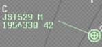

--8<-- "includes/abbreviations.md"

Coordination is an underutilised tool in VATPAC airspace, primarily due to how difficult it was to do it back in the Euroscope and VRC days. Now, (almost) all controllers are using vatSys, and voice coordination can be done in seconds with the touch of a button, using the Hotlines and Coldlines. Coordination helps controllers stay aware of aircraft that are about to enter their jurisdiction, and ensure they will operate in a predictable manner, which allows for easier planning of sequencing and separation.

Coordination requirements are often very location-specific, however this page outlines the general guidelines to coordination, which are supplemented by Local Instructions.

[MATS Chapter 6](https://www.airservicesaustralia.com/mats/docs/nos-saf-2000.pdf){target=new} goes in to much more detail about coordination principles, phraseology, and situations. It is well above the level required for VATSIM, but feel free to read up on it if you want to extend your learning.

## Coordination in vatSys
Coordination is performed using the VSCS window in vatSys.  Once logged onto a relevant position, controllers have the option of opening **hotlines** and **coldlines** to surrounding positions.  

A hotline is opened by pressing the yellow button titled with the sector you wish to communicate with, which creates an instant connection between positions with no need for the other controller to accept the call.  A coldline is opened by pressing the blue button titled with the sector you wish to communicate with, which notifies the other position and requires them to accept the call before communications can begin.

!!! tip
    For more in depth information, refer to the [vatSys website](https://virtualairtrafficsystem.com/docs/vscs/){target=new}.

Coordination notes are included for most positions, using the following format: 
!!! note "" 
    `Hotline`:  **ORIGINATING SECTOR** -> **RECEIVING SECTOR**: "Message"  
    `Coldline`:  **ORIGINATING SECTOR** -> **RECEIVING SECTOR**: "Message"  

As a receiving controller, answer a coordination call by stating the name of **your** position.  If you are busy at the time, finish your current radio call and then state your position to indicate that you are ready to receive the message.

!!! example
    *BIK calls SAN with a hotline to discuss an arrival*  
    **BIK** -> **SAN**: \***DING**\*  
    **SAN** -> **BIK**: "Sydney Approach"  
    **BIK** -> **SAN**: "Via RIVET, QFA541, request heading 030 due weather"  
    **SAN** -> **BIK**: "QFA541, Concur heading 030"

!!! tip
    Remember that coordination items must be read back in the same way a pilot must read back an instruction from ATC.

## Types of Coordination
### Heads-up
Heads-up Coordination is the act of giving the next sector a "heads-up" about an aircraft about to enter their airspace. The format is as follows:

Controlling Sector -> Receiving Sector: "(Position), (Callsign)"  
Receiving Sector -> Controlling Sector: "(Callsign), (Level)"

!!! example
    **ELW** -> **BIK**: "via CB, VOZ1234"  
    **BIK** -> **ELW**: "VOZ1234, F350"  

If the level that will be assigned at transfer of jurisdiction is different from the current CFL, the Controlling Sector will use the phrase "Will be assigned (level)".

Once this coordination is completed, the aircraft's level and route is **locked in**. Any further changes must be recoordinated.

!!! example
    **ELW** -> **BIK**: "VOZ1234, requesting DCT RIVET"  
    **BIK** -> **ELW**: "VOZ1234, concur DCT RIVET"  

!!! tip
    In situations where Heads-Up Coordination is required, the best time to do it is when the aircraft first calls you. There's no need to wait until half a mile before when its due, if you can get it done sooner.

### Voiceless
Certain routes, areas, levels, airspace, etc, will have voiceless coordination agreements, which is where Heads-Up Coordination is not required. These routes may also have change parameters, where no changes are permitted within a certain distance of the sector boundary without prior coordination.

### Boundary
Boundary coordination is required when an aircraft may deviate within ***half the applicable standard*** of another sector's airspace.  
Ie: Within:  
**500ft** vertically; or  
**2.5nm** laterally for **ENR**; or  
**1.5nm** laterally for **TCU/ADC**.

Boundary coordination must be completed so they are aware of the aircraft, and can nominate any restrictions. The format is as follows:

Controlling Sector -> Boundary Sector: "For Ident, (Position), (Callsign), (Details as required)"  
Boundary Sector -> Controlling Sector: "(Callsign), (Restriction)"

!!! example
    **BIK** -> **CBE**: "For Ident, overhead CB, QFA12, do you have any restrictions on descent?"  
    **CBE** -> **BIK**: "QFA12, No restrictions on descent"  

The Boundary Sector may omit the restriction and readback the callsign only. This will be taken as the Boundary Sector having **no vertical or lateral restrictions**.

!!! example
    **INL** -> **BAS**: "For Ident, West of BLAKA, ABC"  
    **BAS** -> **INL**: "ABC"

## The C-Prompt (Coordination Prompt)
Display the "C-Prompt" when all coordination for an aircraft is complete, or voice coordination is not required for an aircraft (eg subject to voiceless coordination).

The "C-Prompt" can be displayed by middle clicking the area just above the aircraft's callsign in the label.

<figure markdown>
{ width="200" }
  <figcaption>C-Prompt</figcaption>
</figure>

Remove the "C-Prompt" once jurisdiction of the aircraft has been handed off, and the new frequency has been correctly read back.

## No Frequency Requirements (NFR)
Occasionally, aircraft may clip small parts of a sector's airspace on their planned route. If an aircraft only enters someone's airspace for a small distance, there is usually no need for them to talk to that controller. In this instance, A controller may coordinate an aircraft to have "No Frequency Requirements" with another controller, or vice versa. This shall also be supplemented by the nomination of a restriction, or lack thereof. See below:

Source: [Annotations](../../controller-skills/annotations)

| Label Data / Global Ops | Meaning | Note |
| ---- | ----------- | --- |
| **NFR** | No Frequency Requirements | |
| **NRD** | No Restrictions on Descent | Additional coordination must be done for any **lateral** changes |
| **NRC** | No Restrictions on Climb | Additional coordination must be done for any **lateral** changes |
| **NVR** | No Vertical Restrictions | Additional coordination must be done for any **lateral** changes |
| **NLR** | No Lateral Restrictions | Additional coordination must be done for any **level** changes |
| **C(lvl)** | Cleared level (lvl) | Additional coordination must be done for any **lateral or level** changes |
| **NR** | No Restrictions | **Any and all** lateral and level changes approved |
| **NRR** | No Restrictions or Requirements | **Any and all** lateral and level changes approved, and No Frequency Requirements |

*Offering NFR*
!!! example
    *ABC tracking MNG W663 VINOP*  
    **ELW** -> **YWE**: "via MNG, ABC, if you have no restrictions or requirements, my onwards with OXL"  
    **YWE** -> **ELW**: "ABC, I have no restrictions or requirements, your onwards with OXL"  
    ELW will put *"YWE NRR"* in the label data  
    **ELW** -> **OXL**: "via MNG, ABC, YWE has no restrictions or requirements"  
    **OXL** -> **YWE**: "ABC, F190"  
    ELW will handoff the aircraft directly to OXL

*Initiating NFR*
!!! example
    *DEF tracking EML-LEMER-RK*  
    **SWY** -> **CVN**: "via LEMER, DEF, I have no vertical restrictions or frequency requirements, your onwards with KPL"  
    **CVN** -> **SWY**: "DEF, my onwards with KPL"  
    CVN will put *"SWY NVR NFR"* in the label data  
    **CVN** -> **KPL**: "via LEMER, DEF, SWY has no vertical restrictions or frequency requirements"  
    **KPL** -> **CVN**: "DEF"  
    CVN will handoff the aircraft directly to KPL

!!! note
    It is important to remember that this coordination is still a negotiation. You are free to reject any proposition that doesn't work for you and your traffic picture. And if there is a particular restriction to nominate, it is always best to take the aircraft on frequency.

## Rules
### General
Coordination must be done on a **point-to-point** basis. Meaning, you can only coordinate with the sector which the aircraft is coming from, or going to, no skipping! This is important to remember, for example, if you are controlling ELW, and you would like to pass an amended route to someone on the ground at YMML. Whilst that may be no issue for ELW, ML SMC and ML ADC, it might not work for ML APP. ML APP would be the sector which the aircraft is coming from, so ELW must talk to them, and it is the responsibility of ML APP to work backwards down the line on a point-to-point basis.

Ensure no coordination is ambiguous in its meaning. Not all coordination can be straight out of the phraseology books, and the reality is, not everyone controlling the airspace is going to be 100% proficient and by the books. When using "plain english", ensure there is no ambiguity, and the message is fully understood by both parties.
### ENR/TCU -> Class D TWR
Heads-up coordinate arrivals/overfliers prior to **5 mins** from the boundary.
#### Format
- *"via (Route/Procedure)"*
- Callsign
- Level (if not Standard Assignable)
- Runway (if not active runway)

### Class D TWR -> ENR/TCU
Voice coordinate 'Next' call **within 2 minutes of takeoff** for all CTA departures.
#### Format
- *"Next"*
- Callsign
- Level (if not Standard Assignable)

### Radar TWR -> TCU
Voice coordinate 'Next' call **within 2 minutes of takeoff** unless overridden by local Auto Release rules.

#### Format
- *"Next"*
- Callsign
- Runway

If Auto Release is suspended by the TCU controller, respond by advising of any aircraft with a takeoff clearance.

!!! example
    **TCU** -> **ADC**: "Cancel auto release until time 45"  
    **ADC** -> **TCU**: "Cancel auto release until time 45, QLK108D released"  
    **TCU** -> **ADC**: "QLK108D"

### TCU -> Radar TWR
Radar TWRs will voice coordinate all departures unless permitted by local Auto Release rules. Respond with any lateral departure instructions (if required by SID or departure procedure) and any additional vertical restrictions, or "unrestricted". 

If due to weather, overflying aircraft, runway config changes, etc. Auto Release needs to be cancelled, advise this to the ADC controller.  They will respond with any aircraft who have a takeoff clearance.

### ENR -> TCU
**Voiceless** for aircraft landing at main airport (eg YMML in ML TCU), assigned a STAR, and standard assignable level.  

Heads-up coordinate all other aircraft by **20nm** to boundary.
### TCU -> ENR
**Voiceless** for aircraft assigned lower of standard assignable level or RFL, and tracking via a Procedural SID terminus.

Heads-up coordinate all other aircraft by the boundary.
### ENR -> Oceanic
Heads-up coordinate prior to **15 mins** to boundary.
### Oceanic -> ENR
Heads-up coordinate prior to **15 mins** to boundary.
### Oceanic -> Oceanic
Heads-up coordinate prior to **30 mins** to boundary (**15 mins** to Australia and New Zealand units).

#### Format
Coordination between **Australian** units shall be done in the [Standard Heads-up format](#heads-up).

Coordination to **International** units shall be done in the following format:

- *"Estimate"*
- Callsign
- Boundary Point
- Estimate
- Level
- *"On climb"*/*"On descent*" (if applicable)

!!! example
    **IND** -> **FIMM CTR**: "Estimate, QFA63, IBMAT time 33, F360"  
    **FIMM CTR** -> **IND**: "QFA63, F360"
### ENR -> ENR
**Voiceless**, no changes to route or CFL within **50nm** to boundary.

!!! note
    Except as amended by Local Instructions.

### OCTA Coordination
For any aircraft transiting **to or from** Uncontrolled airspace (ie: Class G, VFR Class E), heads-up coordination is **not required**. However, a **5 minute** change parameter applies to any aircraft that change level, route, or taxi within **5 minutes** of the next sector's airspace.

## Handoffs
Receiving a handoff means you are permitted to turn an aircraft **45 degrees left or right**, and **climb/descend it to any level** without coordination. Do not handoff an aircraft to another sector if a turn of 45 degrees or a change of level would cause a conflict with any of your own aircraft. Or alternatively, you can nominate a restriction prior to handoff.

!!! example
    **YWE** -> **TBD**: "ABC, my restriction is DEF, calls you now"  
    **TBD** -> **YWE**: "ABC, restriction is DEF, calls me now"

Upon receipt of a handoff, once the aircraft is established **half the applicable lateral standard** (2.5nm for ENR, 1.5nm for ADC/TCU) within your airspace, you are free to turn the aircraft as much as you like. If you need to turn them more than 45 degrees earlier than that, simply ask!

!!! example
    **KPL** -> **RKA**: "ZYX, do you have any restrictions?"  
    **RKA** -> **KPL**: "ZYX, no restrictions"  
    KPL will place *"RKA NR"* in the label until 2.5nm clear of their airspace, to record that the coordination has been completed.

For more information, refer to individual local instructions.