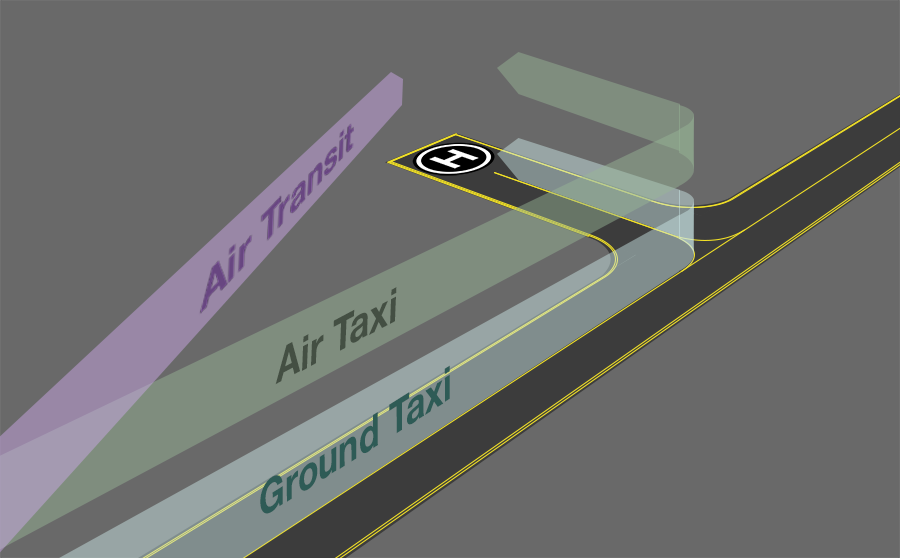

--8<-- "includes/abbreviations.md"

The majority of the traffic on VATSIM is fixed-wing aircraft, and this can sometimes make helicopter operations seem difficult and confounding. But while there are differences between helicopter and fixed-wing operations, controlling helicopters is actually quite simple.

## Common Helicopter Types
The ICAOs for many common helicopters may be unfamiliar to controllers used to fixed wing operations. Below is a list of some helicopter types that you may encounter in VATPAC airspace.

| ICAO | Aircraft |
| ---- | -------- |
| A139 | AgustaWestland AW139 |
| AS50 | Airbus Helicopters H125 |
| B407 | Bell 407 |
| B412 | Bell 412 |
| BK17 | MBB/Kawasaki BK117 |
| EC35 | Eurocopter EC-635 |
| EC45 | Eurocopter EC-145 |
| EC75 | Eurocopter EC-175 |
| G2CA | Guimbal Cabri G2 |
| H60 | Sikorsky H60 |
| R22 | Robinson R22 |
| R44 | Robinson R44 |
| S92 | Sikorsky S-92 |

## Phraseology
On first contact, helicopters will prefix their callsign with "HELICOPTER".

!!! phraseology
    **WP1**: "Gold Coast Tower, helicopter WP1, 6 miles south, inbound YXTV, received G"

## Aerodrome Operations
### Airways Clearances
At most aerodromes, airways clearances for helicopters are exactly the same as fixed-wing aircraft. Helicopters most commonly operate under VFR flight rules and the clearance phraseology is identical to fixed wing aircraft.

!!! phraseology
    **RSCU533:** "Brisbane Delivery, helicopter RSCU533, MEDEVAC, for YXHE, request clearance"  
    **BN ACD:** "RSCU533, Brisbane Delivery, cleared to YXHE via BLHS flight planned route, climb A025, squawk 1256, departure frequency 124.7"  
    **RSCU533:** "Cleared to YXHE via BLHS flight planned route, climb A025, squawk 1256, departures 124.7, RSCU533"
	
Helicopters operating IFR should be processed just as a fixed-wing aircraft. They will be issued a radar SID (where available) and assigned a runway, unless a visual departure is acceptable.

!!! phraseology
    **RDBK5:** "Willy Delivery, IFR helicopter RDBK5 for YSHW, request clearance"  
    **WLM ACD:** "RDBK5, Willy Delivery, cleared to YSHW via LIMLO flight planned route, runway 12 WLM4 departure, climb via SID A030, squawk 2070, departure frequency 135.7"  
    **RDBK5:** "Cleared to YSHW via LIMLO flight planned route, runway 12 WLM4 departure, climb via SID A030, squawk 2070, departures 135.7, RDBK5"

#### Coded Clearances
Aerodromes that see significant helicopter traffic, such as [Sydney](../../aerodromes/classc/sydney#helicopter-operations) may implement local procedures that specify coded clearances that can be issued to helicopters.

!!! phraseology
    **YOE:** "Sydney Delivery, helicopter YOE, for the Harbour Bridge 5 outbound, request clearance"  
    **SY ACD:** "YOE, Delivery, cleared Harbour Bridge 5 outbound, squawk 0215, departure frequency 123.0"  
    **YOE:** "Cleared Harbour Bridge 5 outbound, squawk 0215, departure frequency 123.0, YOE"
	
These local procedures are documented in these SOPs on the relevant aerodromes' page.

### Ground Movements
Helicopters are capable of more maneuvres than a fixed-wing aircraft, and as such there is unique procedures and phraseology to handle their movements. Beyond these differences, helicopter operations around an aerodrome are otherwise quite similar.

<figure markdown>
{ width="600" }
  <figcaption>Different helicopter aerodrome movements</figcaption>
</figure>

#### Ground Taxi
Some helicopter have wheels and are capable of taxiing on their own power while remaining on the ground. This maneuvre is known as 'ground taxiing' and is functionally akin to taxiing fixed-wing aircraft.

!!! phraseology
    **AD SMC**: "POL2, ground taxi via A, F2, hold short runway 12."

#### Air Taxi
When Air Taxiing, helicopter must follow the specified taxiways while remaining within ground effect and operating at a speed less than 20KT. SMC will issue air taxi instructions in the same way as taxi instructions for fixed-wing aircraft, following standard taxi routes where relevant.

A helicopter must receive explicit clearance to cross a runway during an air taxi.

!!! phraseology
    **CS SMC**: "HLTK501, air taxi via A, hold short Y."

    **NFFN ADC**: "DQIBT, air taxi via H, cross runway 25, C to the apron."
	
#### Air Transit
Air transit allows helicopters to proceed directly between two points on the aerodrome expeditiously. During an air transit, helicopters must remain below A001, but may operate at speeds greater than those used in air taxiing and move freely beyond the extent of taxiways.  A helicopter must receive explicit clearance to cross a runway during an air transit.

!!! phraseology
    **KA SMC**: "ABC, air transit to Woodside Apron."
	
	**AS ADC**: "SVY801, air transit to the southern airpark, cross runway 12."
	
Before an SMC gives an air transit instruction to a helicopter, they must [coordinate with ADC](../coordination#air-transit).

!!! tip 
    Where air transit will be prolonged or conflicts with other traffic are likely, consider issuing a takeoff/landing clearance instead.

#### Downwash
Just as fixed wing aircraft can produce wake turbulence, helicopters operating near the ground generate forceful blasts of air that can create disturbances in all directions.

Light aircraft that are operating within three times the rotor diameter of helicopter operating near the ground should be issues with a caution.

!!! phraseology
    **EN SMC**: "2AB, taxi via P, R, hold short E. Traffic is a AgustaWestland 139 air taxiing via D, caution downwash."
	
!!! tip 
    Helicopters performing air taxi (and to a lesser extent air transit) maneuvres generate downwash which can damange concrete surfaces over time. In the real world, controllers will try to mitigate this by encouraging ground taxis and allowing helicopters to take-off in aprons, taxiways, etc. Controllers may choose to simulate this practice when facilitating helicopter movements.

### Takeoff and Landing
#### Runways & Maneuvering Area
Any takeoff or landing on any part of the manoeuvring area requires a specific takeoff or landing clearance from ADC. You should specify the location when issuing your clearance.

!!! phraseology 
    **SY ADC**: "RSCU209, runway 16L, cleared to land"

    **LT ADC**: "YOE, taxiway E, cleared for takeoff"

#### Other Locations
Helicopters do not necessarily need to use a runway, taxiway, or helipad to takeoff or land. Helicopters often operate from aprons, paved areas, and even flat grassed areas next to hangars.

Helicopters operating from points outside the controlled maneuvering area do not receive explicit takeoff/landing clearance. Instead. helicopters using these helipads are instructed to 'report on the ground'/'report airborne' in lieu of an explicit clearance.

!!! phraseology 
    **MB ADC**: "RJB, southern apron, report on the ground"  

    **CFS ADC**: "WP3, report airborne"
	
This also applies to helicopters departing helipads away from the aerodrome but within the CTR.

!!! phraseology 
    *RSCU203 is a VFR AW139 helicopter inbound from the southwest for Southcare Base (YXSB), within the CB CTR*  
    **RSCU203**: "Canberra Tower, gday, RSCU203"
    **CB ADC**: "RSCU203, Canberra Tower, report on the ground"
	
#### Visual Holds
Helicopters can be given holding instructions to facilitate movement of nearby traffic that would be impossible for fixed-wing aircrafy to perform.

Most commonly issued by ADC's that own local airspace, these instructions involve making the helicopter hold over a visual reference point, such as the control tower or a runway threshold, before being given onwards clearance. Such an instruction should include an obvious visual reference and an altitude restriction.

!!! phraseology 
    **HWD:** "Sydney Tower, helicopter HWD, Hotel 7, for the Harbour Bridge 5 outbound, ready"  
    **SY ADC:** "HWD, Sydney Tower. Track to and hold over the tower not above `A005`, traffic landing 34L. report airborne"  
    **HWD:** "Track to and hold over the tower not above `A005`, HWD"
	
### IFR Approaches
Arriving IFR Helicopters should be processed just as a fixed-wing aircraft and cleared for an IAP and, if landing on a runway, receive standard runway landing clearances.

In IMC or marginal VMC, it’s common for a helicopter to fly the instrument approach and, once visual, request to break off for a landing at a helipad or nearby location within the CTR. Approval is at Tower’s discretion, considering traffic and circuit activity. If approved, provide any relevant traffic information and surface/obstacle cautions.

!!! phraseology 
    **AY ADC**: "HM1, cleared RNP-Z approach runway 07."
    **HM1**: "Cleared RNP-Z approach runway 07, HM1"
	*HM1 becomes visual during their approach, and intends to break-off and land on the helipad*
	**HM1**: "Tower, HM1 visual, request the Western Helipad."
	**AY ADC**: "HM1, recleared visual approach to Western Helipad, report on the ground."
	**HM1**: "Cleared visual, Western Helipad. HM1."