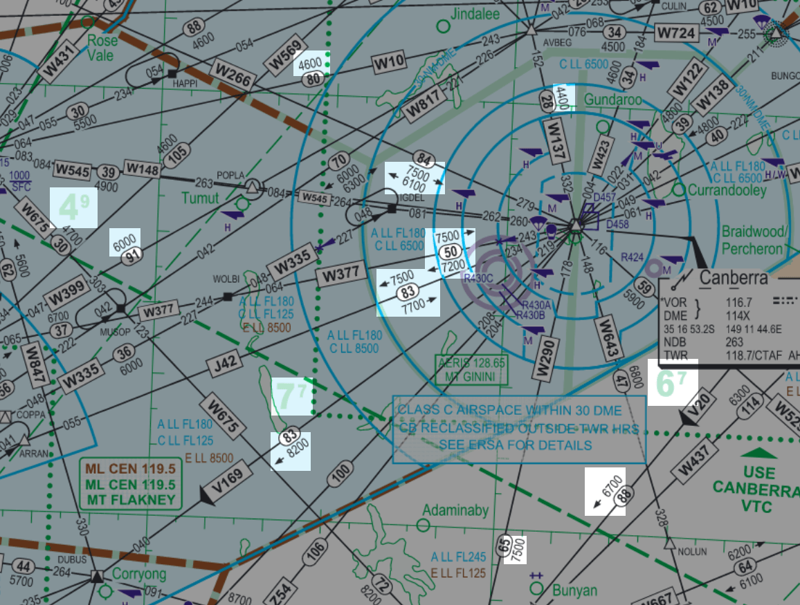
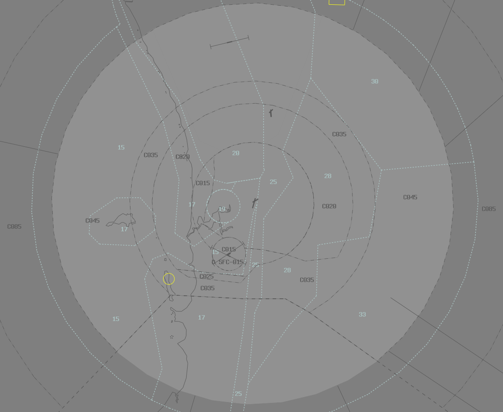

--8<-- "includes/abbreviations.md"

## Grid LSALTs
Grid LSALTs are calculated for an area of 1 degree of latitude x 1 degree of longitude, and can be used by any aircraft inside that grid.

## Route LSALTs
Route LSALTs are valid for RNP2-approved aircraft tracking via an airway, as shown on the relevant chart.

## Charts
Grid LSALTs and Route LSALTs can be found on [TAC and ERC Low charts](https://www.airservicesaustralia.com/aip/aip.asp), as shown below

<figure markdown>
{ width="800" }
  <figcaption>Grid and Route LSALTs</figcaption>
</figure>

## Rules
It is the responsibility of the pilots to plan their flight above LSALT if they are IFR. However, ATC cannot clear an aircraft below LSALT, and any aircraft receiving a FIS that has planned below LSALT, shall be queried to ensure the pilot is aware.

An IFR aircraft is permitted below LSALT when:

- They have reported Visual
- They are using a "Pilot-Calculated" LSALT
- They are in the course of a normal departure/approach procedure

!!! information
    Pilots can calculate their own LSALT from numerous different sources, such as aerodrome 25nm and 10nm MSAs, VOR/NDB/DR tracking tolerance splays, and others. Bottom line is, if a pilot says they are using a Pilot-Calculated LSALT, they have taken full responsibility for their own separation with terrain.

## Radar Terrain Clearance Chart (RTCC)
On VatSys within some TCUs, the RTCC map can be displayed to show local, more precise terrain clearance levels within TMAs, shown below at Perth

<figure markdown>
{ width="800" }
  <figcaption>Perth RTCC</figcaption>
</figure>

Aircraft can be cleared within CTA down to the level shown on the RTCC, and this can be used to supplement any local Grid LSALTs, Route LSALTs, and MSAs.

## Visual
Once an aircraft has reported visual, LSALTs are no longer a factor. However, if clearing an aircraft to an altitude that is below Grid LSALT, Route LSALT, or MSA, the controller must append the word **"Visual"** to the clearance. This also applies to any assigned headings, or route clearances, when the aircraft is cleared to a level below LSALT.

!!! example
    **MAE**: "AM328, Report in-flight conditions"  
    **AM328**: "AM328, visual"  
    **MAE**: "AM328, Descend to A040 visual"  
    **AM328**: "Descend to A040 visual, AM328"  

## Examples
!!! example
    **ABC**: "Melbourne Centre, PA44, ABC, POB 2, IFR, Taxiing YSWG for YMCO, Runway 23"  
    **BLA**: "ABC, Melbourne Centre, Squawk 3601, No reported IFR Traffic"  
    **ABC**: "3601, ABC"  
    **BLA**: "ABC, you've planned below Grid Lowest Safe, advise intentions"  
    **ABC**: "Roger, ABC, request amended A090"  
    **BLA**: "ABC, no additional reported IFR traffic, expect that"  
    **ABC**: "ABC"  

!!! example
    **DEF**: "Brisbane Centre, PC12, DEF, POB 6, IFR, Taxiing YBUD for YROM, Runway 32"  
    **KPL**: "DEF, Brisbane Centre, Squawk 3601, No reported IFR Traffic"  
    **DEF**: "3601, DEF"  
    **KPL**: "DEF, you've planned below Grid Lowest Safe, advise intentions"  
    **DEF**: "We've calculated our own lowest safe, DEF"  
    **KPL**: "DEF"  
    KPL will enter "PCALC" in label data.