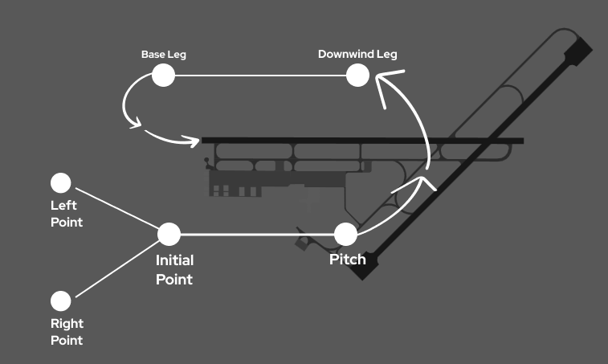
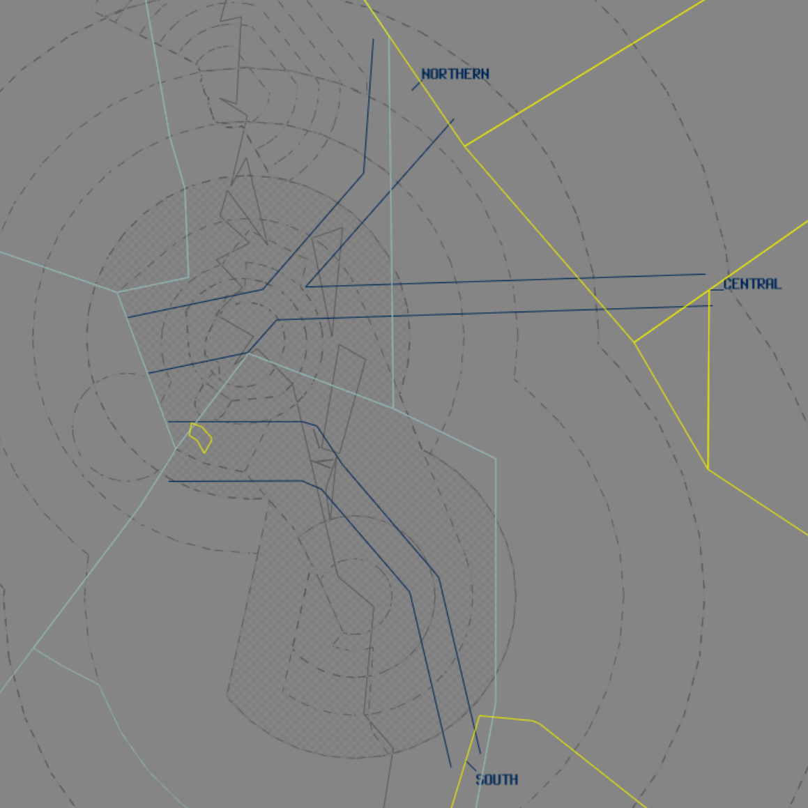
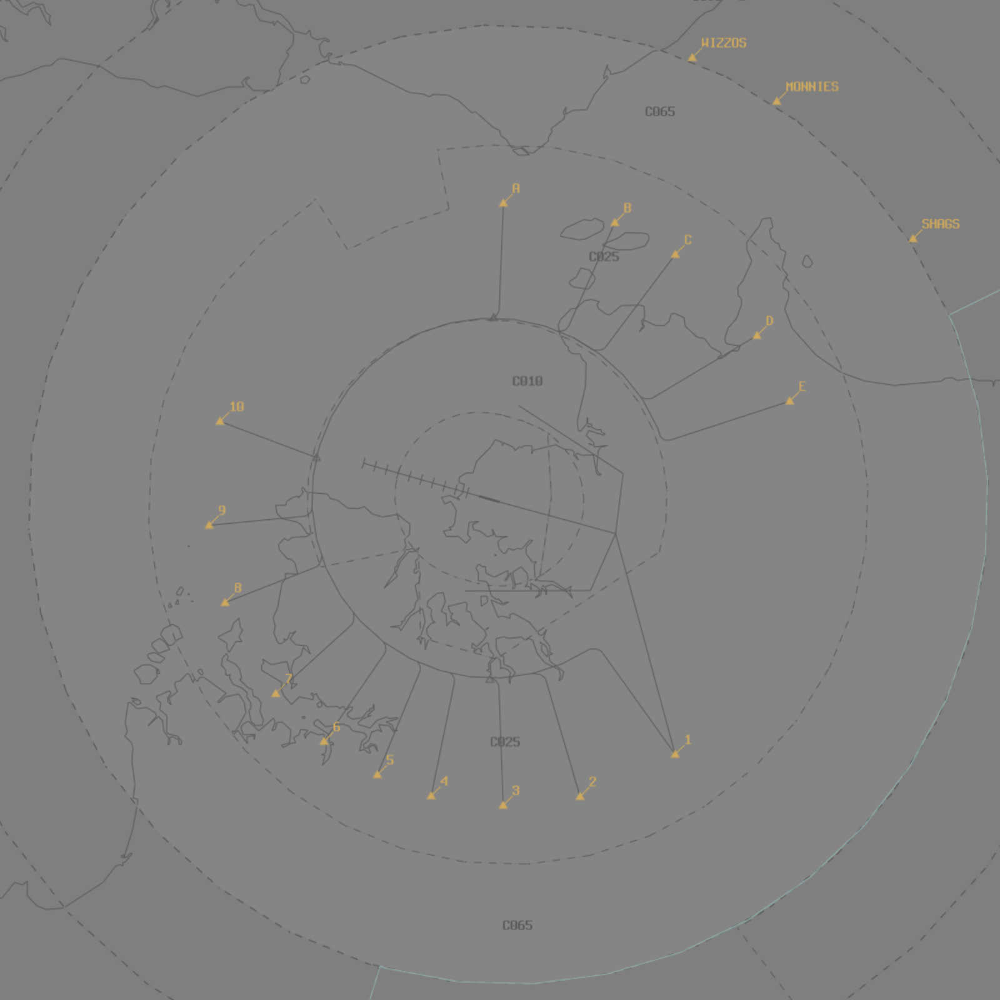

--8<-- "includes/abbreviations.md"

The majority of traffic on VATSIM is simulated 'civilian' traffic: airliners performing regular passenger transport, smaller general aviation aircraft doing recreational flights, and even simulated [airwork](../airwork). There is, however, a notable contingent of pilots who are interested in simulating special and military operations.

Military operations can vary significantly from civilian operations, both in procedure and in phraseology.

!!! warning "Important"
    As per the VATSIM [Special Operations Policy](https://vatsim.net/docs/policy/special-operations){target=new}, the following activities are restricted on the VATSIM network. They may only be performed by pilots who are a member of, and flying an operation representing, an approved Virtual Special Operations Association.

    - Conducting joint training exercises with other approved VSOAs
    - War games
    - Air to air refuelling
    - Carrier operations
    - Flying low level military routes
    - [Flying escort missions](#interception-and-escorts)
    - Executing air combat manoeuvres
    - [Interception/scramble of other aircraft](#interception-and-escorts)
    - Having access to [special use airspace](#military-operating-areas)
    - [Search and Rescue Operations](#search-and-rescue-sar-operations)
    - [Firefighting Operations](#firefighting-operations)
    - Launch and Recovery of Space Vehicles
    - Air Displays (Flying Displays, Races)
    - Fly unmanned aerial vehicles, e.g. Global Hawk

!!! tip
    It may be beneficial to refer pilots to VATPAC's [Pilot Procedures](https://pilots.vatpac.org){target=new} to provide them with reference material for special operations.

## Military Airspace
### Military Aerodromes
There are several military and joint military/civil aerodromes in Australia.

These airports have published military procedures that can differ significantly from civil operations. In addition to the civilian `ERSA` and `AIP` publications, [the RAAF AIP website](https://ais-af.airforce.gov.au/australian-aip){target=new} contains the necessary charts (available in the TERMA) and description of procedures (in each airports' FIHA).

| Aerodrome | Terminal Area | Military Status |
| --------- | ------------- | --------------- |
| [Amberley](../../aerodromes/classc/Amberley) | [Amberley TCU](../../terminal/amberleyoakey) | Military |
| [Curtin](../../aerodromes/classc/Curtin) | [Curtin TCU](../../terminal/curtin) | Joint Military/Civil |
| [Darwin](../../aerodromes/classc/Darwin) | [Darwin TCU](../../terminal/darwin) | Joint Military/Civil |
| [East Sale](../../aerodromes/classc/EastSale) | [East Sale TCU](../../terminal/eastsale) | Military |
| [Edinburgh](../../aerodromes/classc/Edinburgh) | None *(Adelaide)* | Military |
| [Gingin](../../aerodromes/classc/Gingin) |[Pearce TCU](../../terminal/pearce) | Military |
| [Learmonth](../../aerodromes/classc/Learmonth) |[Learmonth TCU](../../terminal/learmonth) | Joint Military/Civil |
| [Nowra](../../aerodromes/classc/Nowra) |[Nowra TCU](../../terminal/nowra) | Military |
| [Oakey](../../aerodromes/classc/Oakey) | [Oakey TCU](../../terminal/amberleyoakey) | Military |
| [Pearce](../../aerodromes/classc/Pearce) | [Pearce TCU](../../terminal/pearce) | Military |
| [Richmond](../../aerodromes/classc/Richmond) | None *(Sydney)*  | Military |
| [Tindal](../../aerodromes/classc/Tindal) | [Tindal TCU](../../terminal/tindal) | Joint Military/Civil |
| [Townsville](../../aerodromes/classc/Townsville) | [Townsville TCU](../../terminal/townsville) | Joint Military/Civil |
| [Williamtown](../../aerodromes/classc/Williamtown) | [Williamtown TCU](../../terminal/williamtown) | Joint Military/Civil |
| [Woomera](../../aerodromes/procedural/Woomera) | None | Military |

When an ADC or TCU controller is online at a military aerodrome-and at some joint military/civil aerodromes-the restricted and danger areas associated with the aerodromes are activated. These areas are listed in the *'Restricted Areas'* section of the relevant aerodrome and TCU page.

!!! tip
    Controllers accustomed to civil operations may not be familiar with the airspace associated with military positions. When logging on to a position with associated restricted or danger airspace, it is good practice to announce your presence and the restricted areas activated in the controller chat.
    
    **NWA**: "Nowra Approach online. Restricted Area R421 activated from `SFC` to `F125`."
    
    This makes surrounding controllers aware of your presence, and reminds them to [activate the necessary SUAs](../sua/#activating-sua-in-vatsys) in their client. 

### Military Operating Areas
Military Operating Areas (MOA) are a subset of [danger areas](../sua/#danger-areas) which have been established to facilitate a range of military operations. They are labelled with the **M** prefix (e.g. M550, which makes up part of the military airspace offshore from YWLM). Inside Australian territory, aircraft require permission to enter an activated MOA, and civil aircraft are generally rerouted to avoid transiting the area.

MOAs are considered to be deactivated by default, until activated by [NOTAM](../sua/#activation-by-notam) or as an [ad-hoc](../sua/#ad-hoc-activations) upon a pilot request.

## Common Military Aircraft Types
The ICAOs for many common military aircraft may be unfamiliar to controllers used to civilian operations. Below is a list of some military types that you may encounter in VATPAC airspace.

| ICAO | Aircraft                        | Type                 |
| ---- | ------------------------------- | -------------------- |
| APCH | Boeing AH-64 Apache             | Attack Helicopter    |
| C17  | Boeing C-17 Globemaster         | Military Transport (Jet)       |
| C27J | Alenia C-27J Spartan            | Military Transport (Turboprop) |
| C30J | Lockheed Martin C-130J Hercules | Military Transport (Turboprop) |
| CH47 | Boeing CH-47 Chinook            | Tandem-Rotor Helicopter        |
| F18  | Boeing EA-18G Growler           | High-Performance Jet |
| F18S | Boeing F/A-18E Super Hornet     | High-Performance Jet |
| F35  | Lockheed Martin F-35            | High-Performance Jet |
| HAWK | BAE Systems Hawk                | Jet Trainer          |
| H60  | Sikorski H-60 Blackhawk/Seahawk | Utility Helicopter   |
| P8   | Boeing P-8 Poseidon             | Military B737        |
| P21  | Pilatus PC-21                   | Turboprop Trainer    |
| TIGR | Eurocopter EC665 Tiger          | Attack Helicopter    |

## Aerodrome Operations
### Check Wheels
Military aircraft must be asked to confirm the undercarrige is down and locked when issuing a clearance to land.

!!! phraseology
    **ESA**: "VIPR42, cleared to land runway 27, check wheels"  
    **VIPR42**" "Cleared to land runway 27, three greens"

!!! note
    Some aircraft may respond with a beep tone to indicate three greens. In the real world, this tone is produced by the aircraft itself, however some online pilots may choose to replicate this produce using other methods.

### Initial and Pitch 
The Initial and Pitch is a military visual approach to the circuit area. Military aircraft approach on the deadside, parallel to the extended runway centreline at high speed (the **initial**), then make a tight turn onto downwind (the **pitch**). Aircraft should be cleared for a visual approach via the relevant initial point by the **TCU controller** and transferred to ADC when appropriate. 

To deconflict traffic, aircraft can be instructed to: 

- Pitch short (abeam the landing threshold)
- Pitch long (abeam the upwind threshold)

!!! note
    Refer to each aerodrome's SOPs for location-specific altitude and approach points.

The initial can be commenced from a straight in position (straight initial) or a position left or right of the straight in position (left and right initial).

<figure markdown>
{ width="700" }
  <figcaption>Initial & Pitch</figcaption>
</figure>

!!! phraseology
    **ESA**: "VIPR47, track via left initial runway 27, cleared visual approach, at the initial, contact Sale Tower 118.3"  
    **VIPR47**: "Track via left initial runway 27, cleared visual approach, at the initial, contact Sale Tower 118.3, VIPR47"

By default, aircraft will pitch at the midfield point (about half way down the runway). However, if necessary, instruct aircraft to move their pitch point, which has the same effect as instructing a civil aircraft to extend their downwind leg or make a close circuit.

- Pitch short (abeam the landing threshold)
- Pitch long (abeam the upwind threshold)

!!! phraseology
    **VIPR47**: "Sale Tower, VIPR47"  
    **ES ADC**: "VIPR47, pitch long"  
    **VIPR47**: "Pitch long, VIPR47"  
    **VIPR47**: "VIPR47, base"  
    **ES ADC**: "VIPR47, runway 27, cleared to land, check wheels"  
    **VIPR47**: "Runway 27, Cleared to Land, VIPR47, three greens"

## Terminal/En Route Operations
### Military Corridors
**Military corridors** are designed to allow military airspace to transit between restricted areas throuugh civilian airspace in an organised and predicable way.

Military aircraft will transit military corridors after being provided a **coded clearance** or **STAR**, depending on the airport. These procedures will include **lateral** and **vertical** constraints on the aircraft as they transit the corridor. 

!!! tip
    Corridors can be displayed in vatSys by activating the "MIL_CORRIDORS" map.

<figure markdown>
{ width="700" }
  <figcaption>Example of Military Corridors in vatSys</figcaption>
</figure>

Aircraft entering civilian airspace via a military corridor generally **does not** constitute voiceless coordination between TCU and enroute. [Heads up coordination](../controller-skills/coordination.md#heads-up) is still required for these aircraft.

!!! phraseology
    **AMA** -> **NSA**: "via BYRON1, BUCK3, will be assigned `F190`"  
    **NSA** -> **AMA**: "BUCK3, `F190`" 

### Military Gates
**Military Gates** are fixes used by military aicraft to enter or exit SUA.

These fixes are normally defined by reference to a fixed navaid, such as a TACAN or VOR, and many military SIDs and STARs will use gates as termini. At some aerodromes (such as [Amberley](../../terminal/amberleyoakey)), military gates have been given codenames and are part of the required routing for particular operations. At other aerodromes (such as [East Sale](../../terminal/eastsale)), multiple waypoints are aligned and defined as a **lane**, and serve the same purpose.

!!! tip
    Gates can be displayed in vatSys by activating the "MIL_GATES" map.

<figure markdown>
{ width="700" }
  <figcaption>Example of Military Gates in vatSys</figcaption>
</figure>

Military Gates are referred to by their identifier, and military aircraft can be instructed to navigate to gates as they would any other fix.

!!! phraseology
    **CIA**: "CYCN15, track direct Gate 3."  
    **CYCN15**: "Track direct Gate 3, CYCN15."

### Stereo Approaches
**Stereo Approaches** are the primary procedure for fighter & strike aircraft (e.g. F18, HAWK, PC21) recovering back to airbases after operations in SUA. Aircraft track from specified SUA [exit gates](#military-gates) where they join the procedure, tracking along charted TACAN arcs/radials which position them for an initial and pitch or instrument approach. 

!!! phraseology
    *WGTL45 is returning from M581 via Gate 6, and has already been identified. Runway 30 is in use.*  
    **WGTL45**: "Willy Approach, WGTL45. `F150` visual, for stereo approach with information A."  
    **WAL**: "MAPL45, Willy Approach, cleared stereo approach. At 11 TACAN WLM contact Tower, 118.3"  
    **MAPL45**: "Cleared stereo approach, tower at 11 TACAN WLM, WGTL45"

Clearing an aircraft for a stereo approach gives aircraft permission to descend along the approach to meet any altitude restrictions and align for the approach. Where clearance for an aircraft to descend is not available, they should be instead be instructed to **track** via the approach, and given an altitude restriction.

!!! phraseology
    *CLAS11 is returning to Tindal via Top Gate, and has already been identified. Runway 32 is in use.*  
    **CLAS11**: "Tindal Approach, CLAS11. `A090` visual, for stereo approach with information A"  
    **TNA**: "CLAS11, Tindal Approach, track via stereo approach, not below `A060`"  
    **MAPL45**: "Track via stereo approach, not below `A060`, CLAS11"  
    
Stereo approaches should generally be used during high military traffic levels, and nominated on the appropriate aerodrome ATIS.

### Restricted Area Operations in Civil Airspace
Military aircraft will almost always conduct their operations within a [military operating area](#military-operating-areas). Civil ATC does not provide ATS service within these areas when activated, even if the MOA is located within what would normally be civilian airspace.

Aircraft entering an MOA will instead have their control services terminated on entry to the restricted area.

!!! phraseology
    **ARA**: "DRGN379, shortly entering R604 restricted area, identification and control services terminated, frequency change approved. Contact me prior to leaving for onwards clearance"  
    **DRGN379**: "Wilco, DRGN379"
    
Aircraft leaving an MOA must receive onwards clearance before reentering controlled airspace.

!!! phraseology
    **DRGN379**: "Brisbane Centre, DRGN379. Operations complete, request onwards clearance to Amberley, `F350`."  
    **ARA**: "DRGN379, Brisbane Centre, identified, cleared to Amberley via COE flight planned route. Maintain `F350`."  

## Formation Flights
### Standard Formation
A **standard formation** is defined by more than one aircraft, separated by no more than **1nm** laterally/longitudinally, and no more than **100 feet** vertically, from the lead aircraft. All aircraft in the formation are treated as *one*. Ensure only the leader is squawking Mode C.

An additional **1nm** must be applied to any lateral separation standards for aircraft in a Standard Formation (Surveillance standards, for example, become *6nm* for Enroute, *4nm* for ADC/TCU).

When military formations make initial contact with a new sector, they will commonly "check in" with all of the members of the formation, to ensure they've all made the frequency transfer. This involves all the individual members of the formation saying their own number in order on the first call. Formations are most commonly referred to by their base radio telephony callsign, without any numbers (eg, VIPR, BLKT, WGTL).

!!! phraseology
    **VIPR1**: "Viper 1"  
    **VIPR2**: "2"  
    **VIPR3**: "3"  
    **VIPR4**: "4"  
    **VIPR**: "Brisbane Centre, Viper, Maintaining `F280`"  
    **ARA**:  "Viper, Brisbane Centre" 

Any subsequent calls will only be made by the leader, representing the entire formation.

!!! phraseology
    **ARA**: "Viper, Climb to `F340`"  
    **VIPR**:  "Climb to `F340`, Viper" 

You may issue issue individual control instructions to a formation when necessary.

!!! phraseology
    **ARA**: "VIPR12, extend downwind"  
    **VIPR12**: "Extend downwind, VIPR12"

You must consider the formation to be broken and process aircraft individually when the formation aircraft:

- elect to carry out touch and go landings;
- are required to go around;
- elect to carry out individual activities

<!--### Close Formation
Reserved.

### Block Formation
Reserved.

### In-Trail Formation
Reserved.
-->
## MARSA Operations
**Military Authority Assumes Responsibility for Separation of Military Aircraft** (MARSA) is a procedure which authorises pilots of military aircraft to assume responsibility for separation between their aircraft and other nominated military aircraft (or military contract civil aircraft) within Australian controlled airspace. 

!!! warning "Important"
    MARSA **cannot** be initiated by ATC, it **must** be initiated by the pilot(s).

MARSA is to be assigned and terminated on pilots request, and when standard seperation can been applied.

!!! phraseology
    *MAPL01 is Maintaining `F260`. DRGN50 is maintaining Block `F270`-`F290` above them.*  
    **MAPL01**: "Request Climb to Block `F270`-`F290`, MARSA DRGN50"  
    **ARA**: "MAPL01, Climb to and maintain Block `F270`-`F290`, MARSA DRGN50"  
    **ARA**: "DRGN50, Maintain Block `F270`-`F290`, MARSA MAPL01"  
    ...  
    **MAPL01**: "Request descent to `F260` and termination of MARSA"  
    **ARA**: "MAPL01, Descend to `F260`, MARSA DRGN50"  
    *(After MAPL01 is maintaining `F260`)*  
    **ARA**: "MAPL01 and DRGN50, MARSA terminated"

## NOCOM Operations
**Non-Continuous Communication** (NOCOM) procedures allow military aircraft to discontinue two-way radio communications with civil ATC. ATC approval is required when military aircraft are in controlled airspace. Military aircraft under NOCOM procedures fall under multiple categories:

- Flights on "Area Freq" when OCTA
- Flights that are "Radio Silent"
- Flights that are in SUA
- Flights that are on nominated route segments, except for short position reports when possible.

!!! note
    Military aircraft normally operate NOCOM in military Restricted Areas and Class G airspace only. **Do not** permit NOCOM operations in Civil CTA.

## Interception and Escorts
Reserved.

## Non-Military Special Operations
### Special Operations Remarks
When simulating special operations, pilots may file a priority status in their remarks using the STS/ format.

| STS/ Code | Description |
| --------- | ------------------------ |
|`STS/MEDEVAC` | Aircraft engaged in life critical transportation of severely ill patients | 
|`STS/FFR` | Aircraft engaged in Fire or Flood Relief operations |
|`STS/SAR` | Aircraft engaged in Search and Rescue Operations |
|`STS/HEAD STATE` | Aircraft carrying a Head of State |
|`STS/STATE` | Aircraft part of the defence force, military, or customs | 
|`STS/HOSP` | Aircraft engaged in non-life-critical transportation of medical operations, personnel, or ill patients |

!!! warning "Important"
    `VATSIM Code of Conduct - Section B6` 
    
    *No flight may declare itself to have priority over another. Pilots are permitted to declare in-flight emergencies only when under air traffic control. If, for any reason, air traffic control requests the pilot to terminate the emergency, then the pilot shall do so IMMEDIATELY or disconnect from the network. Pilots are not permitted to simulate any unlawful act including, but not limited to, declaring a hijack by any method, including entering a transponder code of 7500.*

    Persuant to the [VATSIM Code of Conduct](https://vatsim.net/docs/policy/code-of-conduct){target=new} controllers may simulate higher priority operations, such as emergency aircraft and MEDEVAC operations, by giving track shortening and conducting coordinationm as long as it does not impose an undue delay on any other aircraft (beyond reasonably expected delays, such as sequencing).

### Search and Rescue (SAR) Operations
SAR Operations are conducted more or less as a standard [airwork](../airwork) procedure. Handle the aircraft as any other normal aircraft transiting your airspace.

SAR Operations are most commonly flown in a circular area (eg Radius from a Fix, or Radius from a Lat/Long), or a Straight line pattern (eg, back and forth on a line between 2 Fixes, or 2 Lat/Longs).

!!! phraseology
    **DDU**: "DDU, request traffic for Search and Rescue operations for the next 90 minutes, within a 10nm Radius of 23 52 South, 136 01 East, Not above `A060`"  
    **ASP**: "DDU, no reported IFR traffic. Report ops normal on the hour.""  
    **DDU**: "Wilco, DDU" 

### Firefighting Operations
Firefighting operations are conducted more or less as a standard [airwork](../airwork) procedure, but can vary significantly depending on the operation being conducted.

Firebombing, for example, might involve repeated manoevres between a source of water and a fire, whereas fire spotting and surveillance aircraft might fly patterns resembling that of [search and rescue](#search-and-rescue-sar-operations). The [callsign](../callsigns/#special-task-operations) of firefighting aircraft will generally indicate the type of operation an aircraft will be conducting

!!! phraseology
    **BMBR301**: "BMBR301, request traffic for firefighting operations for the next thirty minutes, within a 5nm Radius of 38 53 South, 146 26 East, not above `A055`"  
    **WON**: "BMBR301, no reported traffic."  
    **BMBR301**: "BMBR301" 

!!! note
    During inclement weather, it is common for firefighting aircraft to transit to the fire zone IFR and downgrade to VFR on arrival. Pilots may elect to upgrade to IFR when departing the fire zone.