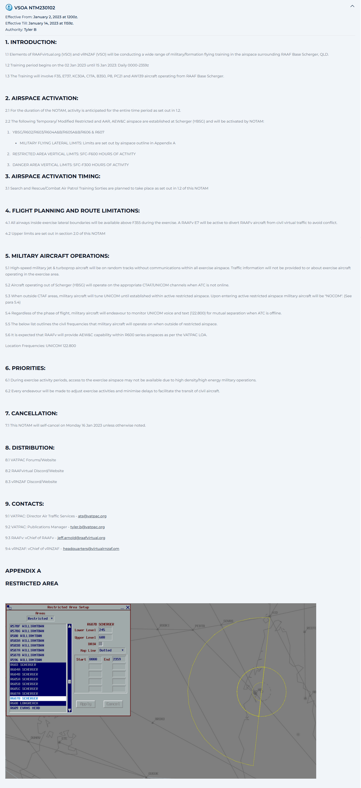

--8<-- "includes/abbreviations.md"

## Special Use Airspace (SUA)
SUAs, formerly known as Restricted Areas (RAs), are scattered all over Australian airspace. In real life, they can be used for many different purposes, including, but not limited to:

- Military Activity (most common)
- Live Firing
- Airshows
- Operationally Restricted Airspace
- Radiation Hazards
- Rocket Launches

Although the majority of these things don't pose any hazards in the online environment, activations of SUAs should still be simulated on VATSIM, and aircraft should be kept clear of them.

<figure markdown>
{ width="800" }
  <figcaption>SUAs on vatSys</figcaption>
</figure>

### Vertical Limits
The Restricted Areas cover various altitudes, and these can be seen either in the Restricted Areas window in vatSys, the [ERSA](https://www.airservicesaustralia.com/aip/aip.asp){target=new}, or by referencing VTC, VNC, ERC and TAC charts.

### Separation
It is the pilots responsibility to remain clear of Restricted Areas, however, that does not mean they always do!

#### OCTA
Outside controlled airspace, it is the responsibility of the controller to provide Safety Alerts on aircraft that will shortly enter, or have already entered, active restricted areas.

!!! phraseology
    **CBW**: "Safety Alert, VFR aircraft overhead Cotter tracking southbound 2500, you will shortly be entering R430 restricted area, clearance not available, suggest immediate left turn to avoid"

!!! phraseology
    **CNK**: "VFR aircraft overhead YCNK 3500 tracking westbound, confirm you will be remaining clear of the R564 restricted area?"  
    To which they will almost always reply with either *"Affirm"* or *"Huh?"*

For aircraft unfamiliar with the restricted area, provide *suggested* headings to avoid. Get the aircraft to squawk ident to temporarily identify them. Remember that you cannot vector aircraft OCTA.

#### CTA
You must separate all aircraft in controlled airspace by *half the applicable lateral standard* from a Restricted Area (ie, **1.5nm** for TCU, **2.5nm** for Enroute). Aircraft operating at the vertical limits of Restricted Areas are considered to be separated from it.

### Activation times
Some Restricted Areas are not always active. Some may be active only on certain days, or certain hours of the day. More info can be found in the [ERSA](https://www.airservicesaustralia.com/aip/aip.asp){target=new}, or on the Restricted Areas window in vatSys

### NOTAM
Some Restricted Areas will be activated by NOTAM, most commonly for use by [RAAF Virtual](https://www.raafvirtual.org/){target=new}. These are available on the [VATPAC NOTAMs Page](https://vatpac.org/publications/notam){target=new}. These Restricted Areas will automatically become active on vatSys with AIRAC updates, so they are visually displayed on the screen.

##### Example
<figure markdown>
{ width="800" }
  <figcaption>Example Restricted Area Activation NOTAM</figcaption>
</figure>

### Aircraft operating inside Restricted Area
Military aircraft are permitted to operate within their designated Restricted Area as per the relevant NOTAM. Even if this Restricted Area is inside civil airspace, Civil ATC has no control authority over it.

!!! phraseology
    **ARA**: "DRGN379, shortly entering R604 Restricted Area, identification and control services terminated, frequency change approved. Contact me prior to leaving for airways clearance"  
    **DRGN379**: "Wilco, DRGN379"  

### ATC Activated Military Airspace
Most Military TCUs and Tower positions, when online, control airspace that correspond to certain Restricted Area Activations. These are prescribed in the Local Instructions.

These Restricted Areas may be activated in vatSys, and the controllers of these positions may inform other surrounding controllers of their activations, so they may use the Resitricted Areas on the screen to visually assess the airspace and separation required for traffic.

Unless otherwise stated in Local Instructions, Restricted Areas activated for control by Military TCUs and Towers, will become **Class C** airspace.

## Formation Flights
### Standard Formation
A **Standard formation** is defined by more than one aircraft, separated by no more than **1nm** laterally/longitudinally, and no more than **100 feet** vertically, from the lead aircraft. All aircraft in the formation are treated as *one*. Ensure only the leader is squawking Mode C.

An additional **1nm** must be applied to any lateral separation standards for aircraft in a Standard Formation (Surveillance standards, for example, become *6nm* for Enroute, *4nm* for ADC/TCU).

!!! note
    RAAF FIHA AD2 Supps and TERMAs can be found [here](https://ais-af.airforce.gov.au/australian-aip){target=new}

When Military formations make initial contact with a new sector, they will commonly "check in" with all of the members of the formation, to ensure they've all made the frequency transfer. This involves all the individual members of the formation saying their own number in order on the first call. Formations are most commonly referred to by their base radio telephony callsign, without any numbers (eg, VIPR, BLKT, WGTL).

!!! phraseology
    **VIPR**: "Viper 1, 2, 3, 4, Brisbane Centre, Viper, Maintaining F280"  
    **ARA**:  "Viper, Brisbane Centre" 

Any subsequent calls will only be made by the leader, representing the entire formation.

!!! phraseology
    **ARA**: "Viper, Climb to F340"  
    **VIPR**:  "Climb to F340, Viper" 

### Close Formation
Reserved.

### Block Formation
Reserved.

### In-Trail Formation
Reserved.

## MARSA Operations
**Military Authority Assumes Responsibility for Separation of Military Aircraft** (MARSA) is a procedure which authorises pilots of military aircraft to assume responsibility for separation between their aircraft and other nominated military aircraft (or military contract civil aircraft) within Australian controlled airspace. 

!!! warning "Important"
    MARSA **cannot** be initiated by ATC, it **must** be initiated by the pilot(s).

MARSA is to be assigned and terminated on pilots request, and when standard seperation can been applied.

!!! phraseology
    *MAPL01 is Maintaining F260. DRGN50 is maintaining Block F270-290 above them.*  
    **MAPL01**: "Request Climb to Block F270-F290, MARSA DRGN50"  
    **ARA**: "MAPL01, Climb to and maintain Block F270-290, MARSA DRGN50"  
    **ARA**: "DRGN50, Maintain Block F270-290, MARSA MAPL01"  
    ...  
    **MAPL01**: "Request descent to F260 and termination of MARSA"  
    **ARA**: "MAPL01, Descend to F260, MARSA DRGN50"  
    *(After MAPL01 is maintaining F260)*  
    **ARA**: "MAPL01 and DRGN50, MARSA terminated"

## NOCOM Operations
**Non-Continuous Communication** (NOCOM) Procedures are when Military Aircraft discontinue two-way radio communications with Civil ATC. NOCOM Procedures state that ATC Approval is required when Military Aircraft are in controlled airspace. Military Aircraft under NOCOM procedures fall under multiple categories:

- Flights on "Area Freq" when OCTA
- Flights that are "Radio Silent"
- Flights that are in SUA
- Flights that are on nominated route segments, except for short position reports when possible.

!!! note
    Military aircraft normally operate NOCOM in military Restricted Areas and Class G airspace only. **Do not** permit NOCOM operations in Civil CTA.

## Stereo Approaches
Stereo Approaches are the primary procedure for fighter & strike aircraft (e.g. F18, HAWK, PC21) recovering back to airbases after operations in SUA. Aircraft track from specified SUA exit gates where they join the procedure, tracking along charted TACAN arcs/radials which position them for an initial and pitch or instrument approach.

!!! info
    Despite their name, stereo approaches can be thought of as the military equivalent of a STAR. Aircraft generally transition from a stereo approach onto an instrument approach or an initial and pitch.

Stereo approaches should generally be used during high military traffic levels and nominated on the appropriate aerodrome ATIS.

Stereo Approach charts can be found in the [RAAF TERMA](https://ais-af.airforce.gov.au/australian-aip){target=new}

## Initial and Pitch 
The Initial and Pitch is a military visual approach to the circuit area. Military aircraft approach on the deadside, parallel to the extended runway centreline at high speed (the **initial**), then make a tight turn onto downwind (the **pitch**). Aircraft should be cleared for a visual approach via the relevant initial point by the **TCU controller** and transferred to ADC when appropriate. 

To deconflict traffic, aircraft can be instructed to: 

- Pitch short (abeam the landing threshold)
- Pitch long (abeam the upwind threshold)

!!! note
    Refer to each aerodrome's SOPs for location-specific altitude and approach points.

The initial can be commenced from a straight in position (straight initial) or a position left or right of the straight in position (left and right initial).

<figure markdown>
{ width="700" }
  <figcaption>Initial & Pitch</figcaption>
</figure>

!!! phraseology
    **ESA**: "VIPR47, track via left initial runway 27, cleared visual approach, at the initial, contact Sale Tower 118.3"  
    **VIPR47**: "Track via left initial runway 27, cleared visual approach, at the initial, contact Sale Tower 118.3, VIPR47"

By default, aircraft will pitch at the midfield point (about half way down the runway). However, if necessary, instruct aircraft to move their pitch point, which has the same effect as instructing a civil aircraft to extend their downwind leg or make a close circuit.

- Pitch short (abeam the landing threshold)
- Pitch long (abeam the upwind threshold)

!!! phraseology
    **VIPR47**: "Sale Tower, VIPR47"  
    **ADC**: "VIPR47, pitch long"  
    **VIPR47**: "Pitch long, VIPR47"
    **VIPR47**: "VIPR47, Base"  
    **ADC**: "VIPR47, runway 27, cleared to land, check wheels"  
    **VIPR47**: "Runway 27, Cleared to Land, VIPR47, 3 Greens"

