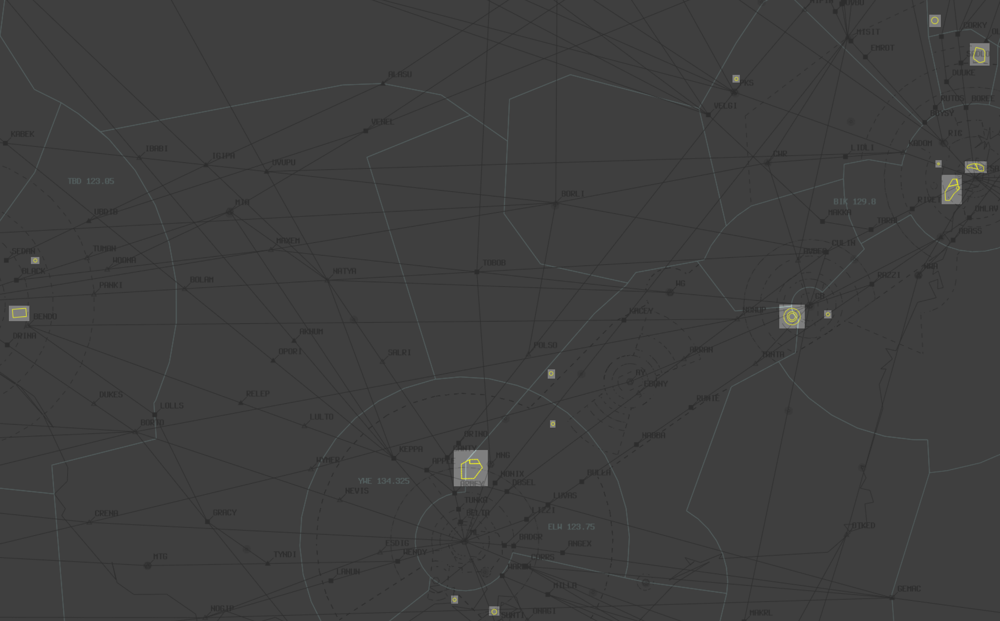

--8<-- "includes/abbreviations.md"

## Special Use Airspace (SUA)
SUAs, formerly known as Restricted Areas (RAs), are scattered all over Australian airspace. In real life, they can be used for many different purposes, including, but not limited to:

- Military Activity (Most common)
- Live Firing
- Airshows
- Operationally Restricted Airspace
- Radiation Hazards
- Rocket Launches

Although the majority of these things don't pose any hazards in the online environment, activations of SUAs should still be simulated on VATSIM, and aircraft should be kept clear of them.

<figure markdown>
{ width="800" }
  <figcaption>SUAs on vatSys</figcaption>
</figure>

### Vertical Limits
The Restricted Areas cover various altitudes, and these can be seen either in the Restricted Areas window in vatSys, the [ERSA](https://www.airservicesaustralia.com/aip/aip.asp){target=new}, or by referencing VTC, VNC, ERC and TAC charts.

### Separation
It is the pilots responsibility to remain clear of Restricted Areas, however, that does not mean they always do!

#### OCTA
Outside controlled airspace, it is the responsibility of the controller to provide Safety Alerts on aircraft that will shortly enter, or have already entered, active restricted areas.

!!! example
    **CBW**: "Safety Alert, VFR aircraft overhead Cotter tracking southbound 2500, you will shortly be entering R430 restricted area, clearance not available, suggest immediate left turn to avoid"

!!! example
    **CNK**: "VFR aircraft overhead YCNK 3500 tracking westbound, confirm you will be remaining clear of the R564 restricted area?"  
    To which they will almost always reply with either *"Affirm"* or *"Huh?"*

For aircraft unfamiliar with the restricted area, provide *suggested* headings to avoid. Get the aircraft to squawk ident to temporarily identify them. Remember that you cannot vector aircraft OCTA.

#### CTA
You must separate all aircraft in controlled airspace by *half the applicable lateral standard* from a Restricted Area (ie, **1.5nm** for TCU, **2.5nm** for Enroute). Aircraft operating at the vertical limits of Restricted Areas are considered to be separated from it.

### Activation times
Some Restricted Areas are not always active. Some may be active only on certain days, or certain hours of the day. More info can be found in the [ERSA](https://www.airservicesaustralia.com/aip/aip.asp){target=new}, or on the Restricted Areas window in vatSys

### NOTAM
Some Restricted Areas will be activated by NOTAM, most commonly for use by RAAF Virtual. These are available on the [VATPAC NOTAMs Page](https://vatpac.org/publications/notam){target=new}. These Restricted Areas will automatically become active on vatSys with AIRAC updates, so they are visually displayed on the screen.

##### Example
<figure markdown>
{ width="800" }
  <figcaption>Example Restricted Area Activation NOTAM</figcaption>
</figure>

### Aircraft operating inside Restricted Area
Military aircraft are permitted to operate within their designated Restricted Area as per the relevant NOTAM. Even if this Restricted Area is inside your airspace, you have no control authority over it. If an AWEC aircraft is up and certified, you transfer all traffic to that aircraft. The AWEC aircraft will control up to the lateral boundries of the restricted airspace. AWEC aircraft will hand off departing traffic back to your control authority at 10NMs from the boundary.

Airborne Early Warning & Control aircraft (AWEC) controls the tactical airspace, providing and supporting intellegence to fighter aircraft, supporting aircraft, surface combatants and land-based elements.

!!! example
    **ARA**: "DRGN379, shortly entering R604 Restricted Area, identification and control services terminated, frequency change approved. Contact me prior to leaving for airways clearance"  
    **DRGN379**: "Wilco, DRGN379"
    **ARA**: "ASY101, shortly entering M550 Restricted Area, contact WGTL47 on 130.500, frequency change approved"
    **ASY1101**: "Wilco, ASY101"

### ATC Activated Military Airspace
Most Military TCUs and Tower positions, when online, control airspace that correspond to certain Restricted Area Activations. These are prescribed in the Local Instructions.

These Restricted Areas may be activated in vatSys, and the controllers of these positions may inform other surrounding controllers of their activations, so they may use the Resitricted Areas on the screen to visually assess the airspace and separation required for traffic.

Unless otherwise stated in Local Instructions, Restricted Areas activated for control by Military TCUs and Towers, will become **Class C** airspace.

## Formation Flights
A standard military formation consits of a proximity of no more than 1 mile laterally or longitudinally and within 100 feet vertically from the flight leader is maintained by each wingman. As such you treat both aircraft as one and ensure only the leader is on mode C. Futhermore per FIHA (Flight Information Handbook Australia), Military AIrcraft are given discrete sqwaks in the 5000's and 6000's.

!!! note
  RAAF FIHA AD2 Sup and Termas can be found here (https://ais-af.airforce.gov.au/australian-aip)
!!! example
    **VIPR**: "VIPER, Checking in"
    **ARA**:  "VIPER, squawk 5000, confirm flight lead is mode C" 

## Military Authority Assumes Responsibility for Separation of Military Aircraft (MARSA)
MARSA is a procedure which authorises pilots of military aircraft to assume
responsibility for separation between their aircraft and other nominated military aircraft (or military contract
civil aircraft) within Australian controlled airspace. 

MARSA is to be asssigned and terminated on pilots request and or when standard seperation has been apllied.

!!! example
    **MAPL01**: "Request MARSA"
    **DRGN50**: "Request MARSA"
    **ARA**: "Mantain Block FL270-290, MARSA MAPL01"
    **ARA**: "Mantain Block FL270-290, MARSA DRGN50"
    **MAPL01**: "Request descent to F260 and termination of MARSA"
    **ARA**: "MAPL01, Descend to F260, MARSA DRGN50"
    **ARA**: "MAPL01 and DRGN50, MARSA terminated"

## NOCOM Operations
NOCOM Procedures are when Military Aircraft are not making routine radio traffic to Civil ATC. NOCOM Procedures state that ATC Approval is required when Military Aircraft are in controlled airspace. Military Aircraft under NOCOM procedures fall under multiple categories:
Flights on "Area Freq" when OCTA
Flights that are "Radio Silent"
Flights that are in SUA
Flights that are on nominated route segments, except for short position reports when possible.

Note: Military aircraft normally operate NOCOM in military Restricted Areas and Class G airspace only
