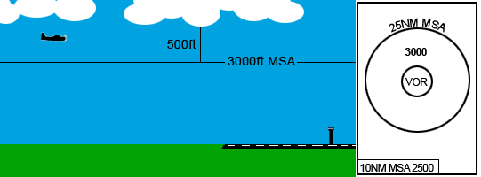

--8<-- "includes/abbreviations.md"

## Duty Runways
Careful selection of the duty runway at an aerodrome is important to ensure safe, expeditious traffic flow. When considering runway configuration, be mindful of the following operational considerations:
<ol>
    <li>Wind direction and speed</li>
    <li>SOP-dictated preferred runway modes</li>
    <li>Traffic flow and efficiency</li>
</ol>

### Wind
Where possible, select the most into wind runway/s. Your chosen runway configuration should have:

|  | Crosswind | Tailwind |
| ---- | ---- | ---- |
| Dry Runway | Max 20kt | Max 5kt |
| Wet Runway | Max 20kt | None |

!!! tip
    It is good practice to review the TAF when selecting a runway configuration, so that you are aware of any predicted wind shifts and can plan accordingly.

### Preferred Runway Modes
Most major aerodrome SOP pages include guidance on preferred runway modes, which cater for traffic levels, common approach types, and airspace restrictions. After considering the prevailing winds, have a look at the appropriate SOP page to determine whether a preferred runway mode exists for the current meteorological conditions.

!!! example
    The [Sydney Aerodrome SOPs](../../aerodromes/Sydney/#runway-modes) dictate that the preferred runway mode is SODROPS (runway 34L for arrivals, runway 16L for departures), however a note below indicates the reduced capacity achievable with this mode and recommends PROPS where traffic levels are expected to be high.

#### Non-Standard Runway Modes
The usage of non-standard runway modes is **strongly discouraged**, unless approved by a Senior Controller for use in major events. Non-Standard runway modes can cause unintended conflicts in TCU and Enroute airspace that may only slightly reduce an ADC controller's workload, but *dramatically* increase that of the affected TCU or Enroute controller.

!!! example
    At YMML, one of the Preferred Runway Modes is 16A27D. If ADC were to add 16 as a departure runway (16AD27D), this may allow them to get more aircraft to depart. However, subsequent departures from Runway 16, then via 27, both assigned a DOSEL SID, would be pointed directly at each other in TCU airspace, with no separation assurance. This creates a high workload environment for the TCU controller.

#### Traffic Flow
Where the published SOPs don't include guidance on preferred runway modes, or the situation you are faced with differs from those catered for by the SOPs, consider how you can maximise runway efficiency to handle the current traffic scenario. Remember to be mindful of the impact of the current wind & weather conditions, and any operational pressure the chosen configuration might have on any surrounding controllers.

#### Pilot Requests
Where a pilot requests to use a runway not nominated on the ATIS, try to be accommodating without delaying or disadvantaging other aircraft. Most commercial aircraft have crosswind and tailwind component limits much higher than those which limit runway selection by a controller, so a pilot may wish to depart with a tailwind or crosswind to minimise airborne tracking. In a similar manner, pilots may wish to depart from alternate runways (such as runway 16R at YSSY, instead of runway 16L) to reduce their taxi time.

During periods of low traffic volume, there is likely to be little consequence to other airspace users, however during busy periods, these requests are likely to significantly increase the workload of yourself or surrounding controllers, and may not be available. However, pilots will greatly appreciate any effort you can put into accommodating their reasonable requests.

!!! note
    If a pilot is warned about a potential hazard (such as a strong tailwind) and is still happy to accept the runway assignment, you may allow them to depart from, or arrive to, a runway not specified on the ATIS.

## Approach Types
The controller in charge of the ATIS must nominate an approach expectation to allow pilots to prepare themselves and their aircraft as required. Since this decision largely affects the TCU controller, it is a good idea to discuss this with them.

Visual approaches should be nominated on the ATIS when the current meteorological conditions (cloud base and visibility) allow for them. You may nominate visual approaches when:

- There are no clouds within 500ft of the appropriate MSA sector from which the approach will be commenced (as found on any DAP chart), and
- The visibility is greater than 5000m

<figure markdown>
{ width="600" }
  <figcaption>Visual Approach Cloud Base</figcaption>
</figure>

If the cloud base or visibility does not allow for visual approaches, an instrument approach should be nominated on the ATIS. Some SOPs will dictate local procedures regarding particular instrument approach procedures which should be included on the ATIS. If in doubt, include `EIA` (Expect Instrument Approach) in the ATIS.

!!! tip
    See [ATIS Abbreviations](./atis.md) for a full list of abbreviations which can be used in the ATIS.

## Runway Changes
Whilst runway changes have minimal impact on aerodrome controllers, they can drastically increase the workload for TCU controllers and have large flow on effects for enroute controllers. All runway changes should (where possible) be carefully planned and communicated, to ensure all surrounding sectors are aware of the impending change.

!!! warning "Important"
    Runway changes involve all types of controllers (from Delivery to Enroute), so a large amount of coordination is required. All coordination should be done on a **point-to-point** basis, so remember to pass on any relevant details to any controllers above/around you as necessary.

    E.g. ADC talks to TCU, then TCU talks to ENR, then ENR talks to any subsectors/surrounding sectors as required.

### Planned Configuration Change
The aerodrome controller in charge of the ATIS should frequently check the METAR/TAF to identify trends and any anticipated wind shifts. If a change of runway is expected (e.g. with the forecast passing of a front), controllers should anticipate this change.

Discuss the event with the overlying TCU controller/s and nominate a time from which the new runway configuration will be used. It can be helpful to identify the last arrival who will use the current runway mode, so that both Tower and Approach have a definite change point. Once this coordination has been completed, update the ATIS and include an expectation of a runway change in the `OPR INFO` field. This should include the expected time of change and the new runway mode to be used. The TCU controller should coordinate with Enroute, who will amend any STAR clearances for aircraft projected to land after the nominated time.

!!! phraseology
    **SY ADC** -> **SAN**: "The tailwind component is starting to increase a bit and the TAF indicates the wind's going to keep swinging around. Thoughts on changing to runway 34s from time 30?"  
    **SAN** -> **SY ADC**: "There's a gap in the sequence in about 20 minutes, lets make it time 45. Last arrival in the runway 16 direction will be QFA553."  
    **SY ADC** -> **SAN**: "Copy, changing to 34s at time 45, last arrival runway 16s QFA553."

    **ATIS**: `FM TIME 0445 EXP RWY 34L AND R FOR ARRS AND DEPS`

Once QFA553 lands, the runway change can occur. It is good practice to cancel autorelease during this period, to avoid any surprise departures.

### Immediate Change
Sometimes, prior notice is not available to plan a runway change and an immediate change is required. **Changes of this nature will have a severe impact on surrounding controllers if the traffic levels are high, and should be avoided at all costs.**

If an immediate change is required, the first port of call should be to contact the TCU controller and advise of the situation. Nominate the last aircraft to land using the current runway mode and hold all departures until the runway change has occurred. It is good practice to cancel autorelease during this period, to avoid any surprise departures as the TCU controller sequences any remaining aircraft for the new runway.

### Actions for Each Position
#### ADC
Once a need to change configurations has been identified, Tower controllers should:  

- Discuss with TCU controllers to nominate the time of change and identify last arrival to use the current runway config  
- Update the ATIS  
- Coordinate with ACD to ensure aircraft departing after the runway change are assigned an appropriate runway and SID  
- Continue departing aircraft as normal until the last arrival lands

!!! note
    Ensure that the aircraft identified as the last arrival is the last aircraft (arrival or departure) to use the runway in that direction.  

#### TCU
In response to coordination from Tower, or on making their own assessment of the conditions, Approach controllers should:  

- Nominate last arrival to use the current runway config and record in tag (`LAST`) if they own the tag
- Nominate the first arrival to use the new runway config and record in tag (`FIRST`) if they own the tag
- Coordinate with Enroute to advise of change
- Not allow an aircraft to approach within **10nm** of the reciprocal runway end until the last arrival has landed on the old runway. This is to consider the go around case.

#### Enroute
In response to coordination from the TCU, Enroute controllers should:

- Record the last and first arrivals in the tag if they own applicable tags (using `LAST` and `FIRST` respectively)
- Build a **5 minute** gap in the sequence between the last arrival to use the current config and the first arrival to use the new config
- Reassign STAR clearances to any aircraft projected to land after the change as required
- Continue issuing STAR clearances to subsequent aircraft using the new runway config

!!! tip
    There is often a need to delay aircraft to achieve the required 5 minute gap between last and first arrivals, so utilise all available resources to minimise the flow on delay to other aircraft, such as evenly spreading traffic across parallel runways if able.

## Runway Separation Standards
Refer to [Runway Separation Standards](../../separation-standards/runway/)

### Wake Turbulence
Refer to [Wake Turbulence Separation Standards](../../separation-standards/runway/#wake-turbulence)

## Helicopter Operations
There is often confusion about how to handle helicopter operations at a controlled aerodrome. In reality, their operation is quite simple and no different to fixed wing aircraft.

Refer to [Helicopter Operations](/helicopters.md).

## LAHSO
!!! warning "Important"
    Due to its operational complexity, LAHSO **must be authorised by a senior VATPAC staff member or a nominated event coordinator**.

    Very little benefit is achieved by running LAHSO without a flow controller and it is almost exclusively reserved for our busiest events.

LAHSO is the independent operation of two crossing runways for arrivals and departures. Whilst arrivals to each runway are considered independent, they will still be flowed to provide some degree of lateral segregation. ADC must maintain a visual separation standard between both aircraft during their approach and in the event of a go around.

In addition to the procedure being authorised for use, specific criteria must be met to enable LAHSO, which is detailed on the page of each participating aerodrome.

!!! note
    LAHSO is only permitted at [YMML](../aerodromes/classc/Melbourne.md#lahso) and [YPDN](../aerodromes/classc/Darwin.md#lahso).

The **active** aircraft is the landing aircraft issued with a hold short instruction, prohibiting them from rolling out on their assigned runway beyond the intersection with the crossing runway.

The **passive** aircraft is the landing or departing aircraft which has full use of their assigned runway.

### ADC
ADC is responsible for maintaining a visual separation standard between the active and passive aircraft during their final approach and in the event of a go around. The flight paths of both aircraft must be monitored and speed adjustments provided to arriving aircraft to ensure that in the event of a go around, both aircraft remain clear of each other. 

ADC must provide traffic information to both aircraft where a LAHSO standard has been applied between them. Additionally, the active LAHSO aircraft must be explicitely instructed to hold short of the crossing runway. Passive aircraft must be informed that the active aircraft will hold short.

!!! phraseology
    **ML ADC:** "RXA3866, traffic is a 737 departing on the crossing runway, hold short runway 27, cleared to land runway 34."  
    **RXA3866:** "Hold short runway 27, cleared to land runway 34, RXA3866"

    **ML ADC:** "QFA421, traffic is a SAAB 340 landing on the crossing runway, will hold short. Runway 27 cleared for takeoff"  
    **QFA421:** "Runway 27 cleared for takeoff, QFA421"

Should an arriving aircraft go around, ADC must maintain a visual separation standard between that aircraft and any others, until a radar standard (3nm or 1,000ft) is available, at which point the aircraft may be transferred to the TCU controller.

### TCU
With LAHSO in use, ADC will visually separate all relevant aircraft during their final approach and in the event of a go around. TCU controllers shall ensure that simultaneous arrivals are laterally segregated where possible, so that their flightpaths do not conflict in the event of a go around.

Where possible, simultaneous arrivals should be avoid flying conflicting flight paths which may lead to close proximity during a go around of one or both aircraft.

### Enroute
Enroute controllers should assertain whether each aircraft is capable of participating in LAHSO as soon as possible, and advise Flow of any aircraft who are unable.

In the real world, LAHSO participation is complicated but, generally, most Australian operators participate. On VATSIM, pilot competency may preclude an understanding of the procedure. If in doubt, assume an aircraft is **negative active LAHSO**.

### Flow
LAHSO enables the flow controller to utilise both runways independently for arrivals. However, where possible, aircraft on each adjacent runway should be staggered by **1 minute** to minimise the chance of a conflicting flight path in the event of a go around. The TCU and aerodrome controllers will likely use speed control to make small changes to the spacing of arriving aircraft during their final approach.