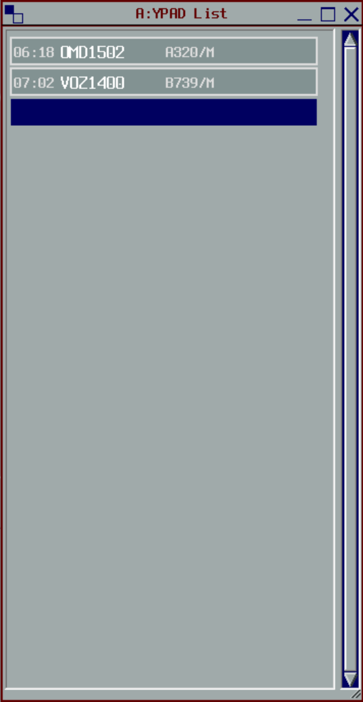
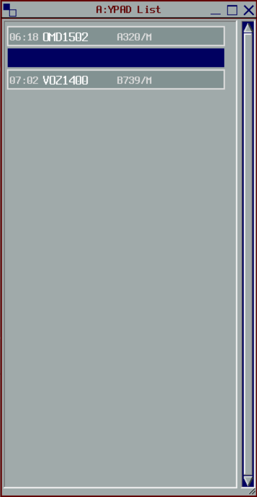
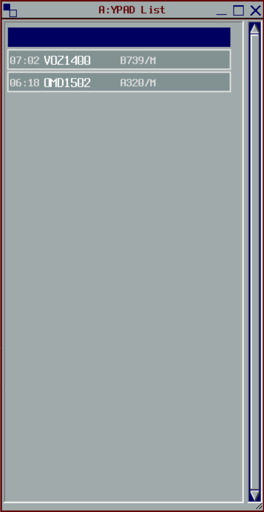

--8<-- "includes/abbreviations.md"

# Sequencing

It's all well and good maintaining separation standards in your airspace, but if you handoff 2 aircraft to ML_APP overhead BOOIN at the same speed, 1000ft apart, you're not going to make any friends. By default, aircraft must be sequenced **2 minutes** apart at the **Feeder Fix** (generally the first waypoint of the STAR).  

It's important to remember that aircraft aren't just arriving from your sector, they can be coming in from all directions at similar times. **MAESTRO** is a tool used to help aid with sequencing (what time do YOU need to get the aircraft to the feeder fix to avoid TCU congestion). You can find more info [here](../maestro).

In real life, controllers have the luxury of putting a fair bit of the onus of forming the sequence on the pilots, by issuing instructions like *"Adjust speed to cross RIVET at time 52 at 250kts in to published speeds"*. On VATSIM, every pilot may be using a different clock, potentially even different weather, and the pilot may simply not be proficient enough to meet a FF time. As such, all sequencing is best left in the hands of you, the controller.

There are multiple tools a controller can use to create and maintain a sequence.

## Arrivals List
The Arrivals List window is a sequencing management tool that can be used side-by-side with, or in-lieu of, [Maestro](../maestro).

It is a **global** window that can be viewed and manipulated by Tower, TCU, and Enroute Controllers.

The responsibility for managing the window falls on the:

- **Flow** Controller
    - This is delegated to the **Approach** Controller when Flow is Offline
- **ADC** Controller at [Procedural Towers](../../aerodromes/procedural/)

### How it works
New aircraft will automatically populate *above the bar* in the order of their **system-estimated arrival time** at the airport. No changes can be made manually above the bar.

<figure markdown>
{ width="300" }
  <figcaption>Arrivals List Window</figcaption>
</figure>

The controller managing the window can drag aircraft manually *below the bar*. Aircraft can be put in whatever order the controller wants below the bar, with the bottom representing **Number 1** in the sequence, and the top representing **the back** of the sequence.

<figure markdown>
{ width="300" }
  <figcaption>Arrivals List Window</figcaption>
</figure>

### Building the sequence
Making decisions on how to order the sequence will require a combination of information from:

- System Estimates (Ensure aircraft have their STAR programmed in their route to give accurate estimates)
- BRLs
- Flow Data from Local Instructions
- Aircraft type

<figure markdown>
{ width="300" }
  <figcaption>Arrivals List Window</figcaption>
</figure>

It is good practice to use the Arrivals List window even when an overlying Enroute Controller is not online. It helps to visualise the sequence early, and see what actions must be taken to make the sequence work.

### Global Data
Flow Data can be entered in to the **Global Ops Info** field of the aircraft, which displays on the right hand side of the Arrivals List.

<figure markdown>
{ width="500" }
  <figcaption>Arrivals List Window</figcaption>
</figure>

[Sequencing/Flow Abbreviations](../annotations/#sequencingflow) should be used to manage the sequence.

!!! example
    `L54/57 17W CSR<`

    Meaning:

    - Projected Landing time of time **54**
    - Sequenced Landing time of time **57**
    - Runway **17**
    - **Whiskey** STAR
    - **Cancel Speed Restrictions** (instruction has been issued to aircraft)

### Coordination
By default, any sequencing actions required by the Enroute Controller must be coordinated by the TCU/ADC controller on an ad-hoc basis.

During busy events, it may be prudent to make a verbal agreement to use the Global Data in the Arrivals List to coordinate Sequencing items.

The Enroute Controller may use a `<` symbol to denote an instruction that has been issued.

!!! example
    `F30` - TCU has requested aircraft cross FF at time 30 at 250kts, then published speeds  
    `F30<` - Enroute controller has indicated that they have taken action on this instruction

## Handoff minima
Refer to [Sequencing Separation Standards](../../separation-standards/surveillance/#sequencing)

## Speed Control
Speed Control is simply slowing aircraft down and speeding aircraft up as required. As a general rule of thumb, Speed Control is most useful to achieve anywhere between a 1 minute expedition, to a 2 minute delay (depending on how far out from the FF).

!!! tip
    Prior to implementing speed control, get yourself the best possible picture of what the pilots are doing. Asking questions like:  
    "QFA123, report planned cruise Mach number"  
    "VOZ456, report speed on descent"  
    "QJE1781, report top of descent point"*  
    to give you maximum awareness of the traffic picture, and help plan restrictions, sequences, etc.

!!! tip
    When in doubt, start with speed control and use other sequencing techniques as required.  Reducing an aircraft to minimum speed in the cruise and applying a short delaying vector may produce the same delay as a hold, but greatly reduce controller and pilot workload.

### General Flow Speeds
For information only, the following approximate time gains and losses achieved by speed control during descent.

| IAS Restriction | JET Gain / Loss | Others |
| ---- | -------- | -------|
| 320+ | - 2 MIN |  |
| 300  | - 1 MIN |  |
| 280  | - 0 MIN |  |
| 270  | + 1 MIN |  |
| 250  | + 2 MIN |  |
| 230  | + 3 MIN |  |
| 210  |  | +1 MIN |
| 190  |  | +2 MIN |
| 180  |  | +3 MIN |

!!! tip
    Refer to [Annotations](../../controller-skills/annotations/#speed-control) for info regarding Label data pertaining to speed control sequencing.

### Relative speeds
When using speed control for aircraft on *climb* with similar climb profiles, using the **same speed** as an instruction to both pilots is a good rule of thumb to ensure the speeds will open at all times (Eg, Lead aircraft: 280kts or Greater, Following aircraft: 280kts or Less). 

When using speed control for aircraft on *descent* with similar descent profiles, giving the following aircraft **20KIAS less** than the following aircraft is a good rule of thumb to maintain the current distance between the aircraft (Eg, Lead aircraft: Maintain 300kts, Following aircraft: Maintain 280kts).

## Descending early
Levels can also be used to help facilitate sequencing where required. Aircraft will naturally have a slower ground speed at lower levels, so to assist with any delaying action, you can give the instruction:
*"BNZ148, for sequencing, descend now to F130"*

This method is not the best for planning purposes, and will only help to achieve 1-4 mins delay, depending on how far out from the destination. This method is more suited to adjusting the sequence if things haven't quite worked out as planned, or an aircraft that despite all efforts, just will not slow down.

## Vectoring
Vectoring aircraft is best to achieve anywhere between a 2 minute and a 6 minute delay (again, depending on how far out from the FF). Vectoring aircraft for sequencing involves pointing aircraft away from their route (somewhere between 30° and 60°) for as long as necessary to achieve the delay. Whilst vectoring, you can anchor a BRL between the aircraft and the Feeder Fix to monitor how much time needs to be lost, then turn the aircraft back on route once the required delay has been achieved.

!!! note
    The times shown at waypoints when displaying an aircraft's route are not completely accurate. They are calculated based on a combination of the aircraft's ***planned TAS, Forecast GRIB winds, and estimated climb/descent profiles***. Times shown on the BRL anchored from an aircraft to a waypoint are based on the aircraft's ***current ground speed***. As a general rule of thumb, a jet aircraft will tend to add approximately 1-2 minutes to a BRL time on descent. A propeller aircraft will not add any time on descent. Both the route time and the BRL time can provide situational awareness and more info, but use whatever is appropriate for the situation.

## Predictable Sequencing 
Predictable Sequencing is an action to delay aircraft via rerouting aircraft via pre-defined waypoints off major airways to create certain time delays while also allowing a continuous descent into the airport.

!!! phraseology
    **ARL:** "QFA11, recleared ADLIV then direct RIKNI, rest of clearance unchanged, FL130"
    **QFA11:** "Cleared ADLIV RIKNI, continue descent FL130"

!!! tip
    Refer to [Enroute](../enroute/) to see which airways currently use it.

## Holding
Holding is the final delaying action, useful for when a delay of 6 minutes or more is required. Published Holds exist on common useful holding fixes all around Australia, usually either at the Feeder Fix, or a waypoint before the Feeder Fix. Locations of Published Holds can be found on ERC Charts.

Typically 1 standard holding pattern takes 6 minutes.

!!! phraseology
    **MUN:** "BNZ135, hold at METES, maintain FL200."  
    **BNZ135:** "Hold at METES, maintain FL200, BNZ135"  
    ...  
    **MUN:** "BNZ135, cancel hold, cleared METES, ARBEY, to rejoin the STAR, when ready, descend via STAR to A090, QNH 1013"  
    **BNZ135:** "Cancel hold, cleared METES, ARBEY, to rejoin the STAR, when ready, descend via STAR to A090, QNH 1013, BNZ135" 

Although the phraseology *"Hold at (waypoint)"* is standardised from the AIP `AIP GEN 3.4`, it could mean pilots who are not familiar with published holding patterns do not fly the hold you were expecting them to. In this case, use specific instructions which gives more detail about the holding pattern. This is also applicable to holding at fixes where there is no published hold.

!!! phraseology
    **BLA:** "VOZ888, hold at NABBA, inbound track 224 degrees, left hand pattern, outbound time 2 minutes, maintain FL200."  
    **VOZ888:** "Hold at NABBA, inbound track 224 degrees, left hand pattern, outbound time 2 minutes, maintain FL200,VOZ888"  
    ...  
    **BLA:** "VOZ888, Cancel hold, cleared NABBA, BULLA, TAREX, BOOIN, to rejoin the STAR, maintain F300"  
    **VOZ888:** "Cancel hold, cleared NABBA, BULLA, TAREX, BOOIN, to rejoin the STAR, maintain F300, VOZ888"

It may be prudent to use another form of delaying action, other than holding, with aircraft that appear to be unable to fly a hold (use vectors).